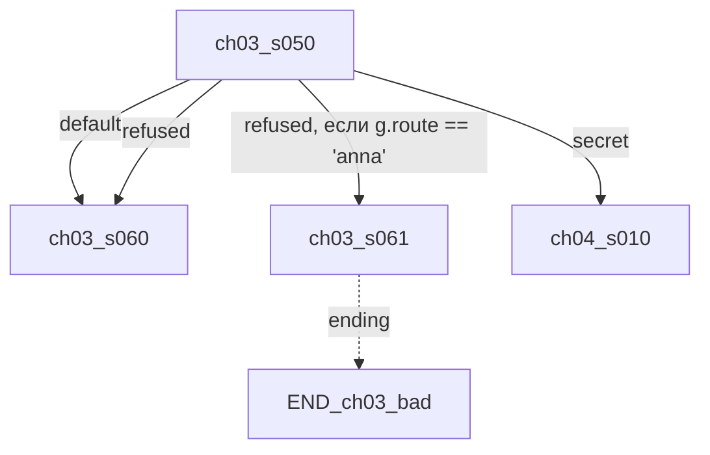

# Архитектура производства коммерческой визуальной новеллы на Ren'Py

**Версия документа:** 1.0 · **Дата:** 2026-08-07 · **Статус:** утверждаемый фундамент

## Что это за документ

Это не архитектура Ren'Py-игры — это архитектура **конвейера производства** игры, рассчитанная на 5–10 лет жизни проекта и целевой масштаб: 20+ глав, 300+ сцен, 150+ персонажей, тысячи изображений и анимаций, команда из сценаристов, художников, motion-дизайнера, локализаторов и QA, работающих параллельно и почти не мешая друг другу.

Документ прошёл три стадии проектирования: (1) независимое проектирование семи подсистем, (2) адверсариальная критика с трёх позиций — реализуемость в Ren'Py 8.x, реальная командная работа, деградация на дистанции 5 лет, — выявившая 41 проблему включая 7 блокеров, (3) сведение противоречий в нормативный глоссарий и ревизия всех разделов под него. Ключевые решения (раздел 0) — это контракт: код и процессы, противоречащие им, не проходят ревью.

## Три кита архитектуры

1. **Data-driven контент.** Добавление главы = добавление папки `content/chapters/chNN_slug/` с YAML-декларациями и `scene.rpy`-файлами. Меню, галерея, локализация, сейв-схема, билд обновляются автоматически. Ручной регистрации нет.
2. **Кодогенерация вместо runtime-магии.** Собственный Content Compiler превращает декларации в обычный статический `.rpy`-код на этапе сборки. Ren'Py получает то, с чем он хорошо работает: статические label, `layeredimage`, `default`-объявления — поэтому save/rollback/prediction/lint работают штатно, без хаков.
3. **Валидация до мержа.** Битые ссылки, отсутствующие ассеты, неописанные флаги, сломанный граф сцен, старые сейвы, которые перестали грузиться, — всё это ловит CI, а не игрок.

## Карта документа

| Раздел | Содержание |
|---|---|
| 0 | Ключевые архитектурные решения (нормативный контракт) |
| 1 | Структура репозитория и проекта |
| 2 | Конвейер ассетов |
| 3 | Декларативный контент: главы, сцены, Content Compiler |
| 4 | Система персонажей |
| 5 | Локализация |
| 6 | Состояние, сейвы, миграции, DLC и моды |
| 7 | Сборка, CI/CD, QA-автоматизация, UI и темы |
| 8 | Дорожная карта внедрения |
| 9 | Риски и стратегии эволюции |

---

## 0. Ключевые архитектурные решения

Этот раздел — нормативный контракт проекта. Каждое решение имеет номер (G1–G24); в ревью кода, контента и процессов на них ссылаются как на закон проекта. Изменение любого пункта — только через ADR. Детали и обоснования — в профильных разделах.

### 0.1. Сводка главных развилок

| Развилка | Решение | Ключевая причина |
|---|---|---|
| Один репозиторий или несколько | Monorepo; сырцы ассетов — в S3 через манифесты | Схема деклараций, компилятор и контент эволюционируют атомарно, одним PR |
| Где живут диалоги | В `scene.rpy` (гибрид с `scene.yaml`) | Ren'Py script — лучший из существующих DSL для диалогов; YAML-диалоги убивают эргономику сценариста |
| Runtime-магия или кодогенерация | Content Compiler генерирует статический `.rpy` | Save/rollback/prediction/lint Ren'Py работают только со статикой |
| Коммитить ли собранные ассеты | Нет; обязательный `vn bootstrap` из remote cache | LFS-история производных бинарей растёт монотонно; байт-в-байт воспроизводимость энкодеров — миф |
| Модель состояния | Типизированные переменные в named stores из деклараций | Идиоматика rollback/save Ren'Py; единый dict — чужеродная конструкция для движка |
| Судьба `.rpyc` генерата | Релизный артефакт, переносится между релизами | Statement-имена в `.rpyc` — единственная опора позиционной save-совместимости движка |
| Live2D/Spine | Да, но prebaked fallback обязателен для 100% анимаций | Проприетарные лицензии и версии — вне нашего контроля |
| Телеметрия, хостинг | Готовые сервисы, не self-hosted | Команда делает игру, а не инфраструктуру |

### 0.2. Нормативные решения G1–G24

**G1. Один CLI — `vn`.** Все инструменты — один Python-пакет `tools/vn/`: `vn bootstrap|doctor|dev|build|play|package|migrate|shell`, `vn assets …`, `vn content …`, `vn scene …`, `vn chapter …`, `vn char …`, `vn loc …`, `vn voice …`, `vn save …`, `vn test …`, `vn release …`, `vn pack …`. Других CLI не существует; CI-режим проверки без записи — везде флаг `--check`.

**G2. Зоны каталогов.** `content/` (декларации + scene.rpy) — строго вне `game/`; `game/generated/` — единственная зона генерата, в .gitignore; `game/assets/` — собранные ассеты, не в git; `assets_src/` — сырцы, в git только манифесты; `game/framework/` — рукописный код надстройки. Персонажи: декларации в `content/characters/`, сырцы в `assets_src/`, собранные слои в `game/assets/spr/`.

**G3. Диалоги живут в `scene.rpy`.** Формат сцены = `scene.yaml` (метаданные) + `scene.rpy` (диалоги, show/hide, menu). Диалогов в YAML не существует.

**G4. `game/assets/`, `game/generated/` и `game/tl/` не коммитятся.** Обязательный `vn bootstrap` тянет все три зоны из remote cache/CI-артефактов последнего зелёного main; гарантия «clone → bootstrap → запуск ≤ 5 минут» проверяется CI. Провенанс — по манифесту (hash сырца → hash артефакта → версия трансформации), не байт-в-байт. Аварийный режим: `vn build --use-artifact <sha>`.

**G5. Состояние: named stores + миграции над dict-снапшотом.** `default`-объявления генерируются из `vars.yaml`; в сейве только простые типы; единственный счётчик `vn_save_schema` (без `_`-префикса — переменные с `_` не сохраняются); одна цепочка миграций `migrate(state: dict)` исполняется и в игре (`label after_load`), и во внешнем инструменте через генерируемый маппинг stores↔dict; после миграции — конвертация в Revertable + `renpy.block_rollback()`; номера миграций резервируются через коммитящийся реестр.

**G6. `.rpyc` генерата — релизный артефакт.** Подкладывается перед компиляцией следующего релиза (перенос statement-имён); очистка `generated/` — точечная по диффу манифеста; полный wipe — только в release-CI; CI-кейс «сейв N−1 → правка сцены → пересборка» с/без переноса .rpyc обязателен.

**G7. Идентификаторы.** Id сцены `chNN_sNNN`, слуг — только в имени файла; id неизменяемы навсегда, переименование = `renames.yaml` → и `config.label_overrides`, и физическая shim-метка; `config.missing_label` не существует — shim-метки генерируются для всех отсутствующих id; инвариант call-стека (глубина 0 на входе в сцену), fallback-переходы разматывают стек через `renpy.pop_call()`.

**G8. Локализация поверх scene.rpy.** `vn loc keys` дописывает id-клаузы в say парсером Ren'Py (не регексами); у menu-пунктов клаузы `id` не существует — перевод выборов через собственный lookup по choice-id в кастомном `screen choice`; обмен — gettext PO с msgctxt; ledger шардирован по главам; `game/tl/` генерируется, ручные правки запрещены; голос — явные voice-операторы (не auto_voice), поставка — voice-паки отдельными депотами.

**G9. DLC.** Скрипты всех паков грузятся всегда (управлять загрузкой через `config.archives` в init невозможно — архивы индексируются раньше); владение — логический гейт после инициализации Steam, фильтрация реестров через `pack_registry.owned()`; манифест пака несёт `api_level` фасада `vn.*` с диапазоном; каждый релиз ядра переиздаёт все DLC-депоты; релизный CI гоняет матрицу совместимости.

> **Уточнено [ADR-0014](adr/0014-platform-services.md):** ownership-провайдер живёт в `game/framework/00_core/035_platform.rpy` — единственной точке касания платформы (гард-тест `test_platform::test_platform_facade_is_single_steam_touchpoint`), подключается на `init 999`, а не в `label splashscreen`; маппинг «пак → DLC» — поле `steam_dlc_appid` в манифесте пака (`steam_appid` схемой запрещён), один пак = один DLC App ID; ошибка API — **fail-open** (гейт логический, не DRM). Переиздание всех DLC-депотов на релиз ядра и smoke-матрица ядро×DLC — по-прежнему не реализованы.

**G10. Моды.** Инжекты — только на реестр стабильных якорей; подпись отделена от проверки совместимости; Mod SDK — фаза 3, но формат паков mод-совместим с первого дня.

**G11. layeredimage-эмиттер.** Селекторы `attribute X default Null()`, гейтинг через `if_any`/`if_all`; каждый attribute с явным displayable; golden-тесты через `renpy compile`+lint; тонировка — через генерируемый `config.tag_layer` (теги → слой sprites) + `camera sprites`.

**G12. Live2D/Spine.** Один тег = одно определение image; кодоген проецирует атрибуты на возможности бэкенда; prebaked fallback обязателен для 100% анимированных персонажей; проприетарные рантаймы вендорятся; экспортированные секвенции — самостоятельные сырцы в S3.

**G13. Кэш ассетов.** Ключ = хэш содержимого (для PSD — послойно) + версия конкретного инструмента трансформации; draft-энкод локально, полное качество в CI; warm-up remote cache перед бампом тулчейна; бюджет цикла художника P95 < 15 с.

**G14. Локи на сырцы обязательные.** `vn assets push` без валидного лока отказывает; `pull --edit` берёт лок; бот-нотификации; TTL с эскалацией.

**G15. Строгость валидации по статусу.** `draft` → граф-проверки warnings + `vn scene stub`; orphan-ассеты — error только в release-гейте; scope-check заменён CODEOWNERS-approve; smoke на MR — только затронутые главы (< 10 мин), полный — nightly.

**G16. Каждый YAML начинается с `schema: <name>@<int>`.** Без исключений; реестр схем в `tools/schemas/`; `vn migrate` покрывает все типы деклараций.

**G17. Версии.** `project.yaml`: `version` (semver, новая глава = minor), `save_schema` (int), `min_tools`; версии tools — lockfile, откат = git revert.

**G18. Эволюция движка.** Недокументированные API — только в `framework/00_core/engine_compat/` с контракт-тестами; weekly canary CI на свежем Ren'Py; апгрейд SDK минимум раз в год — плановая работа.

**G19. Перф-бюджеты в CI.** Cold start, baseline RSS (слабое железо + Android-эмулятор), суммарный размер .rpyc, размер реальных .aab/.apk по каналам (не каталога assets). Утверждения о масштабе проверяются измерением, а не рассуждением: `vn test corpus` строит синтетический корпус заданного размера и гоняет по нему конвейер (7.6). Измеренное состояние: генерат — **3,1–3,6 КБ `.rpy` на сцену** на всех масштабах от 100 до 20 000 сцен, то есть `generated_total_kb: 65536` вмещает **тысячи сцен — сотни глав** (с `.rpyc` ×2,5 — около 7,5 тыс. сцен); потолок `ARG_MAX` в build-bridge, который обрывал компиляцию на 5,6–9,5 тыс. сцен, **устранён** файлом-списком (7.6).

**G20. Скоуп по фазам.** Фаза 1: компилятор, ассеты, валидаторы, bootstrap, CI. Фаза 2: локализация, миграции, QA, релизный конвейер. Фаза 3: Live2D/Spine, DLC, моды, скриншот-тесты, телеметрия (готовым сервисом). Два владельца на инструмент; runbook аварий; онбординг tools-инженера.

**G21. Хранилище сырцов — логические id.** `storage: default, key: …` в манифестах; маппинг на физические endpoint'ы — один конфиг.

**G22. Онбординг по ролям.** Однокомандный инсталлер + `vn doctor`; метрика: сценарист от чистой машины до правки в игре < 1 дня.

**G23. QA/headless.** Headless у Ren'Py нет — xvfb; savecheck = оффлайн-структурная проверка + полный прогон (процесс-на-слот); автопилот через QA-label с fixed seed.

**G24. Content Compiler.** Разбор .rpy — только парсером Ren'Py из пиннованного SDK; архитектура frontend/IR/backends с плагинными стадиями; e2e golden-тесты; поддержка схем N и N−1.

---

### 0.3. Интеграционный канон (C1–C24)

Нормы, зафиксированные вторым сведением (после независимой ревизии разделов): единые имена, пути, схемы и механизмы там, где у подсистем есть точки соприкосновения.

Финальная сверка нашла расхождения между переработанными разделами. Ниже — канон по каждому. Всё, что в разделе противоречит канону, механически выравнивается (примеры, regex, пути, имена).

**C1. Идентичность пунктов меню (был blocker)**
- Маркер меню — переменная `vn_menu` (без underscore — обязана попадать в сейв): `$ vn_menu = "<full_scene_id>_mNNN"`. Вставляет её инструмент `vn loc keys` в авторский scene.rpy перед menu-стейтментом. `default vn_menu = None` — во framework.
- Формат id меню: `m\d{3}` (m001, m002). Везде. Примеры «m01» переписать.
- Кастомный `screen choice` читает: `vn_loc.choice_text(vn_menu, idx, caption)`.
- QA-якорь ветки: `$ vn_qa.choice(scene_id, vn_menu, idx)` — первый стейтмент ветки.
- Механизм «стабильных label-имён меню» (`menu chNN_sNNN_mNN:`) и `vn_qa.menu_enter`/`vn_qa.current_menu` НЕ существуют — убрать; всё производно от `vn_menu`.

**C2. Контракт авторского scene.rpy (был blocker)**
Канон — модель раздела 3:
- Автор пишет `label <full_id>__body:` и внутренние метки веток `label <full_id>__<branch>:` (префикс `<full_id>__` обязателен, линтер проверяет).
- Компилятор эмитит обвязку `label <full_id>:` (вход, checkpoint, call `__body`, обработка exit, переход).
- Переходы между сценами — ТОЛЬКО `return "<exit_id>"`; цели описаны в `exits:` scene.yaml. Прямые `jump`/`call` на метки вне префикса своей сцены запрещены линтером.
- Все примеры с прямыми `jump chNN_sNNN` между сценами переписать на return-exits.

**C3. Путь и имя генерата сцены**
`game/generated/scenes/chNN/<full_id>.gen.rpy` (например `game/generated/scenes/ch03/ch03_s050.gen.rpy`). Имя — только по id, без слуга (statement-имена Ren'Py включают имя файла: слуг в имени генерата ломает save-совместимость). Каталог `generated/content/` не существует.

**C4. Единая схема scene.yaml / chapter.yaml**
- `schema: scene@1`, `schema: chapter@1` — имена схем БЕЗ префикса `vn/`, версии в примерах @1.
- scene.yaml: `id: sNNN` (короткий; полный id выводится из пути: `<chapter_id>_<id>`); chapter.yaml: `id: chNN`.
- Блок переменных: `vars: {reads: [...], writes: [...]}` (не `flags:`).
- Exits — формат раздела 3: map, значения — цель или список условных переходов с `when:`/`to:`; короткие ссылки `to: s060` внутри главы, `to: ch04/s010` между главами. Формы `goto:`/`if: {pack_owned: ...}` не существуют (условие владения паком — обычное `when:`-выражение мини-языка).
- Заголовки — только ключи локализации: `title_key: meta.chapters.ch01.title` (сырое `title:` запрещено).

**C5. Голосовой контур**
- Voice-манифесты: `content/chapters/chNN/voice/<lang>.voice.yaml` (шард по главе × языку — совпадает с зоной владения главой). Настройки голоса персонажа — в character.yaml; **сегодня схема `character@1` знает из них ровно одно поле — `voice_tag`** (и стоит с `additionalProperties: false`). Пер-персонажного TTS-профиля (`voice.tts_draft`) в схеме нет: реализованный `vn voice tts` берёт бэкенд, голос и темп из флагов и дефолтов языка (`voice.py: resolve_tts`), а не из декларации персонажа. Появится профиль — расширяется `character@1` и `resolve_tts` (единственная точка); до тех решений формулировки «TTS-профиль в character.yaml» ниже читать как план, а не как факт.
- Сгенерированный оператор: `voice vn.voice_path("<line_id>")` (voice-стейтмент через фасад vn.*).
- CLI-домен `vn voice` легализован: `vn voice manifest|import|tts|validate`. `vn loc report --domain voice` не существует — покрытие озвучки смотрит `vn voice validate --report`.
- Путь примера сцены: `content/chapters/chNN_slug/scenes/sNNN_slug.scene.rpy` (всегда с `scenes/` и префиксом `s`).

**C6. Декларация состава спрайтов**
Единый `character.yaml` с блоком `matrix:` (poses/outfits/emotions/required/forbidden). Файла `sprites.yaml` НЕ существует — убрать из дерева и примеров раздела 1.

**C7. Раскладка слоёв спрайтов и пути**
Канон — схема раздела 4 (подкаталоги + oversampling):
`game/assets/spr/<char>/<pose>/base@2.webp`, `<pose>/outfits/<outfit>@2.webp`, `<pose>/faces/<emotion>@2.webp`, `<pose>/overlays/<overlay>@2.webp`, `side/<emotion>@2.webp`.
Все загружаемые пути в генерате — с префиксом зоны: `"assets/spr/..."`. Regex раздела 1.4 и примеры 1.5/2.4/2.6 привести к этой схеме.

**C8. Единая таблица init-приоритетов**
Канон — шкала раздела 7 (полнее): ядро −999 (движковый предел: init-приоритеты пользовательского кода — только −999..999), named stores −980, engine_compat −950, build_info −900, данные реестров −100, themes −60…−50, styles/screens 0, контентные define 500, DLC-слоты 999. Таблицу 1.8 заменить ссылкой/копией этой шкалы; `init -55`/`init -50` для stores → `init -980`; загрузка Asset Registry `init -900` (2.8) → `init -100`.

**C9. Контракт persistent**
Плоская модель с префиксом: `persistent.vn_*` (никакого dict-корня `persistent.vn`). Формулировку 6.1 переписать. Разблокировка галереи — штатный механизм `Gallery` + `persistent._seen_images` (свой dict не ведётся); `persistent.gallery_unlocked` не существует.

**C10. Где живёт DLC-контент**
Отдельное дерево `packs/<pack_id>/` в корне репозитория (зеркалит структуру content/: chapters/, characters/, loc/, + manifest.yaml). Поле `pack:` в chapter.yaml НЕ существует (принадлежность паку определяется расположением). Добавить `packs/` в нормативное дерево раздела 1. `content/` — это ядро (core).

**C11. Имена и версии схем YAML**
Без префикса `vn/`: `schema: project@1`, `chapter@1`, `scene@1`, `character@1`, `storage@1`, `renames@1`, `vars@1`, `asset_src@1` и т.д. В примерах — @1 везде (кроме мест, где демонстрируется миграция схемы, с явной оговоркой).
Манифест сырца — единый `asset_src@1`: поля `path`, `version` (int), `size`, `hash: {algo: blake3, hex: ...}`, `storage` (логический id), `key`, `exports`, `uploaded_by`, `uploaded_at`. Хэш-алгоритм всего тулинга — blake3 (один на проект).
vars-файлы — единый формат 6.1: `schema: vars@1`, поля `store:` + `vars:`; отдельной схемы chapter_vars не существует.

**C12. renames.yaml**
Единый формат: `schema: renames@1`; секции `scenes:` (old: new), `deleted_scenes:` (id: {fallback:, since:}), `labels:`, `vars:`. Генерат: `game/generated/registry/overrides.gen.rpy` с `init -100 python: config.label_overrides.update({...})` (update, не define — паки могут дополнять) + shim-метки.

**C13. CLI — финальный перечень доменов**
`vn bootstrap|doctor|dev|build|play|package`, `vn assets …`, `vn content …`, `vn scene …`, `vn chapter …`, `vn char …` (в т.ч. `vn char sheet` — команды `vn assets sheet` для персонажей не существует), `vn loc …`, `vn voice …`, `vn save …`, `vn test …`, `vn release …` (включая `vn release steam` — генерация VDF и раскладка депотов по ADR-0014; сам аплоад `steamcmd` — вне CLI — `vn release android status|preflight|build` — мобильный канал, и changelog), `vn pack …` (сборка DLC/паков), `vn pipeline …` (окружение production-конвейера DAZ/ComfyUI/ffmpeg, ADR-0006), `vn shell` (docker-репро CI), `vn migrate`.
Новых доменов верхнего уровня список не получает: канал поставки — это подгруппа `vn release` (`release steam`, `release android`), а не свой домен, иначе «финальный перечень» перестаёт быть финальным с каждой новой платформой. Соответствие перечня и дерева команд сверяет тест `tools/vn/tests/test_cli.py::test_top_level_domains_match_architecture_c13`.
CI-режим проверки без записи — флаг `--check` ВЕЗДЕ (`vn loc keys --check`; `--verify` не существует).
`vn dev` — комбинированный цикл разработчика (content watch + assets watch + запуск игры); низкоуровневые `vn content compile --watch` и `vn assets watch` остаются как отдельные входы.

**C14. API владения паками и экран выбора глав**
- Единственное API: `vn.pack_registry.owned(pack_id)` (через фасад). `vn_packs.*` и `vn.pack_flag` не существуют.
- Экран выбора глав — один: `screen chapter_select()` в `game/generated/screens/chapter_select.gen.rpy`, итерирует define-константу `VN_CHAPTERS` (эмитится компилятором из Chapter Registry), собирается из компонентов framework/20_ui. Отдельного ui/screens/chapter_select.yaml нет.

**C15. Фасад рантайм-обвязки**
`vn.checkpoint()`, `vn.beat()`, `vn.unwind_call_stack()`, `vn.check_scene_stack()`; глубина стека — `renpy.call_stack_depth()`. Голые глобалы `vn_checkpoint`/`vn_beat`/`vn_stack_unwind` не существуют; весь генерат обращается к движку только через `vn.*`.

**C16. Путь реестра id**
`content/registry/id_registry.json` (append-only). Единственный путь.

**C17. Раскладка framework**
Числовые префиксы: `framework/00_core/` (в т.ч. `00_core/engine_compat/`), `framework/10_systems/` (код механик: `10_systems/<mechanic_id>/`, включая minigame_host), `framework/20_ui/` (компоненты, `20_ui/screens/choice.rpy`), `framework/90_debug/`. Пути `framework/core/`, `framework/mechanics/`, `framework/ui/components/`, `framework/screens/` не существуют.

**C18. Аудио**
Логические id: генерат `define audio.<id> = "assets/audio/bgm/<file>.ogg"`; в сценах — `play music <id>`. Физические пути только `assets/audio/{bgm,amb,sfx}/…` (+ voice в паках). Форматы: `.ogg` (bgm/amb/sfx), `.opus` (voice). Сырых путей в play-операторах и каталога `audio/music/` не существует.

**C19. Служебные каталоги и манифесты инкрементальности**
Локальный кэш — `.vncache/` (одно написание). ДВА манифеста с разными ролями, явно разграничить: `game/generated/manifest.json` — манифест Content Compiler (входы→выходы генерата, blake3); `.vncache/build-graph.json` — граф оркестратора сборки (все задачи DAG, blake3). Хэш — blake3 везде.

**C20. Сырцы Live2D/Spine**
`assets_src/live2d/characters/<key>/` и `assets_src/spine_export/characters/<key>/` — отдельные ветки, НЕ внутри `assets_src/psd/`. Поправить 4.2/4.8 и `animated.source` в character.yaml.

**C21. Regex-константы**
Ключ персонажа: `^[a-z][a-z0-9_]{1,23}$` (везде). Паттерн переменной: `^(g|ch\d{2}|mech_[a-z0-9_]+|dlc_[a-z0-9_]+)\.[a-z][a-z0-9_]*$` — включает stores механик `mech_*` и DLC `dlc_*`.

**C22. Состав vn bootstrap**
Доставляет `game/assets/` + `game/generated/` + `game/tl/` последнего зелёного main. Все формулировки привести.

**C23. vn play --scene**
Механизм — env-вариант: `game/generated/qa/dev_boot.gen.rpy` (генерится только в dev-профиле) читает `VN_SCENE`/`VN_PRESET` из окружения и делает jump после start. Release-CI проверяет отсутствие этого файла. Вариант с label_overrides["start"] и захардкоженными vars не существует.

**C24. Галерея**
Механизм разблокировки — штатный `Gallery` + `persistent._seen_images` (ручной учёт не ведётся). Генерат: `game/generated/screens/gallery.gen.rpy`. Пути превью/CG: `assets/cg/…`, `assets/bg/…`, `assets/shots/<chNN>/<sNNN>/<shot>.thumb.webp` (композитное превью послойного шота, трансформация `shot_thumb`) — сегмента `images/` не существует нигде (в т.ч. в путях loc-оверлеев: зона `assets/loc/`).
Классы элементов: `kind: image | movie | shot` (`gallery@1`). У `kind: shot` ссылка — не файл, а шот `shots/<chNN>/<sNNN>/<name>` (ADR-0013): в кадр просмотрщика идёт живой layeredimage, варианты слоёв листаются на месте, а разблокировка по `seen_image` сверяется **по тегу образа и атрибуту шота**, а не точным кортежем имени — движок пишет в `_seen_images` имя КАК ПОКАЗАНО, вместе с липкими атрибутами наряда (`renpy/exports/displayexports.py: show`).

---

## 1. Структура репозитория и проекта

### 1.1. Топология: monorepo + внешнее объектное хранилище для сырцов

**Решение: единый monorepo** для кода игры, декларативного контента, инструментов и документации. Сырцы ассетов (PSD, Spine, Live2D, стемы аудио, исходники видео) живут **вне git** — в S3-совместимом хранилище, привязанном к репозиторию через коммитящиеся манифесты.

Обоснование monorepo:

- Content Compiler и формат деклараций эволюционируют вместе: изменение схемы `scene.yaml` + миграция всех глав + новая версия компилятора — **один атомарный PR**. При разделении на репо «tools» и «content» каждое такое изменение превращается в двухфазный танец с матрицей совместимости версий.
- CI-валидация «битых ссылок» (сцена ссылается на спрайт, спрайт на файл) возможна только тогда, когда декларации, реестры и game-ready ассеты видны одному пайплайну в одном чекауте.
- DLC-контент живёт в том же monorepo: каждый релиз ядра пересобирает и переиздаёт депоты всех DLC (механика — в разделе 6), что без monorepo потребовало бы кросс-репозиторной оркестрации.
- Единый `CODEOWNERS`, единая история, bisect по всему проекту сразу.

**Единая точка входа для всей команды — CLI `vn`** (один Python-пакет `tools/vn/`, см. раздел 0 / G1). Никаких параллельных утилит с собственными именами:

| Домен | Команды |
|---|---|
| верхний уровень | `vn bootstrap`, `vn doctor`, `vn dev` (content watch + assets watch + запуск игры), `vn build`, `vn play`, `vn package` |
| ассеты | `vn assets build\|validate\|watch\|pull\|push\|lock\|status` |
| контент | `vn content compile\|lint\|graph`, `vn scene new\|stub`, `vn chapter new` |
| персонажи | `vn char new\|validate\|sheet` |
| локализация | `vn loc extract\|import\|report\|pseudo\|keys` |
| озвучка | `vn voice manifest\|import\|tts\|validate` |
| сейвы | `vn save check\|migrate\|corpus` |
| тесты и релизы | `vn test …` (включая `test corpus` — измерительный прогон масштаба, 7.4), `vn release …` (`release steam` — VDF и депоты, ADR-0014; аплоад `steamcmd` вне CLI; `release android` — мобильный канал, 2.4; changelog), `vn pack …` (сборка DLC-паков) |
| конвейер рендера | `vn pipeline doctor\|models` (окружение DAZ/ComfyUI/ffmpeg, ADR-0006) |
| сервис | `vn shell` (docker-репро CI), `vn migrate` |

CI-режим «проверить без записи» — единый флаг `--check` у всех модифицирующих команд (например, `vn loc keys --check`).

Масштабные проблемы monorepo решаются штатными средствами git и bootstrap-инсталлером, а не дроблением на репозитории:

```bash
# художник по главе 7: не тянет чужие сырцы и чужие главы
git clone --filter=blob:none git@... vn && cd vn
vn bootstrap --role artist --scope ch07
# bootstrap: Python-окружение + git-хуки, sparse-checkout по роли,
# скачивание собранных game/assets/, game/generated/ и game/tl/ последнего зелёного main
```

**Хранение бинарей — три категории с разной судьбой:**

| Категория | Где | Почему |
|---|---|---|
| Game-ready ассеты (`game/assets/**`: webp/avif, ogg, webm) | **Remote cache / CI-артефакты**, не в git | Производное от сырцов; см. 1.3. Гарантия запускаемости обеспечивается `vn bootstrap`, а не LFS-коммитом. |
| Сырцы (`assets_src/**`: PSD 0.5–4 ГБ, Spine-проекты, WAV-стемы) | **S3 + манифесты в git** | PSD в LFS — тупик: история append-only (стоимость хранилища растёт монотонно), лимиты размера объекта, clone/fetch время, а diff/merge для PSD всё равно невозможны. S3 даёт immutable-версии, lifecycle-политики (старые версии в Glacier), выдачу по требованию. |
| Немногие коммитящиеся бинари (шрифты, иконки, референсы в docs) | Git LFS | Мелкие, редко меняются, нужны каждому чекауту. |

Хостинг git/LFS — managed (GitHub/GitLab.com), не self-hosted: администрирование собственного GitLab+S3-бэкенда — это ещё один продукт, который некому поддерживать (см. раздел 8, фазы тулинга).

Манифест — коммитящийся JSON рядом с «виртуальным» файлом; сам бинарь в чекауте отсутствует, пока его не запросили. **В манифесте — только логические идентификаторы хранилища**: абсолютный `s3://…`-URL означал бы, что смена бакета/провайдера через N лет требует переписать тысячи закоммиченных файлов и ломает воспроизводимость старых ревизий.

```json
// assets_src/psd/characters/mira/mira_base.psd.manifest.json
{
  "schema": "asset_src@1",
  "path": "psd/characters/mira/mira_base.psd",
  "version": 13,
  "size": 2147483648,
  "hash": {"algo": "blake3", "hex": "9f2c41d0…"},
  "storage": "default",
  "key": "psd/characters/mira/mira_base/v13",
  "exports": ["game/assets/spr/mira/**"],
  "uploaded_by": "artist-kate",
  "uploaded_at": "2026-08-01T14:02:11Z"
}
```

Хэш-алгоритм всего тулинга — blake3, один на проект (манифесты сырцов, инкрементальность, провенанс).

Маппинг логических хранилищ на физические endpoint'ы — один файл в корне, меняется одним коммитом, переопределяется локально (`.vnstorage.local.yaml` в `.gitignore`):

```yaml
# .vnstorage.yaml
schema: storage@1
storages:
  default: {endpoint: "https://s3.example.com", bucket: "vn-assets"}
  archive: {endpoint: "https://s3.example.com", bucket: "vn-assets-cold"}
```

```bash
vn assets pull --scope content/chapters/ch07_reunion    # скачать сырцы, нужные главе
vn assets pull --edit assets_src/psd/characters/mira/mira_base.psd   # скачать И взять лок
vn assets push assets_src/psd/characters/mira/mira_base.psd          # залить v14 (требует лок!)
vn assets status                                        # кто что держит
```

**Локи на сырцы — обязательные, не advisory.** Исходная advisory-модель («художник должен не забыть позвать `lock`») гарантированно теряет чей-то день работы: два художника параллельно правят один PSD, конфликт манифеста всплывает на push, а PSD не мержится. Поэтому:

- `vn assets push` **отказывает** без валидного лока автора; лок реализован условной записью lock-объекта в S3 (`If-None-Match`).
- `vn assets pull --edit` берёт лок автоматически — правильный путь совпадает с ленивым.
- Бот сообщает в командный чат о взятии/снятии лока; у лока TTL с эскалацией на лида (забытый лок не блокирует коллегу навсегда).
- При росте арт-отдела до 20+ человек узел `assets_src` выносится в Perforce/Plastic без затрагивания остального репозитория — манифесты остаются интерфейсом.

### 1.2. Зоны каталогов — константа проекта

Зоны и их владельцы — нормативная константа (раздел 0, G2); CI-джоба `vn content lint --layout` сверяет фактическую структуру с `docs/conventions/folder-layout.md`, чтобы «каждая команда построила свою реальность» не случилось молча. Ключевые инварианты:

- `content/` — **строго вне `game/`**: Ren'Py загружает всё, что лежит под `game/`, и источники с черновиками попали бы в билд.
- `game/generated/` — **единственная** зона генерата; альтернативные каталоги генерата не заводятся.
- `content/` — это ядро (core); DLC-контент живёт в отдельном дереве `packs/<pack_id>/`, зеркалящем структуру `content/`. Принадлежность паку определяется расположением — поля `pack:` в chapter.yaml не существует (раздел 6).
- Художник **никогда не пишет в `game/`**: путь ассета — только `assets_src/` → пайплайн → `game/assets/`. Сырых PNG в `game/characters/` не существует; декларации персонажей — `content/characters/<key>/`, арт-сырцы — `assets_src/psd/characters/<key>/`, собранные слои — `game/assets/spr/<key>/`.

```
vn/                                  # корень monorepo
├── project.yaml                     # version, save_schema, min_tools (см. 1.9)
├── .vnstorage.yaml                  # логические хранилища сырцов → endpoint'ы
├── CODEOWNERS
├── .gitattributes                   # LFS — только немногие коммитящиеся бинари (шрифты)
├── .gitignore
│
├── game/                            # ═══ Ren'Py-проект: единственное, что видит движок ═══
│   ├── framework/                   # рукописный код надстройки (контентщики не трогают)
│   │   ├── 00_core/                 # init -999: bootstrap ядра (шкала приоритетов — 1.8 / разд. 7)
│   │   │   ├── 001_boot.rpy         #   config.*, логгер, config.exception_handler
│   │   │   ├── 010_registry.rpy     #   классы реестров (Asset/Character/Scene/Pack Registry)
│   │   │   ├── 020_state.rpy        #   state-инфраструктура, раннер миграций, label after_load
│   │   │   ├── 030_flow.rpy         #   маршрутизатор глав/сцен, фасад vn.* (+ api_level, разд. 6)
│   │   │   └── engine_compat/       #   init -950; ЕДИНСТВЕННЫЙ модуль, касающийся недокументированных
│   │   │                            #     API Ren'Py; каждое допущение — контракт-тест (разд. 9)
│   │   ├── 10_systems/              # gameplay-системы (плагины): 10_systems/<mechanic_id>/
│   │   │   ├── relationship/  phone/  gallery/
│   │   │   └── minigame_host/
│   │   ├── 20_ui/                   # рукописные компоненты/styles/transforms;
│   │   │                            #   20_ui/screens/choice.rpy — кастомный screen choice
│   │   │                            #   (перевод пунктов меню по vn_menu, разд. 5)
│   │   └── 90_debug/                # dev-консоль, jump-to-scene, чит-меню (вырезается из release)
│   ├── generated/                   # ═ ЕДИНСТВЕННАЯ зона генерата. В .gitignore ═
│   │   ├── scenes/                  #   ch01/ ch02/ … — <full_id>.gen.rpy сцен (см. 1.5)
│   │   ├── registry/                #   images.gen.rpy, characters.gen.rpy, audio.gen.rpy,
│   │   │                            #   menus.gen.rpy (реестр choice-id),
│   │   │                            #   overrides.gen.rpy (label_overrides + shim-метки, см. 1.4)
│   │   ├── state/                   #   defaults.gen.rpy — все default проекта + vn_save_schema
│   │   ├── screens/                 #   chapter_select.gen.rpy, gallery.gen.rpy (разд. 6)
│   │   ├── qa/                      #   dev_boot.gen.rpy — генерится только в dev-профиле (разд. 7)
│   │   ├── version.gen.rpy          #   config.version из project.yaml + git sha
│   │   └── manifest.json            #   манифест Content Compiler: blake3 входов → выходов;
│   │                                #     инкрементальность и точечная очистка
│   ├── assets/                      # game-ready ассеты. НЕ в git: vn bootstrap / vn assets build
│   │   ├── bg/  cg/  spr/  ui/  vfx/
│   │   ├── audio/{bgm,amb,sfx}/     #   озвучка — НЕ здесь: voice-паки, разд. 5 и 6
│   │   └── video/
│   ├── tl/                          # ГЕНЕРИРУЕТСЯ из PO (vn loc import). НЕ в git;
│   │                                #   ручные правки запрещены и ловятся CI (разд. 5)
│   ├── options.rpy                  # тонкий: почти всё вынесено в framework/00_core
│   └── gui.rpy                      # тонкий: константы GUI
│
├── content/                         # ═══ ИСТОЧНИК ИСТИНЫ. Строго ВНЕ game/ ═══
│   ├── chapters/
│   │   └── ch01_awakening/          # одна глава = одна папка = один владелец
│   │       ├── chapter.yaml         #   метаданные, status (draft|playtest|release), entry point
│   │       ├── scenes/              #   сцена = ПАРА файлов: метаданные + диалоги
│   │       │   ├── s010_prologue.scene.yaml
│   │       │   ├── s010_prologue.scene.rpy
│   │       │   ├── s020_school_gate.scene.yaml
│   │       │   └── s020_school_gate.scene.rpy
│   │       ├── vars.yaml            #   переменные главы → named store chNN (см. 1.8)
│   │       └── casting.yaml         #   персонажи/локации главы; учитывается orphan-проверкой
│   ├── characters/
│   │   └── mira/
│   │       └── character.yaml       #   имя, цвет, голос + блок matrix: — состав спрайтов
│   │                                #     (poses/outfits/emotions/required/forbidden, разд. 4)
│   ├── locations/
│   │   └── school_gate/location.yaml
│   ├── audio/
│   │   ├── bgm.yaml                 #   логические id → файлы, loop-точки, громкость
│   │   └── sfx.yaml
│   ├── variables/                   #   глобальное состояние → named store g;
│   │   ├── romance.vars.yaml        #   неймспейс-файлы вместо одного global.vars.yaml —
│   │   └── economy.vars.yaml        #   меньше конфликтов и очередей на ревью (см. 1.7)
│   ├── migrations/                  #   единая цепочка миграций сейвов (разд. 6)
│   │   ├── 0007_route_points_clamp.py
│   │   └── registry.yaml            #   реестр занятых номеров; резервируется инструментом
│   ├── renames.yaml                 #   переименования id → label_overrides + shim-метки (1.4)
│   ├── registry/id_registry.json    #   append-only реестр всех когда-либо выпущенных id
│   ├── anchors.yaml                 #   стабильные инжект-якоря для модов (разд. 6)
│   └── flags.yaml                   #   фиче-флаги контента (см. 1.7)
│
├── packs/                           # ═══ DLC-контент: один пак = одно дерево ═══
│   └── ep_beach/                    #   зеркалит структуру content/; принадлежность паку —
│       ├── manifest.yaml            #     по расположению (поля pack: в chapter.yaml нет, разд. 6)
│       └── chapters/  characters/  loc/
│
├── assets_src/                      # сырцы: в git ТОЛЬКО *.manifest.json
│   ├── psd/{characters,backgrounds,cg,ui}/
│   ├── live2d/characters/<key>/     #   сырцы Live2D — отдельная ветка, НЕ внутри psd/ (разд. 4)
│   ├── spine_export/characters/<key>/  # отдельная ветка; + вендоринг Cubism Core /
│   │                                #     Spine-экспортёра (разд. 2)
│   ├── audio_stems/
│   └── video_src/
│
├── loc/                             # обмен с переводчиками (разд. 5)
│   ├── po/<lang>/chNN.po            #   gettext PO с msgctxt
│   └── ledger/chNN.json             #   ledger шардирован по главам — иначе вечный merge-конфликт
│
├── tools/
│   ├── vn/                          # ОДИН Python-пакет, одна точка входа `vn`
│   │   ├── compiler/                #   frontend (парсинг+валидация) / ir / backends (разд. 3)
│   │   ├── assets/  loc/  save/  qa/
│   │   └── cli.py
│   ├── schemas/                     # реестр JSON Schema — ЕДИНСТВЕННЫЙ источник версий схем
│   └── vn.lock                      # пиннованный тулчейн; откат = git revert одного файла
│
├── build/                           # локальные артефакты (в .gitignore)
├── docs/
│   ├── conventions/                 # naming.md, folder-layout.md — нормативные, CI сверяет
│   ├── adr/                         # ADR + список движковых допущений с планом отступления (разд. 9)
│   ├── runbooks/                    # «пайплайн сломан ночью перед релизом» и др.
│   └── onboarding/                  # writer.md, artist.md, localizer.md, tools-engineer.md
└── ci/                              # пайплайны + скрипты проверок
```

Два неочевидных, но принципиальных решения внутри `game/`:

1. **Ассеты лежат в `game/assets/`, а не в `game/images/`.** Штатное автоопределение образов Ren'Py (файл в `images/` → image с именем по basename) на тысячах файлов — источник тихих коллизий: имя образа берётся без учёта подкаталогов, `mira/smile.webp` и `lena/smile.webp` дерутся за `smile`. Вместо этого Asset Registry сканирует `game/assets/` на этапе сборки (а на этапе рантайм-валидации сверяется с `renpy.list_files()`, чтобы поймать файлы, не попавшие в архивы), и компилятор эмитит **явные** `image`-стейтменты. Явные определения — это ещё и рабочий image prediction: Ren'Py умеет предсказывать только образы, которые видит как статические выражения, что компилятор и гарантирует.
2. **Ни одной label-метки вне контракта именования.** Все .rpy склеиваются в один глобальный namespace без какой-либо модульности — это фундаментальное свойство Ren'Py, и на 300+ сценах произвольное ручное именование меток гарантированно даст коллизию. Поэтому авторский `scene.rpy` содержит ровно две категории меток: `label <full_id>__body:` (тело сцены) и внутренние метки веток `label <full_id>__<branch>:` — префикс `<full_id>__` обязателен, линтер проверяет. Обвязку `label <full_id>:` (вход, checkpoint, вызов `__body`, обработка exit-кода, переход к следующей сцене) эмитит компилятор. Переходы между сценами автор не пишет вовсе: сцена завершается `return "<exit_id>"`, а цели переходов описаны декларативно в `exits:` scene.yaml; прямые `jump`/`call` на метки вне префикса своей сцены запрещены линтером.

### 1.3. Судьба производных зон: `vn bootstrap` и жизненный цикл `.rpyc`

**`game/assets/` и `game/generated/` не коммитятся.** Это изменение относительно ранней версии дизайна, где `game/assets/` жил в LFS ради «runnable из чистого clone». От LFS-коммита производных отказались по трём причинам: (а) provenance-проверка «пересобрал — байты совпали» для WebP/AVIF/ffmpeg невозможна — энкодеры недетерминированы между версиями и платформами, проверка флапала бы и её бы выключили вместе с реальной защитой; (б) каждая массовая перегенерация заливала бы в append-only LFS-историю новую копию десятков ГБ — тот же аргумент, из-за которого PSD не кладут в LFS; (в) две несовместимые политики в одном документе хуже любой из них. Гарантия запускаемости при этом не потеряна, а стала **измеримой**:

- **`vn bootstrap`** скачивает собранные `game/assets/` + `game/generated/` + `game/tl/` последнего зелёного `main` из remote cache / CI-артефактов. Сценарист и QA запускают игру **без установки asset-тулчейна** (Python-окружение для самого `vn` ставит bootstrap-инсталлер, см. 1.10).
- Инвариант «clone → bootstrap → игра запускается ≤ 5 минут» — не клятва, а отдельная CI-джоба, которая делает ровно это на чистой машине.
- **Аварийный режим** (регрессия компилятора, битое окружение, «2 часа ночи перед релизом»): CI публикует `game/generated/` каждого зелёного `main`; `vn build --use-artifact <sha>` запускает игру на чужом генерате без локального компилятора. Версия тулчейна пиннуется `tools/vn.lock` — откат = `git revert` одного файла.

**Провенанс производных — по манифесту, не по байтам.** При сборке пайплайн регистрирует тройку (blake3 сырца → blake3 артефакта → версия конкретной трансформации); `vn assets validate --provenance` сверяет, что каждый артефакт порождён зарегистрированной сборкой. Пересборка байт-в-байт требуется только внутри одного пиннованного CI-контейнера (CI сверяет сам себя). Ключи кэша и инкрементальность пайплайна — в разделе 2 (G13).

**`.rpyc` сгенерированных файлов — релизный артефакт, а не мусор сборки.** Ранняя версия дизайна предписывала чистить `game/generated/` начисто перед каждой компиляцией и нигде не хранить `.rpyc`. Это уничтожало штатный механизм save-совместимости Ren'Py: не-label стейтменты идентифицируются служебными именами, и при перекомпиляции изменённого `.rpy` движок переносит имена неизменённых стейтментов **только если рядом лежит старый `.rpyc`**. Без переноса любая правка файла сцены осиротляет сейвы середины сцены и их rollback-логи («Couldn't find a place to stop rolling back») — до всяких `after_load`-миграций. Поэтому:

- Релизный пайплайн **сохраняет `game/generated/**/*.rpyc` каждого релиза** (артефакт-хранилище) и подкладывает их перед компиляцией следующего релиза.
- Очистка `game/generated/` — **точечная**: по диффу старого/нового `manifest.json` удаляются только осиротевшие пары `.rpy`+`.rpyc`. Классическая ловушка «удалённый `.rpy` оставил рабочий `.rpyc`, и сцена продолжает существовать» закрыта по построению — компилятор знает полный список своих выходов. Неизменённые файлы **не трогаются байтово**: полный wipe менял бы mtime всех `.rpy`, Ren'Py перекомпилировал бы все `.rpyc` сотен сцен на каждый запуск и похоронил бы и «< 30 сек полной сборки», и секундный цикл правки через Shift+R.
- Полный wipe — только в release-CI из чистого чекаута, **с подкладыванием `.rpyc` прошлого релиза**.
- Обязательный CI-кейс в save-корпусе: «сейв релиза N−1 → правка сцены → пересборка» в двух вариантах — с переносом `.rpyc` (обязан пройти) и без (обязан упасть — это регрессионный детектор того, что перенос действительно работает). Подробности save-совместимости — в разделе 6.

### 1.4. Соглашения по именованию и неизменяемые id

Нормативные regex (проверяются `vn content lint`, нарушение = красный CI):

| Сущность | Паттерн | Пример |
|---|---|---|
| Папка главы | `^ch(\d{2})_([a-z][a-z0-9_]{2,30})$` | `ch07_reunion` |
| id главы | `^ch\d{2}$` | `ch07` |
| Файл сцены | `^s(\d{3})_([a-z][a-z0-9_]{2,40})\.scene\.(yaml\|rpy)$` | `s030_rooftop.scene.yaml` |
| id сцены | `^ch\d{2}_s\d{3}$` | `ch07_s030` |
| Метка-обвязка сцены (эмитит компилятор) | `^ch\d{2}_s\d{3}$` | `ch07_s030` |
| Авторская метка (`__body` / ветки) | `^ch\d{2}_s\d{3}__[a-z0-9_]+$` | `ch07_s030__b_lie` |
| say-id (клауза `id`) | `^ch\d{2}_s\d{3}_\d{4}$` | `ch07_s030_0042` |
| id меню (значение `vn_menu`) | `^ch\d{2}_s\d{3}_m\d{3}$` | `ch07_s030_m001` |
| id персонажа | `^[a-z][a-z0-9_]{1,23}$` | `mira` |
| Логический id ассета | `^(bg\|cg\|spr\|ui\|vfx\|bgm\|amb\|sfx)/[a-z0-9_/]+$` | `bg/school_gate/day` |
| Файл спрайт-слоя | `^assets/spr/[a-z][a-z0-9_]{1,23}/(([a-z0-9_]+)/(base\|outfits/[a-z0-9_]+\|faces/[a-z0-9_]+\|overlays/[a-z0-9_]+)\|side/[a-z0-9_]+)@2\.webp$` | `assets/spr/mira/a/faces/smile@2.webp` |
| Переменная состояния | `^(g\|ch\d{2}\|mech_[a-z0-9_]+\|dlc_[a-z0-9_]+)\.[a-z][a-z0-9_]*$` (named stores) | `ch07.roof_visited` |
| Файл миграции | `^\d{4}_[a-z][a-z0-9_]+\.py$` | `0007_route_points_clamp.py` |

Принципы поверх таблицы:

- **Слуг — только в имени файла/папки, для читаемости.** В id и label слуг **не входит**: слуг можно менять (git mv + правка ссылок в scene_order), id — никогда. `s030_rooftop.scene.yaml` компилируется в `label ch07_s030`, а не `ch07_s030_rooftop`.
- Номера сцен идут с шагом 10 (`s010`, `s020`, …) — вставка сцены между существующими не требует переименований. Порядок следования определяется `chapter.yaml`, а не сортировкой имён; номер — только человекочитаемый якорь.
- **Id глав/сцен/флагов/персонажей неизменяемы навсегда.** Переименование = новый id + запись в `content/renames.yaml` (`schema: renames@1`; секции `scenes:`, `deleted_scenes:`, `labels:`, `vars:`). Линтер охраняет (старый id нельзя переиспользовать). Для каждого переименования компилятор генерирует **и** запись в `config.label_overrides` (чинит явные `jump`/`call` по старому имени; эмитится как `init -100 python: config.label_overrides.update({...})` — update, а не define: паки могут дополнять карту), **и** физическую shim-метку `label <old_id>: jump <new_id>` — обе в `game/generated/registry/overrides.gen.rpy`. Shim даёт rollback-логу и call-стеку точку опоры, которой `label_overrides` не даёт (позиция сейва восстанавливается откатом по логу, а не по overrides).
- **Config-хука «перехват перехода на несуществующую метку» в Ren'Py не существует** — «последний эшелон» строится иначе: компилятор эмитит shim-метки для всех id из `content/registry/id_registry.json`, отсутствующих в текущей сборке (по данным renames/deleted); собственные диспетчерские переходы проверяются через `renpy.has_label()`; необработанный `ScriptError` ловится в `config.exception_handler` → экран «сцена недоступна» вместо крэша. Инвариант глубины call-стека на границе сцены и разматывание стека при fallback-переходах — в разделах 3 и 6.
- Сохраняемые переменные **никогда не начинаются с `_`**: Ren'Py не кладёт underscore-префиксные переменные в сейв; линтер это запрещает статически (см. 1.8 про `vn_save_schema`).

### 1.5. Примеры: декларации, scene.rpy и сгенерированный код

Формат сцены — **гибрид** (раздел 0, G3): метаданные в YAML, диалоги — на родном языке Ren'Py. Диалогов в YAML (beats/say со string-key) в проекте **не существует**: сценарист пишет реплики, show/hide и menu как обычный Ren'Py-скрипт, а не заполняет форму. Разбор `scene.rpy` компилятор выполняет **парсером самого Ren'Py из пиннованного SDK** — регексы по .rpy запрещены (раздел 3).

`content/chapters/ch01_awakening/chapter.yaml`:

```yaml
schema: chapter@1
id: ch01                             # слуг awakening — только в имени папки
title_key: meta.chapters.ch01.title  # текст — только через ключи локализации; сырое title: запрещено
status: release                      # draft | playtest | release — управляет строгостью валидации
owner: "@anna"
entry_scene: s010                    # внутри главы — короткие id сцен
scene_order: [s010, s020, s025, s030]
requires:
  systems: [relationship, phone]     # проверяется на этапе компиляции
  chapters: []
```

`content/chapters/ch01_awakening/scenes/s020_school_gate.scene.yaml` — только метаданные:

```yaml
schema: scene@1
id: s020                             # короткий id; полный выводится из пути: ch01_s020
participants: [mira]
location: school_gate/day
music: bgm/daily_01
vars:
  reads: [g.route]
  writes: [ch01.met_mira]
exits:                               # return "<exit_id>" из scene.rpy валидируется против exits
  lied: s025                         # короткая ссылка внутри главы
  truth:                             # или список условных переходов, сверху вниз
    - {when: "g.route == 'mira'", to: s030}
    - {to: ch02/s010}                # межглавная ссылка — ch02/s010
```

`content/chapters/ch01_awakening/scenes/s020_school_gate.scene.rpy` — авторский источник. Автор пишет `label ch01_s020__body:` и внутренние метки веток с обязательным префиксом `ch01_s020__` (линтер проверяет); обвязку `label ch01_s020:` эмитит компилятор. Переходы в другие сцены автор не пишет: сцена завершается `return "<exit_id>"`, цели описаны в `exits:` scene.yaml. Без play music (музыка — в метаданных). Клаузы `id` у say-стейтментов и маркеры меню `$ vn_menu = "…"` дописывает инструмент `vn loc keys` — физически, в исходник, используя парсер Ren'Py; правка опечатки в реплике не теряет перевод (раздел 5):

```renpy
label ch01_s020__body:
    show mira a school smile at vn_right with dissolve

    mira "Ты опять проспал?" id ch01_s020_0001

    $ vn_menu = "ch01_s020_m001"
    menu:
        "Соврать":
            mira "Ну-ну. Очень убедительно." id ch01_s020_0002
            $ vn.rel.change("mira", -1)
            jump ch01_s020__caught          # внутренняя метка своей сцены — можно
        "Сказать правду":
            $ ch01.met_mira = True
            return "truth"

label ch01_s020__caught:
    mira "Ладно. Беги, звонок уже был." id ch01_s020_0003
    return "lied"                           # переход к другой сцене — ТОЛЬКО через exit-id
```

Выход компилятора — `game/generated/scenes/ch01/ch01_s020.gen.rpy` (имя файла — только по id, без слуга: statement-имена Ren'Py включают имя файла, и слуг в имени генерата ломал бы save-совместимость при переименовании):

```renpy
# ══════════════════════════════════════════════════════════════
# AUTO-GENERATED by vn content compile (vn 2.3.1, schema scene@1)
# source: content/chapters/ch01_awakening/scenes/s020_school_gate.scene.{yaml,rpy}
# source-blake3: 9f2c41d0aa17…
# НЕ РЕДАКТИРОВАТЬ. Правки перезапишутся. Меняйте источник.
# ══════════════════════════════════════════════════════════════
label ch01_s020:
    $ vn.checkpoint("ch01_s020")
    scene bg school_gate day with dissolve
    play music daily_01 fadein 1.0
    call ch01_s020__body from _call_ch01_s020__body
    $ vn.check_scene_stack()
    if _return == "lied":
        jump ch01_s025
    if _return == "truth" and vn.eval_when("g.route == 'mira'"):
        jump ch01_s030
    if _return == "truth":
        jump ch02_s010
    $ vn.unwind_call_stack()    # неизвестный exit → экран «сцена недоступна» (1.4, разд. 6)

label ch01_s020__body:
    show mira a school smile at vn_right with dissolve
    # voice-операторы эмитятся из voice-манифестов; config.auto_voice не используется (разд. 5)
    mira "Ты опять проспал?" id ch01_s020_0001
    $ vn_menu = "ch01_s020_m001"
    menu:
        "Соврать":
            $ vn_qa.choice("ch01_s020", vn_menu, 0)
            mira "Ну-ну. Очень убедительно." id ch01_s020_0002
            $ vn.rel.change("mira", -1)
            jump ch01_s020__caught
        "Сказать правду":
            $ vn_qa.choice("ch01_s020", vn_menu, 1)
            $ ch01.met_mira = True
            return "truth"

label ch01_s020__caught:
    mira "Ладно. Беги, звонок уже был." id ch01_s020_0003
    return "lied"
```

Три замечания к сгенерированному коду:

- **У пунктов `menu` нет клаузы `id`** — её в Ren'Py не существует (клауза `id` поддерживается только у say-стейтментов); ранние версии кодогена, эмитившие `"Соврать" id …:`, не компилировались. Идентичность выбора держит переменная `vn_menu`: инструмент `vn loc keys` вставляет `$ vn_menu = "<full_scene_id>_mNNN"` (формат id меню — `m\d{3}`: m001, m002, …) перед каждым menu-стейтментом прямо в авторский источник; `default vn_menu = None` объявлен во framework — имя без underscore-префикса, поэтому значение попадает в сейв и rollback. Компилятор дополнительно генерирует реестр choice-id (`generated/registry/menus.gen.rpy`); перевод текстов выборов идёт **не** через `translate strings` (коллизии «Да»/«Нет» между сценами неизбежны), а через lookup `vn_loc.choice_text(vn_menu, idx, caption)` в кастомном `screen choice` (раздел 5). Якорь для QA/аналитики/озвучки — `$ vn_qa.choice(scene_id, vn_menu, idx)`, который компилятор эмитит первым стейтментом каждой ветки.
- Стабильные say-id фиксируют идентификаторы translate-блоков: штатно Ren'Py выводит id из имени метки и хэша текста, и любое разбиение метки или правка реплики осиротляет перевод.
- `play music daily_01` резолвится через `define audio.daily_01 = "assets/audio/bgm/daily_01.ogg"` в `generated/registry/audio.gen.rpy` — логические id аудио из `content/audio/bgm.yaml`.

`content/characters/mira/character.yaml` — единая декларация персонажа: отображение, голос и блок `matrix:` с составом спрайтов (полная механика — в разделе 4):

```yaml
schema: character@1
id: mira
name: "Мира"
color: "#c94f7c"
voice_tag: mira                      # единственное голосовое поле схемы character@1 (C5)
canvas: [1200, 2200]
matrix:
  poses: [a, b]
  outfits: [school, casual]
  emotions: [neutral, smile, angry, blush]
  required:                          # комбинации, обязанные существовать в PSD — CI проверяет слои
    - {pose: a, outfits: [school, casual]}
  forbidden:                         # комбинации, которые не рисуются и запрещены в сценах
    - {pose: b, emotions: [blush]}
```

Фрагмент `game/generated/registry/characters.gen.rpy` — канонический шаблон эмиттера (G11). Селекторные группы — через `Null()` (это выражение-displayable; литерала `null` в layeredimage не существует — NameError), гейтинг слоёв — **только** `if_any`/`if_all`/`if_not` (псевдопеременных вида `_pose` не существует), каждый attribute в selector-группе — с явным displayable, иначе layeredimage ищет файл по авто-паттерну и ломает lint:

```renpy
# AUTO-GENERATED …
init offset = 500    # контентные define — единая шкала приоритетов (1.8 / разд. 7)

define mira = Character(_("Мира"), color="#c94f7c", image="mira", voice_tag="mira")

layeredimage mira:
    group pose:
        attribute a default Null()
        attribute b Null()

    always "assets/spr/mira/a/base@2.webp" if_any ["a"]
    always "assets/spr/mira/b/base@2.webp" if_any ["b"]

    group outfit:
        attribute school default "assets/spr/mira/a/outfits/school@2.webp" if_any ["a"]
        attribute casual "assets/spr/mira/a/outfits/casual@2.webp" if_any ["a"]

    group face:
        attribute neutral default "assets/spr/mira/a/faces/neutral@2.webp" if_any ["a"]
        attribute smile "assets/spr/mira/a/faces/smile@2.webp" if_any ["a"]

# Привязка персонажных тегов к слою sprites — чтобы camera sprites
# с matrixcolor-профилем локации тонировала персонажей (разд. 4):
define config.tag_layer = {"mira": "sprites", "lena": "sprites"}
```

Эмиттер покрыт golden-тестами: результат прогоняется через `renpy.sh . compile` + lint в CI — несуществующий синтаксис не переживает первый прогон. Один тег = ровно одно определение image в сборке; проекция атрибутов на Live2D/Spine-бэкенды — в разделе 4 (G12).

### 1.6. Источник истины vs производное

| Зона | Статус | В git? |
|---|---|---|
| `content/**`, `loc/**`, `tools/**`, `game/framework/**`, `docs/**` | источник истины | да |
| `assets_src/**` бинарники | источник истины | нет (S3); манифесты — да |
| `game/assets/**` | производное (пайплайн из сырцов) | **нет** — remote cache + `vn bootstrap` |
| `game/generated/**` (.rpy) | производное (`vn content compile`) | **нет** — CI-артефакт каждого зелёного main |
| `game/generated/**/*.rpyc` | производное, **релизный артефакт** | нет (git); да (артефакт-хранилище релизов, см. 1.3) |
| `game/tl/**` | производное (генерируется из PO) | **нет**; PO и ledger в `loc/` — да |
| `build/**`, `game/cache/`, `game/saves/` | мусор сборки | нет |

`game/tl/` в ранней версии дизайна был «смешанной зоной» с рукописными переводами — от этого отказались: источник истины переводов — PO-файлы в `loc/` (gettext, msgctxt, шардированный ledger), а `game/tl/` целиком генерируется `vn loc import`; ручные правки запрещены и ловятся CI. Одна модель вместо двух означает, что переводчики никогда не трогают git-зону движка (раздел 5).

`.gitignore` (фрагмент):

```gitignore
game/generated/
game/assets/
game/tl/
game/cache/
game/saves/
*.rpyc
*.rpymc
build/
.vncache/
.vnstorage.local.yaml
```

Почему `game/generated/` не коммитится, хотя это «удобно для истории»: сгенерированные .rpy на 300 сцен — тысячи строк механических диффов в каждом PR, которые хоронят содержательное ревью, плюс вечные конфликты в файлах-реестрах. Цена — каждый чекаут обязан уметь собраться, и она уплачена дважды: `vn content compile` инкрементален (пересборка только изменённых источников по `game/generated/manifest.json` — манифесту Content Compiler «входы → выходы» на blake3; граф всех задач сборки целиком ведёт оркестратор в отдельном `.vncache/build-graph.json`, раздел 2; полная сборка проекта < 30 сек на 20 глав — требование к компилятору, а не надежда), а для тех, кто не собирает, — `vn bootstrap` / `vn build --use-artifact` (см. 1.3).

Защита производных зон (три эшелона):

1. `.gitignore` + pre-commit hook, отклоняющий любой staged-файл под `game/generated/`, `game/assets/`, `game/tl/`.
2. Каждый сгенерированный файл несёт заголовок `AUTO-GENERATED` + blake3 источника.
3. Провенанс по манифесту сборки (см. 1.3): CI сверяет, что каждый артефакт порождён зарегистрированной трансформацией зарегистрированного сырца. Байт-в-байт сравнение дифференцированно: для .rpy-генерата (детерминированный эмиттер) — да, golden-тесты; для медиа-артефактов — нет (энкодеры недетерминированы), только внутри одного пиннованного контейнера.

### 1.7. Параллельная работа без merge-конфликтов

**Границы владения.** Конфликты убиваются не процессом, а геометрией файлов:

- Одна глава = одна папка = один владелец. Одна сцена = пара файлов (`.scene.yaml` + `.scene.rpy`) ≈ одна рабочая сессия сценариста. Два сценариста физически не редактируют один файл.
- Кросс-главные сущности (`characters/`, `locations/`, `variables/`, `flags.yaml`) — узкие файлы, на которые главы только *ссылаются*. Чтобы узкий файл не стал узким горлышком: `variables/` разбит на неймспейс-файлы (`romance.vars.yaml`, `economy.vars.yaml`) с более широким кругом владельцев; на каждый узкий файл — **минимум два владельца** в CODEOWNERS (fallback на отпуск/ночь) и SLA на ревью — один рабочий день. Иначе сценаристы начнут заводить «глобальные» флаги в своём `chNN.*` с export-костылями — паутина межглавных зависимостей, с которой правило видимости и боролось.
- Реестры не редактируются никем — они генерируются, значит, не конфликтуют. Это главный дивиденд правила «generated не коммитится».
- Последовательные счётчики, порождающие конфликты, устранены конструктивно: ledger локализации шардирован по главам (`loc/ledger/chNN.json`), номера миграций резервируются инструментом через коммитящийся реестр в том же PR (разделы 5 и 6).

`CODEOWNERS`:

```
/game/framework/                    @tech-lead @engine-team
/tools/                             @engine-dev-1 @engine-dev-2      # ≥2 владельца на инструмент
/tools/schemas/                     @engine-dev-1 @tech-lead
/content/chapters/ch01_awakening/   @anna
/content/chapters/ch02_undertow/    @boris
/content/characters/                @lead-writer @art-director
/content/variables/                 @tech-lead @lead-writer          # fallback-владельцы обязательны
/content/migrations/                @tech-lead @engine-dev-1
/loc/                               @loc-lead @lead-writer
/docs/conventions/                  @tech-lead @lead-writer
```

**Кросс-зонные PR не запрещены.** Ранний вариант scope-check («PR с меткой content трогает только одну папку главы») ломал атомарные кросс-изменения — новый глобальный флаг + сцена, его использующая, резались бы на цепочку взаимно красных PR. Вместо запрета — CODEOWNERS: кросс-зонный PR требует approve владельцев **всех** затронутых зон, оставаясь одним атомарным изменением.

**Ветвление: trunk-based + статусы глав + фиче-флаги.** Долгоживущая ветка «глава 9» на три месяца — гарантированный ад при мерже. Вместо этого:

- `main` всегда зелёный и всегда собирается в дистрибутив.
- Короткоживущие ветки (< 3 дней): `content/ch07/s030-rooftop-rework`, `feat/phone-notifications`, `fix/ch02-missing-sfx`.
- Недописанная глава мержится в `main` ежедневно со `status: draft` в `chapter.yaml`. Draft-главы попадают в dev/nightly-сборки (с водяным знаком и jump-to-scene из debug-меню) и полностью исключаются из release-профиля.
- **Строгость валидации привязана к статусу главы** (G15): для `draft` все граф-проверки (тупики, битые exits, недостижимость) — warnings, не errors: у недописанной главы висячие переходы есть по определению, и error здесь запрещал бы ежедневный мерж — ровно тот откат к долгоживущим веткам, против которого всё построено. `vn scene stub <id>` генерирует placeholder-сцену для объявленной, но не написанной цели перехода — smoke-прогон не падает. Полная строгость включается со `status: playtest`.
- Orphan-ассеты (файл есть, никто не ссылается) — warning на MR, error только в release-гейте; `casting.yaml` будущих глав засчитывается как «использование»: арт готовится раньше сцен, это норма производства, а не нарушение.
- `content/flags.yaml` — флаги тоньше главы (альтернативная концовка на A/B-плейтест, сезонный ивент). Флаг = условие компиляции, а не runtime-if: выключенный контент не существует в release-сборке — важно и для веса, и для дата-майнеров.

CI-стражи процесса:

- Цепочка на каждый PR: `vn content lint` (схемы, ссылки, naming, layout) → `vn content compile` → `renpy.sh . lint` по сгенерированному → smoke-прогон **только затронутых глав** под xvfb (граф зависимостей известен компилятору: изменённые файлы → главы → зависимые). Бюджет MR-пайплайна — **< 10 минут**, мониторится; полный обход всех сцен — nightly и в merge-train перед релизом (headless-режима у Ren'Py нет, все прогоны — xvfb; см. раздел 7).
- CI публикует playable dev-сборку с deep-link: ревьюер жмёт «открыть ch07_s030» и смотрит сцену глазами, а не диффом.

**Ревью контента** — это ревью читаемого диффа: сценарный лид смотрит текст и ветвление в `scene.rpy` (родной синтаксис Ren'Py читается лучше любого YAML-DSL), CI отвечает за техническую корректность, арт-директор — за скриншоты из dev-сборки.

### 1.8. Слоистая архитектура кода

```
Слой 0  framework/00_core (вкл. engine_compat)   ядро: реестры, state, flow, фасад vn.*
Слой 1  framework/10_systems                     gameplay-системы (плагины поверх ядра)
Слой 2  game/generated                           сгенерированный контент-код
Слой 3  content/** + loc/** + реестры            декларации и данные
```

Правила зависимостей (направление — только вниз):

1. Слой 0 не знает ни об одной системе, главе или персонаже. Ни одного `ch\d\d`-идентификатора в grep по `00_core` — это буквально CI-проверка.
2. Системы (слой 1) регистрируются в ядре декларативно (`vn.register_system("phone", PhoneSystem)`), друг с другом общаются только через события ядра. Система удаляема: выпил папки `10_systems/phone` ломает компиляцию только глав, объявивших `requires: [phone]`, — и это ошибка *валидации контента*, а не runtime-крэш.
3. Сгенерированный код обращается к движку **только через фасад `vn.*`** — единственный стабильный API, у которого есть `api_level` (его же проверяют манифесты DLC-паков, раздел 6). Эмиттер компилятора физически не умеет генерировать другие вызовы, поэтому рефакторинг внутренностей framework не трогает 300 сцен.
4. Framework никогда не ссылается на метки/переменные глав. Обратные ссылки («какая сцена следующая») идут через Scene Registry — данные, а не код.
5. Все касания недокументированных/полудокументированных API Ren'Py — **только** в `framework/00_core/engine_compat/`, каждое допущение покрыто контракт-тестом; weekly canary-джоба гоняет сборку на свежем Ren'Py (раздел 9).

`vn content lint --arch` в CI обеспечивает правила статически: скан AST python-блоков и вызовов в .rpy на предмет обращений через слой.

**Порядок инициализации** — место, где Ren'Py требует дисциплины: файлы склеиваются и исполняются в порядке init-приоритетов, при равенстве — в юникод-порядке путей. Полагаться на алфавит имён файлов нельзя, поэтому приоритеты фиксируются явно и продублированы числовыми префиксами каталогов только для читаемости:

Шкала едина для всего проекта (полная версия с обоснованиями — раздел 7):

```
init -999    ядро: config, классы, логгер, state/registry-инфраструктура  (framework/00_core)
init  -980    named stores: g, chNN, mech_*, dlc_*                        (generated/state)
init  -950    engine_compat                                               (00_core/engine_compat)
init  -900    build_info                                                  (generated/version.gen.rpy)
init  -100    данные реестров, label_overrides                            (generated/registry)
init -60…-50  темы                                                        (framework/20_ui)
init     0    styles / screens                                            (framework/20_ui, generated/screens)
init   500    контентные define: персонажи, образы, аудио                 (generated/registry)
init   999    DLC-слоты                                                   (разд. 6)
```

**Семантика define/default как архитектурная граница.** В Ren'Py сохраняются (и участвуют в rollback) только изменённые переменные store, заведённые через `default`; `define` создаёт константы, не попадающие в сейв. Отсюда жёсткие правила слоёв:

- Все данные контента (реестры, тексты, конфиги глав) — только `define`/init-константы. Наивный runtime-подход «загрузим YAML в store-словарь и будем мутировать» приводит к пиклингу мегабайтных структур в каждый сейв и к невозможности обновить контент патчем (старый сейв воскрешает старый словарь).
- Всё сохраняемое состояние объявляется **только** декларациями `*.vars.yaml` (единый формат: `schema: vars@1`, поля `store:` + `vars:` — один и тот же для глобальных и главных файлов) и компилируется в `game/generated/state/defaults.gen.rpy` на **named stores**: глобальные `g.*` (из `content/variables/`), главные `chNN.*` (из `content/chapters/<ch>/vars.yaml`), stores механик `mech_*` и DLC-паков `dlc_*`. Единого корневого dict-контейнера в store нет — named stores сохраняются и откатываются штатно, а типизация живёт в декларациях.
- В сейв попадают **только простые типы** (str/int/float/bool/list/dict) — никаких кастомных классов: unpickle ломается при любом рефакторинге класса. Линтер деклараций это гарантирует.

```renpy
# AUTO-GENERATED from content/variables/*.vars.yaml и content/chapters/*/vars.yaml
init -980 python in g:
    pass
init -980 python in ch01:
    pass

default g.route = "common"
default ch01.met_mira = False
default ch01.route_points = 0    # int, clamp 0..100 в сеттере vn.set()

default vn_save_schema = 7       # БЕЗ "_"-префикса: переменные с "_" не попадают в сейв,
                                 # underscore-вариант никогда не увидел бы старую версию схемы
```

Побочный эффект — **save-схема всего проекта видна в одном сгенерированном файле** и диффится от версии к версии; несовместимое изменение невозможно протащить незаметно. `vn_save_schema` дублируется в `config.save_json_callbacks`, чтобы оффлайн-инструменты (`vn save check`) читали версию без unpickle. Сами миграции — единая цепочка `content/migrations/NNNN_slug.py` с контрактом `migrate(state: dict) -> dict`: компилятор генерирует двунаправленный маппинг stores↔dict, поэтому одна и та же цепочка исполняется и в игре (из `label after_load`), и во внешнем `vn save migrate`. Перенос миграций из `framework/` в `content/` — сознательный: миграции эволюционируют вместе с контентом и его реестром занятых номеров, а не с кодом ядра. Механика раннера (Revertable-конвертация, `renpy.block_rollback()`, `after_load`) — в разделе 6.

### 1.9. Версионирование

Оси версий зафиксированы в `project.yaml` (корень репо):

```yaml
schema: project@1
version: 1.6.2       # semver игры; патч — фиксы, НОВАЯ ГЛАВА = minor, мажор — сезон/сеттинг
save_schema: 7       # целое; бампает tech-lead при несовместимом изменении vars
min_tools: "2.3"     # минимальная версия vn для этого дерева контента
```

- **Версия игры** попадает в `config.version` через `generated/version.gen.rpy` (`1.6.2+build.418.g9f2c41d`) — её видят апдейтер, репорты об ошибках и экран About.
- **Версии контента** — по манифесту релиза: релизный пайплайн фиксирует, какие главы/сцены/ассеты появились в какой версии игры (артефакт `release-manifest.json`). Отдельного ручного `content_version` на главу нет — практика показывает, что его забывают бампать, а манифест генерируется из фактического диффа и не врёт; changelog'и и переиздание переводов строятся по нему.
- **Версии схем данных — сквозные**: **каждый** YAML в репозитории начинается с `schema: <name>@<int>` (имена схем без префиксов: `scene@1`, `chapter@1`, `character@1`, `vars@1`, `asset_src@1`, …) — включая themes, ui, staging, pipeline, loc, flags и манифесты механик, а не только сцены и главы. Реестр JSON Schema в `tools/schemas/` — единственный источник; `vn content lint --schemas` фейлит файл без поля `schema`; `vn migrate` покрывает **все** типы деклараций. Компилятор поддерживает версии схем N и N−1; переход выполняется `vn migrate --to scene@2 content/` одним PR на весь репозиторий (единственный контекст, где в примерах легально появляется версия выше @1), после чего N−2 отваливается — защита от вечного зоопарка форматов.
- **Совместимость сейвов**: при загрузке старого сейва `vn_save_schema` приезжает со старым значением, и `label after_load` прогоняет цепочку миграций; ветка «сейв из будущей версии» — тоже в `after_load` (в `config.after_load_callbacks` — только чистая валидация без переходов). Правило: минорные релизы обязаны грузить сейвы двух предыдущих миноров; мажор может отсекать с явным сообщением. Каждая миграция покрыта тестом с фикстурой реального старого сейва в `ci/fixtures/saves/` (корпус — `vn save corpus`, раздел 6).
- **Версия тулчейна** пиннуется lockfile `tools/vn.lock`; откат тулчейна = git revert одного файла. CI сверяет `min_tools` первым шагом любой сборки.

Сводно, кто что бампает: tech-lead — `save_schema` и версии схем; release manager — `version`; манифест релиза генерируется автоматически; лок тулчейна обновляется PR'ом engine-team (с прогретым remote cache — раздел 2).

### 1.10. Онбординг и bus factor

Тулинг — второй продукт, и без явных владельцев он умирает первым. Нормативные требования (G20, G22):

- **Однокомандный bootstrap-инсталлер по роли**: ставит git + LFS-хуки, Python-окружение, `vn`, пиннованный Ren'Py SDK, делает sparse-checkout по роли и `vn bootstrap`. Не-программист не выполняет ни одного шага из README руками.
- `vn doctor` — самодиагностика окружения (версии, пути, доступ к хранилищам, валидность локов) с человекочитаемыми рецептами починки.
- **Метрика готовности тулинга**: новый сценарист от чистой машины до «правка реплики видна в игре» — **меньше одного дня**; проверяется на каждом реальном найме, а не декларируется.
- На каждый инструмент — **минимум два владельца** в CODEOWNERS; `docs/runbooks/` содержит runbook «пайплайн сломан ночью перед релизом» (включая аварийный `vn build --use-artifact <sha>` из 1.3); `docs/onboarding/tools-engineer.md` — карта внутренностей компилятора для будущих мейнтейнеров.
- Скоуп тулинга разбит по фазам (вертикальный срез → релиз 1.0 → пострелизное) — дорожная карта в разделе 8; телеметрия — готовый сервис, а не собственный бекенд.

Онбординг-документы по ролям (`docs/onboarding/`): writer.md, artist.md, localizer.md, tools-engineer.md — каждый начинается с одной команды инсталлера и списка «что вы никогда не делаете руками» (правка `game/generated/`, `game/assets/`, `game/tl/`, push без лока).

---

## 2. Конвейер ассетов

### 2.1. Двухзонная модель и судьба game/assets/

Весь графический/аудио/видео контент живёт в двух зонах с односторонним потоком данных:

```
assets_src/  ──►  vn assets build (Asset Compiler)  ──►  game/assets/ + game/generated/assets/*.gen.rpy
 (сырцы: в git только                                    (только готовое к рантайму,
  *.manifest.json,        нарезка PSD, транскодирование,  только сгенерированное,
  бинари — в S3-           конвертация, атласы, даунскейл, руками не трогается,
  совместимом хранилище)   валидация, registry)           в .gitignore)
```

Жёсткие правила:

- Художник **никогда не кладёт файлы в `game/`**. Единственный вход для арта — `assets_src/`; никаких «сырых PNG в `game/characters/`» не существует (двухзонное правило распространяется и на персонажей: сырцы — `assets_src/psd/characters/<key>/`, собранные слои — `game/assets/spr/<key>/`, декларации — `content/characters/<key>/`, см. разделы 1 и 4).
- `game/assets/` и `game/generated/` — build-артефакты, **не коммитятся** (`.gitignore`). Зона генерата одна и называется `game/generated/`.
- Ren'Py-механизм автоопределения изображений из `game/images/` **не используется** (каталог пуст). Автоопределение по имени файла не даёт контроля над anchor/zoom/композицией и не масштабируется на layeredimage. Вместо него генерируются явные `image`/`layeredimage`-декларации в `game/generated/assets/`. Trade-off: теряем «магию» Ren'Py, получаем детерминированность, lint-ясность и генерируемые predict-списки.

**Почему `game/assets/` не в git, хотя раздел 1 требует «игра запускается из чистого clone».** Коммит производных бинарей в LFS ради runnable-from-clone (изначальный вариант раздела 1) означает, что каждая массовая перегенерация (бамп энкодера, смена профиля) заливает в append-only LFS-историю новую копию десятков гигабайт webp/avif — та самая монотонная деградация хранилища, из-за которой мы не кладём в LFS даже PSD. Вместо этого гарантия runnable переносится на инструмент:

- **`vn bootstrap`** — обязательная команда онбординга: скачивает собранные `game/assets/` + `game/generated/` + `game/tl/` последнего зелёного main из remote cache / CI-артефактов. Сценарист и QA запускают игру **без установки asset-тулчейна** (Python-окружение с `vn` ставит однокомандный инсталлер роли, см. раздел 1 и `vn doctor`).
- Гарантия «clone → bootstrap → игра запускается ≤ 5 минут» — измеримая: отдельная CI-джоба делает ровно это на чистом раннере и падает при нарушении.
- **Аварийный режим** (пайплайн сломан ночью перед релизом): CI публикует `game/generated/` каждого зелёного main как артефакт; `vn build --use-artifact <sha>` запускает игру на чужом генерате без локального компилятора (детали — раздел 7).

**Провенанс производных артефактов.** Байт-в-байт сравнение «пересобрали — совпало» не используется: энкодеры WebP/AVIF/ffmpeg недетерминированы между версиями и платформами, такая проверка флапает и её выключат. Вместо этого при каждой сборке в манифест сборки регистрируется тройка `(hash сырца → hash артефакта → версия трансформации)`; CI сверяет, что каждый артефакт порождён зарегистрированной сборкой. Байт-в-байт воспроизводимость требуется только от CI к самому себе внутри одного пиннованного контейнера.

### 2.2. Зона сырцов: assets_src/, манифесты и хранилище

В git лежат **только** `*.manifest.json` и `*.meta.yaml`; бинарные сырцы живут в S3-совместимом хранилище и подтягиваются `vn assets pull`. Каталог = категория, первый сегмент — тип источника, путь кодирует смысл (convention over configuration):

```
assets_src/
├── psd/
│   ├── characters/
│   │   └── mira/                              # char_id, совпадает с Character Registry (раздел 4)
│   │       ├── mira_stand.psd.manifest.json   # в git; сам PSD — в хранилище
│   │       ├── mira_stand.meta.yaml           # sidecar: anchor, zoom, автор
│   │       └── mira_sit.psd.manifest.json
│   └── cg/
│       └── ch03/
│           ├── cg_ch03_rooftop_kiss.psd.manifest.json
│           └── cg_ch03_rooftop_kiss.meta.yaml
├── png/
│   ├── backgrounds/
│   │   └── school_yard/
│   │       ├── bg_school_yard_day.png.manifest.json      # мастер 3840x2160
│   │       ├── bg_school_yard_night.png.manifest.json
│   │       └── bg_school_yard.meta.yaml
│   └── ui/
│       ├── mainmenu/
│       │   ├── btn_start_idle.png.manifest.json
│       │   └── btn_start_hover.png.manifest.json
│       └── ui.meta.yaml                       # keep: true — UI не считается сиротой
├── seq/
│   └── vfx/
│       └── rain_heavy/
│           ├── frames/rain_heavy.0001.png.manifest.json  # ... .0240
│           └── rain_heavy.meta.yaml           # target: webm | atlas, fps, loop
├── lottie/
│   └── sparkle_ui.json                        # текстовый — можно прямо в git
├── video/
│   └── op_movie/
│       ├── op_movie.mov.manifest.json         # мастер ProRes 422
│       └── op_movie.meta.yaml
├── live2d/
│   └── characters/mira/                       # runtime-экспорт Cubism: .moc3, .model3.json, textures/, motions/
├── spine/
│   └── characters/mira/                       # проект .spine + export.json (настройки экспорта)
├── spine_export/
│   └── characters/mira/                       # экспортированные секвенции — самостоятельные сырцы (см. 2.9)
├── audio/                                     # музыка/SFX — тот же компилятор; голос см. раздел 5
└── fonts/
```

Манифест сырца хранит **логический** идентификатор хранилища, не абсолютный URL — смена бакета/провайдера через N лет не переписывает тысячи закоммиченных файлов и не ломает checkout старых тегов:

```json
{
  "schema": "asset_src@1",
  "path": "psd/characters/mira/mira_stand.psd",
  "version": 17,
  "size": 412873216,
  "hash": { "algo": "blake3", "hex": "9f83c1..." },
  "storage": "default",
  "key": "psd/characters/mira/mira_stand.psd",
  "exports": [],
  "uploaded_by": "a.petrova",
  "uploaded_at": "2026-08-05T18:22:41Z"
}
```

Маппинг логических хранилищ на физические endpoint'ы — один конфиг, меняется одним коммитом, переопределяется локально:

```yaml
# .vnstorage.yaml
schema: storage@1
storages:
  default: { endpoint: "https://s3.example.com", bucket: "vn-assets-src" }
  cache:   { endpoint: "https://s3.example.com", bucket: "vn-remote-cache" }
```

### 2.3. Локи на сырцы — обязательные, не advisory

PSD не мержится: два художника, параллельно правившие один файл, — это потерянный день работы одного из них, и всплывает это только на конфликте манифеста в git, когда работа уже сделана. Поэтому лок — **обязательный на запись**, а не «договорённость через CLI, о которой Photoshop не знает»:

- `vn assets push <path>` **отказывает** без валидного лока автора;
- `vn assets pull --edit <path>` берёт лок автоматически (лок-объект рядом с ключом в хранилище);
- бот постит в командный чат при взятии/снятии лока;
- у лока TTL с эскалацией на лида (забытый лок не блокирует файл вечно);
- `vn assets status` показывает локи, локальные изменения и отставание от манифестов.

Если при росте числа художников дисциплины хранилища перестанет хватать — план отступления на Perforce/Plastic для `assets_src/` зафиксирован в docs/adr (см. раздел 9).

### 2.4. Рантайм-зона: game/assets/ и game/generated/

```
game/
├── assets/                            # только выход компилятора; доставляется vn bootstrap
│   ├── spr/mira/
│   │   ├── stand/
│   │   │   ├── base@2.webp            # full-canvas, фиксирует габарит
│   │   │   ├── outfits/school@2.webp  # trimmed + offset (offset живёт в registry/кодогене)
│   │   │   ├── faces/smile@2.webp
│   │   │   └── overlays/blush@2.webp
│   │   └── side/smile@2.webp          # side-images для say-окна
│   ├── bg/school_yard/day.avif
│   ├── cg/ch03/rooftop_kiss/base.webp
│   ├── ui/atlas_mainmenu.webp         # атлас UI
│   ├── vfx/rain_heavy.webm
│   ├── video/op_movie_hd.webm
│   ├── audio/{bgm,amb,sfx}/           # .ogg; в сценах — логические id (см. 2.9)
│   └── registry.json                  # Asset Registry (см. 2.8)
├── generated/                         # единственная зона генерата; руками не редактируется
│   ├── assets/
│   │   ├── spr_mira.gen.rpy           # + spr_mira.gen.rpyc — см. ниже про жизненный цикл
│   │   ├── backgrounds.gen.rpy
│   │   ├── cg.gen.rpy
│   │   ├── vfx.gen.rpy
│   │   └── ui_atlas.gen.rpy
│   ├── registry/
│   │   └── assets.gen.rpy             # загрузка Asset Registry, init -100 (см. 2.8)
│   └── ...                            # выходы Content Compiler — раздел 3
└── ...
```

В дистрибуции `game/assets/` поставляется **россыпью** — `build.archive` в `game/options.rpy` не вызывается вовсе, и это норма, а не недоделка: Steam дельта-патчит отдельные файлы, а монолитный `.rpa` при правке одного спрайта перекачивался бы игроками целиком. Защиты упаковка и не добавила бы: наличие `.rpa` по-прежнему **ничем не защищено** (архив распаковывается извне — G9), владение DLC — логический гейт в данных, не в составе файлов (см. раздел 6). Для кода вопрос упаковки прозрачен — все обращения идут по путям, `renpy.loader` одинаково находит и россыпь, и архивы, — поэтому тематические `.rpa` (`archive_spr.rpa`, `archive_bg.rpa`, …) остаются опцией мобильной поставки фазы 3 (аддитивные mobile-паки для каналов без пофайловых дельта-патчей), а не desktop-нормой; их появление в desktop-дистрибутиве — осознанное решение с ADR, а не случайная правка `options.rpy` (инвариант закреплён гард-тестом релизного конвейера).

**Мобильный пакет отличается от десктопного не отдельным профилем сборки, а классификацией.** Отдельного дерева `--profile mobile` (облегчённые ассеты своим прогоном конвейера) в реализации нет; вместо него `game/options.rpy` объявляет `build.classify("**@[2-9].*", "windows linux mac")` — оверсэмпл-варианты `@N` (ADR-0012) уезжают только в desktop-пакеты, а `package("android", …)` их не включает вовсе. На устройстве движок молча берёт безсуффиксный референс (`renpy/display/im.py: get_oversampled_image` проверяет `renpy.loader.loadable` и откатывается; при `draw_per_virt <= 1.0` не ищет `@N` вообще), поэтому цена — чуть мягче картинка на high-DPI планшете, а выигрыш — вдвое меньший вес ассетов при потолке канала 2 ГБ. Место правила в файле значимо: `classify` — первое совпадение (`launcher/game/distribute.rpy: scan_and_classify`), поэтому паттерн стоит ПОСЛЕ флейворных исключений, иначе он вернул бы NSFW-`@N` в SFW-поставку. Проверено сквозным прогоном `launcher distribute --package android --package win`: в android-пакете ноль файлов `@N` и ноль `*.keystore`, в win-архиве все 21 файла `@2` на месте.
Предпосылки мобильной поставки проверяются до сборки: `vn release android preflight` (потолок канала, пофайловый лимит Play-бандла, мобильная модель памяти, утечка ключей подписи), сама сборка — `vn release android build` через штатный `launcher android_build`, подготовка тулчейна — `vn release android setup {sdk,keys,config}` (те же функции RAPT, что у лаунчера, без GUI). Мобильный лимит кэша образов (`render.mobile.image_cache_mb`) эмитится в генерат вариант-условием `renpy.variant('mobile')` (см. 4.10).

**Жизненный цикл .rpyc: релизный артефакт, а не мусор.** Save-совместимость Ren'Py держится на `.rpyc`: statement-имена переносятся при перекомпиляции **только** если рядом лежит старый `.rpyc`; без него любая правка `.rpy` меняет имена всех стейтментов файла, и сейвы середины сцены (вместе с rollback-логом) перестают грузиться вообще. Поэтому политика «начисто очищаем генерат перед каждой сборкой» из исходной версии раздела отменена:

- очистка `game/generated/` — **точечная**: по диффу старого и нового manifest.json удаляются только осиротевшие пары `.rpy`+`.rpyc`; неизменённые файлы не трогаются байтово (эмиттер сравнивает содержимое перед записью — иначе Ren'Py перекомпилирует все `.rpyc` на каждый запуск и убьёт и инкрементальность, и секундный цикл Shift+R);
- релизный пайплайн сохраняет `game/generated/**/*.rpyc` каждого релиза в артефакт-хранилище и **подкладывает их перед компиляцией следующего релиза**;
- полный wipe — только в release-CI из чистого чекаута, с подкладыванием `.rpyc` прошлого релиза;
- обязательный CI-кейс: «сейв релиза N−1 → правка сцены → пересборка» в двух вариантах — с переносом `.rpyc` (обязан пройти) и без (обязан упасть — это регрессионный детектор). Подробнее о save-совместимости — раздел 6.

### 2.5. Соглашения по именованию

Базовый алфавит для всех идентификаторов: `[a-z0-9_]`, snake_case, ASCII, без пробелов. Общий сегмент-паттерн: `^[a-z][a-z0-9]*(?:_[a-z0-9]+)*$`. CI-валидатор бьёт сборку при нарушении.

| Категория | Паттерн (полный путь в assets_src) | Пример OK | Пример FAIL |
|---|---|---|---|
| Спрайт (PSD) | `psd/characters/(?P<char>[a-z][a-z0-9_]{1,23})/(?P=char)_(?P<pose>[a-z][a-z0-9_]*)\.psd` (ключ персонажа — сквозной паттерн `^[a-z][a-z0-9_]{1,23}$`) | `psd/characters/mira/mira_stand.psd` | `Mira Stand v2 FINAL.psd` (пробелы, регистр, версия в имени) |
| Фон | `png/backgrounds/(?P<loc>[a-z][a-z0-9_]*)/bg_(?P=loc)_(?P<time>day|sunset|night|dawn)(?:_(?P<variant>[a-z0-9_]+))?\.(png|psd)` | `bg_school_yard_night_rain.png` | `bg_schoolyard-Night.png` (дефис, регистр), `bg_school_yard.png` (нет времени суток) |
| CG | `psd/cg/(?P<chapter>ch\d{2})/cg_(?P=chapter)_(?P<slug>[a-z][a-z0-9_]*)\.(png|psd)` | `psd/cg/ch03/cg_ch03_rooftop_kiss.psd` | `cg/3/kiss.png` (глава не `chNN`, нет префикса) |
| UI | `png/ui/(?P<screen>[a-z][a-z0-9_]*)/(?P<elem>[a-z][a-z0-9_]*?)(?:_(?P<state>idle|hover|selected|selected_hover|insensitive))?\.png` | `png/ui/mainmenu/btn_start_hover.png` | `btn_start_over.png` (`over` — не из словаря состояний) |
| VFX-секвенция | `seq/vfx/(?P<name>[a-z][a-z0-9_]*)/frames/(?P=name)\.(?P<frame>\d{4})\.png` | `rain_heavy.0001.png` | `rain_heavy_1.png` (не 4 цифры — ломает сортировку) |
| Видео | `video/(?P<name>[a-z][a-z0-9_]*)/(?P=name)\.(mov|mp4|webm)` | `video/op_movie/op_movie.mov` | `video/opening (final2).mov` |
| Live2D | `live2d/characters/<char>/<char>.model3.json` + стандартный Cubism-экспорт | — | — |

Словарь состояний UI (`idle|hover|selected|insensitive|selected_hover`) намеренно совпадает со style-состояниями Ren'Py — кодоген собирает из них готовые `auto`-шаблоны кнопок без единой строчки конфига.

Из имени файла выводится **всё адресуемое**: id ассета, image-имя в Ren'Py, путь в рантайме. Версии, даты, фамилии, «final» в именах запрещены — для этого есть история хранилища и sidecar.

### 2.6. Соглашение по слоям PSD и layeredimage-кодоген

PSD — первичный источник для спрайтов и CG. Автонарезчик (`psd-tools`) интерпретирует структуру слоёв:

```
mira_stand.psd  (канва 1400x2600, персонаж по центру)
├── =guides                 # '=' — служебная группа, игнорируется
├── base                    # группа верхнего уровня = attribute group (слот)
│   └── default*            # '*' — default-значение слота
├── outfit
│   ├── school*
│   ├── casual
│   └── gym
├── face                    # эмоции
│   ├── neutral*
│   ├── smile
│   ├── laugh
│   ├── angry
│   └── cry
├── +blush                  # '+' — независимый опциональный атрибут (оверлей)
├── +tears
└── _sketch                 # '_' — черновик, игнорируется
```

Правила: имя группы/слоя обязано матчить `^[=_+]?[a-z][a-z0-9_]*\*?$`; вложенность глубже 2 уровней запрещена; blend mode только Normal (компилятор фейлит сборку на Multiply/Screen — Ren'Py их не воспроизведёт в layeredimage); слои с эффектами (stroke, glow) должны быть растрированы — детектируется и фейлится.

Нарезчик экспортирует: `base/*` — full-canvas (фиксирует габарит displayable), остальное — trimmed по bbox с записью `offset` в registry. Trimmed-слои экономят и диск, и RAM image cache (штраф full-canvas прозрачности — RGBA-байты за пустоту).

**Разделение труда с разделом 4:** Asset Compiler нарезает слои и кладёт их данные (пути, размеры, offsets) в Asset Registry; сам `layeredimage` эмитится единым эмиттером по декларациям `content/characters/<key>/` (Character Registry, раздел 4) поверх этих данных. Один тег — **ровно одно** определение image в сборке. Канонический шаблон эмиттера (все позы персонажа — в одном layeredimage, поза — селекторная группа):

```renpy
# game/generated/assets/spr_mira.gen.rpy
# AUTOGENERATED by vn content compile. DO NOT EDIT.
layeredimage mira:

    group pose:                          # селектор позы: якоря-атрибуты, слоёв не рисуют,
        attribute stand default Null()   # но displayable обязан быть явным — Null()-выражение
        attribute sit Null()

    always:
        "assets/spr/mira/stand/base@2.webp"
        if_any ["stand"]

    group outfit:
        attribute school default:
            "assets/spr/mira/stand/outfits/school@2.webp"
            pos (118, 402)
            if_any ["stand"]
        attribute casual:
            "assets/spr/mira/stand/outfits/casual@2.webp"
            pos (121, 398)
            if_any ["stand"]

    group face:
        attribute neutral default:
            "assets/spr/mira/stand/faces/neutral@2.webp"
            pos (512, 188)
            if_any ["stand"]
        attribute smile:
            "assets/spr/mira/stand/faces/smile@2.webp"
            pos (512, 188)
            if_any ["stand"]

    attribute blush:
        "assets/spr/mira/stand/overlays/blush@2.webp"
        pos (497, 231)
        if_any ["stand"]

    # ... слои позы sit — аналогично, с if_any ["sit"]
```

Нормативные правила эмиттера (нарушение — красный CI):

- селекторные группы — только через `attribute <name> default Null()`: `Null()` — выражение-displayable; литерала `null` в layeredimage не существует (NameError);
- гейтинг слоёв по выбранным атрибутам — **только** `if_any` / `if_all` / `if_not`; псевдопеременных вида `_pose` не существует, if-блоки layeredimage вычисляют обычные store-выражения и для гейтинга по атрибутам непригодны;
- каждый attribute в селекторной группе — с явным displayable (иначе layeredimage ищет файл по авто-паттерну и ломает lint);
- эмиттер покрыт golden-тестами: эталонные входы → байт-в-байт `.rpy`, и результат прогоняется через `renpy.sh . compile` + `renpy lint` в CI — несуществующий синтаксис не переживает первый прогон.

В сценарии это даёт каноничный Ren'Py-синтаксис `show mira stand school smile blush`, полноценно дружащий с rollback, save (в сейв попадает только строка show-атрибутов), prediction и lint. Привязка персонажных тегов к слою `sprites` для тонировки делается не через `onlayer` в show, а сгенерированным `define config.tag_layer = {...}` из Character Registry — см. раздел 4.

Для CG в PSD то же соглашение: группы = варианты (`variant`), генерируется `layeredimage cg_ch03_rooftop_kiss` + записи для галереи.

### 2.7. Sidecar-метаданные .meta.yaml

Имя кодирует адрес, sidecar — то, что из имени не выводится. Ищется рядом с ассетом (`<basename>.meta.yaml`) либо на уровень выше как каталожный default (наследование: каталог → файл). Каждый YAML начинается с `schema: <name>@<int>` — сквозное правило проекта (раздел 0, G16); реестр JSON Schema живёт в `tools/schemas/`, `vn assets validate --schemas` фейлит файл без поля `schema`.

```yaml
# assets_src/psd/characters/mira/mira_stand.meta.yaml
schema: sprite@1
anchor: [0.5, 1.0]        # точка "ног" — компилятор генерирует transform с этим anchor
nominal_zoom: 0.62        # масштаб к 1080p-сцене; на show применяется автоматически
author: "a.petrova"
license: workforhire      # workforhire | stock:<id> | cc-by-4.0 ...
tags: [main_cast, ch01+]
gallery: false            # спрайты в галерею не идут
budgets:
    max_layer_px: [1400, 2600]
overrides:                # точечные исключения из convention
    face/cry: { pos_nudge: [0, 2] }
```

```yaml
# assets_src/seq/vfx/rain_heavy/rain_heavy.meta.yaml
schema: vfx@1
target: webm              # webm | atlas
fps: 24
loop: true
alpha: true               # компилятор сам сделает side-by-side маску
author: "d.orlov"
```

Неизвестный ключ = ошибка сборки, а не молчаливое игнорирование (`additionalProperties: false`).

### 2.8. Asset Registry

`game/assets/registry.json` — единый манифест, генерируемый компилятором на каждой сборке. Источник истины для валидаторов, галереи, дебаг-инструментов и других генераторов: Content Compiler (раздел 3) резолвит ссылки сцен на ассеты **только** через него.

```json
{
  "schema": "asset_registry@1",
  "built_at": "2026-08-07T12:41:03Z",
  "profile": "full",
  "tools": { "vn-assets": "1.14.2", "ffmpeg": "7.1", "psd-tools": "1.10.4" },
  "assets": {
    "spr/mira": {
      "kind": "sprite",
      "image": "mira",
      "poses": {
        "stand": {
          "layers": {
            "base": {"path": "assets/spr/mira/stand/base@2.webp", "w": 1400, "h": 2600, "bytes": 812345, "hash": "blake3:9f83c1..."},
            "face/smile": {"path": "assets/spr/mira/stand/faces/smile@2.webp", "w": 380, "h": 296, "offset": [512, 188], "bytes": 40213, "hash": "blake3:77ab02..."}
          }
        }
      },
      "anchor": [0.5, 1.0], "nominal_zoom": 0.62,
      "tags": ["main_cast", "ch01+"], "author": "a.petrova", "license": "workforhire",
      "src": "psd/characters/mira/mira_stand.psd"
    },
    "bg/school_yard/night_rain": {
      "kind": "bg", "image": "bg school_yard night rain",
      "path": "assets/bg/school_yard/night_rain.avif",
      "w": 1920, "h": 1080, "bytes": 402118, "hash": "blake3:c01d44...",
      "decoded_mb": 7.9
    },
    "vfx/rain_heavy": {
      "kind": "vfx_movie", "path": "assets/vfx/rain_heavy.webm",
      "fps": 24, "frames": 240, "loop": true, "side_mask": true, "bytes": 3188220
    }
  }
}
```

Генерация: скан манифестов `assets_src/` → парс имён по паттернам → merge sidecar'ов → после трансформаций дозапись фактических размеров/хэшей/байтов и версий инструментов (это и есть провенанс-записи из 2.1). `decoded_mb = w*h*4/2^20` — используется бюджетником памяти сцен.

Использование игрой — через `game/generated/registry/assets.gen.rpy` (данные реестров грузятся на `init -100` — единая шкала init-приоритетов, раздел 7):

```renpy
# AUTOGENERATED
init -100 python:
    import json
    with renpy.open_file("assets/registry.json") as f:
        ASSET_REGISTRY = json.load(f)["assets"]
```

Критично: реестр живёт в обычной python-переменной, создаваемой на init (эквивалент `define`-семантики), **не в `default`** — иначе мегабайтный словарь попадёт в каждый сейв и в rollback-лог. Игра читает его для: галереи (tags → unlock-сетка), predict-списков сцены (`renpy.start_predict` по ассетам, перечисленным в декларации сцены), debug-оверлея «что за ассет на экране», проверки при `config.developer`, что show-атрибут существует.

### 2.9. Обработка по типам источников

**PSD.** Описано в 2.6. Инструменты: `psd-tools` + Pillow, воркер-пул процессов, послойная инкрементальность (см. 2.11). Один PSD → N слоёв → N WebP + данные для layeredimage-эмиттера.

**Секвенции кадров.** Два таргета по `meta.target`:

- `webm`: ffmpeg → VP9. Ren'Py не декодирует альфу из WebM напрямую, поэтому при `alpha: true` компилятор собирает side-by-side маску (`alphaextract` + `hstack`) и генерирует `Movie(play="assets/vfx/rain_heavy.webm", side_mask=True, loop=True)`. Подходит для длинных/полноэкранных эффектов: постоянная память, потоковый декод.
- `atlas`: упаковка кадров в атлас (bin-packing, лимит листа 4096×4096, при переполнении — несколько листов) + ATL-кодоген:

```renpy
# AUTOGENERATED
image vfx_sparkle_ui:
    Crop((0, 0, 128, 128), "assets/vfx/atlas_sparkle_ui.webp")
    pause 0.0417
    Crop((128, 0, 128, 128), "assets/vfx/atlas_sparkle_ui.webp")
    pause 0.0417
    # ... кадры 3..24
    repeat
```

Атлас-вариант — для коротких UI/спрайтовых анимаций: один файл вместо 240, prediction прогревает одну текстуру, никакого видеодекодера. Trade-off: весь лист сидит в image cache целиком — поэтому лимит на суммарную площадь листа и автопереключение на `webm` при > ~2 сек 30fps полноразмерных кадров (валидатор предупреждает). Развёрнутый покадровый ATL допустим только в этих пределах — суммарный размер `.rpyc` бюджетируется (nightly перф-бюджеты, раздел 7).

**Spine.** Нативной поддержки в Ren'Py нет, а рантайм-интеграция через creator-defined displayable + spine-c означает собственный C-биндинг, ручную работу с GL2 и хрупкость относительно rollback/save. Решение: **прекомпиляция**. Spine CLI экспортом (`Spine -i mira.spine -o out/ -e export.json`) рендерит каждый именованный клип (`idle`, `talk`, `wave`) в секвенцию → дальше стандартная ветка «секвенция → webm/atlas». Лицензионная защита от lock-in (Spine-лицензия именная, проекты привязаны к версии редактора): зафиксированная версия Spine-экспортёра вендорится в собственном хранилище, а **экспортированные секвенции складываются в `assets_src/spine_export/` как самостоятельные сырцы** (открытый промежуточный формат) — экспорт выполняется художником/по расписанию, и сборка дистрибутива **не требует Spine в критическом пути**. Теряем runtime-блендинг и мешевые деформации — принимаем осознанно: детерминизм, save/rollback и prediction дороже.

**Live2D.** Нативная поддержка есть: официальный модуль Ren'Py (GL2) с displayable `Live2D` и управлением motion/expression через атрибуты. Политика (фаза 3, см. 2.15):

1. Cubism Core SDK не распространяется с Ren'Py и не редистрибутируется нами; лицензия Live2D Inc. для коммерческого релиза с порогом выручки. Зафиксированная совместимая версия Core вендорится в собственном хранилище — через 4 года её может не быть в публичной выдаче.
2. Работает не на всех платформах (web — нет); прогресс анимации не участвует в rollback — визуально допустимо, но логику на состояние модели завязывать нельзя.
3. **Один тег = ровно одно определение image в сборке.** Никаких одновременных `layeredimage mira` + `image mira = Live2D(...)` — это двойное определение, которое ловит наш же обязательный `renpy lint`. Live2D-вариант живёт либо под отдельным тегом `mira_l2d`, выбираемым на этапе компиляции сцен per-platform, либо заменяет layeredimage целиком в данной сборке. Атрибуты `show` при Live2D-бэкенде кодоген **проецирует на возможности бэкенда**: эмитятся только эмоции из `animated.map` (раздел 4); поза/наряд отбрасываются или маппятся на отдельные модели/motions — «прозрачной замены» layeredimage не существует, и мы её не обещаем.
4. **Prebaked fallback (webm/atlas idle-циклы) — обязательный артефакт для 100% анимированных персонажей**; валидатор фейлит сборку при его отсутствии. Это не опция «на случай web»: это страховка от исчезновения лицензии/бинарей Core в любой момент жизни проекта.

Пайплайн: художник отдаёт стандартный runtime-экспорт Cubism (`.moc3`, `.model3.json`, textures, `.motion3.json`) в `assets_src/live2d/`, компилятор валидирует комплектность, копирует в `game/assets/live2d/mira/` и генерирует единственное определение тега:

```renpy
# AUTOGENERATED (сборка с Live2D-бэкендом)
init python:
    renpy.gl2.live2d.init()
image mira_l2d = Live2D("assets/live2d/mira", base=.9, default_fade=0.5)
```

**Lottie.** Поддержки нет. Прекомпиляция `python-lottie` (`lottie_convert.py`) в секвенцию → ветка atlas/webm. Lottie принимаем только как источник UI-микроанимаций; интерактивные (управляемые прогрессом) Lottie запрещены — каждый такой displayable был бы ручным кодом с обязательным ревью на rollback-безопасность.

**Видео** (фаза 2). Мастера (ProRes/DNxHD) транскодируются ffmpeg по матрице профилей: VP9 2-pass, `full` CRF 30 / 1080p, `hd` CRF 33 / 1080p, `mobile` CRF 36 / 720p; аудио — Opus 128k с `loudnorm` до −16 LUFS. Кодоген — `renpy.movie_cutscene`-хелперы и `Movie`-displayables. H.264/MP4 не используется: VP9/WebM — самый предсказуемый декод во всех сборках Ren'Py.

**Аудио.** Музыка, эмбиенс и SFX проходят тот же компилятор (loudnorm; выход — `.ogg`) и раскладываются в `game/assets/audio/{bgm,amb,sfx}/`. В сценах — только логические id: кодоген эмитит `define audio.<id> = "assets/audio/bgm/<file>.ogg"`, сценарист пишет `play music <id>`; сырые пути в play-операторах запрещены линтером. Голос — отдельный контур: операторы вида `voice vn.voice_path("<line_id>")` генерируются из voice-манифестов `content/chapters/chNN/voice/<lang>.voice.yaml`, файлы — `.opus`, поставка — языковыми паками; см. разделы 5 и 6.

### 2.10. Оптимизация, профили качества и бюджеты размера

- **Форматы.** UI и спрайт-слои → WebP (lossless для UI-элементов с точной графикой, q90 для спрайтов; альфа сохраняется). Фоны и CG → AVIF (Ren'Py 8.1+), выигрыш 25–40% к WebP; trade-off — медленнее декод, поэтому AVIF только для того, что прогревается prediction'ом заранее, и отключаемо флагом профиля (`--no-avif` собирает всё в WebP).
- **Профили разрешения.** Мастер-арт — 4K. `vn assets build --profile full|hd|mobile` собирает три независимых `game/assets/` (4K / 1080p / 720p + агрессивное сжатие). Профиль — это отдельный дистрибутив (Steam depot / mobile build), а не runtime-переключатель: Ren'Py масштабирует одну виртуальную канву, держать в одном билде три копии бессмысленно. Все координаты (offsets, anchors, атласы) пересчитываются компилятором на профиль — в кодогене и registry уже профильные пиксели.
- **Атласы UI.** Все элементы одного экрана (`png/ui/mainmenu/*`) пакуются в один лист; кодоген даёт именованные `Crop`-константы: `define ui.btn_start_hover = Crop((512, 0, 320, 96), "assets/ui/atlas_mainmenu.webp")`. Меньше файлов, мгновенный прогрев экрана одной текстурой.
- **Пер-ассетные лимиты (fail build, не warning):** слой спрайта ≤ 4096 px по стороне (лимит мобильных GPU-текстур); фон ровно равен канве профиля; UI-элемент ≤ 1024×1024 вне атласа; WebM VFX ≤ 25 МБ. Лимиты — в `pipeline.yaml` (`schema: pipeline@1`), исключение — только явным `budgets.override` в sidecar с обязательным полем `reason`.
- **Размер-бюджеты дистрибутива — на финальные артефакты по каналам, не на каталог.** Лимит вида «`game/assets` профиля mobile ≤ N ГБ» ничего не гарантирует: Play принимает крупные игры только как AAB с потолками Play Asset Delivery на install-time pack, а лимит действует на весь дистрибутив (движок, python, скрипты — не только ассеты); universal APK ломается около 2 ГБ. Поэтому CI-джоба package собирает **реальный `.aab`** (сверяется с актуальными лимитами Play Asset Delivery) и **universal `.apk`** (жёсткий потолок < 2 ГБ) и сравнивает фактические размеры с бюджетами; при превышении apk-потолка — вынос тяжёлых ассетов в загружаемый контент (тематические `.rpa` мобильной поставки — фаза 3, см. 2.4; desktop не затрагивается: там ассеты едут россыпью ради Steam-дельта-патчей) или отказ от universal apk как канала. Детали джобы — раздел 7.

### 2.11. Кэширование пайплайна

Контентно-адресуемый кэш в стиле Bazel/ccache:

```
cache_key = blake3( blake3(unit_bytes)              # unit: файл ИЛИ слой PSD (см. ниже)
                  + canonical_json(эффективный sidecar)
                  + transform_id + transform_params
                  + tool_version(transform)          # версия КОНКРЕТНОГО инструмента
                  + profile )
```

- **Версия инструмента — по конкретной трансформации, монолитной toolchain_version в ключе нет.** Бамп ffmpeg инвалидирует только видео/аудио-ветки, psd-tools — только нарезку. Глобальная версия в ключе означала бы, что любое обновление любого инструмента запускает холодную пересборку тысяч ассетов (psd-tools на гигабайтных PSD — минуты на файл, VP9 2-pass на сотнях видео — часы) и блокирует релизы в день бампа.
- **Послойная инкрементальность PSD.** Photoshop сохраняет файл целиком, поэтому хэш файла меняется на каждый Ctrl+S — кэш по файлу бесполезен для цикла художника. `psd-tools` даёт послойный доступ: кэш-ключ считается по хэшу **содержимого слоя**, перекодируются только изменённые слои. Бюджет цикла художника: **P95 < 15 с для PSD до 500 МБ**, замеряется на боевых файлах (перф-фикстуры в CI); плюс soft-конвенция на размер рабочих PSD.
- **Draft-режим локального watch:** быстрый энкод (`webp -q 50`, без AVIF) — полное качество собирает только CI. Локальная картинка чуть хуже, цикл — в разы быстрее.
- Локальный кэш: `.vncache/objects/<aa>/<hash>` (артефакты) + `.vncache/actions/<key>` (маппинг действие→артефакты); граф задач оркестратора сборки — `.vncache/build-graph.json` (весь DAG, хэши blake3). Он не путается с `game/generated/manifest.json` — манифестом Content Compiler «входы→выходы генерата»: у двух файлов разные роли. Инкрементальность честная, по ключам, а не по mtime — переключение веток git не инвалидирует кэш зря.
- **Remote cache** (главный выигрыш для команды): S3-совместимый бакет (логическое имя `cache` в `.vnstorage.yaml`), протокол «HEAD по ключу → GET/PUT». CI после мержа пушит, художники и сборки читают (`--cache remote,local`). Художник, вытянувший чужую главу, не пересобирает её PSD вообще; `vn bootstrap` (2.1) читает отсюда же.
- **Обновление тулчейна — через warm-up джобу:** PR с бампом версии инструмента запускает джобу, прогревающую remote cache по затронутой ветке трансформаций **до мержа** — команда не встаёт на холодную пересборку. Версии инструментов пиннуются lockfile'ом (раздел 1, `project.yaml: min_tools`); откат тулчейна = git revert одного файла.
- `vn assets cache gc --max-size 50G` — LRU-очистка локального кэша.

### 2.12. Режим художника: vn assets watch

Файловый вотчер (watchdog) на локальной копии `assets_src/`, debounce 700 мс, пересборка только затронутого поддерева через кэш, атомарная запись артефактов в `game/assets/` (tmp-файл + rename, чтобы Ren'Py не прочитал недописанный файл) и перегенерация только изменившихся `.rpy` в `game/generated/` (без байтовых перезаписей неизменённого — см. 2.4). `vn assets watch` — низкоуровневый вход; комбинированный цикл разработчика `vn dev` (content watch + assets watch + запуск игры) поднимает его автоматически.

Честная модель цикла — **два класса изменений**, watcher их различает по факту «изменился ли генерат»:

1. **Чистая замена пикселей** (перерисовали эмоцию, слои те же): hot-reload — запущенная в дев-режиме игра подхватывает изменённые файлы, эмоция видна на текущей строке сценария через несколько секунд, без участия программиста.
2. **Структурное изменение** (новый слот/слой в PSD → изменился `.rpy`-генерат): авторелоад Ren'Py перезапускает игру через служебный сейв, и позиция «на текущей строке» может быть потеряна; изменения default-значений к живой сессии не применяются. Watcher печатает diff сгенерированного layeredimage (сценаристы узнают о новом атрибуте) и явное уведомление: **«нужен Shift+R, позиция может сброситься»**.

Windows-специфика: процесс игры держит открытыми хэндлы стримящихся файлов (ogg/webm), и атомарный rename в них упирается. Watcher делает retry с экспоненциальным backoff и деградацию «перезаписать после закрытия хэндла», а не падает. Оба режима и ограничения честно описаны в онбординге художника (см. раздел 1); самодиагностика окружения — `vn doctor`.

### 2.13. Превью и контакт-листы

- `vn char sheet mira` (домен `char`, раздел 4) → `build/review/mira.html`: сетка всех поз × нарядов × эмоций (собранные композиции layeredimage, не сырые слои), с offset-рамками, автором, датой сырца. Это формат арт-ревью: лид смотрит одну страницу вместо тыканья по PSD.
- `vn assets sheet --chapter ch05` → все фоны/CG/VFX главы; CI-джоба публикует как artifact и прикладывает к merge request автоматически.
- Для игровой галереи компилятор из `gallery: true` + `tags` генерирует `game/generated/screens/gallery.gen.rpy` (thumbnails 480px рендерятся тем же пайплайном, сетка — из registry; пути превью и CG — `assets/cg/…`). Разблокировка — **штатный механизм `Gallery` + `persistent._seen_images`**: Ren'Py сам отмечает показанные изображения, собственный dict разблокировок не ведётся. Правило «в сейв и persistent — только str/int/float/bool/list/dict» сквозное, см. раздел 6.

### 2.14. Валидации (vn assets validate, обязательная CI-джоба до мержа)

1. **Схемы:** каждый `.meta.yaml`/`pipeline.yaml` валидируется JSON Schema из `tools/schemas/` по полю `schema: <name>@<int>`; файл без поля — ошибка.
2. **Битые ссылки:** пересечение Scene Registry (все `show`/`scene`/атрибуты из скомпилированных сцен, раздел 3) с Asset Registry. Ссылка на несуществующий ассет или атрибут (`show mira stand gymm`) = ошибка. Это дублирует `renpy lint` (его тоже гоняем — он ловит то, что видно после кодогена), но работает на уровне деклараций и даёт точный указатель на строку источника.
3. **Сироты:** ассет из registry, на который не ссылается ни одна сцена/скрин/галерея и без `keep: true` в sidecar → **warning на MR, error только в release-гейте** сборки дистрибутива. Арт готовится раньше сцен — это норма, а не нарушение: `casting.yaml` будущих глав (раздел 4) засчитывается как «использование». (Строгий orphan-error на каждом MR привёл бы к ритуальному `keep: true` на всём подряд и смерти проверки.) Строгость прочих граф-проверок тоже привязана к статусу главы `draft | playtest | release` — см. раздел 3.
4. **Формат/размер:** соответствие regex-паттернам имён, лимитам разрешений, цветовой профиль sRGB (ICC-профили вычищаются, Display P3 от художников на маках — ошибка с подсказкой), fps секвенций, комплектность Live2D-экспорта, **наличие prebaked fallback для каждого анимированного персонажа** (2.9), blend modes в PSD.
5. **Бюджет памяти сцены:** для каждой сцены из Scene Registry считается пиковая сумма `decoded_mb` одновременно видимых ассетов (bg + все show-персонажи в максимальной комплектации слоёв + VFX-атласы). Порог по умолчанию — 60% от `config.image_cache_size_mb` целевой платформы; превышение = ошибка с раскладкой «кто сколько ест». Это компенсирует то, что сам Ren'Py при переполнении image cache молча начинает thrash-ить декодирование посреди сцены. (Бюджеты cold start / RSS / размера `.rpyc` — nightly-перф, раздел 7.)
6. **Лицензии:** каждый ассет обязан иметь `author` + `license`; `stock:*` сверяется с реестром закупленных лицензий.

### 2.15. CLI, CI-конвейер и фазы внедрения

Все команды — домен `assets` единого CLI `vn` (один Python-пакет `tools/vn/`, раздел 1):

```
vn assets build    [--profile full|hd|mobile] [--only psd/characters/mira] [--jobs N]
                   [--cache local|remote,local] [--no-avif] [--draft]
vn assets validate [--strict] [--release-gate] [--memory-budget desktop|mobile] [--json]
vn assets watch    [--profile full] [--draft]
vn assets pull     [--edit] [PATH]      # скачать сырцы по манифестам; --edit берёт лок
vn assets push     PATH                 # залить версию сырца; без валидного лока — отказ
vn assets lock     take|release PATH    # явное управление локами (эскалация — через лида)
vn assets status   [PATH]               # локи, локальные изменения, отставание от манифестов

# сервисные:
vn assets sheet    --chapter chNN [--out build/review/]   # фоны/CG/VFX главы; спрайт-листы персонажей — vn char sheet <key> (раздел 4)
vn assets cache    gc --max-size 50G | stats
vn assets diff     <git-ref>            # какие ассеты пересоберутся и почему (по cache-ключам)
vn assets explain  spr/mira             # цепочка: сырец → трансформации → артефакты → кто ссылается
```

**CI-конвейер.** На MR (бюджет пайплайна < 10 минут, раздел 7): `vn assets validate` (сироты — warning) → `vn assets build --profile hd --cache remote,local` только затронутого поддерева → `renpy lint` на полном сгенерированном проекте → smoke затронутых глав → публикация contact-sheet артефактов → push в remote cache. Nightly: полный обход, полное качество, перф-бюджеты. Release-гейт: `validate --release-gate` (сироты — error), сборка из чистого чекаута с подкладыванием `.rpyc` прошлого релиза (2.4), package `.aab`/`.apk` против размер-бюджетов (2.10).

**Фазы внедрения** (беспощадная приоритизация, раздел 8):

| Фаза | Что входит из этого раздела |
|---|---|
| 1 (вертикальный срез) | `vn assets build` для PNG/PSD/аудио, схема-валидация, локальный+remote кэш, `vn bootstrap`, локи, базовый CI |
| 2 (до релиза 1.0) | видео/WebM-конвейер, атласы VFX, перф- и размер-бюджеты, draft-режим watch |
| 3 (после 1.0) | Live2D/Spine-конвейер, скриншот-тесты contact-sheet'ов, DLC-специфика упаковки |

На Asset Compiler — минимум два владельца в CODEOWNERS, runbook «пайплайн сломан ночью перед релизом» (аварийный путь — `vn bootstrap` / `vn build --use-artifact`, см. 2.1) и онбординг-документ tools-инженера — bus factor тулчейна учитывается как критерий распределения людей, а не как надежда.

---

## 3. Декларативный контент: главы, сцены, Content Compiler

### 3.1. Build-time компиляция вместо runtime-автообнаружения

Требование «добавил папку `chapters/ch12/` — игра сама увидела главу» реализуется **на этапе сборки**, а не в рантайме. Технически Ren'Py позволяет сделать runtime-магию: `renpy.list_files()` находит файлы, `renpy.load_string()` подгружает скрипт динамически, `config.label_overrides` перенаправляет метки. Для проекта на 5–10 лет это отвергнуто сознательно:

| Механизм Ren'Py | Что ломает runtime-подход |
|---|---|
| `renpy lint` | Не видит динамически построенные `jump`/метки — битые переходы уезжают в прод |
| Image prediction | Предсказатель сканирует статический скрипт вперёд; `jump expression` и динамические метки останавливают предикт → фризы на слабых машинах |
| Translate-извлечение | Строки собираются из статического AST; динамические строки не попадают в translate-блоки |
| Save/load | Сейв хранит позицию исполнения и call-стек по statement-именам; сейв внутри динамически сгенерированного кода хрупок и невоспроизводим |
| Порядок init | Динамическая регистрация конфликтует с детерминированным порядком `init`-блоков |

Поэтому: **Content Compiler (`vn content compile`, часть единого CLI `vn`, см. раздел 1) — чистый Python-инструмент вне Ren'Py — сканирует `content/`, валидирует декларации и генерирует статические `.rpy`-файлы в `game/generated/`**. Для Ren'Py результат неотличим от написанного вручную кода: lint, prediction, rollback, translate работают штатно. «Игра сама увидела» = компиляция встроена в запуск (`vn play`, комбинированный цикл `vn dev`, watcher `vn content compile --watch`) и в CI; руками её никто не вызывает, кроме исключительных случаев.

### 3.2. Зоны каталогов и поток данных

`content/` живёт **в корне репозитория, строго вне `game/`**. Причина: Ren'Py загружает и компилирует *все* `.rpy` под `game/` — если источники сцен лежат внутри, черновики и авторские файлы физически попадают в дистрибутив и в глобальный namespace меток. Вместо этого компилятор валидирует источники и кладёт **обработанные копии** в `game/generated/` — единственную зону генерата.

```
project.yaml                          # версии игры/схемы сейва/тулинга (см. разделы 1 и 6)
content/                              # ядро (core): декларации + авторские источники; Ren'Py их НЕ видит
├── registry/
│   └── id_registry.json              # append-only реестр всех когда-либо выпущенных id
├── renames.yaml                      # переименования id → shim-метки + label_overrides
├── variables/                        # глобальные переменные (store g), шардировано по неймспейсам
│   ├── romance.vars.yaml
│   └── economy.vars.yaml
├── migrations/                       # цепочка миграций сейвов NNNN_slug.py (см. раздел 6)
├── characters/                       # декларации персонажей (см. раздел 4)
├── mechanics/
│   └── fishing/
│       └── manifest.yaml             # декларация механики; код — в game/framework/10_systems/
└── chapters/
    ├── ch01/
    │   ├── chapter.yaml
    │   ├── vars.yaml                 # переменные области главы (store ch01)
    │   └── scenes/
    │       ├── s010_prologue.scene.yaml
    │       ├── s010_prologue.scene.rpy
    │       ├── s020_school_gate.scene.yaml
    │       └── s020_school_gate.scene.rpy
    └── ch03/
        ├── chapter.yaml
        ├── vars.yaml
        └── scenes/…

packs/                                # DLC-паки: каждый packs/<pack_id>/ зеркалит структуру content/
└── beach_dlc/…                       # (chapters/, characters/, loc/, + manifest.yaml); см. раздел 6

game/
├── framework/                        # рукописный код надстройки (см. разделы 1, 6, 7)
│   ├── 00_core/runtime.rpy           # vn.checkpoint/scene_enter/leave, unwind_call_stack, dev-хуки
│   ├── 00_core/check_generated.rpy   # init -999: проверка свежести generated/ в dev-режиме
│   ├── 00_core/engine_compat/        # единственный модуль с полудокументированными API (см. раздел 9)
│   └── 10_systems/
│       └── fishing/
│           ├── logic.py              # чистые функции
│           └── screens.rpy           # скрины и label mech_fishing__run
├── generated/                        # пишет ТОЛЬКО vn content compile; в .gitignore
└── assets/                           # собранные ассеты; НЕ в git (см. раздел 2)

tools/
├── vn/                               # единый CLI-пакет; компилятор: frontend / ir / backends
└── schemas/                          # JSON Schema всех деклараций — единственный источник версий
    ├── chapter.schema.json
    ├── scene.schema.json
    ├── vars.schema.json
    └── mechanic.schema.json
```

Структура зоны генерата:

```
game/generated/
├── manifest.json                     # blake3 входов → выходов (манифест Content Compiler);
│                                     # основа инкрементальности и точечной очистки
├── state/
│   ├── stores.gen.rpy                # named stores: g, chNN, mech_*, dlc_*
│   └── defaults.gen.rpy              # default-объявления всех переменных + vn_save_schema
├── scenes/
│   └── ch03/
│       ├── ch03_s050.gen.rpy         # обработанная копия авторского s050_market.scene.rpy
│       └── ch03_s060.gen.rpy
├── nav/
│   └── ch03.nav.gen.rpy              # label-обвязки сцен, статические jump-переходы
├── registry/
│   ├── chapters.gen.rpy              # define VN_CHAPTERS + unlock-предикаты
│   ├── scenes.gen.rpy                # define VN_SCENES
│   ├── menus.gen.rpy                 # define VN_MENUS: choice-id для локализации и QA
│   ├── predict.gen.rpy               # predict-списки данными (см. 3.7)
│   └── overrides.gen.rpy             # label_overrides + shim-метки (renames.yaml + id_registry)
├── mechanics/
│   └── glue.gen.rpy                  # точки вызова механик
├── screens/
│   ├── chapter_select.gen.rpy
│   └── gallery.gen.rpy
├── characters/                       # layeredimage, config.tag_layer (см. раздел 4)
└── qa/
    └── dev_boot.gen.rpy              # только dev-профиль: читает VN_SCENE/VN_PRESET (см. 3.13);
                                      # в дистрибутив не попадает
```

Существенные следствия этой топологии:

- **Копия сцены именуется только по id** (`ch03_s050.gen.rpy`), без слуга. Statement-имена Ren'Py включают имя файла — значит, косметическое переименование авторского файла (смена слуга) не меняет ни одного statement-имени и не трогает сейвы.
- В копию компилятор **инжектирует** служебные стейтменты: QA-якоря веток меню (см. 3.7) и явные `voice`-операторы из voice-манифестов (см. раздел 5). Авторский источник остаётся чистым.
- `game/generated/` и `game/assets/` **не коммитятся**. В отличие от ранней версии дизайна, где `game/assets/` жил в Git LFS «ради runnable-from-clone»: derived-бинари недетерминированы между версиями энкодеров и платформами (provenance-проверка байт-в-байт вечно флапала бы), а каждая массовая перегенерация раздувала бы append-only LFS-историю на десятки ГБ. Гарантию «clone → игра запускается ≤ 5 минут» вместо LFS даёт обязательный **`vn bootstrap`** — скачивание собранных `game/assets/` + `game/generated/` + `game/tl/` последнего зелёного main из remote cache/CI-артефактов, без установки asset-тулчейна; гарантия измерима и проверяется отдельной CI-джобой (см. разделы 1 и 2).
- Рассинхрон генерата ловится дважды: `vn content compile --check` в CI и проверка хэшей `manifest.json` при dev-запуске (`framework/00_core/check_generated.rpy`, init -999, экран «запусти vn content compile»).

### 3.3. Идентификаторы и конвенции именования (enforced линтером)

Ключевой принцип (см. также раздел 0): **id вечен, слуг — нет**. Слуг присутствует только в имени файла для читаемости; в id, метки и сейвы он не входит. Переименование слуга — тривиальный rename файла; переименование id — запрещённая операция (только через `renames.yaml`, см. 3.8).

| Сущность | Regex | Пример |
|---|---|---|
| Папка/id главы | `^ch\d{2}$` | `ch03` |
| Файл сцены (пара) | `^s\d{3}_[a-z0-9_]{3,40}\.scene\.(yaml\|rpy)$` | `s050_market.scene.yaml` |
| Полный id сцены (выводится из пути) | `^ch\d{2}_s\d{3}$` | `ch03_s050` |
| Метки внутри scene.rpy | `^<scene_id>__[a-z0-9_]+$` | `ch03_s050__help` |
| Главная метка тела сцены | `<scene_id>__body` | `ch03_s050__body` |
| Id реплики (пишет `vn loc keys`) | `^ch\d{2}_s\d{3}_\d{4}$` | `ch03_s050_0020` |
| Id меню (пишет `vn loc keys`) | `^ch\d{2}_s\d{3}_m\d{3}$` | `ch03_s050_m001` |
| Переменная (store.имя) | `^(g|ch\d{2}|mech_[a-z0-9_]+|dlc_[a-z0-9_]+)\.[a-z][a-z0-9_]*$` | `ch03.vendor_mood` |
| Id выхода сцены | `^[a-z][a-z0-9_]{1,30}$` | `refused` |
| CG для галереи | `^cg_ch\d{2}_[a-z0-9_]+$` | `cg_ch03_market_rain` |
| Id механики | `^[a-z][a-z0-9_]{2,30}$` | `fishing` |

Номера сцен идут с шагом 10 (`s010, s020, …`) — вставка сцены между существующими не требует перенумерации (перенумерация и есть смена id, что запрещено).

Все `.rpy` склеиваются в один глобальный namespace меток — префикс `<scene_id>__` это единственная защита от коллизий между 300+ сценами, поэтому правило жёсткое: линтер отклоняет любую метку в `scene.rpy`, не начинающуюся с id своей сцены.

Каждый YAML в репозитории начинается с поля `schema: <name>@<int>` (сквозное правило проекта, см. раздел 0; имена схем — без префиксов: `chapter@1`, `scene@1`, `vars@1`); `vn content lint` фейлит файл без него. Это страховка на годы: мигратору деклараций не приходится угадывать версию формата эвристиками.

### 3.4. Декларация главы: chapter.yaml

```yaml
# content/chapters/ch03/chapter.yaml
schema: chapter@1
id: ch03                        # обязан совпадать с именем папки (проверяется)
order: 3                        # позиция в меню и в сквозном прохождении
status: playtest                # draft | playtest | release — управляет строгостью валидации (см. 3.9)
title_key: meta.chapters.ch03.title       # только ключ локализации; сырой title запрещён (см. раздел 5)
unlock:
  when: "persistent.vn_completed_ch02"    # мини-язык условий (см. 3.11)
scenes: auto                    # автообнаружение по scenes/*; можно явный список с исключениями
entry_scene: s010               # точка входа главы
next_chapter: ch04              # куда ведёт финал главы в сквозном режиме
entry_presets:                  # канонические состояния для старта главы из меню
  - id: route_anna
    title_key: meta.chapters.ch03.presets.route_anna
    when: "persistent.vn_ending_seen_ch02_anna"
    set:                        # значения типизируются по реестру переменных
      g.route: anna
      g.money: 120
gallery:
  cover: "gui/covers/ch03.webp"
```

`scenes: auto` — режим по умолчанию: сцены обнаруживаются сканированием `scenes/`, их связность задаётся переходами (см. 3.9), а не порядком списка. Явный список нужен только чтобы исключить сцену из сборки.

`entry_presets` решает проблему «начать главу 12 из меню без сейва»: глава декларирует канонические срезы состояния. Без пресетов старт возможен только продолжением сейва — компилятор это проверяет и требует либо пресеты, либо `standalone: false`.

Принадлежность главы единице поставки определяется **расположением, а не полем декларации**: `content/` — это ядро (core), главы DLC живут в отдельном дереве `packs/<pack_id>/`, зеркалящем структуру `content/` (см. 3.2 и раздел 6). Скрипты всех установленных паков всегда загружены (управлять этим в Ren'Py невозможно — архивы индексируются до init-фазы); владение — логический гейт `vn.pack_registry.owned()` в меню, реестрах и переходах (см. раздел 6).

### 3.5. Формат сцены: пара scene.yaml + scene.rpy

Ключевое решение (нормативное для всего документа, см. раздел 0) — **не выносить диалоги в YAML**. Ren'Py script — уже превосходный, отлаженный DSL для повествования: say-стейтменты, `show/hide` с ATL, `menu`, `with`-переходы, и вокруг него построены lint, prediction и редакторская поддержка. YAML-повествование («список beat'ов») означало бы написать свой интерпретатор поверх Ren'Py и потерять всё перечисленное — классическая ошибка таких проектов. Локализация при этом строится не на нестабильных хэш-id translate-механизма, а на явных id-клаузах, которые `vn loc keys` физически дописывает в say-стейтменты (см. раздел 5).

Разделение ответственности:

- **`sNNN_slug.scene.rpy` — язык сценариста**: реплики, `show/hide/scene` внутри сцены, `menu`, локальная логика (`if`, присваивания переменных), вызовы объявленных точек механик. Запрещены (линтером): `init`-блоки, `define`/`default`, `screen`, `image`, `jump`/`call` на метки вне префикса своей сцены, `renpy.jump/call/eval` в python-строках.
- **`sNNN_slug.scene.yaml` — машиночитаемый контракт сцены**: id, участники, локация, музыка по умолчанию, читаемые/записываемые переменные, точки выхода и переходы (в т.ч. условные), механики, галерея. Всё, что нужно реестрам, графу, галерее, превью и CI — без парсинга прозы.

Связь между ними — **выходы (exits)**: тело сцены завершается `return "exit_id"` (или голым `return` для выхода `default`), а куда этот выход ведёт — решает YAML. Сценарист не знает и не должен знать метку следующей сцены.

```yaml
# content/chapters/ch03/scenes/s050_market.scene.yaml
schema: scene@1
id: s050                             # полный id ch03_s050 выводится из пути; слуг market — только в имени файла
title_key: meta.scenes.ch03_s050.title    # только ключ локализации (см. раздел 5)
participants: [mc, anna, mira]       # сверяется с Character Registry (см. раздел 4)
location: market_day                 # сверяется с Asset Registry (см. раздел 2)
music: market_theme                  # логический id → assets/audio/bgm/market_theme.ogg (см. раздел 2)
vars:
  reads:  [g.money, g.route, ch03.vendor_mood]
  writes: [ch03.helped_vendor, ch03.vendor_mood, ch03.caught_big_fish]
mechanics:
  - id: fishing
    as: pier_minigame                # локальное имя точки вызова
    params:
      difficulty: 2
      reward_flag: ch03.caught_big_fish
exits:
  default:
    to: s060                         # s060_dinner
  refused:                           # условный переход: список веток,
    - when: "g.route == 'anna'"      # последняя обязана быть безусловной
      to: s061                       # s061_dinner_alone
    - to: s060
  secret:
    to: ch04/s010                    # межглавная ссылка: только на entry-точки (см. 3.9)
gallery:
  include: true
  cg: [cg_ch03_market_rain]
```

```renpy
# content/chapters/ch03/scenes/s050_market.scene.rpy
# Сценарист пишет ТОЛЬКО тело сцены. Обвязку (вход, музыка, фон, регистрация
# посещения, исходящие переходы) генерирует компилятор.
# Клаузы `id ...` и маркеры меню дописаны инструментом vn loc keys (см. раздел 5);
# руками их не редактируют — линтер проверяет уникальность и монотонность.

label ch03_s050__body:

    "Полуденное солнце плавило черепицу торговых рядов." id ch03_s050_0010

    show anna casual smile at right with dissolve
    anna "Ты всё-таки пришёл. Мира уже спрашивала про тебя." id ch03_s050_0020

    $ vn_menu = "ch03_s050_m001"    # маркер меню (вставлен vn loc keys)
    menu:
        anna "Поможешь ей с лотком?" id ch03_s050_0030

        "Конечно" if g.money >= 20:
            $ ch03.helped_vendor = True
            $ ch03.vendor_mood += 1
            jump ch03_s050__help

        "Не сегодня":
            anna "Как знаешь..." id ch03_s050_0040
            return "refused"

label ch03_s050__help:
    mira "Ох, спасибо, милый!" id ch03_s050_0050

    # Точка вызова механики, объявленная в scene.yaml как pier_minigame.
    # Метка сгенерирована компилятором, параметры зашиты из декларации.
    call ch03_s050__mech_pier_minigame

    if ch03.caught_big_fish:
        anna "Ничего себе! Целая щука!" id ch03_s050_0060
        return "secret"

    return   # выход default
```

Обратите внимание: **у пунктов `menu` нет никаких id-клауз — такой синтаксической конструкции в Ren'Py не существует** (id поддерживается только у say-стейтментов). Идентичность пункта выбора держится на связке «маркер `vn_menu` + порядковый индекс пункта», зафиксированной в сгенерированном menu-реестре (см. 3.7); перевод текстов выбора идёт через собственный lookup по choice-id, а не через `translate strings` — иначе «Да»/«Нет» из разных сцен неизбежно делили бы один перевод на весь проект (детали — раздел 5).

Компилятор разбирает `scene.rpy` **парсером самого Ren'Py из пиннованного SDK** (импортируется как библиотека; никаких регексов по `.rpy` — норма всего тулинга, см. 3.6) и сверяет контракт: каждый возвращаемый exit объявлен в YAML; каждый объявленный exit кроме `default` используется (иначе warning); присваивания `$ chNN.x = ...` / `$ g.x = ...` (python-фрагменты из AST разбираются стандартным `ast`) попадают только в переменные из `vars.writes`.

Trade-off, о котором честно: реплики и структура выборов в `.rpy` не видны декларативному слою — граф сцен строится на уровне сцен и выходов, не отдельных реплик. Это осознанно: гранулярность «сцена + выходы» достаточна для навигации, QA и локализации, а попытка декларировать каждую реплику убивает продуктивность сценаристов.

### 3.6. Архитектура Content Compiler

Компилятор — не скрипт, а слоёная система с жёстким внутренним контрактом (архитектурное ограничение проекта, см. раздел 0):

- **Frontend** — сканирование `content/`, проверка имён по конвенциям, разбор YAML + валидация по JSON Schema из `tools/schemas/` (`additionalProperties: false`: опечатка в ключе = ошибка сборки с адресом `файл:строка`), разбор `scene.rpy` парсером Ren'Py из пиннованного SDK. Регекс-парсинг `.rpy` запрещён как класс: `return "x"` внутри текста реплики, многострочные python-блоки и вложенные кавычки гарантируют ложные срабатывания, и каждый новый случай — вечная заплатка.
- **IR** — нормализованная модель: главы, сцены, выходы, меню, переменные, ссылки на механики/персонажей/ассеты, say-строки с id. Единственный источник для всех генераторов.
- **Backends** — плагины стадий: кодоген `.rpy`, реестры, shim-метки и overrides, экспорт локализации (PO/ledger — раздел 5), инжекция voice-операторов (раздел 5), эмиттеры персонажей (`layeredimage`, `config.tag_layer` — раздел 4), экспорт графа, QA-якоря. **Новая функциональность добавляется только как плагин стадии** — это защита от превращения компилятора в god-component.

Пайплайн `vn content compile`: Scan → Parse+Schema → Registry build (Chapter/Scene/Variable/Menu/Mechanic Registry, разрешение ссылок) → Cross-validation (граф, условия, контракт `.rpy`↔YAML, области видимости) → Codegen. Любая ошибка — ненулевой код возврата с адресом источника.

Свойства, закреплённые тестами и CI:

- **Детерминизм**: стабильная сортировка, фиксированные шаблоны — два прогона дают байт-в-байт одинаковый вывод. Файл перезаписывается **только если содержимое изменилось** (иначе Ren'Py перекомпилировал бы все `.rpyc` на каждый запуск — см. 3.8).
- **Golden-тесты e2e**: фикстуры «мини-проект content/ → байт-в-байт эталонный `.rpy`» — регрессионная сетка для будущих поколений мейнтейнеров; поверх этого сгенерированный код прогоняется через `renpy.sh . compile` + `renpy.sh . lint` в CI — несуществующий синтаксис не переживёт первый прогон.
- **Версионирование схем**: компилятор поддерживает версию деклараций N и N−1; переход контента на новую версию — одним PR через `vn migrate`.
- **Bus factor**: минимум два владельца в CODEOWNERS, онбординг-документ tools-инженера с картой внутренностей, runbook «пайплайн сломан ночью перед релизом» (см. разделы 7 и 8). Аварийный режим — в 3.13.

### 3.7. Кодоген: обвязка сцен, реестры, экраны

Обвязка сцены (навигация):

```renpy
# game/generated/nav/ch03.nav.gen.rpy — сгенерировано vn content compile. НЕ РЕДАКТИРОВАТЬ.
# Источник: content/chapters/ch03/

label ch03_s050:
    $ vn.check_scene_stack("ch03_s050")    # инвариант: глубина call-стека == 0 (см. 3.8)
    $ vn.checkpoint()                      # стабильный чекпойнт границы сцены (см. раздел 6)
    $ vn.scene_enter("ch03_s050")          # persistent-отметка для галереи/статистики
    scene bg market_day with dissolve
    play music market_theme fadein 1.0     # логический id: define audio.market_theme (см. раздел 2)
    call ch03_s050__body
    # _vn_exit транзиентна намеренно ("_"-префикс не пишется в сейв): между
    # присваиванием и jump нет ни одной интеракции, сохраниться здесь нельзя.
    $ _vn_exit = _return or "default"
    $ vn.scene_leave("ch03_s050", _vn_exit)

    if _vn_exit == "refused":
        if g.route == 'anna':
            jump ch03_s061
        jump ch03_s060
    elif _vn_exit == "secret":
        jump ch04_s010
    jump ch03_s060
```

Все переходы — **статические `jump` с литеральными метками**: `renpy lint` ловит битые цели, а предиктор изображений видит, что после рынка будет `bg dinner`, и грузит его заранее.

Реестры генерируются как `define`-константы — они **не попадают в сейвы**, поэтому старый сейв после апдейта видит новый реестр, а не запиканную копию старого:

```renpy
# game/generated/registry/chapters.gen.rpy
# "pack" вычислен компилятором из расположения главы: content/ = core, packs/<id>/ = <id>;
# "title" — строка исходного языка, разрешённая из title_key (см. раздел 5)
define VN_CHAPTERS = (
    {"id": "ch01", "order": 1, "title": _("Пролог"),
     "entry": "ch01_s010", "pack": "core", "scenes": 9},
    {"id": "ch03", "order": 3, "title": _("Дым над рынком"),
     "entry": "ch03_s010", "pack": "core", "scenes": 12},
)

init -100 python:
    def vn_chapter_unlocked(chapter_id):
        # unlock-условия из chapter.yaml: статически провалидированы (см. 3.11),
        # вставлены дословно — никакого eval строк из данных в рантайме
        if chapter_id == "ch01":
            return True
        if chapter_id == "ch03":
            return persistent.vn_completed_ch02
        return False
```

Тексты в реестрах маркируются `_()` (отложенный перевод при отображении), а не `__()` — иначе смена языка в настройках не перерисовала бы меню.

Экран выбора глав — **циклом по `define`-константе**, а не развёрнутым полотном, как в ранней версии дизайна. Причина смены решения: развёртка сотен глав/сцен в построчный кодоген давала десятки МБ `.rpyc`, секунды холодного парсинга AST и сотни МБ RSS на слабых устройствах — при этом статическому анализу развёртка экранов ничего не даёт (unlock-условия уже статичны внутри `vn_chapter_unlocked`, а все `jump` остаются литеральными в nav-файлах). Лимит суммарного размера `.rpyc` контролирует бюджет-проверка CI (см. раздел 7).

```renpy
# game/generated/screens/chapter_select.gen.rpy — собран из компонентов framework/20_ui
screen chapter_select():
    tag menu
    use game_menu(_("Выбор главы"), scroll="viewport"):
        vbox:
            spacing 18
            for ch in VN_CHAPTERS:
                if vn.pack_registry.owned(ch["pack"]):     # DLC-гейт (см. раздел 6)
                    if vn_chapter_unlocked(ch["id"]):
                        textbutton ch["title"] action ShowMenu("chapter_presets", ch["id"])
                    else:
                        add "gui/img/chapter_locked.webp"
```

По той же логике predict-списки сцен генерируются **данными** (`define VN_PREDICT = {"ch03_s050": ("bg market_day", "anna casual smile"), …}`), а `vn.scene_enter` вызывает `renpy.start_predict` по реестру — вместо построчных вызовов на каждую сцену.

**Menu-реестр и якоря выборов.** Поскольку id-клауз у пунктов menu не существует, компилятор собирает реестр меню из AST:

```renpy
# game/generated/registry/menus.gen.rpy
define VN_MENUS = {
    "ch03_s050_m001": {
        "scene": "ch03_s050",
        "items": ("ch03_s050_m001_i0", "ch03_s050_m001_i1"),
    },
}
```

Маркер `$ vn_menu = "ch03_s050_m001"` вставляется перед menu-стейтментом в авторский источник инструментом `vn loc keys` (однажды, монотонный счётчик на сцену — id меню стабилен при любых последующих вставках). Кастомный `screen choice` по маркеру и индексу пункта берёт переведённый текст через `vn_loc.choice_text(vn_menu, idx, caption)` (раздел 5). Дополнительно компилятор инжектирует в **сгенерированную копию** сцены QA-якорь первым стейтментом каждой ветки: `$ vn_qa.choice("ch03_s050", "ch03_s050_m001", 0)` — стабильная точка для автопилота, аналитики и озвучки выборов (см. разделы 5 и 7). `default vn_menu = None` объявлен во framework — переменная без `_`-префикса, т.е. честно сохраняется: загрузка сейва, сделанного на открытом меню, восстанавливает lookup.

Галерея опирается на штатный механизм `Gallery` + `unlock_image` (CG засчитывается самим фактом `show cg_ch03_market_rain` в сцене через `persistent._seen_images` — ручного кода разблокировки нет), тоже циклом по реестру:

```renpy
# game/generated/screens/gallery.gen.rpy
define VN_GALLERY = (
    {"id": "cg_ch03_market_rain", "thumb": "assets/cg/ch03/market_rain_thumb.webp"},
)

init python:
    vn_gallery = Gallery()
    for _cg in VN_GALLERY:
        vn_gallery.button(_cg["id"])
        vn_gallery.unlock_image(_cg["id"])

screen vn_gallery():
    tag menu
    use game_menu(_("Галерея"), scroll="viewport"):
        vpgrid cols 4 spacing 12:
            for cg in VN_GALLERY:
                add vn_gallery.make_button(cg["id"],
                    "assets/cg/" + cg["id"] + ".webp",
                    locked="gui/img/cg_locked.webp")
```

Рукописное ядро минимально:

```renpy
# game/framework/00_core/runtime.rpy
default vn_menu = None

init -999 python in vn:
    from store import persistent

    def scene_enter(scene_id):
        if persistent.vn_seen_scenes is None:
            persistent.vn_seen_scenes = {}      # только простые типы, см. раздел 6
        persistent.vn_seen_scenes[scene_id] = True

    def scene_leave(scene_id, exit_id):
        if persistent.vn_scene_exits is None:
            persistent.vn_scene_exits = {}
        persistent.vn_scene_exits[scene_id] = exit_id

    def unwind_call_stack():
        while renpy.call_stack_depth() > 0:
            renpy.pop_call()

    def check_scene_stack(scene_id):
        # сейв старого релиза мог принести "грязный" стек — разматываем до инварианта
        if renpy.call_stack_depth() > 0:
            unwind_call_stack()
```

### 3.8. Save-совместимость: жизненный цикл .rpyc, шимы, инвариант стека

#### .rpyc сгенерированных файлов — релизный артефакт

Ранняя версия дизайна предписывала «очищать `game/generated/` начисто перед каждой компиляцией; `.rpyc` в `.gitignore`; релиз из чистого чекаута» — это ломало центральное обещание продукта. Save-совместимость Ren'Py держится именно на `.rpyc`: не-label стейтменты идентифицируются служебными именами (файл + версия + serial), и при перекомпиляции изменённого `.rpy` движок переносит имена неизменённых стейтментов **только если рядом лежит старый `.rpyc`** (официальная рекомендация Ren'Py — никогда не удалять `.rpyc` выпущенных проектов). Без переноса любая правка файла сцены меняет имена всех его стейтментов, и сейв середины сцены вместе со своим rollback-логом теряет все опорные точки — загрузка падает до всяких `after_load`-миграций. Поэтому:

- **Релизный пайплайн сохраняет `game/generated/**/*.rpyc` каждого релиза** (кэш/артефакт-хранилище) и подкладывает их перед компиляцией следующего релиза — Ren'Py переносит statement-имена штатно.
- **Очистка `game/generated/` — точечная**: по диффу старого и нового `manifest.json` удаляются только осиротевшие пары `.rpy`+`.rpyc`; неизменённые файлы не трогаются байтово. Полный wipe убил бы инкрементальность (перекомпиляция всех `.rpyc` сотен сцен на каждый запуск) — он выполняется **только в release-CI** из чистого чекаута, с подкладыванием `.rpyc` прошлого релиза.
- **Обязательный CI-кейс** в корпусе сейвов (см. раздел 6): «сейв релиза N−1 → правка сцены → пересборка» в двух вариантах — с переносом `.rpyc` (обязан пройти) и без (обязан упасть; это регрессионный детектор, а не мёртвая проверка).

#### Переименования: label_overrides + физические шимы

Сейв и rollback-лог ссылаются на statement-имена, а не только на метки: `config.label_overrides` чинит лишь явные `jump`/`call` на старое имя, позиция же внутри переименованной сцены восстанавливается откатом по логу и без метки со старым именем приземляется непредсказуемо. Поэтому для каждой записи `renames.yaml` компилятор генерирует **и то и другое**:

```yaml
# content/renames.yaml
schema: renames@1
scenes:
  ch03_s005: ch03_s055        # 2025-11: сцена перенесена в конец главы
deleted_scenes:
  ch02_s090: {fallback: ch02_s100, since: "1.4.0"}   # сцена вырезана; преемник для старых сейвов
# секции labels: и vars: — те же операции для меток и переменных (см. раздел 6)
```

```renpy
# game/generated/registry/overrides.gen.rpy
init -100 python:
    config.label_overrides.update({       # update, не define: паки могут дополнять
        "ch03_s005": "ch03_s055",
    })

# Тот же файл: shim-метки для каждого id из content/registry/id_registry.json,
# отсутствующего в сборке.

label ch03_s005:
    $ vn.unwind_call_stack()
    jump ch03_s055

label ch02_s090:
    $ vn.unwind_call_stack()
    jump ch02_s100
```

**Универсального хука «метка не найдена» в Ren'Py не существует** — «страховки на всё непредусмотренное» через несуществующий API нет и не будет. Вместо неё три реальных эшелона:

1. Компилятор эмитит shim-метки для **всех** id из `content/registry/id_registry.json` (append-only реестр всех когда-либо выпущенных id), отсутствующих в текущей сборке — по данным `scenes:`/`deleted_scenes:` из renames.yaml. Это закрывает и явные jump'ы, и позиции сейвов. Для id, принадлежащих неустановленным DLC-пакам, shim ведёт на экран «контент недоступен» с предложением установить пак (graceful degradation, см. раздел 6).
2. Собственные диспетчерские переходы (entry-presets, галерея, чит-меню) идут через `vn.safe_jump()`, который проверяет `renpy.has_label()` перед прыжком.
3. Необработанный `ScriptError` ловится в `config.exception_handler` (framework) с переходом на экран «сцена недоступна» вместо крэша.

#### Инвариант call-стека

Обвязка `call ch03_s050__body` кладёт кадр в call-стек, который пикулится в сейв — это цена за декларативные выходы. Без дисциплины за годы патчей у игроков копятся сейвы с «грязными» стеками: fallback-jump поверх восстановленного стека оставляет висеть старый кадр, и следующий `return` проваливается в statement, удалённый три релиза назад. Нормативный инвариант: **глубина call-стека на входе в label сцены равна 0**. Обеспечение:

- `vn.check_scene_stack()` первым стейтментом каждой сгенерированной обвязки — разматывает лишние кадры от сейвов старых релизов;
- любой fallback-переход (shim-метки, диспетчерские jump'ы, обработчик ScriptError) сначала вызывает `vn.unwind_call_stack()` (цикл `renpy.pop_call()` до инварианта), затем `jump`;
- в savecheck-корпусе (раздел 6) — фикстуры с намеренно грязным стеком из старых релизов и проверка «после загрузки и прохождения двух сцен глубина стека равна ожидаемой».

Итоговая гарантия совместимости: границы сцен — стабильные чекпойнты; внутри существенно переписанной сцены восстановление best-effort (штатное поведение Ren'Py при переносе `.rpyc`).

### 3.9. Навигация, граф сцен и строгость валидации

Переходы существуют только в `exits` сцен (безусловные и условные списки веток) плюс `entry_scene`/`next_chapter` глав. Компилятор строит ориентированный граф (networkx) и проверяет:

1. **Битые цели** — exit ведёт на несуществующую сцену/главу.
2. **Недостижимые сцены** — нет пути от `entry_scene` по объединению всех веток.
3. **Тупики** — сцена без исходящих переходов и без `ending: true` в scene.yaml.
4. **Неполные условные переходы** — условный exit без финальной безусловной ветки (иначе возможен runtime-провал в никуда).
5. **Рассинхрон exits** — `return "x"` в `.rpy` без декларации / декларация без использования.
6. **Модульность глав** — межглавный переход разрешён только на `entry_scene` целевой главы или сцену с `entry_point: true`; произвольные прыжки вглубь чужой главы запрещены, иначе главы перестают быть независимыми единицами поставки (и DLC-паками).
7. Циклы — допустимы, но выводятся в отчёт (сценарист подтверждает намеренность).

Строгость управляется полем `status` главы — жёсткий контракт «всё и сразу — error» ломал бы trunk-based работу: у недописанной главы висячие переходы есть по определению, и сценарист не смог бы мержить ежедневно.

| Проверка | `draft` | `playtest` / `release` |
|---|---|---|
| Схема YAML, конвенции имён, контракт `.rpy`↔YAML | error | error |
| Битые цели exits | warning | error |
| Недостижимые сцены | warning | error |
| Тупики без `ending` | warning | error |
| Неполные условные переходы | warning | error |
| Межглавный прыжок мимо entry-point | error | error |

Чтобы smoke-прогоны не падали на draft-главах, `vn scene stub ch03 s080` генерирует placeholder-пару (сцена «заглушка: в разработке», выход `default`) для объявленных, но не написанных целей переходов. Смена `status` на `playtest` требует убрать все заглушки и warnings — это и есть definition of done главы для контент-контура.

Экспорт для сценаристов: `vn content graph --chapter ch03 --format mermaid` (и `--format dot` для Graphviz):



CI публикует mermaid-файлы в артефакты сборки — сценаристы видят актуальный flow каждой главы без запуска инструментов. Тот же граф зависимостей отдаётся CI для выборочного smoke: на merge request прогоняются только затронутые диффом главы (полный обход — nightly и merge-train, см. раздел 7).

### 3.10. Переменные состояния и генерация default

Сохраняемое состояние игры — типизированные переменные в named stores (нормативная модель всего документа, см. разделы 0 и 6): глобальные `g.*`, главные `chNN.*`, механик — `mech_<id>.*`, DLC-паков — `dlc_<pack_id>.*` (см. раздел 6). Каждая переменная обязана быть задекларирована. Глобальные декларации шардированы по неймспейс-файлам — единый `global.vars.yaml` был бы вечным merge-конфликтом и бутылочным горлышком одного владельца (у каждого файла свой круг владельцев в CODEOWNERS, минимум два).

```yaml
# content/variables/romance.vars.yaml      → store g
schema: vars@1
route:
  type: enum
  values: [none, anna, boris]
  default: none
  doc: "Основная романтическая ветка"
```

```yaml
# content/variables/economy.vars.yaml      → store g
schema: vars@1
money:
  type: int
  default: 100
  range: [0, 9999]
```

```yaml
# content/chapters/ch03/vars.yaml          → store ch03
schema: vars@1
helped_vendor:   {type: bool, default: false, doc: "Помог Мире с лотком"}
vendor_mood:     {type: int,  default: 0, range: [-3, 3]}
caught_big_fish: {type: bool, default: false, export: true}   # виден следующим главам
```

Допустимые типы — только простые: `bool | int | float | str | enum | list | dict` (кастомные классы в сейве ломают unpickle при любом рефакторинге — запрет уровня проекта, см. раздел 6).

Генерация:

```renpy
# game/generated/state/stores.gen.rpy
init -980 python in g:
    pass
init -980 python in ch03:
    pass
init -980 python in mech_fishing:
    pass
```

```renpy
# game/generated/state/defaults.gen.rpy
# Счётчик схемы сейва: из project.yaml (save_schema). Имя БЕЗ "_"-префикса —
# переменные с ним не попадают в сейв, и миграции никогда не увидели бы старую версию.
default vn_save_schema = 12

default g.route = "none"
default g.money = 100
default ch03.helped_vendor = False
default ch03.vendor_mood = 0
default ch03.caught_big_fish = False
default mech_fishing.best_catch = 0
```

Семантика Ren'Py используется по назначению: `default` — сохраняемое и откатываемое состояние; `define` и `init python`-константы — несохраняемые данные реестров. Смешение (реестр в `default`) — типовая ошибка, приводящая к «замороженным» в сейвах старым данным; линтер это структурно исключает. По этим же декларациям компилятор генерирует двунаправленный маппинг stores↔плоский dict для единой цепочки миграций сейвов (`content/migrations/`, см. раздел 6).

Правила видимости, проверяемые компилятором: сцена главы `chNN` читает `g.*`, `chNN.*` и переменные **предыдущих** глав только с `export: true`; пишет только `g.*` и `chNN.*`. Это удерживает сцепленность глав под контролем: удаление главы ломает ровно те места, где явно импортированы её экспортированные переменные.

Линтер переменных: любое присваивание/чтение `g.*`/`chNN.*`/`persistent.*` в `scene.rpy` (AST python-фрагментов из парсера Ren'Py) сверяется с реестром; неописанная переменная — ошибка сборки. Запись в `persistent.*` из контента запрещена вовсе (persistent пишет только сгенерированный код и framework). `vn content who-writes ch03.helped_vendor` показывает все сцены, пишущие переменную.

### 3.11. Мини-язык условий

Все `when:` в декларациях — **подмножество Python-выражений**, валидируемое через `ast.parse(expr, mode="eval")` с whitelist узлов:

- Разрешено: `BoolOp` (`and`/`or`), `UnaryOp` (`not`), `Compare` (`==, !=, <, <=, >, >=, in, not in`), `Attribute` глубиной ровно один уровень с базой из `{g, chNN текущей области, persistent (только vn_-префикс), packs}`, `Constant` (str/int/float/bool/None), `List/Tuple` только как правый операнд `in`.
- Запрещено: вызовы функций, индексация, арифметика, цепочки атрибутов, comprehension, лямбды, walrus — всё это ошибки валидации с точным указанием места.

Дополнительно к синтаксису проверяется семантика по Variable Registry: существование переменной, совместимость типов (`ch03.vendor_mood >= 2` — ок для int; `g.route >= 2` — ошибка), значения enum только из объявленного множества (`g.route == 'ana'` — ошибка, опечатка ловится на CI).

Провалидированное выражение **вставляется в сгенерированный .rpy дословно** как обычное условие `if` — в рантайме нет ни eval-обёртки, ни интерпретатора: безопасность обеспечена на этапе сборки, стоимость в рантайме нулевая. Владение DLC-паком — обычное `when:`-выражение мини-языка с базой `packs`: `packs.<pack_id>` (id сверяется с Pack Registry) компилируется в вызов реестрового гейта `vn.pack_registry.owned("<pack_id>")` — отдельной синтаксической формы условия для паков нет (см. 3.4 и раздел 6).

### 3.12. Механики как плагины

Контракт разнесён по зонам: декларация — `content/mechanics/<id>/manifest.yaml`, исполняемый код — `game/framework/10_systems/<id>/` (чистый Python-модуль + скрины). Разнесение — прямое следствие зонирования 3.2: код обязан загружаться движком (внутри `game/`), декларации не должны попадать в дистрибутив сырыми. Механика ничего не знает о сценах; сцены ссылаются на неё декларативно.

```yaml
# content/mechanics/fishing/manifest.yaml
schema: mechanic@1
id: fishing
version: 1.2.0
entry_label: mech_fishing__run       # определён в game/framework/10_systems/fishing/screens.rpy
params:
  difficulty:  {type: int, default: 1, range: [1, 5]}
  reward_flag: {type: var_ref, required: true}   # ссылка на bool-переменную из реестра
state:                                # → default'ы в store mech_fishing
  best_catch: {type: int, default: 0}
returns: {success: bool, size: int}
rollback: block                       # после завершения — renpy.block_rollback()
```

Существование `entry_label` проверяется на этапе компиляции разбором framework-скриптов тем же парсером Ren'Py. Сгенерированная склейка для точки вызова из scene.yaml:

```renpy
# game/generated/mechanics/glue.gen.rpy
label ch03_s050__mech_pier_minigame:
    call mech_fishing__run(difficulty=2)
    if _return["success"]:
        $ ch03.caught_big_fish = True
    $ renpy.block_rollback()
    return
```

Правила, делающие механики безопасными для save/rollback (проверяются линтером по AST python-модуля):

- **Всё изменяемое состояние — только в store-переменных**, объявленных в `state:` манифеста (компилятор генерирует `default mech_fishing.* = ...`). Состояние в module-level переменных python-модуля запрещено: `init python`-объекты не пикулятся в сейв и не откатываются — классический источник «минигра сломалась после load».
- Python-модуль — **чистые функции** (вход → выход), вызываемые из скринов/label'ов; списки и словари, создаваемые в игровом контексте, Ren'Py автоматически оборачивает в revertable-варианты, участвующие в rollback.
- Случайность только через `renpy.random` — он rollback-aware, откат честно воспроизводит результат.
- Взаимодействие с игроком только через `call screen` — каждое взаимодействие создаёт штатный чекпойнт rollback; сейв в середине миниигры корректен, потому что вся позиция — это label + store.
- Результат — plain dict через `return` (попадает в `_return`).
- `rollback: block` в манифесте — генерация `renpy.block_rollback()` после завершения: дизайнерский выбор против save-scumming'а результата; `rollback: allow` оставляет откат внутрь миниигры.

Добавление механики аддитивно: папка декларации + папка кода + ссылка в scene.yaml. Удаление ловится компилятором как битая ссылка во всех использующих сценах.

### 3.13. Инструментарий, CI и аварийные режимы

```bash
vn chapter new ch12 --title "Ледоход"           # скелет главы: chapter.yaml (title_key + заготовка
                                                 # строки локализации), vars.yaml, scenes/
vn scene new ch03 s070_confrontation \
    --template menu-heavy                        # пара .scene.yaml + .scene.rpy из шаблона с TODO
vn scene stub ch03 s080                          # placeholder для объявленной, но не написанной цели
vn content compile [--check] [--watch]           # кодогенерация; --check для CI; --watch для dev
vn content lint [--strict]                       # схемы + граф + переменные + конвенции + ссылки
vn content graph --chapter ch03 --format mermaid -o docs/flow/ch03.mmd
vn content who-writes ch03.helped_vendor         # обратный индекс по переменной
vn loc keys [--check]                            # пиннинг id реплик и маркеров меню (см. раздел 5)
vn dev                                           # комбинированный цикл: content watch + assets watch + игра
vn play                                          # compile + запуск игры
vn play --scene ch03_s050 --preset route_anna [--lang ru]
vn migrate                                       # перевод деклараций на новую версию схем, одним PR
vn build --use-artifact <sha>                    # аварийный запуск на генерате CI (см. ниже)
```

`vn play --scene` — предпросмотр отдельной сцены с каноническим срезом состояния: `--preset` ссылается на `entry_presets` главы (значения `set:` провалидированы по Variable Registry — тип, диапазон, enum), сцена и пресет передаются запущенному Ren'Py SDK через переменные окружения `VN_SCENE`/`VN_PRESET`. Читает их `game/generated/qa/dev_boot.gen.rpy` — файл существует **только в dev-профиле генерата**, release-CI проверяет его отсутствие в сборке:

```renpy
# game/generated/qa/dev_boot.gen.rpy — генерится только в dev-профиле;
# release-CI проверяет отсутствие этого файла.
label vn_dev_boot:      # вызывается сразу после start (dev-хук в framework/00_core)
    python:
        import os
        vn_dev_scene = os.environ.get("VN_SCENE")      # например ch03_s050
        vn_dev_preset = os.environ.get("VN_PRESET")    # например route_anna
        if vn_dev_preset:
            vn.apply_preset(vn_dev_preset)
    if vn_dev_scene:
        # единственный динамический jump в проекте — dev-профиль, в релиз не попадает
        jump expression vn_dev_scene
    return
```

Сценарист работает в `vn dev`; правит реплику — watcher пересобирает изменённый файл за доли секунды (инкрементальность по `manifest.json` + перезапись только изменённых выходов, см. 3.8), Shift+R в окне игры перезагружает скрипт — цикл правки измеряется секундами, при этом художник в соседней главе и программист механик не пересекаются с ним ни в одном файле. Окружение сценариста ставится однокомандным bootstrap-инсталлером роли, самодиагностика — `vn doctor` (см. раздел 8).

**Аварийный режим (bus factor).** Весь контент существует через компилятор, поэтому его поломка не имеет права останавливать команду: CI публикует `game/generated/` каждого зелёного main как артефакт, а `vn build --use-artifact <sha>` запускает игру на чужом генерате без локального компилятора — хотфикс ночью перед релизом не блокируется регрессией в тулинге. Версия tools пиннуется lockfile'ом: откат тулчейна = git revert одного файла (см. разделы 1 и 8). По фазам внедрения компилятор — ядро фазы 1 (content compile, схема-валидация, bootstrap, базовый CI); граф-экспорт «люксы», who-writes и stub-генератор допустимо добирать по ходу (см. раздел 8).

CI-пайплайн на каждый merge request (бюджет < 10 минут, см. раздел 7):

```bash
vn content compile --check   # генерат воспроизводим и свеж
vn content lint              # схемы (schema: <name>@<int> в каждом YAML) + граф + переменные +
                             # конвенции; строгость по status главы (см. 3.9)
vn loc keys --check          # нет непиннованных реплик/меню (см. раздел 5)
renpy.sh . lint              # штатный линт Ren'Py поверх сгенерированного кода
# бюджеты (в т.ч. лимит суммарного размера .rpyc) — бюджет-джоба CI, см. раздел 7
# smoke: только главы, затронутые диффом (граф зависимостей от компилятора, см. раздел 7)
```

Итоговое свойство системы: `git add content/chapters/ch12/` с валидными декларациями — и после `vn content compile` глава присутствует в меню выбора глав, её сцены — в Scene Registry и графе, CG — в галерее, переменные — в сейвах (включая старые — через `default`), реплики и меню — в конвейере локализации, а любое нарушение контракта остановлено на CI, не дойдя до основной ветки.

---

## 4. Система персонажей

### 4.1. Принцип «папка = персонаж» и три зоны

Персонаж целиком описывается одной декларативной папкой `content/characters/<key>/`. Появление в ней валидного `character.yaml` — единственное действие, необходимое для регистрации: Content Compiler (см. раздел 3) сканирует `content/characters/*/character.yaml`, строит Character Registry и генерирует весь Ren'Py-код персонажей в `game/generated/characters/`. Никакой ручной регистрации, никаких правок общих файлов — два человека, работающие над разными персонажами, физически не касаются одних и тех же файлов (нулевые merge-конфликты).

В ранней версии дизайна арт-слои лежали сырыми PNG прямо в `game/characters/` — это нарушало двухзонное правило «художник никогда не пишет в `game/`» и шло в обход всего asset-пайплайна. Теперь данные персонажа разнесены по зонам-константам проекта (см. раздел 1):

| Зона | Что лежит | Кто пишет | В git |
|---|---|---|---|
| `content/characters/<key>/` | декларации: `character.yaml`, `crop.yaml` (voice-манифесты покрытия — в зоне глав, см. 4.9) | автор персонажа / арт-лид | да |
| `assets_src/psd/characters/<key>/` | PSD-сырцы слоёв (экспорты Live2D/Spine — отдельные ветки `assets_src/live2d/characters/<key>/`, `assets_src/spine_export/characters/<key>/`, см. 4.8) | художник | только `*.manifest.json`; бинари — в S3-хранилище |
| `game/assets/spr/<key>/` | нарезанные game-ready слои (webp `@2`) | только asset-пайплайн | нет |
| `game/generated/characters/` | сгенерированные `.rpy` | только компилятор | нет |

Почему `game/assets/` не коммитится (ни обычным git, ни LFS, как предлагалось раньше): derived-бинари недетерминированы между версиями энкодеров и платформами (проверка «пересобери и сравни байты» флапала бы вечно), а каждая массовая перегенерация заливала бы в append-only LFS-историю новую копию десятков гигабайт. Вместо этого — обязательный `vn bootstrap`: одна команда скачивает собранные `game/assets/` + `game/generated/` + `game/tl/` последнего зелёного main из remote cache / CI-артефактов, так что сценарист и QA запускают игру без установки asset-тулчейна; гарантия «clone → bootstrap → игра запускается ≤ 5 минут» — измеримая, проверяется отдельной CI-джобой. Провенанс артефактов проверяется по манифесту (hash сырца → hash артефакта → версия трансформации), а не байт-в-байт. Подробности — раздел 1 и раздел 2.

Runtime-автообнаружение через `renpy.list_files()` сознательно **не** используется как основной механизм: динамически создаваемые в `init python` образы и `Character`-объекты ломают статический lint, ухудшают prediction и дают невоспроизводимые сборки. Живой цикл художника обеспечивает `vn assets watch` (см. раздел 2): file-watcher пересобирает изменённые слои и художник видит новый спрайт по Shift+R без полного ребилда.

Ключ персонажа — глобальный идентификатор, он же image tag, он же voice tag, он же префикс всех генерируемых сущностей:

```
Ключ персонажа:      ^[a-z][a-z0-9_]{1,23}$        (anna, mr_kovalev, npc_barista_01)
Поза/наряд/эмоция:   ^[a-z][a-z0-9_]{0,31}$
Профиль света:       ^[a-z][a-z0-9_]{0,31}$
Line ID (реплика):   ^ch\d{2}_s\d{3}_\d{4}$        (ch03_s012_0042 — см. 4.9 и раздел 5)
```

Уникальность ключей проверяет валидатор реестра (image tag namespace в Ren'Py плоский и глобальный — коллизия `anna` из двух папок = ошибка сборки). Ключ выпущенного персонажа **неизменяем навсегда** — как и все id проекта: переименование = новый ключ + запись в `renames.yaml`, линтер охраняет (см. 4.11 и раздел 3).

### 4.2. Деревья: декларации, сырцы, сборка

**Декларации** (в git):

```
content/characters/anna/
├── character.yaml                  # контракт персонажа (см. 4.3)
└── portraits/
    └── crop.yaml                   # bbox головы по позам → side images режутся автоматически
```

Voice-манифесты покрытия озвучкой (line_id → take, статус) живут **не здесь**, а в зоне владения главой: `content/chapters/chNN/voice/<lang>.voice.yaml` — шард по главе × языку, поэтому вечных merge-конфликтов нет (см. 4.9). В `character.yaml` остаётся голосовая настройка самого персонажа — `voice_tag` (актёр и статус дубля объявлены в манифесте главы, профиль синтеза — во флагах `vn voice tts`; см. C5).

**Сырцы** (манифесты в git, бинари в S3-совместимом хранилище; манифест хранит логический storage-ключ, а не абсолютный URL — маппинг хранилищ живёт в одном `.vnstorage.yaml` и меняется одним коммитом):

```
assets_src/psd/characters/anna/
├── stand.psd                       # локально появляется через `vn assets pull`
├── stand.psd.manifest.json
├── sit.psd
├── sit.psd.manifest.json
├── lean.psd
└── lean.psd.manifest.json

assets_src/live2d/characters/anna/  # фаза 3 (см. 4.8) — отдельная ветка, НЕ внутри psd/
├── anna.export/                    # экспортированные секвенции — самостоятельный сырец
└── anna.export.manifest.json       # (для Spine — assets_src/spine_export/characters/<key>/)
```

```json
{
  "schema": "asset_src@1",
  "path": "psd/characters/anna/stand.psd",
  "version": 17,
  "size": 412345678,
  "hash": { "algo": "blake3", "hex": "9f2c4be1…" },
  "storage": "default",
  "key": "psd/characters/anna/stand.psd",
  "exports": ["spr/anna/stand/**"],
  "uploaded_by": "maria.k",
  "uploaded_at": "2026-07-30T14:02:11Z"
}
```

Локи на PSD — **обязательные, не advisory**: `vn assets push` отказывает без валидного лока автора, `vn assets pull --edit` берёт лок автоматически, бот сообщает в командный чат (PSD не мержится — потерянный день работы дороже дисциплины локов; см. раздел 2).

Слои внутри PSD именуются группами по конвенции; asset-пайплайн (`vn assets build`) нарезает их в `game/assets/spr/<key>/`:

| Слой | Группа в PSD | Выход в `game/assets/spr/anna/` | Обязательность |
|---|---|---|---|
| База позы | `base` | `<pose>/base@2.webp` | обязателен для каждой позы |
| Наряд | `outfits/<outfit>` | `<pose>/outfits/<outfit>@2.webp` | по манифесту |
| Эмоция | `faces/<emotion>` | `<pose>/faces/<emotion>@2.webp` | по манифесту |
| Альт-сет лиц | `faces_<set>/<emotion>` | `<pose>/faces_<set>/<emotion>@2.webp` | если наряд объявил `face_override` |
| Оверлей | `overlays/<overlay>` | `<pose>/overlays/<overlay>@2.webp` | опционально |
| Отрисованный свет | `lit/<profile>/base` | `<pose>/lit/<profile>/base@2.webp` | только по декларации |
| Портрет-override | `portrait/<emotion>` | `side/<emotion>@2.webp` (вместо авто-кропа) | опционально |

Все слои рисуются на **едином холсте позы** (размер задан в `character.yaml`), выравнивание — совпадением координат: художнику не нужны смещения. Стоимость в VRAM решает trim-оптимизатор пайплайна: он обрезает прозрачные поля и записывает смещения в генерируемый код — художники этого не видят.

Суффикс `@` в именах слоёв и групп сырцов запрещён (Ren'Py 8.1+ трактует `foo@2.png` как oversampled-изображение); oversampling мы используем сами: исходники рисуются @2x, пайплайн раскладывает выходы как `…@2.webp` — чёткость на 4K и бесплатный даунскейл на 1080p. Допущение о семантике `@2`-имён закреплено контракт-тестом в `game/framework/00_core/engine_compat/` (см. раздел 9).

Цикл художника (детали — раздел 2): кэш нарезки ключуется **хэшем содержимого слоя**, а не файла — Ctrl+S в Photoshop перекодирует только изменённые слои; локальный watch работает в draft-режиме (webp -q 50, без AVIF), полное качество собирает CI. Бюджет: P95 < 15 с на PSD до 500 МБ, замеряется на боевых файлах. Watcher классифицирует изменения: чистая замена пикселей → hot-reload, структурное изменение (генерат изменился — новый слот, новая эмоция) → уведомление «нужен Shift+R, позиция может сброситься».

### 4.3. character.yaml

```yaml
# content/characters/anna/character.yaml
schema: character@1                  # каждый YAML проекта начинается с schema: <name>@<int>

key: anna                            # = image tag = voice tag = префикс генерации
display_name: "Анна"                 # оборачивается в _(), уходит в PO (см. раздел 5)
short_name: "Аня"
aliases: [an, anya]                  # ТОЛЬКО для инструментов; в .rpy не попадают

say:
  color: "#E2707E"
  kind: adv                          # adv | nvl
  # прочие who_/what_-свойства — прозрачно пробрасываются в Character()

defaults:
  pose: stand
  outfit: school
  emotion: neutral

canvas: [1400, 2800]                 # холст слоёв @2x; валидатор сверяет каждый слой
scale:
  height_m: 1.64                     # реальный рост; базовый zoom = height_m / 1.75 (эталон)

matrix:                              # манифест допустимых/обязательных комбинаций
  poses: [stand, sit, lean]
  outfits: [school, casual, sport, winter, formal]
  emotions: [neutral, smile, laugh, smirk, shy, sad, cry,
             angry, annoyed, surprised, scared, thoughtful]
  required:
    - { poses: [stand], outfits: "*", emotions: "*" }          # главная поза — всё
    - { poses: [sit, lean], outfits: [school, casual],
        emotions: [neutral, smile, sad, angry] }               # второстепенные — минимум
  forbidden:
    - { poses: [lean], outfits: [formal] }                     # слой есть = ошибка
  face_overrides:
    winter: scarf                    # наряд winter требует сет faces_scarf (мин. required-эмоции)

lighting:
  baked:
    - { profile: night_rim, poses: [stand] }   # где тонировки недостаточно — рисуем (см. 4.6)

animated:                            # фаза 3; статика первична (см. 4.8)
  engine: live2d                     # live2d | spine | none (default)
  source: live2d/characters/anna/anna.export   # сырец в assets_src/live2d/… (см. 4.8)
  platforms: [pc, mac, linux]
  map:
    emotions: { neutral: Idle, smile: Smile, laugh: Smile, sad: Sad, angry: Angry }
    fallback_emotion: neutral        # эмоции без motion деградируют сюда
  prebaked: idle                     # ОБЯЗАТЕЛЬНО: webm/atlas idle-fallback; валидатор фейлит отсутствие

idle: breathing_soft                 # ATL-профиль из общей библиотеки (content/library/atl.yaml)

voice:                               # ПЛАН: в character@1 сегодня есть только
  tag: anna                          # voice_tag (C5) — per-character mute в настройках.
  actor: "Елена К."                  # Актёр живёт в манифесте главы (voice@1: actor),
  tts_draft: { engine: piper, voice: ru_RU-irina-medium, rate: 1.0 }   # профиль TTS —
  delivery: { codec: opus, bitrate: 96k, lufs: -19 }   # во флагах vn voice tts,
                                     # параметры транскода — в конвейере (voice_opus).

portraits:
  source: auto                       # auto (кроп по crop.yaml) | manual (группа portrait/ в PSD)
  emotions: [neutral, smile, sad, angry, surprised]

gallery:
  tags: [main_cast, romanceable, route_anna]
  cover: stand/outfits/school

template: romanceable                # шаблон скаффолдинга; определяет строгость проверок
```

Всё, что выводимо из состава слоёв PSD (список поз, эмоций, нарядов), в YAML дублируется намеренно только в `matrix` — это не конфигурация, а **контракт полноты**: расхождение слоёв и манифеста в любую сторону — ошибка сборки.

### 4.4. Композиция спрайта: генерация layeredimage

Полные отрисованные спрайты на этом масштабе невозможны: 3 позы × 5 нарядов × 12 эмоций = 180 полных изображений на одну Анну; на 150 персонажей — десятки тысяч. Слоевая композиция сводит это к 3 базы + 15 нарядов + ~44 лиц ≈ 62 слоя, а комбинации собирает `layeredimage` в рантайме.

Канонический шаблон эмиттера (единственный, нерабочие варианты из ранних версий изъяты):

- **Поза — селекторная группа атрибутов с явной `Null()`-графикой.** Именно `Null()` — это выражение-displayable; голого литерала `null` в Ren'Py не существует (NameError на первом же прогоне). Каждый attribute селекторной группы обязан иметь явный displayable — иначе layeredimage ищет файл по авто-паттерну и ломает lint.
- **Гейтинг слоёв — только `if_any` / `if_all` / `if_not`** по атрибутам. Псевдопеременных вида `_pose` не существует; if-блоки layeredimage вычисляют обычные store-выражения и для гейтинга по выбранным атрибутам непригодны.
- Один image tag `anna` на персонажа: Ren'Py хранит атрибуты показанного тега в scene list, они сохраняются и откатываются rollback'ом бесплатно — смена позы/наряда/эмоции автоматически save/rollback-корректна.
- Один и тот же атрибут (`school`, `smile`) объявляется по разу на позу с разными `if_any` — легальный приём layeredimage.
- Порядок объявления слоёв = z-порядок: base → outfit → face → overlays.

Эмиттер покрыт golden-тестами: сгенерированный результат прогоняется через `renpy.sh . compile` + lint в CI — несуществующий синтаксис не переживает первый прогон (см. раздел 7).

```renpy
# game/generated/characters/anna.gen.rpy
# AUTOGENERATED by vn 3.4.1 from content/characters/anna/ — DO NOT EDIT.

define anna = Character(
    _("Анна"), color="#E2707E", image="anna", voice_tag="anna")

layeredimage anna:
    ## селекторы позы: явная Null()-графика у каждого атрибута
    group pose:
        attribute stand default Null()
        attribute sit Null()
        attribute lean Null()

    ## базы: по одной на позу
    always if_any ["stand"]:
        "assets/spr/anna/stand/base@2.webp"
    always if_any ["sit"]:
        "assets/spr/anna/sit/base@2.webp"
    always if_any ["lean"]:
        "assets/spr/anna/lean/base@2.webp"

    ## наряды
    group outfit:
        attribute school default if_any ["stand"]:
            "assets/spr/anna/stand/outfits/school@2.webp"
        attribute school default if_any ["sit"]:
            "assets/spr/anna/sit/outfits/school@2.webp"
        attribute winter if_any ["stand"]:
            "assets/spr/anna/stand/outfits/winter@2.webp"
        # ... остальные наряды × позы по манифесту

    ## лица (trim-оптимизатор вписал смещения обрезанных слоёв)
    group face:
        attribute neutral default if_any ["stand"] if_not ["winter"]:
            Transform("assets/spr/anna/stand/faces/neutral@2.webp",
                      xpos=498, ypos=176)
        attribute neutral default if_any ["stand"] if_all ["winter"]:
            Transform("assets/spr/anna/stand/faces_scarf/neutral@2.webp",
                      xpos=498, ypos=176)
        attribute smile if_any ["stand"] if_not ["winter"]:
            Transform("assets/spr/anna/stand/faces/smile@2.webp",
                      xpos=498, ypos=176)
        # ... 12 эмоций × позы × face-сеты

    ## оверлеи (аддитивные, сочетаются с любым лицом)
    group cheeks multiple:
        attribute blush if_any ["stand"]:
            Transform("assets/spr/anna/stand/overlays/blush@2.webp",
                      xpos=560, ypos=300)

    ## отрисованные световые варианты — включает компилятор сцен (см. 4.6)
    group lit multiple:
        attribute lit_night_rim if_any ["stand"]:
            "assets/spr/anna/stand/lit/night_rim/base@2.webp"

## side images для say-окна — авто-кроп на этапе сборки
image side anna neutral = "assets/spr/anna/side/neutral@2.webp"
image side anna smile   = "assets/spr/anna/side/smile@2.webp"
# ...
```

`face_override` из манифеста разворачивается в пары условий `if_not ["winter"]` / `if_all ["winter"]` — именно из-за таких разветвлений layeredimage на 150 персонажей пишется только генератором.

**Как этим пользуется сценарист.** Диалоги живут в авторском `sNNN_slug.scene.rpy` (гибридный формат сцены, см. раздел 3) — сценарист пишет родной Ren'Py напрямую:

```renpy
show anna smile
anna "Ты всё-таки пришёл."
anna @ laugh "Ха!"          # временная эмоция на одну реплику — работает через image="anna"
```

Стартовый каст сцены (кто на сцене, в каком наряде, в каком слоте) задаётся в метаданных `sNNN_slug.scene.yaml`, и компилятор разворачивает его в статические `show` в обвязке сцены — статика полностью видна lint'у и prediction'у. `renpy.show()` с вычисляемыми атрибутами в генерируемом коде запрещён стайлгайдом компилятора; единственное исключение — фичи типа «гардероб игрока», которые разворачиваются в сгенерированный `menu` со статическими show в ветках.

**`define` vs `default` — жёсткое правило генератора.** `Character`-объекты, layeredimage, реестры — только `define` (константы, не попадают в сейв, не тянут pickle-мусор при обновлениях). Динамическое состояние — только типизированные переменные в named stores из деклараций (единого корневого dict нет; в сейв кладутся только простые типы — см. раздел 6):

```yaml
# content/variables/wardrobe.vars.yaml
schema: vars@1
store: g
vars:
  anna_outfit: { type: str, default: school, values_from: "character:anna:outfits" }
```

```renpy
# game/generated/state/defaults.gen.rpy
default g.anna_outfit = "school"
```

### 4.5. Матрица состояний и валидатор полноты

Манифест `matrix` описывает, что **обязано** существовать (`required`), что **может** (всё в пределах `poses/outfits/emotions`), что **запрещено** (`forbidden` — защита от мусорных слоёв и несуществующих сочетаний в сценариях).

Валидатор (`vn char validate`, обязательный шаг CI) проверяет в обе стороны:

1. **Слои → манифест**: каждая группа PSD обязана матчиться конвенции именования и быть объявленной.
2. **Манифест → слои**: каждая required-комбинация обязана иметь все слои, включая face-override-сеты.
3. **Сценарии → манифест**: компилятор собирает фактические наборы атрибутов из всех `show anna …` всех глав — **парсером Ren'Py из пиннованного SDK, не регексами** (см. раздел 3) — и сверяет с манифестом: сценарист не может сослаться на несуществующую комбинацию (ловится на CI, а не игроком чёрным квадратом).
4. **Геометрия**: размер холста, режим RGBA, выход слоя за bbox базы.

Строгость привязана к жизненному циклу контента: **orphan-слой — warning на MR и error только в release-гейте**, а `casting.yaml` будущих глав засчитывается как «использование» — арт готовится раньше сцен, и это норма, а не нарушение (ранняя версия с «orphan = error в strict CI» ломала естественный порядок производства и была бы обойдена через месяц).

```
$ vn char validate anna
[MATRIX] anna: poses=3 outfits=5 emotions=12; слоёв в сборке: 61
  ERROR  missing required: sit.psd не содержит группу faces/angry     (rule required[1])
  ERROR  face_override winter->scarf: faces_scarf покрывает 4/4 required-эмоций,
         но сцена ch04_s021 использует "anna winter cry" — нет faces_scarf/cry
  ERROR  forbidden combination: lean.psd содержит outfits/formal
  WARN   orphan outfit: stand.psd содержит outfits/beach — нет в matrix.outfits
         и не объявлен в casting.yaml ни одной главы (станет error в release-гейте)
  WARN   canvas mismatch: lean.psd = 1398x2800, ожидалось 1400x2800
[USAGE] по scene.rpy гл.1–7: 41 уникальная комбинация, все в пределах манифеста
FAIL: 3 errors, 2 warnings
```

Отчёт о дырах агрегируется по всем персонажам в HTML (`vn char validate --all --report build/matrix_report.html`) — арт-лид видит карту «что дорисовать к релизу главы».

### 4.6. Освещение и тонировка

Рисовать спрайты в N освещениях — умножение матрицы на ещё одно измерение, запрещено по умолчанию. Освещение — **свойство сцены/локации**, применяемое движком поверх готового спрайта.

Профили — общая библиотека деклараций `content/library/lighting.yaml`:

```yaml
schema: lighting@1
profiles:
  neutral:      {}
  warm_sunset:  { tint: "#FFCF9E", saturation: 0.92, brightness: -0.03 }
  cool_night:   { tint: "#9FB4D8", saturation: 0.72, brightness: -0.14 }
  club_red:     { lut: luts/club_red.png }        # 2D LUT для сложного грейдинга
```

Генерация — трансформы на `matrixcolor` (требует model-based rendering / GL2 — в Ren'Py 8.x включён по умолчанию; честное системное требование проекта):

```renpy
# game/generated/lighting.gen.rpy
transform vn_light_warm_sunset:
    matrixcolor TintMatrix("#FFCF9E") * SaturationMatrix(0.92) * BrightnessMatrix(-0.03)
```

LUT-профили компилируются в зарегистрированный шейдер (`renpy.register_shader("vn.lut", …)` + текстура LUT через `Model`), с fallback на matrixcolor-аппроксимацию.

**Привязка персонажей к слою — через `config.tag_layer`, а не `onlayer`.** Сгенерированные `show anna …` не несут `onlayer` (без явной привязки они ушли бы на `master`, и тонировка слоя молча не применилась бы ни к одному персонажу — этот дефект ранней версии закрыт). Вместо этого компилятор генерирует из Character Registry одно определение, привязывающее все персонажные теги к выделенному слою `sprites` (слой объявляется в сгенерированном конфиге между `master` и `screens`):

```renpy
# game/generated/characters/_layers.gen.rpy
define config.tag_layer = { "anna": "sprites", "kira": "sprites", "mr_kovalev": "sprites" }
```

Компилятор сцен, зная профиль локации/времени суток из `scene.yaml`, эмитит один оператор на слой:

```renpy
camera sprites:
    matrixcolor TintMatrix("#FFCF9E") * SaturationMatrix(0.92)
```

Один оператор тонирует всех персонажей сцены и не трогает фон (в фоны свет врисован художником). Смена времени суток внутри сцены — ATL-интерполяция matrixcolor в той же `camera`. В скриншот-тесты (фаза 3, см. раздел 7) обязательно входит кадр с активным световым профилем — регрессия «тонировка молча отвалилась» ловится автоматически.

Там, где тонировка физически не работает (контровой свет, неоновые блики на волосах), — **отрисованный вариант**: группа `lit/<profile>` в PSD + декларация `lighting.baked` в `character.yaml`. Он попадает в layeredimage группой `lit`, и компилятор сцен, увидев у локации профиль `night_rim` и baked-вариант у персонажа, добавляет атрибут `lit_night_rim` к show; у персонажей без baked-варианта остаётся чистая тонировка. Trade-off явный: baked-слой — +1 файл на позу на профиль, поэтому валидатор требует декларацию и ругается на сиротские lit-слои.

### 4.7. Дистанции, слоты, позиционирование

Стандартизованная сетка вместо ручных `xalign`: 5 слотов × 3 дистанции. Декларация — `content/library/staging.yaml`:

```yaml
schema: staging@1
slots:  { l2: 0.12, l1: 0.30, c: 0.50, r1: 0.70, r2: 0.88 }   # xalign
dists:
  close:  { zoom: 1.35, yoffset: 120, zorder: 30 }
  normal: { zoom: 1.00, yoffset: 0,   zorder: 20 }
  far:    { zoom: 0.74, yoffset: -40, zorder: 10, desat: 0.94 }  # воздушная перспектива
move: { ease: easein, dur: 0.35 }
```

```renpy
# game/generated/staging.gen.rpy
transform vn_l1_normal(char_zoom=1.0):
    xalign 0.30 yalign 1.0
    zoom (1.00 * char_zoom)
transform vn_c_close(char_zoom=1.0):
    xalign 0.50 yalign 1.0
    zoom (1.35 * char_zoom)
# ... 15 трансформов + move-варианты с ATL-интерполяцией для перестановок
```

`char_zoom` подставляется компилятором из `scale.height_m` персонажа (эталон 1.75 м) — линейка персонажей в кадре автоматически соблюдает относительный рост без подгонки каждого спрайта. `zorder` эмитится компилятором в `show … zorder N` из дистанции: `far` всегда за `normal`. В метаданных сцены каст описывается декларативно — `cast: { anna: { at: l1, dist: close, outfit: winter } }` — и разворачивается в статические show; внутри диалога сценарист свободно пишет `show anna at vn_c_close` или обычные `at`-клаузы.

### 4.8. Анимированные персонажи (Live2D/Spine) — фаза 3

Ren'Py поддерживает Live2D нативно (`Live2D()`-displayable, GL2), но Live2D-модель — принципиально другой displayable, чем layeredimage: она принимает в качестве атрибутов **только имена motion/expression** (плюс aliases). Заявление ранней версии «`show anna smile` работает и со статикой, и с Live2D, сценарии не меняются вообще» неверно: сгенерированный `show anna stand school smile` упадёт на Live2D с «unknown attribute» — атрибуты `stand`/`school` для неё бессмысленны. Правила подсистемы:

1. **Один тег = ровно одно определение image в сборке.** Одновременных `layeredimage anna` + `image anna = Live2D(...)` не существует — это двойное определение, которое ловит наш же обязательный lint. Выбор бэкенда — решение этапа компиляции, per-platform.
2. **Кодоген проецирует атрибуты сцены на возможности бэкенда.** При Live2D-бэкенде компилятор эмитит show только с эмоциями из `animated.map` (поза и наряд отбрасываются или маппятся на отдельные модели/motions — маппинг объявляется в `animated.map`); эмоции без motion деградируют в `fallback_emotion`. Валидатор сверяет: каждый атрибут из `matrix` либо замаплен, либо покрыт fallback'ом; motion из модели без маппинга — warning.
3. Альтернатива для смешанных сборок — **отдельный тег** `anna_l2d`, который компилятор подставляет вместо `anna` на этапе компиляции сцены per-platform; в любой сборке по-прежнему ровно одно определение на тег.
4. **Prebaked fallback обязателен для 100% анимированных персонажей**: webm/atlas idle-циклы собираются всегда, валидатор фейлит их отсутствие. Причина — лицензионные риски: Cubism Core не редистрибутируется и имеет пороги выручки, Spine-экспорт привязан к именной лицензии и версии редактора; в момент, когда fallback понадобится, он понадобится всем сразу.
5. **Проприетарные инструменты — вне критического пути сборки.** Зафиксированные версии Cubism Core и Spine-экспортёра вендорятся в собственном хранилище; экспортированные секвенции лежат в S3 как самостоятельные сырцы в открытом промежуточном формате (`assets_src/live2d/characters/<key>/`; для Spine — `assets_src/spine_export/characters/<key>/`), и сборка дистрибутива их только потребляет.

Статика первична: layeredimage обязан существовать у каждого персонажа, анимация — прогрессивное улучшение. Для статики «дыхание» даёт декларация `idle:` — компилятор навешивает общий ATL-профиль (микро-zoom/yoffset синусоидой) через `at`-клаузу show, что оживляет кадр за нулевую цену контента. Весь Live2D/Spine-конвейер — фаза 3 (после релиза 1.0), см. раздел 8.

### 4.9. Голосовая подсистема

Стандартный `config.auto_voice` по translation-идентификатору для коммерческого проекта не годится, и это надо признать прямо: идентификатор — хэш от label + текста, любая правка текста (даже опечатки) меняет хэш и молча отвязывает записанный войс. На тысячах реплик и живых актёрах это неприемлемо. `config.auto_voice` не используется; компилятор эмитит **явные voice-операторы**.

Стабильные line ID — это say-id, которые инструмент `vn loc keys` физически дописывает в авторский `scene.rpy`, используя парсер самого Ren'Py из пиннованного SDK (см. раздел 5):

```renpy
# content/chapters/ch03_festival/scenes/s012_confession.scene.rpy — после vn loc keys
anna smile "Ты всё-таки пришёл." id ch03_s012_0042
```

Говорящий известен компилятору из say-стейтмента, поэтому в line ID имя персонажа не кодируется: `^ch\d{2}_s\d{3}_\d{4}$`. Правка текста реплики не меняет id — перевод и войс не отвязываются.

Покрытие озвучкой описывают voice-манифесты `content/chapters/chNN/voice/<lang>.voice.yaml` (шард по главе × языку; line_id → take, статус draft/final); по ним компилятор, перенося сцену в `game/generated/`, вставляет voice-оператор перед каждой озвученной репликой:

```renpy
# game/generated/scenes/ch03/ch03_s012.gen.rpy (фрагмент)
voice vn.voice_path("ch03_s012_0042")
anna smile "Ты всё-таки пришёл." id ch03_s012_0042
```

`vn.voice_path` — функция фасада `vn.*` (`framework/00_core/045_audio.rpy`): резолвит файл `assets/voice/<lang>/<chNN>/<line_id>.opus` (шард по главе: тысячи файлов в одном каталоге — боль и для ФС, и для Steam-депотов voice-паков) по текущему языку с деградацией до оригинала; если файла нет ни в одном языке (voice-пак не установлен) — возвращает `""`, и voice-оператор движка честно молчит: потребление `_voice.play` гейтится truthiness. Оба допущения (simple expression в voice-стейтменте, falsy-no-op) закреплены контракт-тестом `test_engine_compat::test_voice_statement_contract`. `voice_tag="anna"` в Character даёт per-character mute в настройках бесплатно. Пока звучит voice-канал, музыка и эмбиенс приглушаются штатным `config.emphasize_audio_*` (дакинг без своего кода).

**Поставка**: озвучка — и оригинал, и дубляжи — не едет в основной дистрибутив. Это языковые паки формата контент-паков (`kind: voice_pack`), отдельные Steam-депоты; при 3 языках × тысячи реплик это гигабайты, из которых игроку нужен один язык. Механика паков — раздел 6, обмен с переводчиками и PO-процесс — раздел 5.

Пайплайн (реализован целиком, включая TTS-черновики):

```
vn voice manifest ch03 --lang ru [--char anna] -o build/voice/anna_ch03.csv
    # реплики (id, кто, текст, контекст до/после, статус) — лист для актёра/студии
vn voice import build/raw/elena_2026-08-01/ --lang ru [--draft]
    # дубли <line_id>.<wav|flac|ogg|opus> -> assets_src/voice/<lang>/<chNN>/,
    # обновляет content/chapters/ch03/voice/ru.voice.yaml (шард глава × язык —
    # merge-конфликтов нет); импорт атомарен: битое имя = не импортировано ничего.
    # Транскод в opus 96k / loudnorm −19 LUFS — vn assets build (voice_opus)
vn voice tts ch03 [--char anna] [--lang ru] [--backend piper|say] [--voice NAME]
                  [--rate 1.0] [--regenerate-drafts] [--allow-download]
    # TTS-черновики непокрытых реплик: играбельный озвученный билд до записи
    # актёров. Мастер пишется сразу .opus (encode_opus — assets_src под LFS),
    # статус draft, импорт идёт тем же import_takes; status: final не
    # перезаписывается НИКОГДА, даже с --regenerate-drafts. Повтор идемпотентен
    # и не требует TTS на машине вовсе: озвучивать нечего -> бэкенд не ищется.
    # Бэкенд выбирается по доступности (piper -> say), пути переопределяются
    # VN_PIPER / VN_SAY, модели piper — VN_PIPER_VOICES / .vncache/piper-voices;
    # сеть трогается только по --allow-download. Для языка, отличного от
    # исходного, текст берётся из PO: черновик дубляжа обязан говорить своим
    # языком, а реплика без перевода даёт warning, а не молчаливую подмену.
vn voice validate [--report]
    # манифесты <-> ledger <-> мастера: id-сироты и файлы-сироты (в обе стороны),
    # драфты, дыры покрытия; в release-гейте драфты = WARN, дыры в озвученных
    # главах = FAIL
```

### 4.10. Масштабирование на 150+ персонажей

**Измеренная часть (2026-08-18).** Конвейер сборки на масштабе проверен прогоном, а не рассуждением (`vn test corpus`, 7.6): 20 000 сцен и 10 000 мастеров образов проходят весь путь `assets build → lint → compile → повторный compile → модель памяти` без ошибок; генерат линеен (3,1–3,6 КБ `.rpy` на сцену), повторная компиляция переписывает ноль файлов. Сверхлинейна ровно одна стадия — **модель памяти образов**: `_character_cost` сканирует все ключи манифеста сборки на каждого участника каждой сцены, поэтому её время растёт как произведение «сцены × выходы» (0,94 → 8,30 с при росте сцен в 10 раз); на 150 персонажей с полными матрицами это первое, что придётся мемоизировать. Прочее ниже — по-прежнему про **рантайм** движка, а он корпусом не измерен.

Что дёшево в Ren'Py, а что нет — честно:

- **150 `define Character(...)` и 150 layeredimage — дёшево.** Лёгкие Python-объекты, создаются при старте из `.rpyc` за миллисекунды; изображения лениво грузятся кэшем. Нужна лишь нарезка: один персонаж = один сгенерированный `.rpy` (DLC-персонажи просто не включаются в сборку базовой игры; логика владения паками — раздел 6).
- **Порядок init — по единой шкале проекта (раздел 7)**: данные реестров-констант — `init -100`, контентные define (Character, layeredimage, трансформы света/стейджинга) — `init 500`, DLC-слоты — `init 999`. Генератор гарантирует порядок init-приоритетами, потому что склейка `.rpy` в общий namespace ничего другого не гарантирует.
- **Реестр — компактные define-константы, а не JSON на init.** `define VN_CHARACTERS = {...}` с метаданными (допустимые атрибуты, дефолты, voice tag, теги галереи) генерируется прямо в `.rpy`; JSON-версия реестра существует только для внешних инструментов (`vn char sheet`, боты, чит-меню) и рантаймом не парсится — мегабайтный `registry.json` на старте был бы платой за ничего.
- **Prediction — главное узкое место.** Ren'Py плохо предсказывает сквозь меню и переходы между сценами; первый показ тяжёлого спрайта = фриз на декодировании. Компилятор знает точный каст и все комбинации атрибутов каждой сцены, но predict-списки эмитятся **данными, а не построчными вызовами** — кодоген обязан быть компактным там, где развёртка не нужна статическому анализу (бюджет суммарного размера `.rpyc` проверяет `vn content validate --budgets`):

```renpy
# game/generated/predict/ch03.gen.rpy
define vn_predict.ch03 = {
    "ch03_s012": ("anna stand school neutral", "anna stand school smile",
                  "kira sit casual sad"),
    # ... остальные сцены главы
}
```

```renpy
# фрагмент сгенерированной обвязки сцены (см. раздел 3)
$ vn.predict_start("ch03_s012")     # renpy.start_predict(*vn_predict.ch03[...])
# ... сцена ...
$ vn.predict_stop("ch03_s012")      # в эпилоге
```

- **Бюджет VRAM считается на сборке, а не выясняется на устройствах игроков.** Холст 1400×2800 RGBA = 15,7 МБ на слой; без обрезки комбинация из 3 слоёв — ~47 МБ на персонажа. Trim-оптимизатор режет наряд до фактического bbox (~10 МБ) и лицо (~0,8 МБ): персонаж в кадре ≈ 26 МБ, сцена на 4 персонажей + фон ≈ 120–140 МБ. Валидатор суммирует worst-case predict-набор сцены против бюджета кэша образов. Фактическое состояние: в генерат едут ДВА значения одного лимита — `define config.image_cache_size_mb` из `render.image_cache_mb` (`project.yaml`: 1024) и присваивание под `if renpy.variant('mobile')` из `render.mobile.image_cache_mb` (дефолт 200 МБ). Второй define на тот же `config` был бы переопределением, а не условием, поэтому мобильная ветка — присваивание в `init python` того же приоритета (`init offset = -950`, до `im.cache.init()` в `renpy/main.py`). Ту же модель памяти на мобильном лимите и масштабе 1 считает предполётная проверка `vn release android preflight`: в пакете нет `@N`-вариантов, поэтому worst-case на `@2` был бы враньём в свою пользу.
- **Cold start и RSS — бюджетируются в nightly-перф** (см. раздел 7): холодный старт до главного меню и baseline RSS после меню замеряются на референсном слабом железе и Android-эмуляторе с ограниченной памятью — суммарный статический футпринт (AST сотен сцен + layeredimage-развёртки + реестры) не должен обнаружиться отзывами «не запускается на телефоне».
- **`.rpyc` генерата персонажей подчиняется общей релизной политике** (см. разделы 1 и 6): очистка `game/generated/` — точечная по диффу манифестов, неизменённые файлы не трогаются байтово, `.rpyc` прошлого релиза переносится — иначе Ren'Py перекомпилирует всё на каждый запуск и ломает save-совместимость.
- **Отчёт по весу**: `vn char report anna` — диск, число слоёв, VRAM худшей комбинации, топ-10 тяжёлых слоёв, доля слоёв, не достижимых из сценариев и галереи (компилятор включает в дистрибутив только достижимые).

### 4.11. CLI и контракт подсистемы

```
vn char new anna --template=romanceable
    # скаффолдинг: content/characters/anna/ с прекомментированным character.yaml,
    # PSD-шаблон холста с направляющими и именованными группами слоёв (кладётся
    # в assets_src через vn assets push). Шаблоны (romanceable / secondary / npc_bulk)
    # отличаются строгостью matrix.required: npc_bulk — 1 поза, 3 эмоции, 1 наряд,
    # без голоса и анимации.

vn char validate [anna|--all] [--report build/matrix_report.html]
    # манифест <-> слои <-> использование в сценариях; геометрия; вес. Шаг CI;
    # строгость по статусу главы (см. 4.5 и раздел 3).

vn char sheet anna [--pose stand] [--light warm_sunset] [-o build/sheets/]
    # контакт-лист всех валидных комбинаций для арт-ревью. Работает БЕЗ запуска
    # Ren'Py: композиция — детерминированный alpha-over по JSON-реестру, тонировка —
    # те же цветовые матрицы через numpy; лист собирается Pillow за секунды и
    # прикладывается ботом к MR при изменении файлов персонажа.

vn char report [anna|--all]        # вес/VRAM/недостижимые слои
vn voice manifest | import | tts | validate   # см. 4.9 (реализовано целиком)
vn assets watch                    # цикл художника: инкрементальная нарезка + hot-reload (раздел 2)
vn content compile --watch         # цикл сценариста: регенерация сцен, Shift+R (раздел 3)
vn dev                             # комбинированный цикл разработчика: content watch +
                                   # assets watch + запуск игры (см. раздел 2)
```

**Переименование.** Ключ персонажа, попавший в релиз, неизменяем навсегда — он живёт в сейвах игроков (атрибуты показанного тега хранятся в scene list) и во всех сценариях. До первого релиза `vn char rename anna_old anna` атомарно переписывает ключ, пути сырцов и все ссылки в сценариях; после релиза операция запрещена линтером — заводится новый ключ с записью в `renames.yaml`, по которой реестры сохраняют маппинг для старых данных (общая политика id — раздел 3). `display_name` при этом правится свободно в любой момент: это перевод, а не идентификатор.

**Контракт наружу.** Другие подсистемы (сцены, галерея, локализация, чит-меню) не читают папки персонажей напрямую — только Character Registry: `define VN_CHARACTERS` в рантайме и JSON-реестр для инструментов. Для каждого ключа там лежат допустимые атрибуты, дефолты, voice tag, слой (`config.tag_layer` генерируется отсюда же) и теги галереи. Точка сопряжения версионируется схемой (`schema: character@1`); компилятор поддерживает схему N и N−1, миграция деклараций — одним PR через `vn migrate` (см. раздел 3). Метрика готовности тулинга для этой подсистемы — из общего онбординг-контракта (раздел 1): новый художник от чистой машины до «слой виден в игре» — меньше одного дня.

---

## 5. Локализация

### 5.1. Место подсистемы в общей архитектуре

Локализация — не «фича», а сквозной контракт между Content Compiler (раздел 3), платформой переводов и рантаймом Ren'Py. С учётом того, что носитель диалогов — авторский `scene.rpy` (гибрид `sNNN_slug.scene.yaml` + `sNNN_slug.scene.rpy`, см. раздел 3), поток данных выглядит так:

```
content/chapters/**/sNNN_slug.scene.rpy  ◄── vn loc keys (дописывает id-клаузы в say,
        │                                     парсером Ren'Py из пиннованного SDK)
        │ + sNNN_slug.scene.yaml, strings.yaml, character.yaml, chapter.yaml, ...
        │
        ├── vn content compile ──► game/generated/**/*.rpy   (label-обвязка, say с id,
        │                                                      menu-реестр, voice-операторы)
        │
        └── vn loc extract ──────► loc/pot/*.pot             (шаблоны строк)
                                        │ msgmerge (fuzzy)
                                   loc/po/<lang>/*.po ◄─────► Crowdin/Weblate (CI-синк)
                                        │
                     vn loc import ────► game/tl/<lang>/**   (генерат: .rpy + shadow-ассеты)
```

Ключевые принципы:

- **Переводчики никогда не видят .rpy, рантайм никогда не видит PO.** Единственный формат обмена — gettext PO; единственный потребитель PO — `vn loc import`.
- **`game/tl/` полностью генерируется из PO и не редактируется руками.** В отличие от ранней версии дизайна, `game/tl/` НЕ коммитится в git: генерация из PO детерминирована (это текст, а не WebP-энкод), двойное хранение давало бы двойной дифф на каждый синк переводов и лазейку для ручных правок. Source of truth — `loc/po/**` в git; сценарист и QA получают готовый `game/tl/` через `vn bootstrap` вместе с `game/assets/` и `game/generated/` (см. раздел 1). CI-проверка структуры репозитория фейлит любую попытку завести `game/tl/` под git.
- `.rpyc`-файлы `game/tl/` живут по той же политике, что и `game/generated/**/*.rpyc` — релизный артефакт с точечной очисткой (translate-блоки тоже компилируются; подробности переноса .rpyc между релизами — в разделах 6 и 7).
- По дорожной карте (раздел 8) локализационный тулинг — **фаза 2**: в фазе 1 достаточно дисциплины «весь текст в say/strings.yaml», чтобы фаза 2 легла без переписывания контента.

---

### 5.2. Стратегия идентификации строк

#### 5.2.1. Почему автогенерируемые translation-id Ren'Py неприемлемы на горизонте 5–10 лет

Ren'Py по умолчанию строит идентификатор translate-блока как `<имя label>_<хэш от текста реплики>` (при коллизиях внутри label добавляется суффикс `_1`, `_2`, …). На проекте с тысячами строк и живым текстом это ломается по четырём независимым направлениям:

1. **Правка опечатки = потеря перевода.** Хэш считается от текста; исправили «превет» на «привет» — id изменился, все N языков перевода этой реплики осиротели. `renpy translate` умеет переносить переводы по эвристике, но эвристика на 10 000+ строк даёт ложные срабатывания, которые тихо подставляют чужой перевод.
2. **Сдвиг суффиксов.** Две одинаковые реплики в одном label получают `_1`/`_2` по порядку следования. Вставка реплики между ними меняет суффиксы у всех последующих — переводы «съезжают» на соседние строки. Это худший класс бага: не отсутствие перевода, а *неверный* перевод.
3. **`_seen_translates`.** Ren'Py хранит множество прочитанных реплик в persistent по translation-id. Нестабильный id означает, что после патча с правкой опечаток у игрока ломается «пропускать прочитанное» — для коммерческого long-tail-проекта это прямые негативные отзывы.
4. **Озвучка и ТЗ студии.** Файлы дубляжа именуются по line-id (`voice/<lang>/<line_id>.opus`, см. 5.9.3), voice-манифесты и ТЗ студии звукозаписи ссылаются на те же id. Нестабильный id = переименование сотен записанных дублей после каждой редактуры текста.

Вывод: id должен назначаться **один раз при создании строки** и жить дольше самого текста.

#### 5.2.2. Схема стабильных string-id

Схема id сцен — `chNN_sNNN`, слуг живёт только в имени файла и в id не входит (см. раздел 3): слуг можно переименовать, id — никогда.

| Домен | Схема | Regex | Пример | Механизм перевода |
|---|---|---|---|---|
| Диалоги | `<scene_id>_<key>` | `^ch\d{2}_s\d{3}_\d{4}$` | `ch01_s003_0012` | клауза `id` у say + `translate <lang> <id>` |
| Меню (реестр) | `<scene_id>_m<key>` + индекс пункта | `^ch\d{2}_s\d{3}_m\d{3}$` | `ch01_s003_m001`, пункт `#0` | menu-реестр + кастомный `screen choice` (5.3) |
| UI | `ui.<screen>.<element>[.<qual>]` | `^ui(\.[a-z0-9_]+){2,4}$` | `ui.preferences.volume.music` | `translate strings` (5.4) |
| Персонажи | `char.<char_id>.<field>` | `^char\.[a-z][a-z0-9_]{1,23}\.(name|name_short|title)$` | `char.ayane.name` | `translate strings` |
| Мета-контент | `meta.<entity>.<field>` | `^meta\.[a-z0-9_.]+$` | `meta.chapters.ch01.title` | `translate strings` |

Важно: id меню — это ключ **нашего реестра**, а не translation-id Ren'Py. Клаузы `id` у пунктов menu в Ren'Py не существует (она поддерживается только у say-стейтментов) — ранний вариант кодогена с `"Соврать" id ...:` был несобираемым и удалён из дизайна; действующий механизм описан в 5.3.

`<key>` в диалоговых id — **номер аллокации, а не позиция**. Вставка реплики в середину сцены даёт ей следующий свободный номер, даже если по порядку она третья. Порядок реплик задаётся текстом сцены, идентичность — ключом. Счётчик аллокации НЕ хранится в `scene.yaml` (поле вроде `next_key` — гарантированный merge-конфликт двух параллельных PR и второй источник истины): следующий номер вычисляется как high-watermark по ledger-шарду главы (5.7), в котором навсегда остаются и удалённые id — освободившиеся номера никогда не переиспользуются.

#### 5.2.3. `vn loc keys`: физическая простановка id в scene.rpy

Так как диалоги живут в авторском `scene.rpy`, а не в YAML (решение G3, раздел 3 — сценарист пишет на родном языке движка, а не в самодельном beats-формате), идентификация строк выполняется инструментом `vn loc keys`, который **физически дописывает клаузы `id` в say-стейтменты исходного файла**. Принципиально: файл разбирается ПАРСЕРОМ самого Ren'Py из пиннованного SDK, импортированного как библиотека, — регексы по .rpy запрещены архитектурно (см. раздел 3). Парсер даёт точные позиции стейтментов; вставка выполняется текстуально по этим позициям, поэтому форматирование и комментарии сценариста не трогаются.

Исходники сцены (метаданные + диалоги):

```yaml
# content/chapters/ch01_prologue/scenes/s003_rooftop.scene.yaml
schema: scene@1
id: s003                  # короткий id; полный — ch01_s003 — выводится из пути
title_key: meta.scenes.ch01_s003.title
participants: [ayane, mc]
location: school_rooftop
time: evening
music: bgm_evening_wind
exits:
  hand:   s004            # короткие ссылки внутри главы; межглавная — ch02/s010
  silent: s005
```

```renpy
# content/chapters/ch01_prologue/scenes/s003_rooftop.scene.rpy — авторский источник
# (состояние ПОСЛЕ прогона vn loc keys)

label ch01_s003__body:

    show ayane shy at center

    ayane "Ты правда придёшь завтра, [mc_name]?" id ch01_s003_0012
    mc "Обещаю." id ch01_s003_0013

    $ vn_menu = "ch01_s003_m001"
    menu:
        "Взять её за руку":
            ayane "…Спасибо." id ch01_s003_0014
            return "hand"
        "Промолчать":
            return "silent"
```

Сценарист пишет реплики без id; `vn loc keys` (запускается pre-commit-хуком или вручную) назначает новым say-стейтментам ключи, а перед каждым непомеченным menu вставляет якорь `$ vn_menu = "<menu_id>"` — это одновременно и стабильная идентичность меню в исходнике (переупорядочивание меню не сдвигает id), и runtime-источник id для `screen choice` (5.3). Обе правки — и id-клаузы, и ledger-записи — коммитятся в том же PR, что и сама сцена.

Обратите внимание на контракт сцены (раздел 3): автор пишет `label ch01_s003__body:` и, при необходимости, внутренние метки веток `label ch01_s003__<branch>:`; переходы между сценами он НЕ пишет — ветка завершается `return "<exit_id>"`, а цель перехода маппит `exits:` из scene.yaml. Прямые `jump`/`call` на метки вне префикса `ch01_s003__` запрещены линтером.

Режимы инструмента:

- `vn loc keys` — назначить id всем новым строкам и меню затронутых файлов;
- `vn loc keys --check` — CI-режим без записи: каждая пара (id → blake3-хэш исходного текста) сверяется с ledger-шардом главы; различается легальное «текст изменился, id сохранён» (→ fuzzy во всех языках) и нелегальное «id изменился/пропал/дублирован» (→ ошибка CI). Строгость привязана к статусу главы (G15, раздел 3): в `status: draft` say без id — warning, с `playtest` — error;
- `vn loc keys --migrate --from ch01_s003_0012 --to ch01_s004_0001` — осознанный перенос строки между сценами: переводы во всех PO переезжают, пара old→new пишется в миграционную таблицу `_seen_translates` (persistent-механика — см. раздел 6), ledger получает запись о переносе.

Правка опечатки в тексте реплики id не меняет — перевод не теряется, строка лишь помечается fuzzy при следующем `vn loc extract`.

Сгенерированный компилятором файл (обвязка — из `scene.yaml`, тело — из `scene.rpy`):

```renpy
# game/generated/scenes/ch01/ch01_s003.gen.rpy — GENERATED from
#   content/chapters/ch01_prologue/scenes/s003_rooftop.scene.{yaml,rpy} — do not edit
label ch01_s003:                       # обвязка — эмитит компилятор
    $ vn.checkpoint("ch01_s003")
    scene bg school_rooftop_evening with dissolve
    play music bgm_evening_wind fadein 1.0   # логический id (define audio.*, раздел 7)
    call ch01_s003__body
    if _return == "hand":              # exit-таблица из scene.yaml
        jump ch01_s004
    if _return == "silent":
        jump ch01_s005

label ch01_s003__body:                 # тело — авторский scene.rpy с инъекциями
    show ayane shy at center
    voice vn.voice_path("ch01_s003_0012")
    ayane "Ты правда придёшь завтра, [mc_name]?" id ch01_s003_0012
    voice vn.voice_path("ch01_s003_0013")
    mc "Обещаю." id ch01_s003_0013
    $ vn_menu = "ch01_s003_m001"
    menu:
        "Взять её за руку":
            $ vn_qa.choice("ch01_s003", vn_menu, 0)
            voice vn.voice_path("ch01_s003_0014")
            ayane "…Спасибо." id ch01_s003_0014
            return "hand"
        "Промолчать":
            $ vn_qa.choice("ch01_s003", vn_menu, 1)
            return "silent"
```

Имя генерата — только по id, без слуга (`ch01_s003.gen.rpy`): statement-имена Ren'Py включают имя файла, слуг в имени генерата ломал бы save-совместимость при переименовании. У пунктов menu нет никаких id-клауз — их не существует в языке. Якорь ветки для QA, аналитики и автопилота — `$ vn_qa.choice(scene_id, vn_menu, idx)` первым стейтментом ветки (генерируется компилятором, сценарист его не пишет). С явными id у say вся связка «перевод + seen-tracking + именование озвучки + скриншоты для переводчиков» держится на одном стабильном ключе.

---

### 5.3. Перевод выборов: menu-реестр и кастомный `screen choice`

Штатных путей у текстов выбора два, и оба не годятся: клаузы `id` у пунктов menu не существует, а `translate strings` матчит по точному тексту — на тысячах сцен коллизии вида «Да»/«Нет»/«Промолчать», требующие разных переводов в разных сценах, неизбежны, и политика «переформулируй исходник» не масштабируется. Поэтому тексты выборов переводятся **собственным lookup по choice-id**, минуя механизм строкового перевода Ren'Py (нормативное решение G8):

1. Компилятор собирает **menu-реестр** из IR всех сцен:

```renpy
# game/generated/registry/menus.gen.rpy — GENERATED
init offset = -100    # данные реестров (шкала init-приоритетов — раздел 7)
define vn_loc.MENU_REGISTRY = {
    "ch01_s003_m001": ("Взять её за руку", "Промолчать"),
    # ...
}
```

2. `vn loc import` для каждого языка генерирует регистрацию переводов (обычные данные, не translate-блоки):

```renpy
# game/tl/en/ch01/choices.rpy — GENERATED
init 500 python:    # контентные данные (шкала init-приоритетов — раздел 7)
    vn_loc.register_choices("en", {
        "ch01_s003_m001": ("Take her hand", "Stay silent"),
    })
```

3. Кастомный `screen choice` (рукописный, `game/framework/20_ui/screens/choice.rpy`) берёт id текущего меню из `vn_menu` и подставляет перевод по индексу пункта:

```renpy
screen choice(items):
    style_prefix "choice"
    vbox:
        for idx, i in enumerate(items):
            textbutton vn_loc.choice_text(vn_menu, idx, i.caption):
                action i.action
```

`vn_loc.choice_text(menu_id, idx, fallback)` читает `_preferences.language` и возвращает перевод либо исходный caption (непереведённый пункт откатывается на исходный язык — та же семантика, что у штатного механизма). Экраны переисполняются при смене языка, так что переключение языка в настройках работает нативно.

Инварианты и страховки:

- `default vn_menu = None` объявлен во framework. Имя — **без underscore-префикса**: переменные с `_` не попадают в сейв (см. раздел 6), а `vn_menu` обязана корректно сохраняться и откатываться — сейв посреди меню и rollback к меню переисполняют `screen choice`, и id должен быть актуальным. Присваивание `$ vn_menu = ...` стоит в исходнике непосредственно перед menu, поэтому rollback-лог восстанавливает его автоматически.
- `vn loc import` валидирует переводы против реестра: несовпадение числа пунктов — ошибка; потерянные плейсхолдеры — ошибка (5.10).
- Эти строки минуют `renpy lint` (он не знает про наш lookup) — компенсация: валидация на стороне `vn loc import` плюс e2e-тест в CI, который собирает эталонную мини-игру с переведённым меню и проходит её автопилотом под xvfb (см. раздел 7). Этот тест — бывший «прототип перевода меню», превращённый в постоянную регрессионную сетку.
- В PO пункты меню идут с контекстом `msgctxt "<menu_id>#<idx>"` — два одинаковых исходных текста в разных сценах спокойно получают разные переводы; CI-детектор коллизий для выборов больше не нужен (он остаётся только для доменов на `translate strings`, см. 5.4).

---

### 5.4. UI и системные строки: честно про `translate strings`

Для UI, имён персонажей и мета-строк механизм `translate <lang> strings:` остаётся лучшим выбором: на нём же держится перевод строк самого движка и `_()`-интерполяций, он даёт нативную ретрансляцию при смене языка и проверяется штатным lint. Его ограничение — матчинг по точному тексту `old`-строки без контекста — компенсируется надстройкой:

- **Идентичность живёт в нашем пайплайне** (msgctxt = string-id в PO), `translate strings` — только формат финальной сериализации.
- Все UI-строки объявляются в `content/ui/strings.yaml` с ключами; кодогенератор экранов (раздел 7) подставляет в screen language литерал `_("Настройки")` — сохраняются prediction и lint.
- **Коллизии ловятся на CI:** если два ключа имеют одинаковый исходный текст, но хотя бы в одном языке разные переводы, `vn loc import` падает с требованием развести исходные формулировки (или явно слить ключи). Для UI-домена (сотни строк, а не тысячи) это редкое событие и приемлемая цена за нативный механизм — в отличие от выборов, где коллизии массовые и поэтому выборы выведены в собственный lookup (5.3).

```yaml
# content/ui/strings.yaml
schema: ui_strings@1
strings:
  ui.main_menu.start:          {text: "Начать историю"}
  ui.main_menu.continue:       {text: "Продолжить"}
  ui.preferences.volume.music: {text: "Музыка", note: "Заголовок слайдера громкости"}
```

Поле `schema: <name>@<int>` обязательно в каждом YAML репозитория (сквозное правило G16, реестр JSON Schema — в `tools/schemas/`).

---

### 5.5. Формат обмена: gettext PO

| Критерий | gettext PO | XLIFF 2.x | Свой JSON/CSV |
|---|---|---|---|
| Поддержка CAT (Crowdin, Weblate, memoQ, Smartcat) | нативная у всех | хорошая, но версии 1.2/2.0 путаются | через кастомные парсеры |
| Fuzzy / отметка устаревших | встроено (`#, fuzzy` + `#|` prev-msgid), `msgmerge` из коробки | есть (state), тулинг слабее | писать самим |
| Контекст строки (id) | `msgctxt` | `id`-атрибут | поле |
| Комментарии переводчику | `#.` extracted comments | notes | поле |
| Диффы в git / код-ревью переводов | отличные (плоский текст) | XML-шум | JSON терпимо, CSV плохо |
| Зрелый оффлайн-тулинг | msgfmt/msgmerge/pofilter (translate-toolkit) | фрагментарно | нет |

Выбор: **PO как канонический формат обмена**. XLIFF проигрывает в git-диффах и в зоопарке версий; собственный формат означает написать и вечно поддерживать аналог `msgmerge` — худшая инвестиция из возможных. Ren'Py сам PO не читает — и не должен: конвертация PO → `game/tl/` — работа `vn loc import`.

Разбиение на домены = единицы поставки контента (глава/DLC/системный слой) — это же гранулярность отчётов покрытия и релизных гейтов:

```
loc/                              # в корне репозитория, вне game/
  loc.yaml                        # конфиг подсистемы (schema: loc@1)
  interpolation.yaml              # вайтлист переменных в тексте (schema: loc_vars@1)
  locale_rules.yaml               # числа/даты/plural (schema: locale_rules@1)
  glossary/glossary.csv           # термбаза: имена, топонимы, термины лора
  ledger/                         # журнал версий строк, ШАРДИРОВАН по доменам
    ch01.json  ch02.json  ui.json  characters.json  meta.json
  pot/
    ch01.pot  ch02.pot  ui.pot  characters.pot  meta.pot
  po/
    en/       ch01.po  ch02.po  ui.po  characters.po  meta.po
    ja/       ...
    zh_hans/  ...
  screenshots/
    ch01/ch01_s003_0012.jpg       # референсы для переводчиков
```

Ledger шардирован по главам/доменам вместо единого `ledger.json` из ранней версии: единый append-файл, который дописывает каждый сценарист в каждом PR, — это merge-конфликт почти в каждом мерже при 3–4 активных авторах; шард `ch03.json` совпадает с зоной владения главой, и конфликты исчезают геометрически.

Единица перевода в PO (msgctxt — стабильный id; контекст — сцена, говорящий, скриншот-референс):

```po
#. Speaker: Аяне (17 лет, застенчивая, мягкая речь, с ГГ на «ты»)
#. Scene: ch01_s003 — крыша школы, вечер, сцена признания
#. Vars: [mc_name] — имя игрока (мужское, именительный падеж, не склонять слот)
#. Screenshot: https://loc.studio.example/shots/ch01_s003_0012.jpg
#: content/chapters/ch01_prologue/scenes/s003_rooftop.scene.rpy:16
msgctxt "ch01_s003_0012"
msgid "Ты правда придёшь завтра, [mc_name]?"
msgstr "You really will come tomorrow, [mc_name]?"
```

Комментарии `#.` компилятор собирает автоматически: спикер и его карточка — из `content/characters/<key>/character.yaml` (раздел 4), локация/время/суть сцены — из `scene.yaml`, ручная заметка сценариста — из loc-комментария в scene.rpy (`# loc: ...` над репликой), ссылка на скриншот — из реестра `vn loc screenshots` (5.10).

---

### 5.6. Round-trip: extract → PO → import

#### Экстракция

`vn loc extract` читает **IR компилятора и декларации, а не сгенерированный .rpy**: диалоги и меню приходят из frontend-стадии Content Compiler, которая парсит `scene.rpy` парсером Ren'Py из пиннованного SDK (раздел 3; регексы по .rpy запрещены — G24). Остальные источники — декларации: `character.yaml` (имена), `chapter.yaml` (названия глав), `strings.yaml` (UI), `gallery.yaml` (подписи), `achievements.yaml` и т.д. Выход — POT-файлы по доменам; затем тот же прогон выполняет `msgmerge --previous` для каждого языка: новые строки появляются пустыми, изменённые получают `#, fuzzy` с сохранённым `#| msgid` (CAT-инструменты показывают переводчику дифф старого и нового исходника). Say-стейтмент без id-клаузы в главе статуса playtest/release останавливает экстракцию с ошибкой (в draft — warning, см. G15).

#### Генерация `game/tl/<lang>/`

`vn loc import` из PO собирает файлы переводов, зеркаля структуру глав (важно для инкрементальных ребилдов и чтобы Ren'Py, склеивающий все .rpy в один namespace, не получал гигантские файлы):

```
game/tl/en/                       # генерат, в .gitignore; приезжает через vn bootstrap
  common/strings.rpy              # UI + строки движка (translate en strings)
  common/characters.rpy
  common/fonts.rpy                # шрифты, стили, переносы (5.9.2)
  ch01/dialogue.rpy
  ch01/choices.rpy                # регистрация переводов меню (5.3)
  ch02/...
  assets/...                      # shadow-ассеты (5.9.1) — пишет ассет-пайплайн, не loc
```

```renpy
# game/tl/en/ch01/dialogue.rpy — GENERATED
translate en ch01_s003_0012:
    ayane "You really will come tomorrow, [mc_name]?"

translate en ch01_s003_0013:
    mc "I promise."
```

```renpy
# game/tl/en/common/strings.rpy — GENERATED
translate en strings:
    old "Начать историю"          # ui.main_menu.start
    new "Start the story"
    old "Музыка"                  # ui.preferences.volume.music
    new "Music"
```

Тексты выборов в `strings.rpy` не попадают — они идут через `choices.rpy` (5.3). Непереведённые строки в tl-файлы **не попадают** (Ren'Py корректно откатывается на исходный язык), fuzzy-строки — не попадают тем более: устаревший перевод хуже отсутствующего. После генерации CI прогоняет `renpy.sh . lint` под xvfb (headless-режима у Ren'Py нет, см. раздел 7) — сгенерированные translate-блоки проверяются штатным линтером на битые теги `{i}`, несовпадение интерполяций и т.п.

#### CI-синк

```yaml
# .gitlab-ci.yml (фрагмент)
loc:push:                        # на каждый мерж в main
  script:
    - vn content lint
    - vn loc keys --check
    - vn loc extract --push crowdin --branch main    # POT + msgmerge + загрузка в CAT
loc:pull:                        # nightly
  script:
    - vn loc import --pull crowdin --min-status approved --langs all
    - vn loc report --format md > loc-report.md
    - git checkout -b loc/sync-$CI_PIPELINE_ID
    - git add loc/po             # game/tl НЕ коммитится — генерат
    - # открытие MR стандартным шаблоном пайплайна (раздел 7)
```

Переводы возвращаются в репозиторий **через MR**, а не прямым коммитом: дифф PO-файлов проходит ревью локализационного лида, и состояние переводов версионируется вместе с кодом — билд любого коммита воспроизводим из PO без обращения к Crowdin. Ledger при этом в nightly-MR не меняется: записи ledger создаёт `vn loc keys` в PR сценариста, вместе с id-клаузами.

---

### 5.7. Версионирование строк, покрытие, релизные гейты

- **Ledger.** `loc/ledger/<домен>.json` — журнал `id → {source_hash, first_seen, last_changed, state}`. Он отделяет «изменился текст» (легально, → fuzzy во всех языках) от «изменился id» (запрещено без `keys --migrate`) и служит high-watermark-источником для аллокации новых ключей (5.2.2): удалённые id остаются в журнале со `state: retired` и не переиспользуются никогда.
- **Fuzzy-дисциплина.** Fuzzy-строка = непереведённая для всех отчётов и гейтов. Переводчик обязан переподтвердить строку в CAT.
- **Отчёт покрытия** считается по PO-статистике в разрезе язык × домен:

```
$ vn loc report --gate full_release
lang     domain   total  done   fuzzy  missing  coverage
en       ch01     1482   1482   0      0        100.0%   OK
en       ch02     1391   1350   28     13        97.1%   FAIL (gate 100%)
ja       ui        214    214   0      0        100.0%   OK
ja       ch02     1391    905   3      483      65.1%    FAIL
exit code: 1
```

- **Гейты настраиваются в `loc/loc.yaml`**, умеют ограничивать scope (DLC-релиз проверяет только домены DLC) и согласованы со статусами глав (G15): главы `status: draft` в релизные гейты не входят вовсе — недописанная глава не должна красить релизный отчёт.

```yaml
# loc/loc.yaml
schema: loc@1
source_language: ru
languages:
  en:      {tier: release}
  ja:      {tier: release}
  zh_hans: {tier: beta}
gates:
  full_release: {scope: released-chapters, require: {release: 1.00, beta: 0.90}}
  dlc_release:  {scope: from-manifest,     require: {release: 1.00}}
  weekly_build: {scope: released-chapters, require: {release: 0.80}}
```

CI-джоб релизного пайплайна вызывает `vn loc report --gate dlc_release --manifest release/dlc_ch21.yaml` и блокирует сборку при exit code ≠ 0 (интеграция с релизным конвейером — раздел 7; манифест релиза — раздел 6).

---

### 5.8. Псевдолокализация

`vn loc pseudo` генерирует два синтетических языка без участия переводчиков — они собираются как обычные `game/tl/pseudo*/` и включаются только в QA-сборки (флаг `vn build --with-pseudo`; `vn package` их отбрасывает):

- `pseudo`: каждая строка трансформируется `"Начать" → "⟦Ñàçàțь·~~~⟧"` — акцентированные символы (ловят отсутствие глифов в шрифте), удлинение ×1.4 паддингом (ловит переполнение кнопок/текстбоксов — немецкий и французский стабильно длиннее русского на 20–40%), скобки-маркеры `⟦⟧` (обрезанная скобка = clipping, «голая» строка без скобок = захардкоженный текст, миновавший пайплайн, — главный улов псевдолокализации; ловит в том числе тексты меню, случайно пошедшие мимо lookup 5.3). Интерполяции `[mc_name]` и теги `{i}` не трогаются.
- `pseudo_rtl`: обёртка строк в RLO/PDF-управляющие символы плюс `translate pseudo_rtl python: config.rtl = True`. Честная оговорка: полноценный RTL-релиз (арабский, иврит) требует Ren'Py 8.1+ с HarfBuzz-шейпингом и отдельного зеркалирования UI; псевдо-RTL — дешёвый ранний дымовой тест на предположения «текст всегда слева», а не замена настоящей RTL-подготовки.

Порог входа в QA-процесс: прогон smoke-сценария на `pseudo` (автопилот под xvfb, раздел 7) — обязательная часть чек-листа перед отправкой строк главы в перевод. Ловить переполнение до перевода в 20 раз дешевле, чем после.

---

### 5.9. Не-текстовые аспекты

#### 5.9.1. Изображения с текстом

Штатный механизм Ren'Py — файлы в `game/tl/<lang>/` **автоматически замещают** одноимённые файлы из `game/` при активном языке — идеален для этого, но требует дисциплины на стороне арта:

- Конвенция: текст на фонах/CG никогда не запекается в основной слой. Базовое изображение + текстовый оверлей отдельным файлом: `game/assets/bg/school_gate.webp` + `game/assets/loc/bg/school_gate_sign.webp` (зона loc-оверлеев — `assets/loc/`). Компилятор собирает их в Composite/layeredimage декларативно из `location.yaml` (см. разделы 2 и 4).
- Всё под `game/assets/loc/**` автоматически попадает в **реестр локализуемых изображений** (автообнаружение сканом манифеста ассетов, вручную регистрировать ничего не нужно).
- Исходники оверлеев (PSD с живым текстовым слоем) живут в `assets_src/psd/loc_overlays/<lang>/...` — в единой зоне сырцов ассет-пайплайна, а не в отдельном `loc/images/`, как в ранней версии: так на них бесплатно работают манифесты, S3-хранилище, кэш и обязательные локи (`vn assets pull --edit`, см. разделы 1–2), и художник локализации правит текстовый слой, а не перерисовывает файл. Собранный локализованный вариант ассет-пайплайн кладёт в `game/tl/ja/assets/loc/bg/school_gate_sign.webp` — подмена происходит силами движка, без кода. Таким образом `game/tl/` наполняют два генератора: `vn loc import` (тексты) и `vn assets build` (shadow-ассеты); оба регистрируют выходы в манифесте.
- CI-проверка: для каждого файла реестра и каждого языка tier=release вариант либо существует, либо в `loc.yaml` явно указан fallback (`images_fallback: keep_source` — допустимо для диегетических надписей, которые «в мире игры» на языке оригинала). Отсутствие и того и другого = блок релизного гейта.

#### 5.9.2. Шрифты и fallback-цепочки

Декларация в `loc/loc.yaml`, генерация в `game/tl/<lang>/common/fonts.rpy`:

```yaml
# loc/loc.yaml (фрагмент languages)
languages:
  ja:
    fonts:
      text: {main: "fonts/NotoSansJP-Regular.otf"}
      name: {main: "fonts/NotoSansJP-Bold.otf"}
    line_breaking: japanese-normal
  en:
    fonts:
      text: {main: "fonts/Merriweather-Regular.ttf",
             fallback: ["fonts/NotoSans-Regular.ttf"]}
```

```renpy
# game/tl/ja/common/fonts.rpy — GENERATED
translate ja python:
    gui.text_font = "fonts/NotoSansJP-Regular.otf"
    gui.name_text_font = "fonts/NotoSansJP-Bold.otf"

translate ja style default:
    language "japanese-normal"    # правила переносов CJK (kinsoku)
```

Fallback-цепочки собираются через `FontGroup` — соответствующий `define` генерируется в `game/generated/loc/fonts.gen.rpy` (основной латинский шрифт + Noto-фоллбек закрывает случай «в английском тексте встретилось имя с диакритикой»). Для CJK — `language`-свойство стиля (`japanese-normal`, `korean-with-spaces`), управляющее штатным алгоритмом переносов Ren'Py. Прямые теги `{font=...}` в текстах контента **запрещены** линтером `vn content lint` — шрифт определяется языком и стилем, не строкой.

#### 5.9.3. Озвучка

`config.auto_voice` **не используется** — вместо него компилятор генерирует явные voice-операторы из voice-манифестов (нормативное решение G8). Причины замены: auto_voice скрыто завязан на translation-id и не даёт per-line контроля (частичная озвучка глав, переозвучка отдельных дублей, разные паки для разных глав), а главное — «tl-замещение» дубляжа означало бы, что гигабайты озвучки всех языков уезжают в основной дистрибутив каждому игроку. Явные операторы + паки решают и контроль, и дистрибуцию.

- **Манифест озвучки** — шард по главе × языку (совпадает с зоной владения главой, как и ledger-шарды); компилятор эмитит `voice vn.voice_path("<line_id>")` только перед репликами, объявленными в манифесте (см. сгенерированный код в 5.2.3). Голосовой тег персонажа живёт в `character.yaml` (`voice_tag` — единственное голосовое поле схемы `character@1`, C5); актёр — в самом манифесте, профиль TTS — во флагах `vn voice tts`:

```yaml
# content/chapters/ch01_prologue/voice/ru.voice.yaml
schema: voice@1
language: ru
lines:
  ch01_s003_0012: {actor: va_ayane, take: final}
  ch01_s003_0013: {actor: va_mc,    take: final}
```

- **Файлы**: `voice/<lang>/<line_id>.opus` внутри voice-пака. Язык — свойство рантайма, а не компиляции, поэтому `vn.voice_path()` (фасад рантайм-обвязки, `framework/00_core`) резолвит путь по настройке языка озвучки (независимой от языка текста — японский текст с русской озвучкой легален) и **деградирует по цепочке** из `loc.yaml`: предпочитаемый язык → оригинал → тишина без ошибки.
- **Поставка**: и оригинальная озвучка, и дубляжи выпускаются языковыми паками (`kind: voice_pack`) в общем pack-формате — отдельные Steam-депоты с выбором языка в свойствах игры; загрузчик паков подхватывает их штатно (механика паков, депотов и владения — раздел 6). В основной дистрибутив озвучка не входит.
- **CLI**: голосовой контур обслуживает отдельный домен `vn voice` (`vn voice manifest|import|tts|validate`), а не `vn loc`.
- **ТЗ студии**: `vn voice manifest --chapter ch01 --lang ja` собирает CSV (line-id, спикер, исходный текст, перевод, тайминг-референс) из тех же id и PO. Кастинг актёров — в карточках персонажей (раздел 4).
- **Покрытие**: `vn voice validate --report` сверяет манифесты озвучки с фактическим содержимым собранных voice-паков (по манифестам сборки паков; в рантайм-QA — скан `renpy.list_files()` по установленным пакам).

#### 5.9.4. Числа, даты, plural forms

У Ren'Py нет ICU, и тащить его не нужно. Модуль `fmt` (генерируется из `loc/locale_rules.yaml`: десятичный разделитель, шаблоны дат, plural-правила в синтаксисе gettext `nplurals/plural`) даёт функции `fmt.number(n)`, `fmt.date(d)`, `fmt.plural(n, "яблоко", "яблока", "яблок")`, читающие `_preferences.language`. В screen language они работают напрямую (экраны переисполняются), в диалогах — через интерполяцию с function-подстановкой. Честное ограничение: это покрывает нужды VN (счётчики, дата в UI сохранений), но не полноценную CLDR-локализацию — и не должно.

---

### 5.10. Интерполяция и контекст для переводчиков

- Все подстановки — через штатную интерполяцию `[var]`; перечень допустимых переменных в тексте контента ограничен вайтлистом `loc/interpolation.yaml` (mc_name, day_count, …) и проверяется `vn content lint` по IR сцен. `vn loc extract` кладёт описание каждой переменной в `#.`-комментарий; `vn loc import` **валидирует плейсхолдеры**: перевод с потерянным/добавленным `[var]` или битым `{tag}` отклоняется с построчным отчётом ещё до генерации tl (для диалогов, выборов и strings — одинаково).
- Переводимые значения переменных помечаются флагом `[item_name!t]` — компилятор проставляет `!t` автоматически при кодогенерации, если переменная в вайтлисте помечена `translatable: true`.
- Склонение имени игрока (боль русского/славянских как исходных): слоты в текстах фиксируются в именительном падеже; если сцена требует другой падеж, сценарист пишет `[mc_name@gen]` в scene.rpy, компилятор на стадии кодогенерации разворачивает это в `[mc_name_gen]`, а значения падежных форм заполняются при вводе имени (автосклонятор + ручная правка игроком на экране ввода). Для целевых языков без падежей все формы схлопываются в одну — переводчик просто использует `[mc_name]`.
- **Скриншоты как контекст.** `vn loc screenshots` — автопрогон: QA-сборка (генерируемый модуль, активен только при `VN_SHOOT=1`) последовательно проходит сцены главы в skip-режиме и на каждой реплике вызывает `renpy.screenshot()` с путём из env; оркестратор складывает кадры в `loc/screenshots/ch01/<line_id>.jpg`. Прогон живёт в nightly CI под xvfb (headless-режима у движка нет — раздел 7), скриншоты обновляются при изменении сцен. `vn loc extract --push --screenshots` загружает их в Crowdin с привязкой к string-id (Crowdin/Weblate API поддерживают screenshot-теги) — переводчик видит, кто говорит, в каком костюме и на каком фоне. Для выборов референсом служит кадр меню, привязанный к `<menu_id>`.

---

### 5.11. Сводка CLI-инструментария

Текстовый контур — поддомен `vn loc` единого CLI `vn` (раздел 1); голосовой контур — соседний домен `vn voice` (5.9.3). CI-режим проверки без записи везде — флаг `--check`.

| Команда | Назначение |
|---|---|
| `vn loc keys [--check] [--migrate --from <id> --to <id>]` | физическая простановка id-клауз в say и `vn_menu`-якорей в scene.rpy (парсером Ren'Py); сверка с ledger; перенос id с сохранением переводов и seen-миграцией |
| `vn loc extract [--domains ch01,ui] [--push <cat>] [--screenshots]` | IR сцен + декларации → POT; msgmerge → PO с fuzzy и `#\|` prev-msgid; опционально — синк и скриншоты в CAT |
| `vn loc import [--pull <cat> --min-status approved] [--langs all]` | PO → `game/tl/<lang>/` (translate-блоки, choices-реестры, fonts); валидация плейсхолдеров, коллизий strings, полноты меню; затем `renpy.sh . lint` |
| `vn loc report [--gate <name>] [--manifest <file>] [--format json\|md]` | покрытие язык × домен, exit code для CI-гейта |
| `vn loc pseudo [--expand 1.4] [--rtl]` | генерация `tl/pseudo`, `tl/pseudo_rtl` |
| `vn loc screenshots --chapter ch01 [--upload]` | автопрогон сцен под xvfb, скриншоты-референсы по string-id |
| `vn voice manifest --chapter ch01 --lang ja` | ТЗ для студии дубляжа из line-id, voice-манифестов и PO (домен `vn voice`) |
| `vn voice validate --report` | сверка voice-манифестов с содержимым собранных voice-паков (домен `vn voice`) |

Инвариант всей подсистемы: единственный носитель идентичности строки — явный string-id, назначенный при рождении строки и переживающий любые правки текста; всё остальное (translate-блоки, PO-файлы, menu-реестры, файлы озвучки, скриншоты, seen-tracking) — проекции этого id, пересобираемые детерминированно.

---

## 6. Состояние, сейвы, миграции, DLC и моды

### 6.1. Модель состояния: named stores + типизированные декларации

**Почему нельзя жить на россыпи нетипизированных переменных и кастомных классах.** Ren'Py сохраняет игру так: pickle всех переменных store, изменившихся после init-фазы, плюс лог rollback'а и стек исполнения. Из этого следуют три фатальных на дистанции 5 лет факта:

1. **Unpickle требует, чтобы класс существовал по тому же import-пути.** Сейв, содержащий инстанс `store.CharacterState`, перестанет загружаться, если класс переименован, перенесён или удалён. За 5 лет рефакторинги неизбежны — значит, кастомных классов в сейве быть не должно вообще.
2. **Сохраняется всё изменённое, а не только нужное.** Случайная запись `$ tmp = big_object` в глобальный store навсегда попадает в сейвы.
3. **Rollback отслеживает только Revertable-контейнеры.** Мутация обычного `dict`, созданного в чистом `.py`-модуле, не попадает в rollback-лог — откат «назад» не откатит значение.

**Носитель состояния — типизированные переменные в named stores** (а не единый корневой dict, как в ранней версии этого раздела). Причина смены решения: `default`-переменные в stores — идиоматика самого Ren'Py (сейв и rollback работают с ними штатно, без слоя аксессоров), а типизация *каждой* переменной в декларации даёт компилятору статическую проверку каждого присваивания в `scene.rpy` — god-dict эту проверку терял. Для внешних инструментов, которым нужен плоский dict, компилятор генерирует двунаправленный маппинг (см. 6.3) — получаем оба свойства сразу.

Два уровня видимости:

- **глобальные `g.*`** — декларируются в `content/variables/*.vars.yaml` (файлы шардированы по доменам: `romance.vars.yaml`, `economy.vars.yaml` — меньше merge-конфликтов и очередей на ревью);
- **главные `chNN.*`** — декларируются в `content/chapters/<chNN_slug>/vars.yaml`; видимы из других глав только при `export: true` (правило видимости — см. раздел 3).

```yaml
# content/variables/romance.vars.yaml
schema: vars@1
store: g
vars:
  route:  { type: str,  default: "",  doc: "Активный романс-рут; '' = не выбран" }
  trust:  { type: dict, default: {}, key: char_id, value_type: int,
            doc: "Доверие по персонажам; ключи валидируются по Character Registry" }
```

```yaml
# content/chapters/ch03_market/vars.yaml
schema: vars@1
store: ch03
vars:
  helped_vendor: { type: bool, default: false, export: true }
  market_visits: { type: int,  default: 0 }
```

Content Compiler генерирует из деклараций `default`-объявления и валидатор (зона генерата — только `game/generated/`, см. раздел 1):

```renpy
# game/generated/state/defaults.gen.rpy — AUTOGENERATED, do not edit
default g.route = ""
default g.trust = {}
default ch03.helped_vendor = False
default ch03.market_visits = 0
default vn_save_schema = 12          # единственный счётчик версии схемы, см. 6.2
```

В `scene.rpy` сценарист пишет обычные присваивания — `$ ch03.helped_vendor = True`; `vn content lint` проверяет, что каждая переменная объявлена, тип значения совпадает, а чужой не-export chNN-store не читается.

Дисциплина (охраняется линтером, нарушение = блок мержа):

- В сейв кладутся **только простые типы**: `str / int / float / bool / list / dict / None`. Никаких классов, `namedtuple`, `Enum`, `set` (set не сериализуется в JSON, а JSON-представление состояния нужно инструментам).
- Всё объявляется через `default` (не `define`): `default` участвует в сейве и rollback, `define` — константа.
- Мутации вложенных контейнеров — только из кода, скомпилированного из `.rpy` (там литералы и comprehensions дают Revertable-контейнеры). Создание контейнеров для stores в чистых `.py`-модулях запрещено; единственное исключение — миграции, для которых предусмотрена явная конвертация (см. 6.3).
- Транзиентные переменные, не влияющие на прохождение (позиция скроллбара и т.п.), объявляются **с префиксом `_`** — по документированному правилу Ren'Py переменные с `_`-префиксом не попадают в сейв (везде, не только в screen-контексте). Обратная сторона того же правила: ничего сюжетного в `_`-переменных лежать не может — линтер это ловит.

**`renpy.persistent`** (глобальные анлоки, настройки) — отдельный контур с теми же правилами: только простые типы (в том числе никаких `set()` — вместо него dict-множество `{id: True}`), **плоские переменные с префиксом `persistent.vn_*`** (никакого dict-корня), декларации — тот же формат `vars@1` со `store: persistent` (компилятор эмитит `default persistent.vn_<var>`) и свои редкие миграции. Ren'Py мержит persistent между инсталляциями пофилдово («новее побеждает») — плоские переменные мержатся предсказуемо, единый dict-корень мержился бы как одно поле и молча терял бы анлоки одной из сторон, а кастомные классы непредсказуемы вовсе. Разблокировка галереи собственного учёта не ведёт: используется штатный механизм `Gallery` + `persistent._seen_images` (экран — см. раздел 7).

### 6.2. Версия схемы и метаданные сейва

Версия схемы состояния — **одно монотонно растущее целое** в переменной `vn_save_schema`. Имя — сознательно **без underscore-префикса**: переменные с `_` не сохраняются в сейв, то есть вариант с underscore-префиксом из ранних черновиков никогда не увидел бы старую версию схемы при загрузке. Источник числа — `project.yaml` (`save_schema: 12`, см. 6.6), объявление генерируется в `defaults.gen.rpy`.

Слот-скрин и внешние инструменты не должны распаковывать pickle, чтобы узнать версию сейва. Версия дублируется в JSON-часть сейв-файла через `config.save_json_callbacks` (читается через `FileJson(slot)` и оффлайн-инструментами):

```renpy
# game/framework/00_core/save_meta.rpy
init -999 python:
    def vn_save_json(d):
        d["save_schema"] = vn_save_schema
        d["version"]     = config.version                       # semver игры из project.yaml
        d["pos_scene"]   = vn_pos_scene                         # логический якорь, см. 6.5
        d["packs"]       = vn.pack_registry.installed_versions() # {"core": "2.4.0", "dlc_summer": "1.2.0"}
        d["owned"]       = vn.pack_registry.owned_ids()
    config.save_json_callbacks.append(vn_save_json)
```

Это же — контракт для оффлайн-инструментов `vn save check|migrate` и для предупреждений в меню загрузки («сейв использует DLC „Лето“, которое не установлено»).

### 6.3. Миграции сейвов

Ren'Py не имеет механизма миграции сейвов — закрываем своей надстройкой.

**Одна цепочка миграций** — файлы в `content/migrations/` (контент-зона: миграция — следствие изменения контента и едет в том же PR, что и переименование флага):

```
content/migrations/
├── registry.yaml                  # реестр занятых номеров, см. ниже
├── 0005_add_dlc_subtree.py
├── 0006_split_flags_namespace.py
├── 0007_rename_affection.py
└── 0012_chapters_seen_dedup.py
```

Имя файла: `^\d{4}_[a-z0-9_]+\.py$`, номер = целевая версия схемы. Контракт — функция над **плоским snapshot-представлением** состояния (ключ = `<store>.<var>`):

```python
# content/migrations/0007_rename_affection.py
SCHEMA_FROM = 6
SCHEMA_TO   = 7

def migrate(state: dict) -> dict:
    """g.affection -> g.trust (решение нарратив-дизайна, релиз 1.6)."""
    affection = state.pop("g.affection", {}) or {}
    trust = state.get("g.trust", {}) or {}
    for char_id, value in affection.items():
        trust[char_id] = trust.get(char_id, 0) + value
    state["g.trust"] = trust
    return state
```

Компилятор генерирует **двунаправленный маппинг stores↔dict**, поэтому та же цепочка исполняется и внутри игры, и во внешнем `vn save migrate` без движка:

```renpy
# game/generated/state/snapshot.gen.rpy — AUTOGENERATED
define vn_state.FIELDS = (
    ("g", "route"), ("g", "trust"),
    ("ch03", "helped_vendor"), ("ch03", "market_visits"),
    # ... все декларированные переменные всех vars.yaml
)
```

```renpy
# game/framework/00_core/save_migrations.rpy
init -999 python:
    def vn_snapshot():
        out = {"vn_save_schema": vn_save_schema,
               "vn_pos_scene": vn_pos_scene, "vn_pos_beat": vn_pos_beat}
        for store_name, var in vn_state.FIELDS:
            out[store_name + "." + var] = getattr(getattr(store, store_name), var)
        return out

    def vn_revertable_deep(value):
        # Определена именно в .rpy: dict/list-литералы и comprehensions здесь
        # компилируются Ren'Py в Revertable-контейнеры. Попутно это и есть
        # json-раундтрип по типам: несериализуемое значение из миграции упадёт тут.
        if isinstance(value, dict):
            return {k: vn_revertable_deep(v) for k, v in value.items()}
        if isinstance(value, list):
            return [vn_revertable_deep(v) for v in value]
        return value

    def vn_run_migrations():
        """Прогоняет цепочку; возвращает True, если состояние изменилось.
        Никакого control flow — только данные."""
        snap = vn_snapshot()
        before = dict(snap)
        for mig in vn_migration_chain(snap["vn_save_schema"], VN_TARGET_SCHEMA):
            snap = mig.migrate(snap)
            snap["vn_save_schema"] = mig.SCHEMA_TO
        vn_restore_snapshot(vn_revertable_deep(snap))   # dict -> stores по FIELDS
        return snap != before
```

Три правила раннера, исправляющие дефекты ранней версии:

1. **Revertable-конвертация обязательна.** `migrate()` живёт в чистом `.py` — создаваемые там контейнеры не-Revertable и выпали бы из rollback-лога. Поэтому результат цепочки перед записью в stores прогоняется через `vn_revertable_deep`, определённую в `.rpy`.
2. **Rollback за точку миграции запрещён.** Rollback-лог восстанавливается из сейва, и без блокировки игрок мог бы откатиться к домиграционному состоянию (повторно миграция не запустится → рассинхрон версии с данными). Если цепочка изменила состояние — `renpy.block_rollback()`.
3. **Весь control flow — в `label after_load`,** а не в callbacks: переходы из `config.after_load_callbacks` не гарантированы движком. Callbacks — только чистая валидация.

```renpy
# game/framework/00_core/after_load.rpy
label after_load:
    if vn_save_schema > VN_TARGET_SCHEMA:
        jump save_from_newer_version       # сейв из будущего релиза: явный экран, не тихая порча
    if vn_save_schema < VN_TARGET_SCHEMA:
        if vn_run_migrations():
            $ renpy.block_rollback()
    python:
        _target = vn_pos_resolve_target()  # None = позиция валидна; "_" -> в сейв не попадёт
    if _target:
        $ vn.unwind_call_stack()           # инвариант call-стека, см. 6.5
        jump expression _target
    return

init -999 python:
    def vn_validate_state():               # after_load_callbacks: только валидация, без переходов
        vn_schema_validate()                # типы и дефолты — из деклараций vars.yaml
    config.after_load_callbacks.append(vn_validate_state)
```

Недостающие переменные (добавленные после версии сейва) досоздаются самим Ren'Py из `default` — поэтому «добавить переменную» вообще не требует миграции; миграция пишется только для переименований, смены типа и перестройки структуры.

**Резервирование номеров.** Две ветки, параллельно создающие `0013_*.py`, — гарантированный конфликт, а перенумерация миграции, чьи сейвы уже разошлись по плейтесту, ломает цепочку. Поэтому номер выдаёт инструмент: `vn save migrate --new rename_affection` создаёт файл и дописывает номер в `content/migrations/registry.yaml` — реестр коммитится в том же PR, конфликт двух PR всплывает как текстовый конфликт реестра *до* мержа. CI проверяет непрерывность и уникальность цепочки; **перенумерация выпущенной миграции — запрещённая операция**, отдельно ловится линтером.

### 6.4. Жизненный цикл .rpyc: релизный артефакт

Ранняя версия документа предписывала «очищать `game/generated/` начисто, `.rpyc` в .gitignore и не хранить». Это ломало save-совместимость на корню: **не-label стейтменты Ren'Py идентифицирует служебными именами (файл + версия + serial), и при перекомпиляции изменённого `.rpy` имена неизменённых стейтментов переносятся ТОЛЬКО если рядом лежит старый `.rpyc`** (официальная рекомендация движка — никогда не удалять `.rpyc` выпущенных проектов). Без переноса любая правка файла сцены меняет имена всех его стейтментов; сейв середины сцены и его rollback-лог теряют все опорные точки, и загрузка падает с «Couldn't find a place to stop rolling back» — до всяких `after_load`-миграций и логических якорей. Поэтому:

- **`.rpyc` сгенерированных файлов — релизный артефакт.** Релизный пайплайн сохраняет `game/generated/**/*.rpyc` каждого релиза в артефакт-хранилище и подкладывает их перед компиляцией следующего релиза:

```
release-CI (релиз N):
  1. чистый чекаут тега
  2. восстановить game/generated/**/*.rpyc релиза N-1 из артефакт-хранилища
  3. vn content compile          # .rpy генерируются; старые .rpyc рядом => перенос statement-имён
  4. renpy.sh . compile && vn package
  5. выгрузить game/generated/**/*.rpyc релиза N в артефакт-хранилище
```

- **Очистка `game/generated/` — точечная**: по диффу старого/нового `game/generated/manifest.json` (манифест Content Compiler; не путать с `.vncache/build-graph.json` оркестратора, см. раздел 7) удаляются только осиротевшие пары `.rpy`+`.rpyc`; неизменённые файлы не трогаются байтово — иначе Ren'Py перекомпилировал бы все `.rpyc` на каждый запуск и похоронил бы и «< 30 с полной сборки», и секундный цикл правки через Shift+R.
- **Полный wipe — только в release-CI** из чистого чекаута (против осиротевших `.rpyc`), и всегда с подкладыванием `.rpyc` прошлого релиза.
- Локально `game/generated/` (вместе с `.rpyc`) приезжает через `vn bootstrap` — в одном комплекте с `game/assets/` и `game/tl/` из артефактов последнего зелёного main (см. раздел 1); аварийный запуск без локального компилятора — `vn build --use-artifact <sha>` (см. раздел 7).
- **Обязательный CI-кейс** в корпусе сейвов: «сейв релиза N−1 → правка сцены → пересборка» в двух вариантах — с переносом `.rpyc` (обязан пройти) и без переноса (обязан упасть). Второй вариант — регрессионный детектор: если он вдруг «прошёл», значит, тест перестал проверять то, что должен.

### 6.5. Совместимость позиции сейва с изменившимся сценарием

**Что делает Ren'Py и почему этого мало.** Сейв хранит стек исполнения со ссылками на стейтменты по их именам. При загрузке в изменённый скрипт Ren'Py ищет текущий стейтмент; не найдя — откатывается по rollback-логу до ближайшего пережившего правку. Благодаря переносу `.rpyc` (6.4) это работает на правках текста, но при переименовании сцены, её вырезании или переносе игрок без нашей надстройки приземлится непредсказуемо. Строим слой логических якорей поверх.

**Якоря.** Компилятор вставляет чекпоинт в пролог каждой сцены (генерат собирается из `scene.yaml` + авторского `scene.rpy`, см. раздел 3); внутрисценовые биты сценарист расставляет сам:

```renpy
# game/generated/scenes/ch02/ch02_s014.gen.rpy — AUTOGENERATED
# обвязка из content/chapters/ch02_park/scenes/s014_confession.scene.yaml
label ch02_s014:                       # label == полный id сцены; слуг в label НЕ входит
    $ vn.checkpoint("ch02_s014")       # vn_pos_scene = "ch02_s014"; vn_pos_beat = None
    call ch02_s014__body               # авторское тело; вернёт exit_id через return
    # ... диспетчеризация exits: из scene.yaml по _return (jump эмитит компилятор) ...
```

```renpy
# content/chapters/ch02_park/scenes/s014_confession.scene.rpy — авторский файл
label ch02_s014__body:
    scene bg park_day with dissolve
    # ... тело сцены ...
    $ vn.beat("b03_confession")        # vn_pos_beat = "b03_confession"
    # ...
    return "confessed"                 # exit_id; цель перехода — в exits: scene.yaml, не в коде
```

Логическая позиция (`vn_pos_scene` / `vn_pos_beat` — сохраняемые переменные) дублирует физическую позицию Ren'Py и является источником истины при конфликте. На границе главы `vn.checkpoint()` дополнительно вызывает `renpy.block_rollback()` — откат через границу главы запрещён (иначе rollback-лог тянет ссылки на стейтменты соседней главы).

**Реестр переименований `renames.yaml`** — append-only файл в корне `content/`:

```yaml
# content/renames.yaml — только дописывается, никогда не чистится
schema: renames@1
scenes:
  ch01_s003: ch01_s103        # 2025-03: сцена разбита, стартовая половина получила НОВЫЙ id
labels: {}                    # прочие рукописные label'ы (меню, миниигры)
vars:
  g.affection: g.trust        # документация; сама миграция — content/migrations/0007
deleted_scenes:
  ch03_s009: { fallback: ch03_s010, since: "2.1.0" }
```

**Двойной механизм переадресации — и overrides, и shim-метки.** `config.label_overrides` чинит только явные `jump`/`call` на старое имя; позиция же внутри переименованной сцены восстанавливается откатом по rollback-логу, которому нужна физическая точка опоры. Поэтому для каждой записи `renames.yaml` компилятор генерирует **и** запись в `config.label_overrides`, **и** физическую shim-метку:

```renpy
# game/generated/registry/overrides.gen.rpy — AUTOGENERATED
init -100 python:
    config.label_overrides.update({ "ch01_s003": "ch01_s103" })   # update, не define: паки дополняют

label ch01_s003:               # shim: опора для rollback-лога и call-стека
    $ vn.unwind_call_stack()
    jump ch01_s103

label ch03_s009:               # сцена вырезана в 2.1.0 -> fallback из deleted_scenes
    $ vn.unwind_call_stack()
    jump ch03_s010
```

**Конфигурационного хука «label не найден» в Ren'Py не существует** (ранний черновик опирался на такой несуществующий хук) — jump на отсутствующий label даёт `ScriptError` без точки перехвата. Замена — три эшелона:

1. Компилятор эмитит shim-метки для **всех** id из `content/registry/id_registry.json` (6.9), отсутствующих в текущей сборке, — по данным `renames`/`deleted_scenes` и по `fallback_anchor` манифестов паков. Это закрывает и jump'ы, и позиции сейвов.
2. Собственные диспетчерские переходы (exits, injects, чит-меню) проверяются через `renpy.has_label()` перед jump.
3. Необработанный `ScriptError` ловится в `config.exception_handler` → экран «сцена недоступна» с выходом в главное меню вместо крэша. Это последний эшелон, попадание в него логируется как баг.

**Инвариант call-стека: глубина 0 на входе в label сцены.** Стек восстанавливается из сейва; fallback-jump поверх восстановленного стека оставляет висеть старый кадр от `call`, и когда новая сцена делает `return`, возврат проваливается в кадр, чей return-site мог быть удалён три релиза назад. За годы патчей у игроков копятся сейвы с «грязными» стеками — поэтому любой fallback-переход сначала разматывает стек, потом прыгает:

```renpy
# game/framework/00_core/scene_stack.rpy (фрагмент фасада vn.*)
init -999 python in vn:
    def unwind_call_stack():
        # Инвариант: глубина call-стека == 0 на входе в сцену.
        while renpy.call_stack_depth() > 0:
            renpy.pop_call()
```

В savecheck-корпусе (6.10) обязательны фикстуры с намеренно грязным стеком из старых релизов.

**Разрешение позиции при загрузке** (`vn_pos_resolve_target`, вызывается из `label after_load` после миграций):

| Ситуация | Действие |
|---|---|
| Сцена из `vn_pos_scene` существует, физическая позиция Ren'Py внутри неё | Ничего: играем с точного места |
| Сцена существует, но физическая позиция потерялась (правка текста) | Ren'Py сам откатился по логу (statement-имена перенесены, см. 6.4); если откат ушёл за пределы сцены — `_target` = label сцены (перезапуск с чекпоинта) |
| Сцена переименована (`renames.yaml`) | shim-метка + `label_overrides`; `vn_pos_scene` обновляется миграцией |
| Сцена удалена (`deleted_scenes`) | shim-метка ведёт на объявленный `fallback` |
| Сцена из неустановленного пака (DLC/мод) | `fallback_anchor` из манифеста установленного пака; для полностью отсутствующего пака — из вкомпилированной копии манифеста (6.7) |
| Непредусмотренное (битый сейв, ручная правка) | `config.exception_handler` → экран «сцена недоступна» |

Политика продукта, прямо фиксируемая в этом документе: **гарантируется загрузка любого сейва с точностью до начала сцены**, не до реплики. Точность до реплики — best effort средствами Ren'Py (с переносом `.rpyc` она срабатывает в подавляющем большинстве патчей). Гарантия до реплики потребовала бы стабильных id каждого стейтмента и собственного формата сейва, что ломает нативные rollback/sync и не окупается.

### 6.6. Версионирование

Версии проекта живут в `project.yaml` (единый источник, см. раздел 1):

```yaml
# project.yaml (фрагмент)
schema: project@1
version: 2.4.1          # semver ИГРЫ: новая глава = minor, удаление сцен/якорей = major
save_schema: 12         # -> default vn_save_schema, генерат
min_tools: 0.9.0        # минимальная версия vn; сам тулчейн пиннуется lockfile'ом
```

Отдельного `content_version` из ранней версии раздела больше нет: монорепа релизит ядро и контент атомарно, и второй semver лишь дублировал бы первый. Принадлежность контента версии — **в манифесте релиза**: релизная сборка (`vn release build`) генерирует append-only файл `releases/2.4.0.yaml` со списком глав/сцен/ассетов, впервые вошедших в релиз. Пишет его только релизный пайплайн, поэтому точки merge-конфликтов нет (в отличие от проставления `since:` в каждом `scene.yaml`, как предлагалось раньше, — то решение размазывало релизную информацию по сотням файлов и требовало массовых коммитов в контент-зону).

CI-инвариант поверх манифестов: контент, числящийся в манифесте любого прошлого релиза, не может исчезнуть из сборки без записи в `renames.yaml`/`deleted_scenes` — иначе красный релизный гейт.

В каждый сейв (JSON-часть, 6.2) пишутся: `version`, `save_schema`, версии установленных паков, список активных модов.

### 6.7. DLC

**DLC — это обычный контент-пак**: та же структура деклараций, тот же Content Compiler, что у глав ядра (см. раздел 3). Отличие — манифест и способ доставки.

```
packs/dlc_summer/
├── manifest.yaml
├── chapters/dlc_summer_ch01/...
├── characters/...                # декларации; арт-сырцы — в assets_src/, как у ядра
└── loc/                          # PO-файлы пака; game/tl-генерат собирает компилятор
```

```yaml
# packs/dlc_summer/manifest.yaml
schema: pack_manifest@1
id: dlc_summer
kind: dlc
version: 1.2.0
api_level: ">=2 <3"               # версия фасада vn.* — ЕДИНСТВЕННОГО API, доступного пакам
requires: { core: ">=2.3.0 <3.0.0" }   # верхняя граница обязательна: пак эпохи 2.x не грузится молча в 3.x
steam_dlc_appid: 1234571          # ADR-0014: поле называется так; steam_appid схемой ЗАПРЕЩЁН
injects:
  - anchor: ch05_s012             # только стабильные якоря из content/anchors.yaml (см. 6.8)
    chapter: dlc_summer_ch01
fallback_anchor: ch05_s013        # куда приземлять сейв, сделанный внутри DLC, если DLC нет
state_store: dlc_summer           # переменные пака — в named store dlc_summer.* (vars.yaml пака)
```

**Как на самом деле грузятся паки.** Ранняя версия раздела предлагала загрузчик в `init -1500`, формирующий `config.archives` и исключающий неоплаченные DLC «до построения реестров». Это построено на неверном представлении о порядке запуска: **индексация `.rpa` и загрузка всех `.rpyc` (в том числе из архивов) происходят ДО исполнения любых init-блоков** — иначе Ren'Py не мог бы грузить игры, у которых сами скрипты лежат в `archive.rpa`. Модификация `config.archives` в init-фазе не влияет ни на состав загруженных скриптов, ни на индекс loader'а; вдобавок `_renpysteam` в раннем init ещё не инициализирован, и `dlc_installed()` в этот момент недостоверен. Следствия, принимаемые как проектная истина:

- **Скрипты всех установленных паков грузятся всегда.** Это безопасно: лейблы инертны и сами по себе игроку не видны.
- **Владение — логический гейт.** Проверка — после инициализации Steam. **Реализовано иначе, чем в раннем наброске ниже** ([ADR-0014](adr/0014-platform-services.md)): провайдер ставится один раз на `init 999` в `game/framework/00_core/035_platform.rpy` (реестры уже загружены, движковый `steam_init()` отработал на `init -1499`), `owned()` спрашивает его лениво при отрисовке. Ни `label splashscreen`, ни метода `refresh_ownership()` не существует, и заводить их не нужно.

```renpy
# game/framework/00_core/035_platform.rpy (фактическая реализация)
init 999 python:
    if vn_platform.steam() is not None:
        vn.pack_registry.set_ownership_provider(vn_platform._steam_owns_pack)
```

Результат живёт в runtime-реестре; выбор глав, галерея, ачивки и условные переходы фильтруются через `vn.pack_registry.owned(pack_id)` (экраны — см. раздел 7). Для сторов без ownership-API (GOG, itch) владение = наличие пака — фиксируем как осознанную политику.

- **Наличие `.rpa` ничем не защищено** (архив распаковывается извне) — гейт только логический, и это осознанно: DRM сильнее, чем у платформы, для VN не окупается.
- Если когда-нибудь понадобится «жёсткий» unload — единственный честный паттерн «поменяли конфигурацию → `renpy.utter_restart()`»; проектируем так, чтобы он не понадобился.

**Совместимость пак↔ядро.** Загрузчик при старте сверяет `api_level` и `requires` манифеста с текущим ядром; несовместимый пак **отключается с внятным сообщением** («DLC „Лето“ требует обновления игры»), его контент исключается из реестров — но не грузится «на авось». Матрица держится процессом, а не только проверкой: **каждый релиз ядра пересобирает и переиздаёт депоты всех DLC** (monorepo это позволяет; `.rpyc` внутри пака привязан к версии байткода Ren'Py, так что пересборка обязательна при апгрейде движка), а релизный CI гоняет smoke-матрицу «ядро-кандидат × {последняя и предыдущая версия каждого DLC}».

**Условный контент в ядре** — только декларативно, в `scene.yaml`:

```yaml
# фрагмент content/chapters/ch05_pier/scenes/s012_pier.scene.yaml (ядро)
exits:
  pier_done:                          # return "pier_done" из авторского __body
    - when: pack_owned("dlc_summer")  # обычное when-выражение мини-языка условий
      to: dlc_summer_ch01/s010
    - to: s013                        # короткая ссылка внутри своей главы
```

```renpy
# генерат: game/generated/scenes/ch05/ch05_s012.gen.rpy (фрагмент диспетчеризации exit "pier_done")
    if vn.pack_registry.owned("dlc_summer") and renpy.has_label("dlc_summer_ch01_s010"):
        jump dlc_summer_ch01_s010
    jump ch05_s013
```

`renpy.has_label()` закрывает случай «пак не установлен вовсе»; owned-фильтр — «установлен, но не куплен».

**Fallback-данные** (`fallback_anchor`, injects) берутся из манифеста **установленного** пака — он всегда точно соответствует реальной версии контента у игрока. Вкомпилированные в ядро копии манифестов всех когда-либо выпущенных паков используются **только** для полностью отсутствующих паков (иначе вкомпилированный манифест v2.0 расходился бы с установленным паком v1.0). Вкомпилированная копия включает и stub-объявления `default` для store пака — чтобы сейв с данными отсутствующего пака грузился чисто.

**Сейв с DLC-контентом на инсталляции без DLC — graceful degradation:**

- позиция внутри DLC-сцены → shim-метка на `fallback_anchor` (генерируется по вкомпилированной копии манифеста, см. 6.5);
- состояние пака (`dlc_summer.*`) — инертные простые данные: лежат в сейве до переустановки DLC; ядро store пака не читает вовсе (инвариант линтера — тот же, что для `m_*.*` у модов), stub-объявления `default` из вкомпилированной копии манифеста гарантируют существование переменных и на сборке без пака, а условные переходы ядра зависят только от владения — `vn.pack_registry.owned("dlc_summer")`;
- меню загрузки по JSON-метаданным показывает бейдж «сейв использует DLC „Лето“».

**Озвучка как паки.** Голосовые паки (`kind: voice_pack`) — тот же формат, отдельные Steam-депоты на язык дубляжа; оригинальная озвучка — тоже пак. AudioLocalizer деградирует до доступного языка. Подробности схемы voice-файлов и генерации voice-операторов — раздел 5.

### 6.8. Моды

**Фазировка — честная.** Mod SDK, Workshop-пайплайн и криптоподпись — **фаза 3, после релиза 1.0** (см. раздел 8): для команды 10–20 человек публичный SDK до релиза — второй продукт вместо игры. Но формат контент-пака проектируется совместимым с модами **с первого дня** — жёсткие неймспейсы, манифест, injects через стабильные якоря ничего не стоят сейчас и избавляют от редизайна потом.

**Реестр стабильных инжект-якорей.** Инжект в произвольную сцену — иллюзия совместимости: каждый минорный релиз (новая глава = minor) меняет контент вокруг точек вставки. Поэтому вводится явный контракт:

```yaml
# content/anchors.yaml
schema: anchors@1
stable_anchors:            # контракт: не удаляются и не переименовываются в пределах мажора
  - ch04_s020
  - ch05_s012
  - ch06_s001
```

`injects:` любого пака (DLC и модов) разрешены **только** на якорях из этого реестра — линтер пака отклоняет прочие. Линтер ядра, в свою очередь, не даёт переименовать/удалить якорную сцену без мажорного бампа. Так совместимость мода с диапазоном `>=2 <3` становится проверяемым обещанием, а не надеждой.

**Манифест мода** — тот же `pack_manifest`, `kind: mod`:

```yaml
schema: pack_manifest@1
id: m_beach_ep
kind: mod
version: 0.3.1
api_level: ">=2 <3"
requires: { core: ">=2.0.0 <3.0.0" }
depends: []                     # другие моды по id
load_priority: 100              # меньше — раньше; при равенстве — лексикографически по id
injects:
  - anchor: ch04_s020
    chapter: m_beach_ep_ch01
fallback_anchor: ch04_s021
state_store: m_beach_ep
```

**Неймспейс — жёсткий.** Все id мода (главы, сцены, персонажи, ассеты) начинаются с `m_<modid>_`, состояние — только в собственном store `m_<modid>.*`. Валидатор не даёт собрать пак, объявляющий id вне неймспейса или пишущий в чужие stores. Коллизии id между модами невозможны по построению; «конфликт» сводится к дублю установки одного мода (берётся старшая версия) и к патчам core-ассетов (`patches:`-секция; разрешена только официальным модам после ревью — фаза 3).

**Подпись отделена от совместимости.** Подпись пака — про identity и доверие, ставится один раз (Workshop-пайплайн, фаза 3). Совместимость — машинная проверка манифеста (`api_level`, `requires`, якоря) **при каждой загрузке**: подпись годичной давности ничего не говорит о совместимости с сегодняшним ядром, и наоборот — несовместимый, но подписанный пак отключается точно так же, как неподписанный в строгом режиме.

**Честно про песочницу.** Ren'Py не умеет сендбоксить Python: любой `.rpyc` внутри `.rpa` исполняется с полными правами процесса. «Песочница» — организационная: декларативный контент свободно; произвольный Python — только как плагин механик по внутреннему плагин-контракту с ревью; тумблер «разрешить неподписанные моды» показывает предупреждение и помечает сессию (саппорт вправе не разбирать такие баги).

**Load order:** core → DLC → моды по (`load_priority`, id). Порядок влияет только на приоритет файлов в поиске (для `patches:`-ассетов) — сценарные id уникальны по построению.

**Моды и сейвы:** список активных модов с версиями — в JSON-метаданных каждого сейва. Мод отсутствует → предупреждение + деградация как у DLC (shim на `fallback_anchor`, инертный store). Ядро никогда не читает `m_*.*` — инвариант, охраняемый линтером ядра.

**Обещание публичному SDK** (когда появится): миграторы схем деклараций на глубину N−3 с объявленным окном деприкейта — внутреннее правило «компилятор держит схему N и N−1» (раздел 3) для сторонних авторов слишком жёсткое: их исходники живут вне monorepo и не мигрируются «одним PR».

### 6.9. Стабильность идентификаторов — сквозной принцип

Единственное, что связывает пятилетний сейв с сегодняшним контентом, — строковые id.

- **Id неизменяемы навсегда.** «Переименование» = новый id + запись в `renames.yaml` + (для переменных) миграция. Старый id никогда не переиспользуется под другую сущность.
- **Слуг — только в имени файла и каталога, никогда в id.** Сцена: короткий `id: s050` в декларации, полный id `ch03_s050` (выводится из пути), label `ch03_s050`, файл `content/chapters/ch03_market/scenes/s050_market.scene.yaml` (+ парный `.scene.rpy` с авторским `label ch03_s050__body`). Слуг в имени файла можно менять свободно — id и label не меняются; человекочитаемое название («Признание в парке») — строка локализации по ключу `title_key:` декларации (сырое `title:` запрещено схемой).
- Regex-паттерны (проверяются `vn content lint` на каждый коммит):

| Сущность | Паттерн |
|---|---|
| Глава ядра | `^ch\d{2}$` |
| Сцена ядра | `^ch\d{2}_s\d{3}$` (пример: `ch03_s050`) |
| Бит сцены | `^b\d{2}(_[a-z0-9_]+)?$` (локален внутри сцены) |
| Персонаж | `^[a-z][a-z0-9_]{1,23}$` |
| Переменная | `^(g|ch\d{2}|mech_[a-z0-9_]+|dlc_[a-z0-9_]+)\.[a-z][a-z0-9_]*$` (неймспейс-валидатор мод-пака, фаза 3, дополняет альтернативой `m_[a-z0-9_]+`) |
| DLC-пак / его контент | `^dlc_[a-z0-9_]+$` / префикс `dlc_<id>_` |
| Мод / его контент | `^m_[a-z0-9_]+$` / префикс `m_<id>_` |

- **`content/registry/id_registry.json` — append-only реестр всех когда-либо выпущенных id** (генерируется `vn release build`, коммитится). Линтер сверяет контент с реестром: id исчез и не покрыт `renames.yaml`/`deleted_scenes` → ошибка CI; id появился заново с другим типом сущности → ошибка CI. Этот же реестр — источник для генерации shim-меток (6.5).
- Инструментальная поддержка: `vn content rename scene ch01_s003 ch01_s103` — атомарно создаёт новый id, переписывает ссылки в декларациях, дописывает `renames.yaml`. Ручное переименование грепом запрещено конвенцией: человек забудет `renames.yaml`, инструмент — нет.

### 6.10. Savecheck: два инструмента и корпус сейвов

Headless-режима у Ren'Py нет, а `renpy.load()` обрывает исполнение через control-исключение главного цикла — поэтому «одна команда, грузящая сейвы в цикле через `register_command`» (ранний черновик) нереализуема: команды `register_command` исполняются до старта цикла интеракций. Разделяем на два инструмента:

1. **`vn save check` — оффлайн-структурная проверка без движка**: распаковка слота, чтение JSON-метаданных (6.2), unpickle roots с проверкой «только простые типы», прогон dict-цепочки миграций над снапшотом, валидация схемы. Быстро, гоняется на каждом MR.
2. **`vn save corpus` — полный прогон под xvfb** (инфраструктура — раздел 7): игра стартует нормально, QA-label вызывает `renpy.load(slot)`; поскольку каждая загрузка обрывает исполнение, состояние итерации «какой слот следующий» живёт в файле/переменной окружения, а надёжнее — **процесс-на-слот** из внешнего оркестратора, чем `vn save corpus` и занимается.

Проверки на каждый сейв: загрузился без исключений; цепочка миграций дошла до текущей `vn_save_schema`; валидатор схемы прошёл; позиция разрешилась в существующую сцену; глубина call-стека после загрузки и прохождения двух сцен равна ожидаемой (`vn.check_scene_stack()`).

**Корпус** `tests/save_corpus/<version>/*.save` — append-only: канонические сейвы каждого релиза генерирует релизный пайплайн (скриптованные прохождения QA-автопилотом до фиксированных точек, см. раздел 7). Обязательные фикстуры сверх канонических:

- сейв внутри переименованной сцены (проверяет пару shim + `label_overrides`);
- сейвы с намеренно «грязным» call-стеком из старых релизов (проверяет `vn.unwind_call_stack()`);
- сейв внутри DLC-сцены, прогоняемый на сборке без DLC (graceful degradation);
- пара «с переносом `.rpyc` / без переноса» (6.4) — регрессионный детектор механизма statement-имён.

Один упавший сейв = красный CI = релиз не выходит. Сейвы старых релизов не удаляются, пока официально не объявлен минимально поддерживаемый релиз.

CLI-сводка подсистемы (единый CLI `vn`, см. раздел 0):

```bash
vn content lint                            # id-паттерны, покрытие renames.yaml, типы переменных
vn content rename scene ch01_s003 ch01_s103
vn save check saves/1-1-LT1.save           # оффлайн: структура, метаданные, dict-миграции
vn save migrate --new rename_affection     # заготовка миграции + резервирование номера в реестре
vn save corpus --report out/savecheck.json # полный прогон корпуса под xvfb, процесс-на-слот
vn pack build dlc_summer
vn release build                           # манифест релиза, id_registry.json, снапшот .rpyc
```

---

## 7. Сборка, CI/CD, QA-автоматизация, UI и темы

Подсистема отвечает за четыре контура: (1) единый build-конвейер `vn`, превращающий декларации и авторские `scene.rpy` в готовый Ren'Py-проект; (2) CI/CD с валидацией до мержа и автоматическими дистрибутивами; (3) QA-инфраструктуру — детерминированные прогоны, replay, корпус сейвов, чит-меню (скриншот-тесты — фаза 3); (4) UI-слой — дизайн-токены, темы, компонентную библиотеку экранов и безопасные точки расширения для DLC.

### 7.1. Каталоги подсистемы

Релевантные каталоги репозитория (полная схема — в разделе 1; зоны каталогов — константа проекта, см. раздел 0):

```
repo/
├── project.yaml               # version (semver), save_schema (int), min_tools — см. 7.7
├── content/                   # декларации YAML + авторские scene.rpy — СТРОГО ВНЕ game/ (раздел 1, 3)
├── assets_src/                # сырцы; в git только *.manifest.json, бинари в S3 (раздел 2)
├── ui/
│   ├── themes/                # base.yaml, dark.yaml, light.yaml (schema: theme@1); темы DLC — в packs/<pack_id>/
│   └── screens/               # декларации контентных экранов (schema: ui_screen@1)
├── packs/                     # DLC-паки: зеркалят структуру content/ (chapters/, characters/, loc/, manifest.yaml) — раздел 6
├── game/
│   ├── framework/             # ЕДИНСТВЕННОЕ место рукописного .rpy
│   │   ├── 00_core/           # ядро: каркас named stores, init-порядок, slots API; crash/ — exception handler, breadcrumbs
│   │   │   └── engine_compat/ # ВСЕ касания недокументированных API движка + контракт-тесты
│   │   ├── 10_systems/        # код механик: 10_systems/<mechanic_id>/ (включая minigame_host)
│   │   ├── 20_ui/             # компоненты: vn_button.rpy, vn_panel.rpy, screens/choice.rpy …
│   │   └── 90_debug/          # autopilot, snap(), рантайм-поддержка чит-меню
│   ├── generated/             # ЕДИНСТВЕННАЯ зона генерата; в .gitignore; .rpyc — релизный артефакт (7.3)
│   ├── assets/                # собранные game-ready ассеты; в .gitignore; приносится vn bootstrap (7.4)
│   └── tl/                    # сгенерированные переводы (раздел 5); в .gitignore; приносится vn bootstrap
├── qa/
│   ├── baselines/             # эталоны скриншотов (git LFS) — фаза 3
│   ├── replays/               # записанные прохождения (.vnrec.json)
│   └── saves-corpus/          # корпус сейвов прошлых версий (git LFS)
├── ci/
│   ├── docker/build-image.Dockerfile   # пиннованный Ren'Py SDK + mesa llvmpipe + xvfb
│   └── steam/{README.md,app_build.vdf.tmpl}      # ADR-0014: один шаблон, ключ — флейвор, не канал
├── tools/
│   ├── vn/                    # python-пакет CLI (pip install -e tools/vn)
│   └── schemas/               # JSON Schema ВСЕХ YAML — единственный реестр версий схем
├── .vncache/                  # локальный кэш сборки: build-graph.json, реестры (не в git)
└── .gitlab-ci.yml
```

Два решения этого дерева изменены относительно ранних черновиков и требуют пояснения:

- **`game/assets/`, `game/generated/` и `game/tl/` не коммитятся** (ни в git, ни в LFS). Коммит derived-бинарей в LFS давал «runnable из clone», но каждая массовая перегенерация заливала бы в append-only LFS-историю десятки гигабайт перегенерируемых артефактов — та же деградация хранилища, из-за которой мы не кладём в LFS сами PSD. Гарантию запускаемости вместо этого даёт обязательный `vn bootstrap` (7.4) с измеримым CI-контрактом «clone → bootstrap → игра запускается ≤ 5 минут».
- **Зона генерата называется `game/generated/`** — единое имя во всём документе. `content/` находится вне `game/`: иначе Ren'Py загрузил бы авторские источники и черновики прямо в билд.

### 7.2. Build-система: CLI `vn` и оркестратор

Все инструменты проекта — один Python-пакет `tools/vn/` с единой точкой входа `vn <домен> <команда>`. Других CLI не существует.

**Выбор оркестратора: собственное ядро, а не make/ninja/doit/snakemake.**

| Кандидат | Почему отвергнут |
|---|---|
| make | mtime-инкрементальность (ложные пересборки после git checkout), ад с путями на Windows, а половина команды сидит на Windows |
| ninja | нужен генератор ninja-файлов — то есть всё равно пишем свой слой; динамический fan-out по реестрам делается неудобно |
| snakemake | wildcard-модель под научные пайплайны; тяжёлая зависимость; диагностика ошибок не наша |
| doit | ближе всех (Python, checksum-deps), но динамические таски из Scene Registry громоздки, multiprocessing-executor капризен на Windows (spawn), и поверх него всё равно пришлось бы писать 70% нашей логики |

**Решение: собственный оркестратор `vn.buildcore` (~800 строк поверх `concurrent.futures`).** DAG маленький (≈10 типов узлов) и стабильный, задачи — обычные Python-функции, зато мы полностью контролируем: content-hash-инкрементальность, динамический fan-out «одна подзадача на главу» и формат диагностики (каждая ошибка указывает на файл:строку исходного YAML/scene.rpy через source-map компилятора, а не на сгенерированный .rpy). **Trade-off:** ядро поддерживаем сами; митигация — никакого DSL, узлы объявляются декларативно в коде, ядро покрыто юнит-тестами, меняется редко, и на него распространяется правило «минимум два владельца» (7.10).

**DAG сборки:**

```
assets.scan ──► assets.validate ──► registries.build ──┬─► content.compile[ch01..chNN]  (fan-out по главам)
                                                        ├─► ui.compile   (токены, стили, контентные экраны)
                                                        └─► qa.compile   (чит-меню, smoke-маршруты; кроме release)
content.compile + ui.compile ──► loc.compile ──► lint.content ──► lint.renpy ──► package.{win,mac,linux,android}
```

Узел `content.compile` разбирает авторские `scene.rpy` парсером самого Ren'Py из пиннованного SDK (регексы по .rpy запрещены архитектурно) и эмитит итоговые .rpy в `game/generated/` — см. раздел 3.

**Инкрементальность и параллелизм:**

- Хэш содержимого (blake3 — единый алгоритм всего тулинга), не mtime. Граф оркестратора — `.vncache/build-graph.json` (все задачи DAG); отдельно от него Content Compiler ведёт собственный манифест `game/generated/manifest.json` (входы→выходы генерата) — по его диффу выполняется точечная очистка 7.3. Запись build-graph:

```json
{
  "content.compile:ch02": {
    "inputs_hash": "blake3:8c1fa2…",
    "inputs": ["content/chapters/ch02_cafe/**", ".vncache/registry/characters.json",
               "tools_version=1.7.0", "schema=scene@1", "renpy_sdk=8.3.4"],
    "outputs": [{"path": "game/generated/scenes/ch02/ch02_s030.gen.rpy", "hash": "blake3:41ab…"}]
  }
}
```

- Задача пропускается ⟺ `inputs_hash` совпал **и** все outputs существуют с записанным хэшем. В хэш входов включены версия `vn`, версии схем и версия Ren'Py SDK — обновление инструментов автоматически инвалидирует кэш компилятора (кэш ассет-пайплайна ключуется тоньше — по версии конкретного инструмента трансформации, см. раздел 2).
- Параллелизм: независимые узлы DAG + fan-out `content.compile` по главам через `ProcessPoolExecutor`. Задачи — top-level функции, данные передаются через файлы (spawn-safe для Windows).
- **Критичное требование к кодогенерации: детерминизм.** Стабильная сортировка, никаких timestamp'ов в выводе — иначе ломаются хэши, диффы `game/generated/` при отладке и стабильность интерфейсных строк для локализации (диалоговые строки держатся на явных say-id, см. раздел 5, но интерфейсные строки экстрагируются из генерата и обязаны не «мигать» между сборками).

### 7.3. Жизненный цикл game/generated/: точечная очистка и .rpyc как релизный артефакт

Это решение изменено относительно ранней версии («чистим generated начисто, .rpyc не храним») — та схема уничтожала штатный механизм save-совместимости Ren'Py. Save и rollback-лог ссылаются на statement-имена (файл+версия+serial), и при перекомпиляции изменённого .rpy движок переносит имена неизменённых стейтментов **только если рядом лежит старый .rpyc**. Без переноса любая правка файла сцены меняет имена всех его стейтментов, и сейв середины сцены падает с «Couldn't find a place to stop rolling back» до всяких миграций и логических якорей. Поэтому:

- **Очистка `game/generated/` — точечная.** По диффу старого и нового `game/generated/manifest.json` (манифест Content Compiler; не путать с `.vncache/build-graph.json` оркестратора) удаляются только осиротевшие пары .rpy+.rpyc (компилятор знает полный список своих выходов). Неизменённые файлы не трогаются байтово — иначе Ren'Py перекомпилировал бы все .rpyc сотен сцен на каждый запуск, похоронив и «< 30 с полной сборки», и секундный цикл правки через Shift+R.
- **`game/generated/**/*.rpyc` каждого релиза — обязательный релизный артефакт.** Релизный пайплайн после успешной сборки выгружает их бандлом в артефакт-хранилище (`rpyc/<tag>.tar.zst`), а перед компиляцией следующего релиза подкладывает бандл прошлого релиза в `game/generated/` — Ren'Py переносит statement-имена, и сейвы игроков переживают патч.
- **Полный wipe генерата разрешён только в release-CI** из чистого чекаута (против осиротевших .rpyc) — и обязательно с подкладыванием .rpyc-бандла прошлого релиза перед компиляцией.
- **Обязательный регрессионный CI-кейс** (job `rpyc-compat`, release-гейт): «сейв релиза N−1 → правка сцены → пересборка» в двух вариантах — с переносом .rpyc (обязан пройти) и без (обязан упасть). Второй вариант — детектор того, что механизм переноса вообще работает: если «без .rpyc» вдруг прошёл, значит тест ничего не проверяет.

Дистрибутив собирается из `game/generated/` вместе с этими .rpyc — они и есть носитель совместимости.

### 7.4. CLI, bootstrap и аварийные режимы

```bash
vn bootstrap [--role writer|artist|qa|engineer]   # скачать собранные game/assets/ + game/generated/ + game/tl/
vn doctor                                          # самодиагностика окружения (git, LFS, python, SDK)
vn build [--until lint.content] [--only ui.compile] [--jobs 8] [--force] [--channel dev|beta|release]
vn build --use-artifact <sha>                      # аварийный режим: чужой генерат вместо локальной компиляции
vn validate --schemas | --budgets | --content
vn assets build|validate|watch|pull|push|lock|status        # раздел 2
vn content compile|lint|graph                                # раздел 3
vn scene new|stub · vn chapter new · vn char new|validate|sheet   # разделы 3, 4
vn loc extract|import|report|pseudo|keys [--check]           # раздел 5; --check — единый CI-режим проверки без записи
vn voice manifest|import|tts|validate                        # раздел 5, голосовой контур
vn save check|migrate|corpus                                 # раздел 6 и 7.6
vn pack …                                          # сборка и валидация DLC-паков — раздел 6
vn migrate                                         # миграции схем YAML
vn play [--scene ch02_s030] [--preset romance_a] [--autopilot] [--seed 1337]
vn dev                                             # комбинированный цикл: content watch + assets watch + запуск игры
vn test smoke|replay|screens|paths [--affected] [--shard 3/8] [--update-baselines]
vn test oversample [--scale 2.0]                   # подтверждение @N-вариантов движком (ADR-0012)
vn test corpus --scenes N --images M [--keep]      # корпус масштаба + измерения (7.6)
vn package --channel beta --platforms win,mac,linux,android
vn release android status|preflight|build [--bundle]   # мобильный канал: тулчейн, предпосылки, APK/AAB (2.4)
vn release steam --flavor public [--branch beta]   # ADR-0014: VDF + раскладка депотов; аплоад — steamcmd вручную
vn release changelog --from v1.6.0 [--audience player|internal]
vn shell                                           # CI-докер-образ локально (то же окружение, что на раннере)
```

**`vn bootstrap`** скачивает собранные `game/assets/`, `game/generated/` и `game/tl/` последнего зелёного main из remote cache / CI-артефактов. Сценарист и QA запускают игру, не устанавливая asset-тулчейн (psd-tools, ffmpeg) и не имея доступа к S3-сырцам. Провенанс derived-артефактов проверяется **по манифесту** — тройка (hash сырца → hash артефакта → версия трансформации), зарегистрированная при сборке, — а не байт-в-байт: энкодеры WebP/AVIF/ffmpeg недетерминированы между версиями и платформами, и байтовое сравнение флапало бы на ровном месте. Гарантия «clone → bootstrap → игра запускается ≤ 5 минут» — измеримый контракт, проверяемый отдельной CI-джобой (7.5).

**Аварийный режим `vn build --use-artifact <sha>`.** CI публикует `game/generated/` каждого зелёного main как артефакт; при регрессии в компиляторе, битой миграции схем или сломанном Python-окружении любой член команды запускает игру на чужом генерате без локального компилятора. Версия tools пиннуется lockfile'ом — откат тулчейна равен git revert одного файла (см. раздел 0). Это прямой ответ на сценарий «пайплайн сломан ночью перед релизом»; runbook — в 7.10.

**`vn play --scene ch02_s030`** не требует ручного кода: в dev-профиле (и только в нём) генерируется `game/generated/qa/dev_boot.gen.rpy`, который читает `VN_SCENE`/`VN_PRESET` из окружения и после `start` применяет пресет и делает `renpy.jump`. Release-CI проверяет отсутствие этого файла в сборке.

**`vn dev`** — комбинированный цикл разработчика: content watch + assets watch + запуск игры (низкоуровневые `vn content compile --watch` и `vn assets watch` остаются отдельными входами). Watcher классифицирует изменения: чистая замена пикселей ассета → hot-reload на текущей строке; структурное изменение (генерат изменился — новый слот layeredimage, правка сцены) → явное уведомление «нужен Shift+R, позиция может сброситься». На Windows запись в `game/assets/` выполняется с retry/backoff — процесс игры держит открытыми стримящиеся ogg/webm. Подробности watcher'а и draft-режима энкода — в разделе 2.

Пакет инструментов:

```
tools/vn/
├── cli.py                # typer-CLI, entrypoint `vn`
├── buildcore/{dag,manifest,diagnostics}.py
└── tasks/{assets,registries,content,ui,loc,voice,lint,save,pack,package,release,qa}.py
tools/schemas/*.schema.json   # JSON Schema всех YAML — единственный реестр (scene, chapter, character, theme, ui_screen, …)
```

Каждый YAML в репозитории начинается с `schema: <name>@<int>`; `vn validate --schemas` фейлит файл без поля schema — это сквозное правило, включая темы и ui-декларации этого раздела.

### 7.5. CI-конвейер

Хостинг git/LFS — managed (GitLab.com / GitHub): содержать собственный git-сервер для команды 10–20 человек — не наш бизнес. Свои — только раннеры (xvfb, packaging, перф-референс). Все job'ы идут в пиннованном докер-образе `vn/build:renpy-8.3.4-r2` (SDK конкретной версии + Mesa llvmpipe + xvfb + Python-инструменты). **Ren'Py не бывает по-настоящему headless** — ему нужен GL-контекст; на CI это `xvfb-run` + программный рендер llvmpipe с фиксированным разрешением 1920×1080. Образ пиннован **на релизный цикл**, но не «намертво навсегда»: weekly canary-джоба собирает и прогоняет тесты на свежем Ren'Py, а бюджет апгрейда SDK — минимум раз в год (Google Play targetSdk, нотарификация macOS и CVE не оставляют выбора); все касания недокументированных API изолированы в `game/framework/00_core/engine_compat/` с контракт-тестами (см. раздел 9).

```yaml
stages: [validate, compile, lint, test, package, publish]

default:
  image: registry.example.com/vn/build:renpy-8.3.4-r2
  cache: { key: vncache-$CI_COMMIT_REF_SLUG, paths: [.vncache/] }

schemas:      { stage: validate, script: [vn validate --schemas] }
assets:       { stage: validate, script: [vn assets validate] }      # orphan-ассеты: warning на MR, error в release-гейте
save-check:   { stage: validate, script: [vn save check qa/saves-corpus] }  # оффлайн, без движка — секунды

compile:
  stage: compile
  script: [vn build --until lint.content]
  artifacts: { paths: [game/generated/, .vncache/registry/], expire_in: 7 days }  # источник для vn build --use-artifact

renpy-lint:
  stage: lint
  needs: [compile]
  script:
    - xvfb-run -a renpy-sdk/renpy.sh . compile      # синтаксис .rpy — быстрый fail
    - vn content lint --renpy                        # обёртка над `renpy.sh . lint`: парсит отчёт, fail при находках

smoke:
  stage: test
  needs: [compile]
  script: [xvfb-run -s "-screen 0 1920x1080x24" vn test smoke --affected --seed 1337]
  artifacts: { when: always, paths: [.vncache/qa/smoke/] }   # лог, breadcrumbs, результат-JSON

bootstrap-check:
  stage: test
  rules: [{ if: '$CI_PIPELINE_SOURCE == "schedule"' }]       # ежедневно + при изменении tools/
  script:                                                    # чистый контейнер, без кэша .vncache
    - git clone --depth 1 $CI_REPOSITORY_URL /tmp/fresh && cd /tmp/fresh
    - timeout 300 sh -c "vn bootstrap --role qa && xvfb-run -a vn test smoke --menu-only"

saves-corpus:
  stage: test
  rules: [{ if: '$CI_PIPELINE_SOURCE == "schedule"' }, { if: '$CI_COMMIT_TAG' }]
  script: [xvfb-run -a vn save corpus qa/saves-corpus]       # процесс-на-слот, см. 7.6

rpyc-compat:
  stage: test
  rules: [{ if: '$CI_COMMIT_TAG' }]
  script: [vn save corpus qa/saves-corpus --rpyc-regression] # обе ветки: с переносом .rpyc и без (7.3)

canary:
  stage: test
  image: registry.example.com/vn/build:renpy-nightly
  rules: [{ if: '$CI_PIPELINE_SOURCE == "schedule" && $WEEKLY == "canary"' }]
  allow_failure: true
  script: [vn build && xvfb-run -a vn test smoke && pytest game/framework/00_core/engine_compat/tests]

screens:                                                     # фаза 3 — после релиза 1.0
  stage: test
  rules: [{ if: '$CI_PIPELINE_SOURCE == "schedule" && $NIGHTLY == "screens"' }]
  script: [xvfb-run -a vn test screens]
  artifacts: { when: on_failure, paths: [.vncache/qa/screens/diff/] }

package:
  stage: package
  rules: [{ if: '$CI_COMMIT_TAG' }, { if: '$CI_PIPELINE_SOURCE == "schedule"' }]
  parallel: { matrix: [{ PLATFORM: [win, mac, linux, android] }] }
  script:
    - vn package --platforms $PLATFORM --channel $VN_CHANNEL
    - vn validate --budgets --dist dist/                     # бюджеты на ФИНАЛЬНЫЕ артефакты (7.7)
  artifacts: { paths: [dist/] }

steam-publish:
  stage: publish
  rules: [{ if: '$CI_COMMIT_TAG =~ /^v\d+\.\d+\.\d+(-rc\d+)?$/' }]
  script: [vn release steam --channel $VN_CHANNEL]

nightly-paths:
  stage: test
  rules: [{ if: '$CI_PIPELINE_SOURCE == "schedule" && $NIGHTLY == "paths"' }]
  parallel: 8
  script: [xvfb-run -a vn test paths --coverage edges --shard $CI_NODE_INDEX/$CI_NODE_TOTAL --seed nightly]

nightly-perf:
  stage: test
  tags: [perf-ref]                                           # референсное слабое железо + Android-эмулятор
  rules: [{ if: '$CI_PIPELINE_SOURCE == "schedule" && $NIGHTLY == "perf"' }]
  script: [vn test perf --budgets]                           # cold start до меню, baseline RSS после меню
```

Порядок MR-пайплайна: schemas → assets → save-check → compile (внутри — `lint.content`: граф сцен, недостижимость, неизвестные флаги, циклы) → renpy-lint → smoke затронутых глав. **Бюджет MR-пайплайна — < 10 минут**, мониторится по `build_report.json` (7.9); мерж запрещён без зелёного пайплайна.

Два правила строгости, без которых trunk-based не выживает (подробно — в разделе 3):

- Для глав со `status: draft` все граф-проверки `lint.content` — warnings; `vn scene stub <id>` генерирует placeholder-сцены для объявленных, но не написанных целей переходов, чтобы smoke не падал. Полная строгость — с `playtest`.
- Smoke на MR гоняет **только затронутые главы** — граф зависимостей (изменённые файлы → главы → зависимые через export-флаги) известен компилятору. Полный обход всех сцен — nightly и в merge-train перед релизом. Иначе при 300+ сценах каждая опечатка стоила бы десятки минут пайплайна, и люди начали бы копить правки батчами.

### 7.6. QA-инфраструктура

#### Smoke-прогон и автопилот: почему не штатный тестовый язык Ren'Py

В Ren'Py есть встроенный тестовый модуль (`renpy.test`, блоки `testcase`), но он недокументирован, ориентирован на клики по координатам/паттернам и хрупок при смене UI. **Решение:** автопилот встроен в наш собственный рантайм, потому что компилятор владеет всеми точками интерактивности:

- реплики — обычные `say`-стейтменты (сохраняем lint/prediction/translate и say-id для локализации, см. раздел 5); автопродвижение — форсированный skip через обёртки `vn_compat.force_skip()` (внутри — `config.skipping = "fast"` и `_preferences.skip_unseen = True`; это полудокументированные точки, поэтому они живут в `engine_compat` и покрыты контракт-тестами, прогоняемыми canary-джобой);
- меню — обычные `menu`-стейтменты. Клаузы `id` у пунктов menu в Ren'Py не существует — идентичность меню несёт переменная `vn_menu` (формат id — `m\d{3}`): присваивание `$ vn_menu = "ch02_s030_m001"` вставляет инструмент `vn loc keys` в авторский scene.rpy перед каждым menu-стейтментом; id фиксируется в menu-реестре и в PO (msgctxt), см. раздел 5. `default vn_menu = None` объявлен во framework — имя намеренно без underscore-префикса, чтобы значение попадало в сейв. Первым стейтментом каждой ветки стоит якорь `$ vn_qa.choice("ch02_s030", vn_menu, 0)` (вставляется тем же `vn loc keys`): он же служит стабильной точкой привязки для replay, аналитики и озвучки выборов;
- выбор в режиме автопилота делает наш `screen choice` (7.8): `timer 0.05 action items[vn_qa.pick(len(items))].action`. По умолчанию — первый пункт, при replay — записанный индекс, в nightly — индекс из маршрута обхода;
- ввод текста — content-lint запрещает голый `renpy.input` в сценах; вместо него `$ x = vn_qa.input(...)`, в автопилоте возвращающий дефолт/записанное значение;
- `renpy.pause(hard=True)` в контенте **запрещён content-lint'ом** — он ломает skip и делает автопрогон невозможным.

Смоук проходит сцены (на MR — затронутых глав, в nightly — все) дефолтными выборами, пишет `result.json` (пройденные лейблы, время на сцену, исключения) и завершает процесс `renpy.quit()`. Watchdog: если сцена не сменилась за N секунд (по `config.label_callback`) — принудительный fail с breadcrumbs. **Trade-off:** автопилот не кликает по реальному UI — интерактивные экраны покрываются скриншот-тестами (фаза 3) и ручным QA; это осознанная цена за стабильность конвейера.

#### Детерминизм и record/replay

- QA-режим сеет ГСЧ: `renpy.random.seed(vn_qa.seed)` на старте. `renpy.random` участвует в rollback, поэтому детерминизм переживает откаты. Прямой `import random` в контенте и мини-играх ловится lint-правилом.
- Запись: JSONL-поток `(scene, menu, idx)` из якорей `vn_qa.choice` + seed + версия контента → `qa/replays/<name>.vnrec.json`.
- Воспроизведение: `vn test replay qa/replays/bug_1234.vnrec.json` — автопилот скармливает записанные индексы. Replay-файл прикладывается к багу вместо «шагов воспроизведения».

#### Savecheck: два инструмента

Ранняя версия описывала «корпусный прогон» как одну команду через `renpy.arguments.register_command`, грузящую сейвы в цикле, — это нереализуемо: команда исполняется до старта главного цикла интеракций, а `renpy.load()` обрывает исполнение через control-исключение, обрабатываемое этим циклом. Поэтому инструментов два:

1. **`vn save check`** — оффлайн-структурная проверка без движка: распаковка слота, чтение JSON-метаданных, unpickle корней, прогон dict-цепочки миграций над плоским snapshot-представлением (компилятор генерирует двунаправленный маппинг stores↔dict — см. раздел 6). Секунды, на каждом MR.
2. **`vn save corpus`** — полный прогон под xvfb: внешний оркестратор запускает **процесс на слот** (состояние «какой слот следующий» живёт в оркестраторе, а не в игре — каждая загрузка обрывает исполнение). Внутри процесса: игра стартует, QA-label вызывает `renpy.load(slot)`, `label after_load` прогоняет миграции (control flow миграций — только в `after_load`; `config.after_load_callbacks` — чистая валидация без переходов, см. раздел 6), автопилот проигрывает 200 интеракций, ассерты: отсутствие исключений, актуальный `vn_save_schema`, инвариант глубины call-стека (0 на входе в label сцены — проверка `vn.check_scene_stack()`, внутри `renpy.call_stack_depth()`).

Обязательные фикстуры корпуса: сейв внутри переименованной сцены (проверяет shim-метки и `config.label_overrides`, см. раздел 6); сейвы с намеренно «грязным» call-стеком из старых релизов (проверяют размотку стека перед fallback-jump); сейв релиза N−1 для `rpyc-compat` (7.3); сейв с DLC-контентом на инсталляции без DLC (graceful degradation, раздел 6). Корпус пополняется автоматически: релизный пайплайн проигрывает дефолтный маршрут и складывает сейвы на старте каждой главы в LFS — вместе с соответствующим `persistent` (он тоже pickle).

#### Nightly: обход веток

Полный перебор путей экспоненциален — честно отказываемся. Граф выборов известен статически (мы его компилируем), поэтому `vn test paths`:

1. строит покрытие **каждого ребра выбора** минимум одним маршрутом (жадное покрытие множеств);
2. для веток, зависящих от флагов, использует пресеты достижимости из `qa.presets` сцен + деклараций маршрутов;
3. добирает бюджет времени случайными блужданиями с фиксированным seed (воспроизводимо);
4. шардируется на 8 параллельных CI-джобов.

#### Корпус масштаба (`vn test corpus`) — реализовано

Утверждения «выдержит N глав» перестали быть моделью. `vn test corpus --scenes N --images M [--videos K] [--lines L] [--vars V] [--dest DIR] [--keep]` (`tools/vn/src/vn/corpus.py`) строит **настоящий проект** заданного размера вне репозитория (свой крошечный render-профиль 64×48, боевые бюджеты, схемы и `game/framework` из шаблона), гоняет по нему `assets build → content lint → content compile → повторный compile → модель памяти` и печатает таблицу: время и cpu каждой стадии (включая cpu детей — Ren'Py-мост и ffmpeg), пики RSS, объём каждой зоны, генерат на сцену, долю бюджетов G19 и худшую сцену модели памяти. Каталог сносится и после аварии, а генерация отказывается писать в чужой каталог (маркер `.vncorpus.json`).

Метод намеренно ограничен: `game/assets` корпуса **несопоставим** с боевым (профиль 64×48 вместо 4K — иначе прогон мерил бы libwebp), а доли бюджета памяти занижены полом схемы `image_cache_mb ≥ 16 МБ`; сопоставимы `game/generated`, времена стадий и стоимость сцены «в экранах». Корпус не ЗАПУСКАЕТ игру: `cold_start_s`, RSS движка и поведение `chapter_select` на 99 главах им не мерятся.

Измерено (macOS 25.5 arm64, SDK 8.5.3, профиль `full`, 8 реплик на сцену, `--images` = `--scenes`, кроме колонки 20 000, где образов оставлено 2 000 — она мерит рост по сценам; полная таблица «стадия × масштаб» — `docs/handbook/32-performance-and-scalability.md` §7.5):

| | 100 сцен | 2 000 | 5 000 | 10 000 | 20 000 |
|---|---|---|---|---|---|
| полный прогон, с | 1,8 | 14,4 | 33,3 | 61,2 | 62,3 |
| `content compile`, с | 1,1 | 3,7 | 7,9 | 13,3 | 22,2 |
| `game/generated` (`.rpy`) | 0,4 МБ | 6,7 МБ | 16,7 МБ | 33,4 МБ | 60,7 МБ |
| пик RSS `vn`, МБ | 50 | 126 | 230 | 421 | 747 |
| доля `generated_total_kb` | 0,5 % | 10,4 % | 26,0 % | 52,1 % | 94,9 % |

**Генерат линеен: 3,1–3,6 КБ `.rpy` на сцену на всех масштабах**, повторная компиляция переписывает ноль файлов (идемпотентность проверяется внутри прогона, а не наблюдается). Долю бюджета из таблицы нельзя переносить на боевое дерево напрямую: в `game/generated` корпуса нет `.rpyc` — движок по нему не запускается, — а в бою пара `.rpy`+`.rpyc` весит ×2,5 (замер по сценам репозитория), то есть 64 МБ вмещают около 7,5 тыс. сцен на 8 реплик и около 7 тыс. боевых сцен на 30 реплик. И то и другое — сотни глав. Единственная сверхлинейная стадия — модель памяти: `assets/memory.py: _character_cost` сканирует все ключи манифеста на каждого участника каждой сцены, поэтому её время зависит от произведения «сцены × выходы» — при фиксированных 2 000 сценах рост выходов в 16 раз даёт ×2,9, при фиксированных выходах рост сцен в 10 раз — ×8,8 (0,94 → 8,30 с). Мемоизация по `(char_id, scale)` — открытый пункт.

**Найденный корпусом жёсткий потолок был не бюджетом, а `ARG_MAX` — и он устранён.** `content/analyze.py` передавал каждый путь сцены отдельным argv в `renpy.sh vn_analyze`, поэтому предел зависел от суммарной длины argv: при `ARG_MAX = 1 048 576` Б потолок составлял 5,6–9,5 тыс. сцен (замер прямой пробой `execve`: путь 101 Б — 9 468 аргументов, 177 Б — 5 599), а наружу шёл сырой `OSError: [Errno 7] Argument list too long` без диагностики; кэш анализа не спасал, потому что заполняется только после успешного прогона. Теперь список сцен уезжает в мост **файлом**: `renpy.sh <root> vn_analyze <out.json> --files-from <список>` (`analyze.py: write_files_listing`, приёмник `_vn_analyze_inputs` в `050_build_bridge.rpy`; прямые аргументы мост понимает по-прежнему — для отладки одной сцены руками), а `OSError` превращается в `AnalyzeError`. Батчинг отвергнут со счётом: каждый запуск моста — init всего проекта, поэтому чанки по 5 000 сцен стоили бы на 20 тыс. ~60 с против 23 с одним запуском. Проверено после починки: 10 000 и 20 000 сцен компилируются, 0 ошибок. Связывающим ограничением снова стал бюджет генерата.

Не измерено (и не выдаётся за измеренное): энкод боевых 4K-мастеров, рантайм движка на корпусе (`cold_start_s`, `Loading script`, RSS движка, `chapter_select` на 99 главах), другие ОС (`ARG_MAX` и единицы `ru_maxrss` платформозависимы), ветки голоса и локализации (в корпусе нет `assets_src/voice` и `loc/po`), энкод боевых видео-лупов.

#### Перф-бюджеты (nightly-perf)

Ren'Py загружает AST всего скрипта при старте — на сотнях сцен и полутора сотнях layeredimage статический футпринт становится продуктовым риском задолго до image cache. Nightly-perf меряет с бюджетами и алертами:

- **cold start до главного меню** и **baseline RSS после меню** — на референсном слабом железе и Android-эмуляторе с ограниченной памятью (2–3 ГБ);
- время входа в сцену, пик RSS, промахи image cache (парсинг лога при `config.debug_image_cache = True`).

`vn validate --budgets` дополнительно лимитирует суммарный размер .rpyc — компактность кодогена там, где развёртка не нужна статическому анализу, обязательна (пример — экраны глав в 7.8; predict-списки эмитятся данными, а не построчными вызовами).

**Фактическое состояние бюджетов (2026-08-18).** Из этого раздела в коде живут только четыре размерных бюджета `project.yaml: budgets` (`release.py: budget_failures` — их проверяют и `vn build`, и релизный гейт) плюс `cold_start_s` внутри `vn test smoke`; джобы `nightly-perf`, замера baseline RSS и отдельного бюджета на суммарный `.rpyc` не существует. Что теперь **измерено** вместо модели (`vn test corpus`, 7.6): объём генерата на сцену и, следовательно, ёмкость `generated_total_kb`; время каждой стадии конвейера до 20 000 сцен; пик RSS **тулинга** (50 → 747 МБ). Что по-прежнему **не измерено**: cold start и RSS **движка** на большом корпусе — корпус компилируется, но не запускается, поэтому «AST всего скрипта на сотнях сцен» остаётся риском по построению, а не числом. Ближайший шаг к закрытию — smoke по корпусу (нужны фикстуры сейва на вход главы, `docs/handbook/32-performance-and-scalability.md` §7.3).

#### Скриншот-тесты (фаза 3 — после релиза 1.0)

Дизайн фиксируем сейчас, внедряем после 1.0: сопровождение эталонов — постоянная стоимость, которую до релиза не окупить; до тех пор экраны покрывает smoke + ручной QA. Точки съёмки декларируются в `scene.yaml` и размечаются сценаристом в `scene.rpy` явным маркером — lint сверяет декларацию с маркерами:

```yaml
# content/chapters/ch02_cafe/scenes/s030_cafe.scene.yaml (фрагмент; диалоги живут в s030_cafe.scene.rpy — раздел 3)
schema: scene@1
qa:
  screenshots: [mira_intro, rooftop_wide]
  presets:
    romance_a: { vars: { g.mira_affection: 7, g.knows_secret: true }, route: mira }
```

```renpy
# content/chapters/ch02_cafe/scenes/s030_cafe.scene.rpy (фрагмент)
    $ vn_qa.snap("mira_intro")
    mira "Ты всё-таки пришёл."
```

В режиме `screens` автопилот идёт не fast-skip'ом, а auto-forward'ом (кадр должен реально отрисоваться), ждёт два кадра и вызывает `renpy.screenshot()`. Сравнение с эталоном `qa/baselines/ch02_s030/mira_intro@1920x1080.png`: пиксель считается отличающимся при дельте канала > 8/255; fail при > 0.3% таких пикселей (допуск на дизеринг/шрифтовый рендер). Эталоны валидны только для пиннованного CI-образа; обновление — `vn shell` → `vn test screens --update-baselines` → коммит в LFS, диффы видны в MR. В обязательный набор входит кадр с активным световым профилем локации (`camera sprites` + matrixcolor) — регрессия тонировки персонажей через `config.tag_layer` (раздел 4).

#### Чит-меню QA — генерируется из Scene Registry

```renpy
# game/generated/qa/qa_menu.gen.rpy — СГЕНЕРИРОВАНО. В release-канале файл не создаётся вовсе.
init python in vn_qa:
    from store import vn
    REGISTRY = __load_registry()   # вшитый снапшот .vncache/registry/scenes.json
    def jump_scene(scene_id, preset=None):
        if preset:
            apply_preset(scene_id, preset)      # выставляет vars пресета
        vn.unwind_call_stack()                  # инвариант: глубина стека 0 на входе в сцену
        renpy.jump(scene_id)

screen vn_qa_menu():
    modal True
    zorder 200
    use vn_panel(title="QA: сцены"):
        input value ScreenVariableInputValue("q") length 40
        viewport scrollbars "vertical" ymaximum 800:
            vbox:
                for sc in vn_qa.filtered(q):     # сцены неустановленных паков отфильтрованы через vn.pack_registry.owned()
                    hbox:
                        textbutton sc["id"] action Function(vn_qa.jump_scene, sc["id"])
                        for p in sc["presets"]:
                            textbutton p action Function(vn_qa.jump_scene, sc["id"], p)
```

Открывается по F8 (`config.keymap` дополняется только в dev/beta). **Не компилируется вовсе, а не выключается флагом**: в коммерческом релизе не должно быть спящего чит-кода. Trade-off: нельзя «включить чит на релизной сборке» для саппорта — для этого есть beta-канал Steam с паролем.

#### Краш-репорты и последний эшелон восстановления

```renpy
# game/framework/00_core/crash/handler.rpy
init -900 python:
    config.label_callback = vn_crash.on_label        # кольцевой буфер последних 50 лейблов
    config.exception_handler = vn_crash.handle
```

`vn_crash.handle` различает два класса. **ScriptError** (переход на отсутствующий label — сейв или jump пережил все шимы): показывается экран «сцена недоступна» с безопасным возвратом в главное меню — это последний эшелон; первая линия обороны — shim-метки, которые компилятор эмитит для всех id из `content/registry/id_registry.json`, отсутствующих в сборке, плюс `renpy.has_label()` в собственных диспетчерских переходах (хука «label не найден» в Ren'Py нет — см. раздел 6). **Прочие исключения**: пишется отчёт, возвращается False → штатный экран ошибки.

Отчёт: traceback, `vn_build` (версия, git sha, канал, content-hash), breadcrumbs лейблов, whitelisted-снапшот флагов, язык, платформа. Локально — в `config.savedir/crash/`; при opt-in телеметрии (фаза 3) — анонимная отправка тем же каналом. Версия контента в каждом отчёте позволяет отличить «баг движка» от «баг вчерашнего патча главы 14».

### 7.7. Каналы, версии, релизы

| Канал | Триггер | Чит-меню | Телеметрия | Назначение |
|---|---|---|---|---|
| dev | каждый merge в main | да | staging-проект провайдера | внутренние сборки, nightly |
| beta | тег `vX.Y.Z-rcN` | да | prod, помечена beta | Steam beta-branch (с паролем), плейтест |
| release | тег `vX.Y.Z` | **отсутствует в коде** | prod, opt-in | игроки |

- **Источник версий — `project.yaml`** (см. раздел 0): `version` (semver игры; новая глава = MINOR, хотфикс = PATCH), `save_schema` (int), `min_tools`. Build-метаданные добавляются из git при сборке:

```renpy
# game/generated/core/build_info.gen.rpy — СГЕНЕРИРОВАНО
define vn_build.version = "1.7.0"                               # из project.yaml
define vn_build.build   = "1.7.0+2026.08.07.b1432.g8a3f9c1"     # + git sha, номер сборки
define vn_build.channel = "beta"
define vn_build.content_hash = "blake3:9f31c2ab77d0e441"
init -900 python:
    config.version = vn_build.build
```

- Счётчик схемы сейва в build_info **не дублируется**: единственный счётчик — `default vn_save_schema = N`, генерируемый в `game/generated/state/defaults.gen.rpy` (раздел 6). Имя намеренно без underscore-префикса: переменные с `_`-префиксом не попадают в сейв вообще (это общее правило Ren'Py, не только для screen-переменных) — «версионирование» в такой переменной молча не работало бы. Значение дублируется в `config.save_json_callbacks`, чтобы `vn save check` читал версию без unpickle.
- **Changelog из деклараций:** реестры (главы/сцены/галерея) — JSON-снапшоты; `vn release changelog --from v1.6.0 --audience player` диффит снапшоты между git-тегами: новые главы/сцены/CG берут человекочитаемые строки из `changelog:`-полей chapter.yaml; `--audience internal` даёт полный дифф (включая изменённые флаги и ассеты). Никто не пишет changelog руками. Манифест релиза (какие главы/сцены/ассеты появились в какой версии) — часть тех же снапшотов.
- **Упаковка:** обёртка над штатным `renpy.sh launcher distribute` (Win/Mac/Linux) и rapt (Android), SDK кэшируется в образе, платформы собираются параллельными джобами. Перед release-компиляцией подкладывается .rpyc-бандл прошлого релиза (7.3).
- **Размер-бюджеты — на финальные артефакты по каналам, а не на каталог `game/assets/`:** лимит на каталог ничего не гарантирует — в дистрибутив входят движок, python-библиотеки, скрипты и .rpyc. CI собирает реальный **.aab** и сверяет с актуальными лимитами Play Asset Delivery (install-time asset pack) и **universal .apk** с жёстким потолком < 2 ГБ (zip32-границы, сторонние установщики). При превышении apk-потолка — вынос тяжёлых ассетов в загружаемый контент (мобильные тематические .rpa — фаза 3, см. 2.4; desktop-каналы остаются россыпью ради Steam-дельта-патчей) или отказ от universal apk как канала.
- **Steam:** `vn release steam --flavor <f> [--branch <b>]` рендерит `ci/steam/app_build.vdf.tmpl` в `build/steam/app_build_<flavor>.vdf` и раскладывает депоты из артефактов distribute (zip и tar.bz2 — форматы различаются по платформам). **Уточнено [ADR-0014](adr/0014-platform-services.md):** ключ раскладки — флейвор, а не канал (каналов `dev`/`beta`/`release` как сущностей конвейера не существует; `--branch` — только строка `SetLive` в VDF), и `steamcmd +login … +run_app_build … +quit` вызывает человек или отдельная джоба, а не сам CLI: credentials и Steam Guard не бывают ни в репозитории, ни в генерате. Джобы `steam-publish` из 7.2 сегодня не существует. Шаблон VDF в репозитории — `ci/steam/app_build.vdf.tmpl`, процесс — `ci/steam/README.md`; пример результата:

```
"AppBuild" {
  "AppID" "1234560"
  "Desc" "vn 1.7.0+b1432 beta"
  "SetLive" "beta"                       // release-канал: SetLive пуст, выкатка вручную в партнёрке
  "ContentRoot" "../../dist/1.7.0/"
  "Depots" {
    "1234561" { "FileMapping" { "LocalPath" "win/*"   "DepotPath" "." "Recursive" "1" } }
    "1234562" { "FileMapping" { "LocalPath" "mac/*"   "DepotPath" "." "Recursive" "1" } }
    "1234563" { "FileMapping" { "LocalPath" "linux/*" "DepotPath" "." "Recursive" "1" } }
    // + депоты DLC-паков и voice_pack'ов по языкам (разделы 5, 6)
  }
}
```

- **DLC-депоты (фаза 3):** каждый релиз ядра пересобирает и переиздаёт депоты всех DLC (monorepo позволяет), а релизный CI гоняет smoke-матрицу «ядро × {последняя и предыдущая версия каждого DLC}» — см. раздел 6. Озвучка (оригинал и дубляжи) поставляется языковыми паками (`kind: voice_pack`) отдельными депотами — гигабайты чужих языков не едут каждому игроку (раздел 5).

### 7.8. UI-архитектура: токены → генерация → компоненты

#### Дизайн-токены и темы

Источник — `ui/themes/*.yaml` (валидируется `tools/schemas/theme.schema.json`; ссылки `{path.to.token}` резолвятся на этапе компиляции):

```yaml
# ui/themes/base.yaml
schema: theme@1
meta: { name: base }
palette:
  bg: "#101014"
  surface: "#1a1a22"
  text:   { primary: "#f2f2f7", muted: "#9a9aa8" }
  accent: { primary: "#e0709a", hover: "#ef8fb0" }
typography:
  fonts: { ui: "fonts/Inter-Medium.ttf", dialogue: "fonts/Literata-Regular.ttf" }
  sizes: { dialogue: 34, ui: 28, title: 64 }        # px при дизайн-разрешении 1920×1080
spacing: { xs: 4, s: 8, m: 16, l: 32, xl: 64 }
radius:  { panel: 12, button: 8 }
components:
  say_window: { bg: "{palette.surface}@0.85", pad: ["{spacing.l}", "{spacing.m}"] }
  button:
    text_color: "{palette.text.primary}"
    text_hover_color: "{palette.accent.hover}"
```

```yaml
# ui/themes/light.yaml — тема = оверлей токенов
schema: theme@1
meta: { name: light, extends: base }
palette:
  bg: "#f4f4f8"
  surface: "#ffffff"
  text: { primary: "#1c1c22", muted: "#5a5a68" }
```

Имя темы: `^[a-z][a-z0-9_]{1,31}$`. DLC-тема — такой же YAML в дереве пака (`packs/<pack_id>/ui/themes/*.yaml`), подхватывается автосканом (доступность гейтится `vn.pack_registry.owned()`, см. раздел 6).

#### Генерация и переключение в рантайме

Честно про Ren'Py: `gui.*` и `style`-заявления — init-time-механизм, «из коробки» смена темы в рантайме не предусмотрена. Но прецедент есть у самого Ren'Py — смена языка меняет gui-переменные в `translate python` и вызывает `gui.rebuild()`. Строим на этом же; поскольку `gui.rebuild()` — полудокументированная точка, вызов обёрнут в `vn_compat.gui_rebuild()` из `engine_compat` с контракт-тестом (canary-джоба ловит поломку на свежем движке первой):

```renpy
# game/generated/ui/themes.gen.rpy — СГЕНЕРИРОВАНО ИЗ ui/themes/*.yaml. НЕ РЕДАКТИРОВАТЬ.
init -60 python in vn_theme:
    from store import gui, persistent, vn_compat
    THEMES = {
        "dark":  { "text_color": "#f2f2f7", "accent_hover": "#ef8fb0", "surface": "#1a1a22d9", "radius_button": 8, "sp_m": 16 },
        "light": { "text_color": "#1c1c22", "accent_hover": "#c2517e", "surface": "#ffffffd9", "radius_button": 8, "sp_m": 16 },
        "dlc_noir": { "text_color": "#d8d8d8", "accent_hover": "#9a9aa8", "surface": "#0c0c10e6", "radius_button": 2, "sp_m": 16 },
    }
    current = "dark"
    def apply(name, rebuild=True):
        global current
        current = name
        persistent.vn_theme = name
        for k, v in THEMES[name].items():
            setattr(gui, "t_" + k, v)
        if rebuild:
            vn_compat.gui_rebuild()           # пере-выполняет style-определения, читающие gui.*
            renpy.restart_interaction()

init -55 python:
    vn_theme.apply(persistent.vn_theme or "dark", rebuild=False)
```

```renpy
# game/generated/ui/styles.gen.rpy — СГЕНЕРИРОВАНО
style vn_btn_primary:
    background Frame("assets/gui/[vn_theme.current]/btn_bg.png", gui.t_radius_button, gui.t_radius_button)
    padding (gui.t_sp_m, gui.t_sp_s)
style vn_btn_primary_text:
    color gui.t_text_color
    hover_color gui.t_accent_hover
    size gui.t_size_ui
```

Ключевые решения и их следствия:

- Тема хранится в `persistent` (не в store): переживает перезапуск, не попадает в сейвы, не участвует в rollback — правильная семантика для настройки оформления.
- Тематизируемая графика — через конвенцию путей `assets/gui/<theme>/<asset>.png` и интерполяцию `[vn_theme.current]` в имени файла (строка с `[...]` автоматически становится DynamicImage; prediction работает по текущему значению). `vn assets validate` проверяет, что каждая тема либо имеет свой файл, либо явно наследует base.
- **Жёсткое правило (lint):** рукописные `style`-заявления и «магические числа» цветов/отступов вне `game/generated/ui/` и `game/framework/20_ui/` запрещены. Всё оформление обязано выражаться через `gui.t_*`. Trade-off: художник UI не может «быстренько захардкодить», зато любая тема, включая DLC-темы, гарантированно покрывает весь интерфейс.

#### Компонентная библиотека экранов

Рукописные компоненты — единственный ручной UI-код; используют транклюзию screen language:

```renpy
# game/framework/20_ui/panel.rpy
screen vn_panel(title=None):
    frame:
        style "vn_panel"
        vbox:
            spacing gui.t_sp_m
            if title:
                text title style "vn_panel_title"
            transclude

# game/framework/20_ui/button.rpy
screen vn_button(label=None, action=NullAction(), kind="primary", icon=None, sensitive=True):
    button:
        style "vn_btn_" + kind
        action action
        sensitive sensitive
        hbox:
            spacing gui.t_sp_s
            if icon:
                add icon yalign 0.5
            if label is not None:
                text label style "vn_btn_" + kind + "_text"
```

Особый компонент — `screen choice` (замена штатного): выводит текст пункта через собственный lookup по choice-id из сгенерированного menu-реестра (тексты выборов не переводятся через `translate strings` — коллизии «Да»/«Нет» между сценами неизбежны; механизм — в разделе 5) и несёт ветку автопилота:

```renpy
# game/framework/20_ui/screens/choice.rpy (фрагмент)
screen choice(items):
    style_prefix "choice"
    vbox:
        for i, it in enumerate(items):
            textbutton vn_loc.choice_text(vn_menu, i, it.caption) action it.action
    if vn_qa.autopilot:
        timer 0.05 action items[vn_qa.pick(len(items))].action
```

(`vn_menu` — присваивание `$ vn_menu = "ch02_s030_m001"`, которое `vn loc keys` вставляет в авторский scene.rpy перед каждым menu-стейтментом — 7.6; `default vn_menu = None` объявлен во framework.)

Именование компонентов: `^vn_[a-z0-9_]+$`. Контентные экраны (галерея, выбор глав, музыкальная комната) **генерируются** в `game/generated/screens/` и руками не трогаются: галерея (`gallery.gen.rpy`) строится на штатном `Gallery` + `persistent._seen_images` (раздел 6), выбор глав — только из Chapter Registry (отдельной YAML-декларации у него нет), прочим контентным экранам конфигурацию задают `ui/screens/*.yaml`. Кодоген компактный: данные — в define-константе, экран — цикл по ней (развёртка сотен `use` на главу раздувала бы AST и .rpyc без пользы для статического анализа — бюджет на суммарный размер .rpyc держит `vn validate --budgets`, 7.6):

```renpy
# game/generated/screens/chapter_select.gen.rpy — СГЕНЕРИРОВАНО ИЗ Chapter Registry; собран из компонентов framework/20_ui
define VN_CHAPTERS = [
    {"id": "ch01", "title_key": "meta.chapters.ch01.title", "thumb": "assets/gui/chapters/ch01_thumb.png", "entry": "ch01_s010", "pack": "core"},
    {"id": "ch02", "title_key": "meta.chapters.ch02.title", "thumb": "assets/gui/chapters/ch02_thumb.png", "entry": "ch02_s010", "pack": "core"},
    {"id": "ch09", "title_key": "meta.chapters.ch09.title", "thumb": "assets/gui/chapters/ch09_thumb.png", "entry": "ch09_s010", "pack": "beach"},
]

screen chapter_select():
    tag menu
    use vn_panel(title=_("Главы")):
        grid 3 4:
            spacing gui.t_sp_l
            for ch in VN_CHAPTERS:
                if vn.pack_registry.owned(ch["pack"]):
                    use vn_chapter_card(ch["id"], vn_loc.t(ch["title_key"]),
                        thumb=ch["thumb"],
                        unlocked=persistent.vn_seen_ch.get(ch["id"], False),
                        action=Start(ch["entry"]))
```

Заголовки глав в константе — ключи локализации (`title_key: meta.chapters.chNN.title` из chapter.yaml; сырых строк в реестре нет — раздел 5), карточка резолвит их через `vn_loc` в момент отрисовки — перевод применяется в рантайме. Фильтрация по `vn.pack_registry.owned()` — это и есть логический гейт DLC: скрипты и реестры всех установленных паков загружены всегда, владение проверяется провайдером, подключённым на `init 999` в `00_core/035_platform.rpy` (ADR-0014; `label splashscreen` из раннего наброска раздела 6 не существует), и спрашивается лениво при отрисовке. Детерминизм генератора гарантирует стабильность интерфейсных строк между сборками — иначе локализаторы получали бы ложные «новые строки» на каждый билд.

#### Безопасные точки расширения UI (слоты)

Проблема: DLC/моды, патчащие `screens.rpy`, ломаются на каждом обновлении. Решение — реестр слотов в named store + `use expression`:

```renpy
# game/framework/00_core/slots.rpy
init -999 python in vn_ui:
    _slots = {}
    def register(slot, screen_name, priority=100, when=None):
        _slots.setdefault(slot, []).append((priority, screen_name, when))
        _slots[slot].sort()
    def slot(name):
        for prio, scr, when in _slots.get(name, []):
            if when is None or when():
                yield scr
```

```renpy
# фрагмент стандартного main_menu (framework)
vbox:
    use vn_button(_("Начать"), Start())
    use vn_button(_("Загрузить"), ShowMenu("load"))
    for scr in vn_ui.slot("main_menu.items"):
        use expression scr
```

DLC ничего не пишет руками — его `ui.yaml` (в дереве пака `packs/beach/`) компилируется в регистрацию:

```renpy
# game/generated/dlc/beach/ui_hooks.gen.rpy — СГЕНЕРИРОВАНО
init 999 python in vn_ui:
    from store import vn
    register("main_menu.items", "dlc_beach_extras_item", priority=50,
             when=lambda: vn.pack_registry.owned("beach"))
```

Семантика корректна по построению дважды. Во-первых, реестр заполняется в init-фазе и после неё не меняется → не попадает в сейвы и rollback (Ren'Py сохраняет только store-переменные, изменённые после init). Во-вторых, регистрация статична, а **владение проверяется лениво через `when()` в момент отрисовки** — это согласовано с порядком запуска: провайдер владения подключается на `init 999` (ADR-0014), то есть позже любой регистрации слотов, а сама проверка выполняется уже в рантайме. Имена слотов: `^[a-z][a-z0-9_]*(\.[a-z][a-z0-9_]*)+$`; канонический список (`main_menu.items`, `preferences.sections`, `say_window.overlay`, `pause_menu.items`, …) — часть контракта фреймворка и его `api_level` для паков. Lint-правило: slot-экраны обязаны быть «чистыми» (никаких `$`-присваиваний в теле — экраны перерисовываются непредсказуемо часто).

#### Таблица init-офсетов (контракт для всего проекта)

| offset | содержимое |
|---|---|
| -1000 | ядро framework: init-каркас, slots API |
| -980 | named stores |
| -950 | engine_compat |
| -900 | build_info, crash handler |
| -100 | данные реестров |
| -60…-50 | токены/темы, применение persistent-темы |
| 0 | styles, screens, компоненты |
| 500 | контентные define (генерат глав) |
| 999 | регистрации слотов DLC, поздние хуки |

Проверка владения DLC — принципиально **не** в init-фазе: провайдер лишь *подключается* на `init 999` (ADR-0014, `00_core/035_platform.rpy`), а `owned()` спрашивается лениво в рантайме; всё, что в init, обязано быть валидным при любом составе установленных паков.

### 7.9. Наблюдаемость

#### Телеметрия выборов (фаза 3, строго opt-in)

Бекенд — **готовый managed-сервис** (PostHog / GameAnalytics), не собственный ingest + ClickHouse: свой аналитический бекенд — второй продукт со своим дежурством, которого у команды 10–20 человек нет; managed-провайдер стоит дешевле одного месяца поддержки самописного. Честное следствие: API-ключ в клиенте не спрятать (игра — распакуемый архив), поэтому опираемся на серверный rate-limiting и фильтрацию аномалий провайдера, а не на «секретный ключ».

- Первый запуск — экран согласия (сам является slot-экраном в `preferences.sections`); `persistent.vn_telemetry ∈ {None, True, False}`. Без явного True не отправляется ничего.
- Анонимный `persistent.vn_install_id` (uuid4), никаких PII; свободный текст из `vn_qa.input` не логируется никогда (правило зашито в обёртку).
- События пишутся в дисковую очередь `config.savedir/telemetry/queue.jsonl` на границах сцен; отправка батчами через `renpy.invoke_in_thread` (из фонового потока — никаких вызовов renpy-API, только HTTP к endpoint'у провайдера). Очередь с потолком и drop-политикой: телеметрия никогда не блокирует игру.

```json
{"e":"choice","iid":"7c1f9e…","v":"1.7.0+b1432","ch":"release","lang":"ru",
 "scene":"ch02_s030","menu":"ch02_s030_m001","idx":2,"t_ms":8421,"first_time":true}
```

- События: `scene_enter/exit`, `choice`, `ending_reached`, `crash`. Хуки эмитятся компилятором из тех же якорей `vn_qa.choice` — сценаристы о телеметрии не знают.
- Дашборды у провайдера: распределение выборов по меню, drop-off по сценам, время в сцене, срез по версии контента (для оценки патчей баланса).
- Краш-репорты идут тем же каналом с тем же opt-in; в dev/beta-каналах — в staging-проект провайдера без согласия (внутренние сборки).

#### Наблюдаемость конвейера

Каждая сборка публикует артефактом `build_report.json`: граф задач, cache hit/miss, тайминги (включая суммарную длительность MR-пайплайна против бюджета < 10 минут), размеры финальных артефактов по платформам (.aab, universal .apk, десктопные архивы) и дельта к прошлому релизу. Бюджеты на размер и время проверяются тем же `vn validate --budgets`, что и ассеты.

### 7.10. Скоуп по фазам и владение

Тулинг этого раздела разложен по фазам дорожной карты (раздел 8) — беспощадная приоритизация обязательна, иначе команда делает не игру, а пайплайн для неё:

| Фаза | Из этого раздела строится |
|---|---|
| 1 — вертикальный срез (мес. 1–3) | `vn.buildcore`, `vn build`/`vn content compile`, `vn assets build` (PNG/PSD/аудио), `vn validate --schemas`, `vn bootstrap` + bootstrap-check, базовый CI (schemas → compile → lint → smoke затронутых глав). Ничего больше |
| 2 — до релиза 1.0 | автопилот + record/replay, `vn save check|corpus` + корпус сейвов + rpyc-compat, чит-меню из реестров, перф- и размер-бюджеты (nightly-perf, package-бюджеты), nightly-paths, packaging-матрица + Steam-паблиш (частично: ADR-0014 закрыл генерацию VDF и депотов, автоаплоада нет), UI-токены/темы, `vn release changelog` |
| 3 — после 1.0 | скриншот-тесты, DLC-депоты + smoke-матрица ядро×DLC, DLC-темы, телеметрия (managed), моды/Workshop |

Правила владения (критерий укомплектованности штата, а не пожелание): на каждый инструмент — минимум два владельца в CODEOWNERS с ротацией; runbook «пайплайн сломан ночью перед релизом» (первый шаг — `vn build --use-artifact <sha последнего зелёного main>`, второй — git revert lockfile тулчейна); `docs/onboarding/tools-engineer.md` с картой внутренностей компилятора и buildcore. Кросс-зонные PR не запрещены — они требуют approve владельцев всех затронутых зон через CODEOWNERS.

### 7.11. Сводка соглашений подсистемы

| Сущность | Паттерн |
|---|---|
| Id/label сцены (иммутабелен; слуг — только в имени авторского файла; генерат — `game/generated/scenes/chNN/<full_id>.gen.rpy` без слуга) | `^ch\d{2}_s\d{3}$` |
| Id меню (значение переменной `vn_menu`; короткий id — `m\d{3}`) | `^ch\d{2}_s\d{3}_m\d{3}$` |
| Компонент-экран | `^vn_[a-z0-9_]+$` |
| UI-слот | `^[a-z][a-z0-9_]*(\.[a-z][a-z0-9_]*)+$` |
| Тема | `^[a-z][a-z0-9_]{1,31}$` |
| Версия | `^\d+\.\d+\.\d+(\+[0-9a-z.]+)?$` |
| Скриншот-эталон | `qa/baselines/<scene_id>/<point>@<W>x<H>.png`, point: `^[a-z][a-z0-9_]{1,47}$` |
| Replay | `qa/replays/<slug>.vnrec.json` |
| Генерат | только `game/generated/**`, заголовок «СГЕНЕРИРОВАНО … НЕ РЕДАКТИРОВАТЬ», не в git; `.rpyc` генерата — релизный артефакт |
| Рукописный .rpy | только `game/framework/**`; всё остальное — нарушение, ловится CI |
| Любой YAML | первая строка — `schema: <name>@<int>`; схемы — в `tools/schemas/` |
| CLI | единственный — `vn <домен> <команда>` |

---

## 8. Дорожная карта внедрения

Совокупный объём описанного тулинга — второй продукт размером с игру. Попытка построить всё сразу означает, что команда год делает пайплайн вместо игры, а у половины инструментов bus factor = 1. Поэтому внедрение — строго фазами, и у каждой фазы есть измеримый критерий готовности («definition of done»), а не «в целом работает».

### 8.1. Фаза 0 — фундамент репозитория (недели 1–2)

- Monorepo, зоны каталогов по разделу 1, CODEOWNERS, `.gitattributes`/`.gitignore`.
- `project.yaml`, реестр JSON Schema в `tools/schemas/`, правило `schema: <name>@<int>` в каждом YAML.
- Скелет CLI `vn` (один Python-пакет, домены-подкоманды), lockfile для версий tools.
- ADR-процесс: каждое отклонение от раздела 0 — через записанное решение в `docs/adr/`.

**Готово, когда:** пустой проект собирается `vn build` и запускается; CI зелёный на пустом контенте.

### 8.2. Фаза 1 — вертикальный срез (месяцы 1–3)

Цель: **одна настоящая глава** (5–8 сцен, 2–3 персонажа, 2 локации) проходит весь конвейер от PSD и scene.rpy до играбельного билда.

- Content Compiler: chapter.yaml + scene.yaml + scene.rpy → генерат (label-обвязка, реестры, defaults, меню глав). Парсинг scene.rpy — парсером Ren'Py из пиннованного SDK с первого дня (G24): переделывать с регексов потом — дороже.
- Asset pipeline: PSD-нарезка по соглашению слоёв, PNG/WebP, аудио; кэш по хэшу содержимого; `vn assets watch` с draft-энкодом.
- Генерация layeredimage из файловой структуры персонажа (канонический эмиттер G11, golden-тесты через renpy compile + lint).
- `vn bootstrap` + CI-джоба «clone → bootstrap → запуск ≤ 5 минут».
- Базовый CI: schema-валидация, asset validate, content lint (строгость по статусу главы), renpy lint, smoke затронутых глав.
- Онбординг-инсталлер по ролям + `vn doctor`.

**Готово, когда:** сценарист без помощи программиста добавляет сцену и видит её в игре; художник без помощи программиста заменяет эмоцию и видит её за ≤ 15 с; новая глава появляется в меню без единой ручной регистрации.

**Чего в фазе 1 НЕТ (осознанно):** локализации, Live2D/Spine, DLC, модов, скриншот-тестов, телеметрии.

### 8.3. Фаза 2 — производство и первый релиз (месяцы 3–9)

- Локализация: `vn loc keys` (стабильные id в say через парсер Ren'Py), PO-экстракция/импорт, choice-id lookup для меню, псевдолокализация, шардированный ledger, отчёты покрытия.
- Сейвы: единая цепочка миграций + генерируемый маппинг stores↔dict, корпус сейв-фикстур в CI (включая кейсы с переносом .rpyc и «грязным» call-стеком), `vn save check|migrate|corpus`.
- Релизный конвейер: перенос .rpyc между релизами (G6), каналы dev/beta/release, автоверсионирование, changelog из деклараций, Steam-депоты (**сделано** [ADR-0014](adr/0014-platform-services.md): `vn release steam` — VDF и раскладка депотов; остался автоаплоад).
- QA: автопилот под xvfb, чит-меню из Scene Registry, детерминированный режим, перф-бюджеты (cold start, RSS, размер .rpyc, размер .aab/.apk).
- Видео/WebM-конвейер, атласы UI, звуковой конвейер целиком.

**Готово, когда:** релиз 1.0 собирается одной командой из чистого чекаута; сейв беты грузится в релизе; покрытие перевода видно в отчёте; ни одного ручного шага в сборке дистрибутива.

### 8.4. Фаза 3 — рост (после 1.0)

- Live2D/Spine-конвейер с обязательным prebaked-fallback (G12) — только когда команда решила, что анимированные персонажи нужны продукту.
- DLC-инфраструктура: паки, api_level, матрица совместимости в релизном CI, voice-паки отдельными депотами.
- Скриншот-тесты ключевых сцен.
- Телеметрия — готовый сервис (PostHog/GameAnalytics), opt-in.
- Моды/Workshop: реестр стабильных инжект-якорей, публичный Mod SDK — последним, когда форматы устоялись.

### 8.5. Кто это поддерживает

Правила, без которых roadmap не работает:

- На каждый инструмент (компилятор, asset pipeline, loc, save-tools, CI) — **минимум два владельца** в CODEOWNERS. Это критерий распределения людей, а не пожелание.
- Инженеры тулинга — это 30–50% времени 2–3 программистов на фазах 1–2 и ~20% дальше; это закладывается в план штата явно.
- Runbook «пайплайн сломан ночью перед релизом»: аварийный запуск на артефактном генерате (`vn build --use-artifact <sha>`), откат tools через git revert lockfile, контакты владельцев.
- Онбординг-документ для tools-инженера (карта внутренностей компилятора) — обязательный артефакт фазы 1, а не «потом напишем».
- Метрика онбординга: новый сценарист от чистой машины до «правка реплики видна в игре» < 1 дня; проверяется на каждом реальном найме.

---

## 9. Риски и стратегии эволюции

Главные риски проекта на дистанции 5 лет — не в том, что описано в разделах 1–7, а в том, что обычно не описывают: апгрейд движка, проприетарные рантаймы, эволюция форматов и уход людей. Для каждого риска здесь зафиксирована стратегия, а не надежда.

### 9.1. Апгрейд Ren'Py — не опция, а обязанность

Сидеть на пиннованном SDK 5 лет не выйдет: Google Play ежегодно повышает требования targetSdk (rapt-сборки протухают принудительно), macOS ужесточает нотарификацию, уязвимости движка и Python придётся закрывать. Стратегия:

- **`game/framework/00_core/engine_compat/`** — единственный модуль, которому разрешено касаться недокументированных или полудокументированных API движка (`_preferences.skip_unseen`, семантика мержа persistent, oversampling-имена `@2x`, поведение label_overrides и т.п.). Каждое допущение покрыто контракт-тестом, падающим при изменении поведения.
- **Weekly canary-джоба CI**: сборка и полный тест-прогон на свежем релизе/nightly Ren'Py. Расхождения всплывают по одному в неделю, а не скопом в момент вынужденного апгрейда — самый дорогой возможный момент.
- **Бюджет в roadmap: апгрейд SDK минимум раз в год**, как плановая работа с выделенным временем, а не героизм.
- `docs/adr/engine-assumptions.md` — живой список движковых допущений с планом отступления для каждого.

### 9.2. Проприетарные рантаймы: Live2D, Spine

Lock-in недооценивают ровно до момента, когда он срабатывает: Cubism Core не редистрибутируется с Ren'Py и лицензируется с порогами выручки; версия Core, совместимая с нашим SDK, может исчезнуть из выдачи; Spine-экспорт привязан к именной лицензии и версии редактора. Стратегия (детали в разделах 2 и 4):

- Prebaked fallback (webm/atlas idle-циклы) — обязательный артефакт для 100% анимированных персонажей; валидатор фейлит сборку при его отсутствии. В худшем сценарии игра теряет живость анимации, но не персонажей.
- Вендоринг зафиксированных версий Cubism Core и Spine-экспортёра в собственном хранилище, с зафиксированными лицензионными условиями.
- Экспортированные секвенции хранятся в S3 как самостоятельные сырцы: сборка дистрибутива не требует проприетарных инструментов в критическом пути.

### 9.3. Сейвы пятилетней давности

Сейв игрока — контракт навсегда. Три механизма, которые обязаны работать совместно (детали в разделе 6):

- Перенос `.rpyc` между релизами (statement-имена — основа позиционной совместимости Ren'Py).
- Единая цепочка dict-миграций с зарезервированными номерами; перенумерация выпущенной миграции — запрещённая операция.
- **Корпус сейв-фикстур**: с каждого релиза в репозиторий добавляются реальные сейвы (начало/середина/конец глав, внутри меню, с DLC, с «грязным» call-стеком); CI обязан загрузить и смигрировать весь корпус на каждом MR, затрагивающем состояние или сцены. Корпус — единственная защита, которая не зависит от дисциплины людей.

### 9.4. Эволюция форматов деклараций

Через 3 года формат scene.yaml захочется переделать. Это штатная операция, а не катастрофа, потому что:

- Каждый YAML несёт `schema: <name>@<int>`; реестр схем — в `tools/schemas/`.
- Компилятор поддерживает версию N и N−1; `vn migrate` переписывает контент одним PR; окно деприкейта объявляется заранее.
- E2E golden-тесты («декларации → байт-в-байт .rpy») — регрессионная сетка, позволяющая будущим мейнтейнерам менять внутренности компилятора, не боясь сломать выпущенный контент.

### 9.5. Матрица совместимости ядро × DLC × моды

С ростом числа паков совместимость перестаёт быть проверяемой вручную. Контракты (детали в разделе 6): api_level фасада `vn.*` в манифесте каждого пака; каждый релиз ядра пересобирает и переиздаёт все DLC-депоты; релизный CI гоняет smoke-матрицу «ядро × {последняя, предыдущая версия каждого DLC}»; injects модов — только на реестр стабильных якорей.

### 9.6. Bus factor и уход автора пайплайна

Самый вероятный способ умереть для этой архитектуры — не техника, а «человек, который понимал компилятор, уволился». Меры, встроенные в процессы: два владельца на инструмент (CODEOWNERS), онбординг-документ tools-инженера, golden-тесты как исполняемая документация, runbook аварийных режимов, аварийный запуск на артефактном генерате без локального компилятора. Проверка реалистичности — учение раз в полгода: один из владельцев «недоступен», второй проводит релиз по runbook.

### 9.7. Соблазн обойти пайплайн

Каждый валидатор, который флапает, будет выключен; каждый медленный шаг художник обойдёт ручным экспортом. Поэтому: строгость валидации привязана к статусу контента (draft → warnings), orphan-ассеты — error только в release-гейте, бюджет MR-пайплайна < 10 минут мониторится как продуктовая метрика, а цикл художника (P95 < 15 с) замеряется на боевых PSD. Пайплайн, с которым удобно, — единственный пайплайн, которым пользуются.

### 9.8. Ограничения, принятые осознанно

- **Ownership-гейт DLC — логический, не криптографический**: .rpa распаковывается извне, защиты контента нет. Цена честной защиты несоразмерна жанру.
- **Смена бэкенда хранилища сырцов** возможна одним коммитом (логические id в манифестах), но история старых ревизий требует живости старого бакета либо миграции объектов.
- **Advisory-часть команды** (арт-локи, конвенции слоёв PSD) опирается на дисциплину, подкреплённую инструментами (обязательные локи на push, бот-нотификации), но не заменяет культуру.
- **При росте арт-отдела до 20+ человек** узел `assets_src` выносится в Perforce/Plastic; манифесты остаются интерфейсом, остальной репозиторий не затрагивается.
