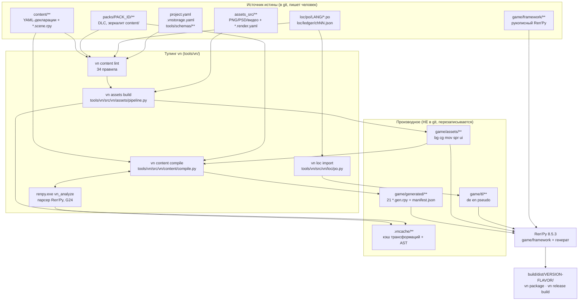

# 02. Архитектура

> **Статус подсистемы:** IMPLEMENTED — зоны каталогов, поток данных, слои `game/framework/` и init-шкала существуют ровно так, как описано ниже; главное «но» — часть норм раздела 0 `ARCHITECTURE.md` (G4, G10, C1, C19, C23, C24) кода под собой не имеет, они помечены в § 7.
> **Отвечает на вопрос:** «Куда класть файл, что его перезапишет, и какую норму я нарушу?»

Архитектура проекта — это не архитектура Ren'Py-игры, а архитектура **конвейера производства**:
источники истины лежат вне `game/`, тулинг `vn` превращает их в статический `.rpy` и собранные
ассеты, Ren'Py получает уже готовое дерево. Нормативный контракт — раздел 0
[`docs/ARCHITECTURE.md:36-201`](../ARCHITECTURE.md) (нормы G1–G24 и C1–C24), полностью
воспроизведён здесь в § 5 и § 6 как справочник.

## Быстрый ответ

```
content/**  packs/**  assets_src/**  loc/po/**   ← вы пишете сюда (в git)
        │
        └── vn build ──→ game/generated/**  game/assets/**  game/tl/**   ← НЕ в git, перезапишется
                                    │
                                    └── Ren'Py (game/framework/** + генерат) ──→ build/dist/**
```

Три правила, которые закрывают 90 % вопросов:

1. **`content/` строго вне `game/`** (G2). Всё, что человек пишет руками, — это `content/`,
   `packs/`, `assets_src/`, `loc/`, `game/framework/`, `tools/`, `docs/`.
2. **`game/generated/`, `game/assets/`, `game/tl/` — производные и не в git** (G4). Правка там
   бессмысленна.
3. **Id неизменяемы навсегда** (G7). Переименование — не `git mv`, а новый id + запись в
   `content/renames.yaml`.

---

## 1. Поток данных



Порядок внутри `vn build` жёсткий и проверяемый по [`tools/vn/src/vn/cli.py:92-153`](../../tools/vn/src/vn/cli.py):

| Шаг | Что делает | Провал → |
|---|---|---|
| 1 | `lint(root)` — полный линт, `--layout` включён по умолчанию | exit 1, сборка не начинается |
| 2 | `_assets_build(root, profile)` (или `build_assets(check=True)` при `--check`) | exit 1 |
| 3 | `compile_content(root, check)` — через `renpy.exe <root> vn_analyze` | `CompileError` → exit 1 |
| 4a | при `--check`: сверка свежести → `validate_translations` → бюджеты | exit 1 |
| 4b | при записи: `_loc_import` (PO → `game/tl/`) → бюджеты → `build: OK` | exit 1 |

Обратный поток ровно один: **`vn loc keys` дописывает say-id и маркеры меню обратно в авторский
`*.scene.rpy`** парсером Ren'Py (`tools/vn/src/vn/loc/keys.py`). Это единственный инструмент, который правит
источник истины. Подробности — [14-localization.md](14-localization.md).

## 2. Зоны каталогов

| Зона | Что это | В git? | Кто пишет | Что снесёт вашу правку |
|---|---|---|---|---|
| `content/` | Источник истины ядра: YAML-декларации + авторские `*.scene.rpy` | да | человек | — (кроме say-id от `vn loc keys`) |
| `packs/<id>/` | DLC: дерево, зеркалящее `content/`; принадлежность — по расположению (C10) | да | человек | — |
| `game/framework/` | Рукописный Ren'Py-код надстройки | да | человек | — |
| `game/generated/` | 21 `*.gen.rpy` + `manifest.json` | **нет** (`.gitignore:2`) | `vn build` | `vn build`, `vn content compile` |
| `game/assets/` | Собранные ассеты: `bg cg mov spr ui` | **нет** (`.gitignore:3`) | `vn assets build` | `vn assets build`, `vn build` |
| `game/tl/` | Переводы `de/en/pseudo` | **нет** (`.gitignore:4`) | `vn loc import` | `vn loc import`, `vn build` |
| `game/fonts/` | Единственный разрешённый бинарь в `game/`, в LFS | да | человек | — |
| `assets_src/` | Сырцы: `psd png daz vam sims4 live2d spine_export audio_stems video_src` | частично — PNG временно в git по [ADR-0004](../adr/0004-local-png-sources-in-git.md), порог 50 МБ | человек + рендер | — |
| `loc/` | Обмен с переводчиками: `loc.yaml`, `po/<lang>/`, `ledger/chNN.json` | да | `vn loc *` + переводчик | `vn loc extract` перезаписывает PO-заголовки |
| `tools/vn/` | Единственный CLI проекта (G1) | да | человек | — |
| `tools/schemas/` | 39 JSON Schema — единственный реестр версий схем (G16); устаревшие версии не удаляются, а помечаются в `title`/`description` (так живёт `build_info@1` рядом с `build_info@2`) | да | человек | — |
| `.vncache/` | Кэш трансформаций, AST-кэш, артефакты прогонов | **нет** (`.gitignore:21`) | тулинг | `vn assets cache --gc` |
| `build/` | Дистрибутивы, `rpyc-cache`, паки | **нет** (`.gitignore:20`) | `vn package`, `vn release`, `vn pack build` | — |
| `ci/` | Скрипты и фикстуры CI; `ci/fixtures/rpyc-line/**` — **единственные `.rpyc` в git** (52 файла, негейт `.gitignore:14`); `ci/fixtures/saves/**` — 2 сейва сейв-корпуса | да | человек | — |
| `docs/` | `ARCHITECTURE.md`, `adr/`, `conventions/`, `runbooks/`, `onboarding/`, `pipeline/`, `licenses/`, `handbook/` | да | человек | — |

Запрещённые пути, за которыми следит линтер (`tools/vn/src/vn/content/lint.py:20-53`): `game/content`,
`game/images`. Автоопределение образов по `game/images/` отключено намеренно — все `image`
приходят из `registry/images.gen.rpy`.

**Каталог `game/assets/audio/` пока не создан, но не из-за поломки конвейера.** Ветка
`copy_audio` читает нормативную зону `assets_src/audio_stems/{bgm,amb,sfx}/`
(`tools/vn/src/vn/assets/pipeline.py:159-170`) и раскладывает `.ogg` в
`game/assets/audio/<kind>/`; каталоги зоны заведены, поведение закрыто тестом
`test_audio_stems_branch_copies_ogg` (`tools/vn/tests/test_assets.py:52`). Каталога нет просто
потому, что в репозитории **ноль `.ogg`**, а `content/audio/{bgm,sfx}.yaml` — `tracks: {}`.
Подробности и оставшиеся дыры (поля `loop`/`loop_start`/`volume` схемы `audio@1` эмиттер
игнорирует, loudnorm нет) — [23-audio.md](23-audio.md).

## 3. Источник истины vs производное

Правило: **у каждого производного файла ровно один источник и ровно одна команда, которая его
воссоздаёт.** Если вы не знаете, кто пересоздаёт файл, — не правьте его.

| Производное | Источник | Команда | Заголовок в файле |
|---|---|---|---|
| `game/generated/**/*.gen.rpy` | `content/**`, `packs/**`, `project.yaml`, `loc/ledger/**` | `vn build` / `vn content compile` | `AUTO-GENERATED by vn content compile (vn 0.1.0)` + `# source:` + `blake3:` |
| `game/generated/manifest.json` | всё вышеперечисленное | та же | `schema: gen_manifest@1` |
| `game/assets/**` | `assets_src/**`, `content/ui/panels.yaml` | `vn assets build` | — (бинари) |
| `game/tl/**` | `loc/po/<lang>/*.po` | `vn loc import` | ручные правки ловит CI |
| `docs/CHANGELOG.md`, `ci/release-manifest.json` | декларации глав + `id_registry` | `vn release changelog` | — |
| `content/registry/id_registry.json` | главы со `status: release` | `vn release changelog` (`release.py:99`) | append-only |
| say-id в `*.scene.rpy` | сам `*.scene.rpy` | `vn loc keys` | пишется **в источник** |

Проверить свежесть, ничего не записывая: `vn build --check` (свежесть считается **побайтовым
сравнением выходов**, а не хэшами входов — `manifest["inputs"]` пишется, но никогда не читается
обратно; см. [25-custom-engine.md](25-custom-engine.md)).

## 4. Слои `game/framework/`

Норма C17: числовые префиксы, никаких `framework/core|mechanics|ui/components|screens`.
Реальное дерево (`find game/framework -type f`):

| Слой | Файлы | Роль |
|---|---|---|
| `00_core/` | `001_boot`, `010_registry`, `020_state`, `030_flow`, `035_platform`, `040_localization`, `045_audio`, `050_build_bridge`, `060_build_info`, `070_crash`, `080_achievements`, `090_gallery`, `095_quality` | Ядро: фасад `vn.*`, состояние, платформенный слой, локализация, аудио, мост к компилятору, достижения, галерея, качество текстур |
| `00_core/engine_compat/` | `000_compat.rpy` | **Единственный** модуль, которому разрешено касаться недокументированных API движка (G18) |
| `10_systems/` | только `README.md` | Механики как плагины — **NOT IMPLEMENTED**, «появятся в фазе 1–2» |
| `20_ui/` | `components.rpy`, `images.rpy`, `scale.rpy`, `input.rpy`, `screens/{build_overlay,choice,core_screens,crash_screen,gallery,history,quick_menu,unavailable}.rpy` | Компоненты и экраны; `screens/choice.rpy` — экран выборов (C1); `scale.rpy` — токены `gui.ui_scale`/`gui.overscan_pad`, `input.rpy` — единственное место дополнений `config.pad_bindings` ([39](39-platforms.md)) |
| `90_debug/` | `010_dev.rpy`, `020_jump_menu.rpy` | Консоль и Shift+J-меню прыжков; исключаются из релиза через `build.classify` в `game/options.rpy:24-26` |

**Правило «`00_core` не знает ни одной главы».** Проверено: `grep -rn "ch[0-9][0-9]"
game/framework/ --include=*.rpy` даёт ровно два попадания, и оба — в комментариях
(`050_build_bridge.rpy:73` — пример `$ ch01.x = True`; `090_gallery.rpy:56` — пример имени
образа `cg ch01 rooftop_day`). **Ни одного `chNN`-идентификатора в исполняемом коде ядра нет.**
Это инвариант: как только ядру понадобится знать про конкретную главу, вы делаете что-то не так —
глава должна прийти через генерат (`VN_CHAPTERS`, `VN_SCENES`) или через декларацию.

**Обработчик исключений в проекте ровно один.** `config.exception_handler` — единственное поле,
и побеждает последнее присваивание, поэтому обработчик живёт только в `070_crash.rpy:82`
(init −950): он пишет `[vn] unhandled exception: <Тип: сообщение>` в `log.txt`, кладёт crash-отчёт
в savedir и возвращает `False`, оставляя показ экрана движку. В `001_boot.rpy` (init −999) второе
присваивание было мёртвым и удалено — на его месте стоит комментарий-предупреждение
(`001_boot.rpy:42-49`). Инвариант «присваивание ровно одно и именно там» стережёт
`tools/vn/tests/test_crash_handler.py`.

Весь генерат обращается к движку только через фасад `vn.*` (C15):
`vn.checkpoint()`, `vn.beat()`, `vn.chapter_done()`, `vn.check_scene_stack()`,
`vn.unwind_call_stack()`, `vn.eval_when()` — все в `00_core/030_flow.rpy`. У фасада есть
`API_LEVEL = 1` (`030_flow.rpy:9`), и именно его проверяют манифесты DLC-паков.

## 5. init-шкала

Норма C8 (`ARCHITECTURE.md:147`) задаёт единую шкалу. [ADR-0003](../adr/0003-init-scale-engine-limit.md)
сдвинул её начало с −1000 на −999: реальный `renpy lint` на SDK 8.5.3 отвечает
«init priority (-1000) is not in the -999 to 999 range». **Верхняя граница 999 тоже жёсткая —
новых уровней выше не заводить.**

Фактическая раскладка (собрана `grep -rn "^init " game/framework/ game/generated/`):

| Приоритет | Что здесь живёт | Файлы |
|---|---|---|
| `-999` | Ядро: boot, `vn_registry`, `vn_state`, фасад `vn`, `vn_qa` | `001_boot.rpy:5`, `010_registry.rpy:4`, `020_state.rpy:12`, `030_flow.rpy:4,91` |
| `-995` | Реестр языков `vn_lang`, лукап строк `vn_loc` | `040_localization.rpy:15,137` |
| `-985` | `vn_build` — метаданные флейвора | `060_build_info.rpy:10` |
| `-980` | Named stores генерата + `vn_ach` + `vn_gal` | `state/defaults.gen.rpy:10,13`, `080_achievements.rpy:12`, `090_gallery.rpy:20` |
| `-970` | `SNAPSHOT_VARS` / `SNAPSHOT_STORES` | `state/snapshot.gen.rpy:8` |
| `-960` | Цепочка миграций; store `vn_platform` (фасад платформы, ADR-0014) | `state/migrations.gen.rpy:7`, `035_platform.rpy:16` |
| `-950` | `engine_compat`, обработчик крэшей | `engine_compat/000_compat.rpy:5`, `070_crash.rpy:10` |
| `offset = -900` | `config.version` | `version.gen.rpy:6` |
| `-100` / `offset = -100` | Данные реестров: chapters, scenes, menus, achievements, gallery, `config.label_overrides` | `registry/{chapters,scenes,menus,achievements,gallery}.gen.rpy`, `registry/overrides.gen.rpy:7` |
| `-4` / `offset = -3` | Хелпер `gui.vn_ui_scale()`, затем токены `gui.ui_scale` и `gui.overscan_pad` — **до** `gui.rpy` (`offset = -2`), который на них умножает кегли | `20_ui/scale.rpy:15,35-42` |
| `offset = 0` | UI-компоненты и экраны, `layeredimage`/`image`, `Frame`-панели, дополнения `config.pad_bindings` | `20_ui/**`, `20_ui/input.rpy:19`, `registry/images.gen.rpy:7`, `registry/ui_frames.gen.rpy:7` |
| `offset = 500` | Контентные `define`: аудио, персонажи | `registry/audio.gen.rpy:8`, `registry/characters.gen.rpy:7` |
| `999` | Пересборка рантайм-реестра языков; подключение платформенных провайдеров (ownership + ачивки) — реестры уже загружены, Steam уже инициализирован движком | `040_localization.rpy:131`, `035_platform.rpy:71` |

**Расхождения с C8, зафиксированные честно (IMPLEMENTED с дрейфом):**

- C8 отводит `build_info` уровень −900; реально `vn_build` сидит на −985, а слот −900 занят
  `version.gen.rpy` (`init offset = -900`).
- Уровень −995 (`vn_lang`/`vn_loc`) в C8 не описан вовсе — он введён [ADR-0005](../adr/0005-language-packages-and-runtime-registry.md).
- «DLC-слоты 999» из C8 наконец используются по назначению: на 999 вместе с пересборкой реестра
  языков живёт подключение платформенных провайдеров ([ADR-0014](../adr/0014-platform-services.md),
  `035_platform.rpy:71-89`) — ownership-гейт паков и синк ачивок.
- `image`- и `layeredimage`-стейтменты имеют базовый приоритет 500 внутри движка, поэтому
  `registry/images.gen.rpy` намеренно ставит `init offset = 0` (`tools/vn/src/vn/content/images.py:52-55`) —
  не «исправляйте» это на 500.

## 6. Нормы G1–G24 и C1–C24 — полный справочник

Раздел 0 `ARCHITECTURE.md` — контракт: код и процессы, ему противоречащие, не проходят ревью.
Изменение любого пункта — только новым ADR (`ARCHITECTURE.md:36`, `ADR-0001:15-18`).
Столбец «Статус» — фактическое состояние кода, не текст документа.

### 6.1. G1–G24 — нормативные решения (`ARCHITECTURE.md:51-99`)

| id | Стр. | Норма | Статус |
|---|---|---|---|
| **G1** | :53 | Один CLI `vn` (пакет `tools/vn/`), домены-подкоманды; других утилит не существует; CI-режим проверки без записи — флаг `--check` везде | IMPLEMENTED (20 доменов); `--check` есть не у всех команд |
| **G2** | :55 | Зоны каталогов: `content/` строго вне `game/`; `game/generated/` — единственная зона генерата (в .gitignore); `game/assets/` не в git; `assets_src/` — сырцы (в git только манифесты); `game/framework/` — рукописный код | IMPLEMENTED; ослаблено ADR-0004 (PNG временно в git) |
| **G3** | :57 | Диалоги живут в `scene.rpy`; сцена = `scene.yaml` (метаданные) + `scene.rpy` (диалоги/show/hide/menu); диалогов в YAML не существует | IMPLEMENTED |
| **G4** | :59 | `game/assets/`, `game/generated/`, `game/tl/` не коммитятся; обязательный `vn bootstrap` тянет их из remote cache/CI-артефактов последнего зелёного main; гарантия «clone → bootstrap → запуск ≤ 5 минут»; аварийный режим `vn build --use-artifact <sha>` | PARTIAL: зоны не в git — да; доставка из артефактов, CI-джоба ≤ 5 мин и `--use-artifact` — NOT IMPLEMENTED |
| **G5** | :61 | Состояние — named stores + миграции над dict-снапшотом; `default` генерируется из `vars.yaml`; в сейве только простые типы; единственный счётчик `vn_save_schema`; одна цепочка `migrate(state)` и в игре, и оффлайн; номера миграций резервируются реестром | PARTIAL: всё, кроме оффлайн-исполнения (`vn save migrate` — фаза 3) |
| **G6** | :63 | `.rpyc` генерата — релизный артефакт: подкладывается перед компиляцией следующего релиза; очистка `generated/` точечная по диффу манифеста; полный wipe только в release-CI | IMPLEMENTED; кэш `build/rpyc-cache/<version>/` ключуется только версией, не флейвором |
| **G7** | :65 | Идентификаторы: id сцены `chNN_sNNN`, слуг только в имени файла; id неизменяемы навсегда; переименование = `renames.yaml` → `config.label_overrides` + физическая shim-метка; `config.missing_label` не существует; инвариант call-стека (глубина 0 на входе в сцену) | IMPLEMENTED; защита «выпущенный id исчез» инертна — `id_registry.json` пуст |
| **G8** | :67 | Локализация поверх `scene.rpy`: `vn loc keys` дописывает id-клаузы парсером Ren'Py; у menu-пунктов клаузы `id` нет — перевод выборов через lookup по choice-id; обмен — gettext PO с msgctxt; ledger шардирован по главам; `game/tl/` генерируется | IMPLEMENTED (включая голос: озвучка привязана к тем же say-id, `config.auto_voice` не используется — см. C5) |
| **G9** | :69 | DLC: скрипты всех паков грузятся всегда; владение — логический гейт после инициализации Steam через `pack_registry.owned()`; манифест пака несёт `api_level` фасада `vn.*`; каждый релиз ядра переиздаёт все DLC-депоты | PARTIAL: `api_level` и `owned()` IMPLEMENTED; провайдер владения **подключён** [ADR-0014](../adr/0014-platform-services.md) (`035_platform.rpy:75`, `steam_dlc_appid` в манифесте, fail-open) — но только при живом Steam, вне него `owned()` = True. Переиздание всех DLC-депотов на релиз и депот пака как товара — NOT IMPLEMENTED ([39](39-platforms.md), [30](30-packs-and-dlc.md)) |
| **G10** | :71 | Моды: инжекты только на реестр стабильных якорей; подпись отделена от проверки совместимости; Mod SDK — фаза 3, но формат паков мод-совместим с первого дня | NOT IMPLEMENTED: `content/anchors.yaml` пуст и никем не читается |
| **G11** | :73 | layeredimage-эмиттер: `attribute X default Null()`, гейтинг `if_any`/`if_all`, у каждого attribute явный displayable; golden-тесты через `renpy compile`+lint; тонировка через генерируемый `config.tag_layer` + `camera sprites` | PARTIAL: эмиттер и `config.tag_layer` есть; golden-тестов нет (ноль тестов, запускающих SDK) |
| **G12** | :75 | Live2D/Spine: один тег = одно определение image; prebaked fallback обязателен для 100 % анимированных персонажей; проприетарные рантаймы вендорятся; экспортированные секвенции — самостоятельные сырцы в S3 | NOT IMPLEMENTED (фаза 3); зоны `assets_src/{live2d,spine_export}/` заведены пустыми |
| **G13** | :77 | Кэш ассетов: ключ = хэш содержимого (PSD — послойно) + версия инструмента трансформации; draft-энкод локально, полное качество в CI; warm-up remote cache перед бампом тулчейна; бюджет цикла художника P95 < 15 с | PARTIAL: ключ и профили `draft/full` есть; remote cache и замер P95 — нет |
| **G14** | :79 | Локи на сырцы обязательные: `vn assets push` без валидного лока отказывает; `pull --edit` берёт лок; бот-нотификации; TTL с эскалацией | PARTIAL: лок обязателен на push; TTL, эскалация, атомарность и нотификации — NOT IMPLEMENTED |
| **G15** | :81 | Строгость валидации по статусу главы: `draft` → граф-проверки warnings; orphan-ассеты — error только в release-гейте; scope-check заменён CODEOWNERS-approve; smoke на MR — только затронутые главы (< 10 мин), полный — nightly | PARTIAL: градация по статусу IMPLEMENTED (`lint.py:209,231,270`); `smoke --affected` не существует |
| **G16** | :83 | Каждый YAML начинается с `schema: <name>@<int>` без исключений; реестр схем — `tools/schemas/`; `vn migrate` покрывает все типы деклараций | PARTIAL: правило и реестр IMPLEMENTED (39 схем); дыра `assets_manifest@1` закрыта — схема заведена, и манифест `.vncache/assets-manifest.json` валидируется ею при записи (`assets/pipeline.py:441-450`). Остаётся: `vn migrate` — заглушка фазы 2 |
| **G17** | :85 | Версии: `project.yaml` несёт `version` (semver, новая глава = minor), `save_schema` (int), `min_tools`; версии tools — lockfile, откат = git revert | PARTIAL: `project.yaml` — да; `tools/vn.lock` теперь **читается** — во всех в 8 джобах установки тулчейна (7 строк в конфигах: GitLab-шаблон `.with-sdk` разворачивается в `build` и `test`) перед editable-установкой идёт `pip install --quiet -r tools/vn.lock`, свойство стережёт `tools/vn/tests/test_ci_config.py`. Остаётся: в локе 18 пакетов, транзитивные зависимости (`pygments`) не закреплены |
| **G18** | :87 | Эволюция движка: недокументированные API — только в `framework/00_core/engine_compat/` с контракт-тестами; weekly canary CI на свежем Ren'Py; апгрейд SDK минимум раз в год как плановая работа | IMPLEMENTED: `engine_compat/000_compat.rpy`, `tests/test_engine_compat.py`, `.github/workflows/canary.yml` |
| **G19** | :89 | Перф-бюджеты в CI: cold start, baseline RSS (слабое железо + Android-эмулятор), суммарный размер `.rpyc`, размер реальных `.aab`/`.apk` по каналам | PARTIAL: только `cold_start_s` (в `vn test smoke`) и размеры каталогов; RSS, `.rpyc`, мобильные сборки — NOT IMPLEMENTED |
| **G20** | :91 | Скоуп по фазам (1 — компилятор/ассеты/валидаторы/bootstrap/CI; 2 — локализация/миграции/QA/релиз; 3 — Live2D/DLC/моды/скриншот-тесты/телеметрия); два владельца на инструмент; runbook аварий; онбординг tools-инженера | PARTIAL: runbook и онбординг есть; все владельцы в `CODEOWNERS` — плейсхолдеры |
| **G21** | :93 | Хранилище сырцов адресуется логическими id (`storage: default, key: …` в манифестах); маппинг на физические endpoint'ы — один конфиг | IMPLEMENTED (`.vnstorage.yaml`), но ни разу не использовано — `~/vn-assets-store` не существует |
| **G22** | :95 | Онбординг по ролям: однокомандный инсталлер + `vn doctor`; метрика — сценарист от чистой машины до правки в игре < 1 дня | PARTIAL: `vn doctor` есть; однокомандного ролевого инсталлера нет (`pip install -e tools/vn` вручную) |
| **G23** | :97 | QA/headless: headless у Ren'Py нет — xvfb; savecheck = оффлайн-структурная проверка + полный прогон (процесс-на-слот); автопилот через QA-label с fixed seed | IMPLEMENTED: `vn test smoke` (in-process), `vn save check` + `vn save corpus` на 2 фикстурах, одна из которых на старой схеме — цепочка миграций проигрывается в реальной игре |
| **G24** | :99 | Content Compiler: разбор `.rpy` только парсером Ren'Py из пиннованного SDK; архитектура frontend/IR/backends с плагинными стадиями; e2e golden-тесты; поддержка схем N и N−1 | PARTIAL: парсер SDK — IMPLEMENTED (`tools/vn/src/vn/content/analyze.py:37-70` + `050_build_bridge.rpy:98-144`); плагинных стадий, golden-тестов и поддержки N−1 нет |

### 6.2. C1–C24 — интеграционный канон (`ARCHITECTURE.md:103-201`)

| id | Стр. | Канон | Статус |
|---|---|---|---|
| **C1** | :109 | Идентичность пунктов меню: маркер `vn_menu` (без `_`, попадает в сейв), формат id меню `m\d{3}`, текст — `vn_loc.choice_text(vn_menu, idx, caption)`, QA-якорь `vn_qa.choice(...)` первым стейтментом ветки; «стабильных label-имён меню» и `vn_qa.menu_enter` НЕ существует | PARTIAL: `vn_menu` и `choice_text` IMPLEMENTED; `vn_qa.choice()` — `pass`-заглушка (`030_flow.rpy:98-101`), компилятор её не эмитит |
| **C2** | :116 | Контракт авторского `scene.rpy`: автор пишет `label <full_id>__body:` и ветки `<full_id>__<branch>:`; обвязку `label <full_id>:` эмитит компилятор; межсценовые переходы — ТОЛЬКО `return "<exit_id>"`, прямые `jump`/`call` наружу запрещены линтером | IMPLEMENTED (`tools/vn/src/vn/content/scenes.py:18,81-104`) |
| **C3** | :123 | Путь генерата сцены — `game/generated/scenes/chNN/<full_id>.gen.rpy`, имя только по id (без слуга); каталога `generated/content/` не существует | IMPLEMENTED (`compile.py:766`) |
| **C4** | :126 | Единая схема scene/chapter: `schema: scene@1`/`chapter@1` без префикса `vn/`; `id: sNNN` короткий (полный выводится из пути), блок `vars: {reads, writes}` (не `flags:`); exits — map с `when:`/`to:`; заголовки только `title_key:` | IMPLEMENTED; при этом `scene.yaml:id` и `title_key` компилятором **не читаются** (id — из имени файла) |
| **C5** | :133 | Голосовой контур: манифесты `content/chapters/chNN/voice/<lang>.voice.yaml`, оператор `voice vn.voice_path("<line_id>")`, домен `vn voice manifest\|import\|tts\|validate`; `vn loc report --domain voice` не существует | IMPLEMENTED, кроме `vn voice tts` (заглушка фазы 2, `cli.py:1278-1281`): схема `voice@1`, инжекция voice-операторов компилятором, `vn.voice_path` с деградацией язык→оригинал→no-op (`045_audio.rpy`), транскод `voice_opus`, гейт в `vn release validate` — см. [23-audio.md](23-audio.md) §8 |
| **C6** | :139 | Состав спрайтов объявляется единым `character.yaml` с блоком `matrix:` (poses/outfits/emotions/required/forbidden); файла `sprites.yaml` НЕ существует | IMPLEMENTED (`tools/vn/src/vn/content/images.py:101-237`) |
| **C7** | :142 | Раскладка слоёв: `game/assets/spr/<char>/<pose>/base@2.webp`, `<pose>/{outfits,faces,overlays}/*@2.webp`, `side/<emotion>@2.webp`; в генерате пути с префиксом зоны `"assets/spr/…"` | PARTIAL: `base`/`outfits`/`faces` IMPLEMENTED; `overlays` сканируются, но не эмитятся; `side/` — NOT IMPLEMENTED |
| **C8** | :147 | Единая init-шкала: ядро −999, named stores −980, engine_compat −950, build_info −900, реестры −100, темы −60…−50, styles/screens 0, контентные define 500, DLC-слоты 999 (правка ADR-0003) | IMPLEMENTED с дрейфом — см. § 5 |
| **C9** | :150 | Persistent — плоская модель с префиксом `persistent.vn_*` (никакого dict-корня `persistent.vn`); разблокировка галереи — штатный `Gallery` + `persistent._seen_images` | Префикс `vn_*` IMPLEMENTED и проверяется компилятором; механизм галереи ЗАМЕНЁН [ADR-0010](../adr/0010-gallery-extras.md) на два источника |
| **C10** | :153 | DLC-контент живёт в `packs/<pack_id>/` в корне репозитория (зеркалит `content/`); поля `pack:` в chapter.yaml НЕ существует — принадлежность по расположению; `content/` = core | IMPLEMENTED (`compile.py:505-513,541`) |
| **C11** | :156 | Имена схем без префикса `vn/`, версии `@1`; манифест сырца — единый `asset_src@1`; vars-файлы — единый `vars@1` (`store:` + `vars:`); хэш всего тулинга — blake3 | IMPLEMENTED |
| **C12** | :161 | `renames.yaml`: `schema: renames@1`, секции `scenes:`, `deleted_scenes:` (`{fallback:, since:}`), `labels:`, `vars:`; генерат — `registry/overrides.gen.rpy` с `init -100 python: config.label_overrides.update({...})` + shim-метки | IMPLEMENTED (`compile.py:407`); сегодня все секции пусты |
| **C13** | :164 | Финальный перечень доменов CLI (`bootstrap\|doctor\|dev\|build\|play\|package`, `assets/content/scene/chapter/char/loc/voice/save/test/release/pack`, `shell`, `migrate`); `--check` везде (`--verify` не существует); `vn dev` — комбинированный цикл | IMPLEMENTED по составу доменов; `char`, `shell`, `migrate` — заглушки; в `voice` заглушка только `tts` |
| **C14** | :169 | Владение паками — единственное API `vn.pack_registry.owned(pack_id)`; экран выбора глав один — `screen chapter_select()` в `generated/screens/chapter_select.gen.rpy` по define `VN_CHAPTERS` | IMPLEMENTED по форме; `owned()` всегда True — провайдера нет |
| **C15** | :173 | Фасад рантайма: `vn.checkpoint()`, `vn.beat()`, `vn.unwind_call_stack()`, `vn.check_scene_stack()`, глубина — `renpy.call_stack_depth()`; голых глобалов `vn_checkpoint`/`vn_beat` не существует | IMPLEMENTED; `vn.beat()` существует, но компилятор его никогда не эмитит |
| **C16** | :176 | Реестр id — единственный путь `content/registry/id_registry.json` (append-only) | IMPLEMENTED, но все четыре массива пусты |
| **C17** | :179 | Раскладка framework с числовыми префиксами: `00_core/` (+ `engine_compat/`), `10_systems/<mechanic_id>/`, `20_ui/` (`20_ui/screens/choice.rpy`), `90_debug/` | IMPLEMENTED; `10_systems/` содержит только README |
| **C18** | :182 | Аудио по логическим id: `define audio.<id> = "assets/audio/bgm/<file>.ogg"`, в сценах `play music <id>`; физические пути только `assets/audio/{bgm,amb,sfx}/…`; форматы `.ogg` (bgm/amb/sfx), `.opus` (voice); каталога `audio/music/` нет | PARTIAL: реестр `registry/audio.gen.rpy` эмитится (`loop_start` — префиксом `"<loop N>file"`, `volume` — клаузой play-оператора сцены), ветка `copy_audio` жива, канал `ambient` и дакинг под голос — в `045_audio.rpy`, kind трека сверяется с каналом при компиляции. Остаётся: ни одного `.ogg` в репозитории (`tracks: {}` во всех трёх `content/audio/*.yaml`), поле `loop` не читается, loudnorm для bgm/amb/sfx нет |
| **C19** | :185 | Служебные зоны: локальный кэш `.vncache/` (одно написание); два манифеста с разными ролями — `game/generated/manifest.json` (Content Compiler) и `.vncache/build-graph.json` (DAG оркестратора); хэш — blake3 | PARTIAL: `.vncache/` и `manifest.json` IMPLEMENTED; `.vncache/build-graph.json` — NOT IMPLEMENTED (оркестратора нет) |
| **C20** | :188 | Сырцы Live2D/Spine — отдельные ветки `assets_src/live2d/characters/<key>/` и `assets_src/spine_export/characters/<key>/`, НЕ внутри `assets_src/psd/` | Зоны заведены, содержимого нет — NOT IMPLEMENTED по существу |
| **C21** | :191 | Regex-константы: ключ персонажа `^[a-z][a-z0-9_]{1,23}$`; переменная `^(g\|ch\d{2}\|mech_[a-z0-9_]+\|dlc_[a-z0-9_]+)\.[a-z][a-z0-9_]*$` | IMPLEMENTED (`vars@1.schema.json`, `character@1.schema.json`) |
| **C22** | :194 | `vn bootstrap` доставляет `game/assets/` + `game/generated/` + `game/tl/` последнего зелёного main | NOT IMPLEMENTED — команда делает локальную пересборку, о чём честно пишет её docstring (`cli.py:206-207`) |
| **C23** | :197 | `vn play --scene` реализуется env-вариантом: `game/generated/qa/dev_boot.gen.rpy` читает `VN_SCENE`/`VN_PRESET`; release-CI проверяет отсутствие файла | NOT IMPLEMENTED — ни файла, ни опции `--scene` у `vn play` |
| **C24** | :200 | Галерея: разблокировка штатным `Gallery` + `persistent._seen_images`; генерат `game/generated/screens/gallery.gen.rpy`; пути `assets/cg/…`, `assets/bg/…` — сегмента `images/` не существует | ЗАМЕНЁН ADR-0010: два источника разблокировки, экран рукописный (`20_ui/screens/gallery.rpy`), генерат — `registry/gallery.gen.rpy`. Норма «сегмента `images/` не существует» — IMPLEMENTED |

## 7. Что в ARCHITECTURE.md есть, а в коде НЕТ

Список отсортирован по риску «прочитать документ и поверить». План закрытия — [37-roadmap.md](37-roadmap.md).

| Обещание | Где обещано | Реальность |
|---|---|---|
| `vn build --use-artifact <sha>` — аварийный запуск на артефактном генерате | G4 (`:59`), § 8.5 (`:4120`), `docs/runbooks/pipeline-broken-at-night.md:11`; **14 упоминаний в документе** | **NOT IMPLEMENTED.** У `vn build` есть только `--check` и `--profile` (`cli.py:84-88`). Во всём `tools/`, `ci/`, `.github/`, `.gitlab-ci.yml` строка `use-artifact` встречается **один раз** — в title схемы `tools/schemas/gen_manifest@1.schema.json:4`. Аварийный путь исполняется только вручную: скачать артефакт CI и распаковать в `game/generated/` |
| `vn validate --schemas` / `--budgets` | § 7 | **NOT IMPLEMENTED.** Группы `vn validate` не существует вовсе |
| `vn bootstrap` доставляет три зоны из CI-артефактов; CI-джоба «clone → ≤ 5 мин» | G4, C22, § 7.4, § 8.2 | **NOT IMPLEMENTED.** Команда пересобирает локально; такой джобы нет ни в `.github/workflows/`, ни в `.gitlab-ci.yml` |
| `content/flags.yaml` — флаг как условие **компиляции** («выключенный контент не существует в release-сборке») | `:696` | **NOT IMPLEMENTED.** Файл обязан существовать (`lint.py:40`), но `flags` не читает ни компилятор, ни рантайм |
| `content/anchors.yaml` — реестр инжект-якорей для модов | G10, `:3255,3317` | **NOT IMPLEMENTED.** То же самое: существование проверяется, содержимое не читается |
| `vn_qa.choice(scene_id, vn_menu, idx)` первым стейтментом каждой ветки | C1, `:544-551,572` | **NOT IMPLEMENTED.** `emit_scene` копирует авторский исходник дословно и не переписывает menu-блоки; сама функция — `pass` |
| `game/generated/qa/dev_boot.gen.rpy` и `vn play --scene <id>` | C23 | **NOT IMPLEMENTED** |
| `.vncache/build-graph.json` — граф оркестратора сборки | C19 | **NOT IMPLEMENTED** |
| `game/assets/registry.json` | `:1085` | **NOT IMPLEMENTED** |
| Спрайт-ветка `side/<emotion>@2.webp` | C7 | **NOT IMPLEMENTED** (ноль совпадений `side/` в `tools/vn/src/vn/`) |
| Golden-тесты «декларации → байт-в-байт `.rpy`» через `renpy compile`+lint | G11, G24, § 9.4 | **NOT IMPLEMENTED.** В `tools/vn/tests/` ноль совпадений на «golden» и ни один тест не запускает SDK |
| Поддержка схем N и N−1, `vn migrate` переписывает контент | G16, G24, § 9.4 | **NOT IMPLEMENTED** — `vn migrate` заглушка фазы 2 |
| `docs/adr/engine-assumptions.md` — живой список движковых допущений | § 9.1 (`:4137`) | **NOT IMPLEMENTED.** Файла нет; допущения рассыпаны по ADR-0003 (предел −999) и ADR-0005 (мёртвый `config.change_language_callbacks` в Ren'Py 8.5) |
| `.rpa`-архивы / `build.archive` | § 2.4 (`:943`) | **Больше не обещано**: §2.4 фиксирует россыпь как норму (Steam дельта-патчит отдельные файлы); тематические `.rpa` — только опция mobile-поставки фазы 3, их появление в desktop-дистрибутиве — осознанное решение с ADR. В `game/` — ноль вхождений `build.archive`, и это соответствует норме |
| Перф-бюджеты RSS, суммарный `.rpyc`, `.aab`/`.apk` | G19 | **NOT IMPLEMENTED** — только `cold_start_s` и размеры каталогов |
| Live2D/Spine, моды, телеметрия, скриншот-тесты | G12, G10, § 8.4 | **NOT IMPLEMENTED** — фазы 2–3 (голосовой контур C5 из этого списка выбыл: реализован, кроме `vn voice tts`) |

Обратная асимметрия — **реализовано, но в `ARCHITECTURE.md` не описано вообще**
(проверено case-insensitive grep'ом: 0 вхождений DAZ / ComfyUI / Virt-a-Mate / Sims / `ui_panel` /
`panels.yaml` / `vn_frame`): весь внешний 3D-конвейер ([ADR-0006](../adr/0006-daz-comfyui-video-pipeline.md),
[ADR-0007](../adr/0007-sims4-optional-source.md)), генерируемые UI-панели
([ADR-0009](../adr/0009-generated-ui-panels.md)), достижения, `vn pack validate`,
`vn assets video inspect`, `vn assets provenance workflow` и все четыре GitHub-workflow.
Для них единственный нормативный источник — ADR и этот хендбук.

## 8. Id неизменяемы навсегда

Это самая дорогая для нарушения норма проекта (G7, C16), потому что statement-имена в `.rpyc` —
единственная опора позиционной save-совместимости Ren'Py.

**Что такое id.** Id сцены — `chNN_sNNN`, выводится **из имени файла**, а не из поля `id:`
в YAML (`compile.py:31-32,571-575`). Слуг живёт только в имени файла и в имени папки:
`content/chapters/ch01_awakening/scenes/s020_school_gate.scene.yaml` → id `ch01_s020` →
генерат `game/generated/scenes/ch01/ch01_s020.gen.rpy` → метка `label ch01_s020:`.
Слуга в генерате нет намеренно (C3).

**Как переименовать сцену.** `git mv` — неправильный ответ. Правильный:

1. Создать сцену с **новым** id (новый номер), перенести содержимое.
2. Записать соответствие в `content/renames.yaml` (`schema: renames@1`, секции `scenes:`,
   `deleted_scenes:` с `{fallback:, since:}`, `labels:`, `vars:`).
3. `vn build` — компилятор сгенерирует `game/generated/registry/overrides.gen.rpy`:
   `init -100 python: config.label_overrides.update({...})` **плюс** физические shim-метки.
   Именно `update`, а не `define`: паки должны иметь возможность дополнять карту (C12).
4. Старый id **никогда** не переиспользуется под другой смысл.

Сегодня `content/renames.yaml` пуст (все четыре секции `{}`), а сгенерированный
`overrides.gen.rpy` содержит `config.label_overrides.update({})` и комментарий
«Переименований нет — shim-метки не требуются».

**`content/registry/id_registry.json`** (`schema: id_registry@1`, append-only) — вторая половина
защиты: реестр выпущенных id. `stamp_id_registry` (`release.py:99-121`) записывает туда главы
только со `status: "release"`, а линтер (`lint.py:319-369`) падает, если выпущенный id исчез из
дерева. **Сегодня механизм инертен:** единственная глава `ch01_awakening` имеет `status: draft`,
поэтому все четыре массива реестра пусты и защите нечего охранять. Она включится сама при первой
главе со статусом `release`.

`config.missing_label` не используется намеренно (G7): вместо динамического перехвата
отсутствующей метки генерируются физические shim-метки для всех отсутствующих id.

## Как изменить / Как расширить

| Задача | Порядок действий |
|---|---|
| Завести новую зону каталога | 1) ADR по `docs/adr/template.md` с полем «Затрагивает нормы: G2/...»; 2) обновить `REQUIRED_DIRS`/`FORBIDDEN_PATHS` в `tools/vn/src/vn/content/lint.py:20-53`; 3) обновить `docs/conventions/folder-layout.md`; 4) добавить строку в `CODEOWNERS`; 5) при необходимости — `.gitignore` |
| Добавить уровень init | Нельзя выйти за `-999..999`. Согласовать с C8 и ADR-0003, вписать в § 5 этого файла и в заголовок затронутого файла `game/framework/` |
| Добавить новый вид генерата | Эмиттер в `tools/vn/src/vn/content/compile.py`, регистрация выхода в словаре `outputs`, схема входа в `tools/schemas/<name>@1.schema.json`, тест в `tools/vn/tests/`. См. [25-custom-engine.md](25-custom-engine.md) |
| Изменить норму G/C | Только новым ADR со ссылкой на заменяемую норму. Правка `ARCHITECTURE.md` без ADR не проходит ревью (`ARCHITECTURE.md:36`) |
| Добавить слой в `game/framework/` | Только по схеме C17 — числовой префикс каталога; `10_systems/<mechanic_id>/` для механик |
| Переименовать сцену/главу/переменную | См. § 8 — через `content/renames.yaml`, никогда `git mv` |

## Чего НЕ делать

- **Не правьте файлы с шапкой `AUTO-GENERATED by vn content compile`** — их 19 штук в
  `game/generated/`, следующая сборка сотрёт правку без предупреждения.
- **Не делайте `git mv` сцене или главе.** Statement-имена в `.rpyc` — опора save-совместимости;
  переименование ломает сейвы игроков навсегда. Только `content/renames.yaml`.
- **Не ставьте `init -1000`** — движок отвергает: «init priority (-1000) is not in the -999 to 999
  range» (ADR-0003). И не заводите уровни выше 999.
- **Не «исправляйте» `init offset = 0` в `registry/images.gen.rpy` на 500** — `image`-стейтменты
  и так имеют базовый приоритет 500.
- **Не заводите второй CLI** (G1). Любая новая утилита — подкоманда `vn`, иначе она не пройдёт ревью.
- **Не полагайтесь на `manifest["inputs"]`** для инкрементальной пересборки: он пишется, но
  никогда не читается, а сканы `game/assets/{cg,mov,spr}` вообще не попадают во входы.
- **Не считайте `docs/conventions/folder-layout.md` полным**: в нём нет `content/gallery/`,
  `content/achievements/`, `content/ui/`, `content/licenses.yaml`, `game/fonts/`,
  `docs/licenses/`, `.github/` — при этом документ объявлен эталоном для `vn content lint --layout`.
- **Не добавляйте ключ в YAML, не добавив его в схему**: у схем стоит
  `additionalProperties: false` (ADR-0002), линт свалится.

## Проверка

```bash
vn content lint                        # 34 правила + сверка раскладки каталогов
vn build --check                       # CI-режим: ничего не пишет, проверяет свежесть генерата
vn content graph                       # mermaid-граф сцен (только content/, паки не видны)
python -m pytest tools/vn/tests -q     # 253 passed
grep -rn "^init " game/framework/ game/generated/ | sort   # ручная сверка init-шкалы с § 5
grep -rn "ch[0-9][0-9]" game/framework/ --include=*.rpy    # должны остаться только 2 комментария
```

## Для AI-агента

| | |
|---|---|
| **Читать перед изменением** | `docs/ARCHITECTURE.md` § 0 (строки 36–201), `docs/conventions/folder-layout.md`, `docs/conventions/naming.md`, `tools/vn/src/vn/content/lint.py`, `CODEOWNERS` |
| **Не трогать** | `game/generated/**` (21 `*.gen.rpy` + `manifest.json`), `game/assets/**`, `game/tl/**`, `.vncache/**`, `build/**` — производные зоны; `docs/ARCHITECTURE.md` — только через ADR |
| **Зависимости** | Правка `content/**` → перегенерация `game/generated/**` → перекомпиляция `.rpyc` → потенциальный слом сейвов; правка `assets_src/**` → `game/assets/**` → `registry/images.gen.rpy`; правка `content/ui/panels.yaml` → `game/assets/ui/*.webp` + `registry/ui_frames.gen.rpy`; правка `loc/po/**` → `game/tl/**` |
| **Валидация** | `vn content lint && vn build && python -m pytest tools/vn/tests -q` |
| **Частые ошибки** | 1) считать текст `ARCHITECTURE.md` описанием кода — сверяйтесь с § 6 и § 7; 2) переименовывать сцену через `git mv` вместо `renames.yaml`; 3) писать в `game/generated/`; 4) добавлять YAML-ключ без правки схемы (`additionalProperties: false`); 5) вводить `chNN`-идентификатор в `game/framework/00_core/` — ядро глав не знает; 6) ожидать, что `vn content graph` покажет главы из `packs/` — он сканирует только `content/chapters/` |
