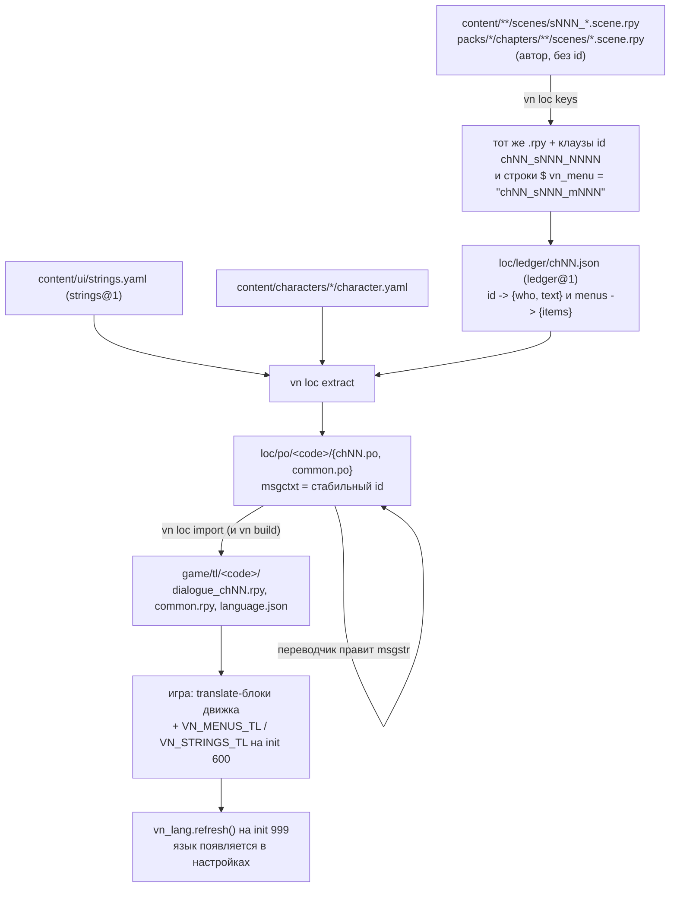

# 14. Локализация

> **Статус подсистемы:** IMPLEMENTED — round-trip PO работает целиком (`vn loc keys/add/extract/import/pseudo/report`), 3 языковых пакета живут в репозитории, покрытие 136/136; на те же say-id опирается озвучка (`voice@1`, см. [23-audio.md](23-audio.md) §8). **Но:** RTL/множественные формы/POT/CAT — NOT IMPLEMENTED, `vn loc report` не умеет гейтить сам. Номера say-id больше НЕ переиспользуются: ledger стал журналом (`ledger@2`, high-watermark — 2026-08-19).
> **Отвечает на вопрос:** «Как добавить язык, как перевести новую строку, как не сломать переводы правкой сцены и что проверит релизный гейт».

Локализация — единственная подсистема, которая пишет **в авторские исходники** (`vn loc keys` дописывает `id` прямо в `content/**/scenes/*.scene.rpy`) и полностью генерирует зону `game/tl/` (gitignored, `.gitignore:4`). Тулинг: `tools/vn/src/vn/loc/keys.py` (249 строк) и `tools/vn/src/vn/loc/po.py` (610 строк), CLI-группа `tools/vn/src/vn/cli.py`. Рантайм: `game/framework/00_core/040_localization.rpy` (named stores `vn_lang` и `vn_loc`). Норматив — `../ARCHITECTURE.md` §5 (строки 2448-2916), архитектурное решение — `../adr/0005-language-packages-and-runtime-registry.md`.

## Быстрый ответ

```bash
# написал/поправил сцену — назначить id и обновить ledger
vn loc keys                       # правит content/**/*.scene.rpy + loc/ledger/chNN.json
vn loc extract                    # обновляет loc/po/{en,de}/*.po, pseudo регенерируется
#   …переводчик правит msgstr в loc/po/<code>/*.po…
vn loc import                     # loc/po/ -> game/tl/<code>/  (то же делает vn build)
vn loc report                     # покрытие по языкам

# новый язык — одна команда, ноль правок кода и конфигов
vn loc add ja --name 日本語

# проверить перед пушем
vn loc keys --check               # то же гоняет CI: .github/workflows/ci.yml:64
vn build --check                  # среди прочего валидирует разметку переводов
```

`game/tl/` **никогда не правят руками** — это генерат, перезаписывается на каждом `vn build` (`cli.py` → `_loc_import`, `cli.py`).

## Round-trip: что создаётся на каждом шаге

**Статус: IMPLEMENTED.**



Зоны, которые сканирует `vn loc keys`: `content/chapters/` **и** `packs/*/chapters` (`keys.py:48-49`) — глава пака `ch90_beach` реально попадает в ledger и в PO. (`vn content graph` пакетные главы, наоборот, не видит — см. `../handbook/09-chapters.md`.)

Что производное и не в git: `game/tl/**` целиком. Что в git: `loc/ledger/*.json`, `loc/po/**`, `loc/loc.yaml` — и правки, внесённые `vn loc keys` в `*.scene.rpy`.

## Четыре домена строк — четыре разных механизма

**Статус: IMPLEMENTED.** Ключевая вещь, которую надо понять до правки: «перевод» в этом проекте — не один механизм, а четыре, и путать их нельзя.

| Домен | Источник | msgctxt | Как доезжает до игры | Кто читает в рантайме |
|---|---|---|---|---|
| Реплики (say) | say-id в `.scene.rpy` → `loc/ledger/chNN.json` | `chNN_sNNN_NNNN` | `translate <lang> <say_id>:` в `game/tl/<lang>/dialogue_chNN.rpy` (`po.py:387-389`) | сам движок Ren'Py |
| Пункты меню | `$ vn_menu = "..."` → ledger `menus` | `chNN_sNNN_mNNN[i]` | `VN_MENUS_TL[lang][menu_id] = [...]` на `init 600` (`po.py:439`) | `vn_loc.choice_text()` (`040_localization.rpy:143-149`), потребитель — `game/framework/20_ui/screens/choice.rpy:47` |
| UI/мета-строки | `content/ui/strings.yaml` (`strings@1`, 114 ключей) | `string:<key>` | `VN_STRINGS_TL[lang][key]` на `init 600` (`po.py:440`) | `vn_loc.t(key)` (`040_localization.rpy:151-157`) |
| Имена персонажей | `content/characters/<id>/character.yaml` | `char:<id>` | `translate <lang> strings:` `old`/`new` (`po.py:422-426`) | движок через `_()` в `Character` |

Почему меню и UI **не** через `translate strings`: тексты вроде «Да»/«Нет»/«Соврать» неизбежно повторяются между сценами, а `translate strings` матчится по тексту — коллизия. Идентичность здесь ключевая, а не текстовая (ADR-0005 §4, уточнение к `../ARCHITECTURE.md` §5.4). `translate strings` остался ровно для имён персонажей.

Живой генерат-контейнер: `game/generated/registry/menus.gen.rpy` (`init offset = -100`) объявляет `VN_MENUS` (исходные подписи, для QA), пустые `VN_MENUS_TL`/`VN_STRINGS_TL`, `VN_STRINGS` (исходные UI-строки) и `VN_SOURCE_LANG = {'code': 'ru', 'name': 'Русский'}` — эмитится `tools/vn/src/vn/content/compile.py:313-330`, вызов на `compile.py:866`.

## Язык = самоописывающийся пакет

**Статус: IMPLEMENTED** (ADR-0005). **Списка языков нет нигде** — ни в коде, ни в конфиге, ни в генерате.

Пакет — это каталог `loc/po/<code>/` с манифестом `language.yaml` (`language@1`, 6 ключей, `additionalProperties: false`):

| Ключ | Обязателен | Смысл |
|---|---|---|
| `schema` | да | const `language@1` |
| `code` | да | `^[a-z][a-z0-9_]{1,15}$`, **обязан совпадать с именем каталога** — проверяется дважды: `po.py:140-144` и `tools/vn/src/vn/content/lint.py:144-155` |
| `name` | да | native-название для UI (`Deutsch`, `日本語`), не английское |
| `font` | нет | путь **относительно `game/`**; исторический алиас `fonts.text` (старые пакеты работают без правок), явный `fonts.text` выигрывает |
| `fonts` | нет | пер-языковые шрифты **по ролям** `gui`: `text` → `gui.text_font` (диалоги), `name` → `gui.name_text_font`, `interface` → `gui.interface_text_font`, `interface_semibold` → `gui.interface_semibold_font`. Пути относительно `game/` (pattern `^fonts/…\.(ttf\|otf\|ttc)$`); эмитятся внутри `translate <code> python` (`po.py:464-484`) |
| `synthetic` | нет | `true` = язык генерируется инструментом (`pseudo`) |

Реально в репозитории: `loc/po/en/language.yaml` (`name: English`), `loc/po/de/` (`Deutsch`), `loc/po/pseudo/` (`Pseudo (QA)`, `synthetic: true`). Исходный язык `ru` пакетом **не** является — он описан в `loc/loc.yaml` (`loc@2`, 7 строк):

```yaml
schema: loc@2
source:
  code: ru
  name: Русский
release_coverage_min: 0.98
```

Дискавери в тулинге — `discover_languages()` (`po.py:96-129`) сканирует `loc/po/*/`. Каталог без `language.yaml` — **жёсткая ошибка**, а не пропуск: молча пропущенный язык = молча непоставленный перевод.

`NATIVE_NAMES` (`po.py:39-51`, **43 кода**) — только автоподстановка `--name` в `vn loc add`, это **не** реестр доступных языков.

`loc@1` остаётся зарегистрированной схемой (история, ADR-0005), но **текущий код её не понимает**: `source_language()` (`po.py:132-136`) читает только `cfg.get("source")`, у `loc@1`-файла тихо получится код языка `"source"`. Не откатывайте `loc.yaml` на `loc@1`.

## Как добавить язык (чеклист)

```bash
vn loc add de --name Deutsch      # --name можно опустить для 43 кодов из NATIVE_NAMES
```

`vn loc add` (`cli.py` → `po.py:139-165`):
1. валидирует код по `^[a-z][a-z0-9_]{1,15}$`; явно отвергает `pseudo` («его создаёт vn loc pseudo»); отвергает существующий пакет;
2. пишет `loc/po/de/language.yaml`, причём `name` — JSON-строкой, чтобы `:` или `#` в названии не порвали YAML;
3. **сразу вызывает `extract(root)`** — заготовки PO появляются той же командой.

Что получится на текущем контенте:

```
loc/po/de/language.yaml     schema: language@1, code: de, name: "Deutsch"
loc/po/de/ch01.po           16 записей, msgstr пустые
loc/po/de/ch90.po           3
loc/po/de/common.po         96 (95 string:* + 1 char:mira)
```

Дальше:

```bash
#   …переводите msgstr…
vn loc import                 # или просто vn build
```

Появится `game/tl/de/{dialogue_ch01.rpy, dialogue_ch90.rpy, common.rpy, language.json}`. `common.rpy` пишется **всегда** — он содержит гарантированный `translate <code> python:`, потому что `renpy.known_languages()` видит только языки, у которых есть хотя бы один translate-стейтмент (`po.py:464-484`). `dialogue_chNN.rpy` — только если в главе есть хотя бы одна доставленная строка (`po.py:392-398`).

Ноль правок кода, ноль правок конфигов: язык сам появляется в `screen language_picker()` (`game/framework/20_ui/screens/core_screens.rpy:349-378`).

**Удалить язык:** `rm -rf loc/po/de` + `vn loc import`. Очистка удаляет только своё: `.rpy`, чья первая строка ровно равна `GEN_HEADER` (`po.py:489-494`), `language.json` с `generator == "vn loc import"` (`po.py:497-501`), осиротевшие `.rpyc` (`po.py:478-481`), затем пустые каталоги (`po.py:483-485`). **Модовый/ручной перевод, положенный в `game/tl/` мимо конвейера, не трогается** — это сознательный контракт.

## say-id и маркеры меню

**Статус: IMPLEMENTED.** Форматы (`keys.py:23-24`):

```python
SAY_ID_RE  = re.compile(r"^(?P<scene>ch\d{2}_s\d{3})_(?P<num>\d{4})$")
MENU_ID_RE = re.compile(r'vn_menu\s*=\s*"(?P<id>ch\d{2}_s\d{3}_m\d{3})"')
```

Реальный вид после прогона (`content/chapters/ch01_awakening/scenes/s010_intro.scene.rpy:4-14`):

```renpy
label ch01_s010__body:
    "Первый учебный день. Звонок уже прозвенел, а ты всё ещё стоишь у ворот." id ch01_s010_0001

    $ vn_menu = "ch01_s010_m001"
    menu:
        "Подойти к воротам":
```

Что важно знать:

- **Разбор — только парсером Ren'Py** через build-bridge (норма G24): `tools/vn/src/vn/content/analyze.py` шеллит `renpy.exe <root> vn_analyze`, мост — `game/framework/00_core/050_build_bridge.rpy`. Регулярками сцены никто не парсит. Значит: без рабочего `RENPY_SDK` команда не работает вообще.
- **Идентичность из имени файла**, не из `scene.yaml`: `full_id = ch<NN>_s<NNN>` собирается из имени каталога главы и имени файла сцены (`keys.py:56-62`). Слаг (`_intro`) в id не входит. Переименование `sNNN` или `chNN` **обнуляет все id сцены** и осиротит все её переводы.
- **Номер ≠ позиция.** Новый id — это `max(существующие) + 1` (`keys.py:39-40`), назначение идёт в порядке чтения, а запись — снизу вверх (`keys.py:118`), чтобы номера строк не съезжали. Живое доказательство: в `s030_rooftop.scene.rpy` реплика `ch01_s030_0006` стоит физически **выше**, чем `ch01_s030_0005`.
- **Правка текста реплики id не меняет** — id уже лежит в исходнике и не пересчитывается. Перевод не теряется, но помечается `fuzzy` при `extract`.
- **Маркер меню считается существующим**, если `$ vn_menu = ...` стоит в пределах 3 строк над `menu:` (`keys.py:141`) — пустые строки между ними допустимы.
- **Верификация round-trip с полным откатом** (IMPLEMENTED / UNDOCUMENTED): после правок изменённые файлы перечитываются мостом; при провале парсинга или если остались say без id — **все изменённые файлы восстанавливаются из памяти** и бросается `KeysError` (`keys.py:198-219`).

Ошибки, которые команда выдаёт явно:

| Ситуация | Сообщение / место |
|---|---|
| id не той сцены (copy-paste) | «id ... вне конвенции chNN_sNNN_NNNN» — `keys.py:95-98` |
| дубликат say-id в главе | «дубликат say-id ... — переводы перезаписали бы друг друга» — `keys.py:100-105` |
| маркер `vn_menu` чужой сцены | «маркер ... принадлежит чужой сцене» — `keys.py:146-153` |
| say с хвостовым комментарием | ловится **постфактум**: «после правки остались say без id (say с хвостовым комментарием?)», файлы откатываются — `keys.py:209-212` |

## Ledger

**Статус: IMPLEMENTED** (как зеркало, не как журнал). `loc/ledger/chNN.json`, схема `ledger@1`, ровно четыре ключа верхнего уровня: `schema`, `chapter`, `says`, `menus` (все `required`, `additionalProperties: false`).

Реальный `loc/ledger/ch90.json` целиком:

```json
{
 "chapter": "ch90",
 "menus": {},
 "says": {
  "ch90_s010_0001": {"text": "Море. DLC-эпизод начинается здесь.", "who": null},
  "ch90_s010_0002": {"text": "Догоняй!", "who": "mira"},
  "ch90_s010_0003": {"text": "КОНЕЦ ДЕМО DLC", "who": null}
 },
 "schema": "ledger@1"
}
```

Ledger — **единственный** источник для PO-экстракции диалогов и меню, и он **полностью пересобирается** из сцен на каждом прогоне (`keys.py:88-89`, запись `keys.py:222-229`, сериализация `indent=1, sort_keys=True`). Шардирование по главам сделано против merge-конфликтов.

`vn loc keys --check` (`keys.py:178-194`) пересобирает ledger в памяти и **байт-в-байт сравнивает с диском**: правка текста реплики id не трогает, но обязана доехать до ledger, иначе переводчики молча работают со старым текстом. Шарды исчезнувших глав: `--check` репортует, обычный прогон `unlink()`-ает (`keys.py:235-249`).

**Частично IMPLEMENTED** (2026-08-19): `state: retired` и high-watermark номеров есть — схема `ledger@2` требует блок `retired`, и счётчик засевается занятыми номерами (живые прошлого прогона + retired). По-прежнему NOT IMPLEMENTED: `source_hash`, `first_seen`, `last_changed`, blake3 по строкам (`../ARCHITECTURE.md`:2505, 2781).

## PO: merge-семантика и фильтр доставки

**Статус: IMPLEMENTED.** Домены = имена PO-файлов: один шард на главу + `common`.

`vn loc extract` (`po.py:214-272`) на каждую запись:

| Ситуация | Что делает |
|---|---|
| новый msgctxt | добавляет с пустым `msgstr` |
| ctx был помечен obsolete | снимает obsolete («строка вернулась») |
| msgid изменился | обновляет msgid, **перевод сохраняет**, вешает флаг `fuzzy` |
| ctx исчез из источников | `e.obsolete = True` (не удаляет) |
| ничего не изменилось | файл не переписывается (идемпотентность, `po.py:269-271`) |

`vn loc import` (`po.py:356-486`) — фильтр доставки:

- непереведённое (`msgstr` пустой) → не пишется;
- **`fuzzy` → не пишется** (`po.py:385-386`) — движок откатится на исходник, это лучше устаревшего перевода;
- **меню — всё-или-ничего**: `VN_MENUS_TL[menu_id]` пишется, только если переведены и не-fuzzy **все** пункты (`po.py:406-417`); полупереведённое меню целиком показывается на исходном языке;
- экранирование в `.rpy` — `_rpy_str` (`po.py:289-291`): `\`, `"`, `\n`, `\t`.

**Валидация разметки** (`_validate_markup`, `po.py:305-336`) — гоняется и на `vn loc import`, и на `vn build --check` (`cli.py`), при ошибках импорт **прерывается** до записи:
- сначала снимаются эскейпы `{{` и `[[`;
- незакрытая `[` или `{` после вырезания валидных конструкций → ошибка;
- парность тегов через стек; самозакрывающиеся — `{w p nw fast done clear space vspace image # _}` (`po.py:298-299`), любой `{#...}` пропускается;
- набор `[подстановок]` в переводе обязан совпадать с исходником (`po.py:332-335`);
- fuzzy-записи и synthetic-языки пропускаются (`po.py:344-348`).

## Псевдолокализация

**Статус: IMPLEMENTED.** `vn loc pseudo` (`cli.py` → `po.py:516-552`) генерирует synthetic-пакет `pseudo` и сразу делает `import`.

Что делает трансформация с каждым msgid:

1. **акцентирует буквы** по `PSEUDO_MAP` (`po.py:30-35`): `a→å e→ê i→ï o→ø u→û y→ý`, `A→Å E→Ê I→Ï O→Ø U→Û`, `а→ą е→ę о→ǫ у→ų и→į`, `А→Ą Е→Ę О→Ǫ У→Ų И→Į`;
2. **не трогает** `{теги}` и `[подстановки]` — `_KEEP_RE = re.compile(r"(\{[^{}]*\}|\[[^\[\]]*\])")` (`po.py:504-513`);
3. **удлиняет** на `~` × `max(2, int(len*0.4))` — расширение ×1.4;
4. обрамляет: префикс `[[` (эскейп Ren'Py для литерального `[`) и суффикс `]`.

Реальная запись, `loc/po/pseudo/common.po`:

```po
msgctxt "string:ui.file.time_format"
msgid "{#file_time}%d.%m.%Y %H:%M"
msgstr "[[{#file_time}%d.%m.%Y %H:%M~~~~~~~~~~]"
```

Зачем: ловить переполнения UI и «забытые» литералы **до** появления реальных переводов. Если строка в игре не «поакцентилась» — она не проходит через `vn_loc.t()` и не попадёт ни в один перевод.

Почему `synthetic: true`:
- `extract` регенерирует пакет целиком, а не мержит (`po.py:220-222`) — псевдолокаль не отстаёт от исходников;
- любой **другой** synthetic-пакет получает warning «synthetic-пакет без генератора — PO не обновлены (устаревает)» (`po.py:226-228`);
- `validate_translations` пропускает synthetic (`po.py:344-345`) — обрамляющие скобки намеренные;
- в настройках виден только при `config.developer` (`040_localization.rpy:78-83`);
- **из дистрибутива исключается по манифесту, без хардкода кодов** — `game/options.rpy:27-40` читает `game/tl/<code>/language.json` и делает `build.classify("game/tl/%s/**" % _code, None)` для `synthetic: true`;
- релизный гейт покрытия его пропускает (`release.py:461-466`).

`pseudo_rtl` из `../ARCHITECTURE.md`:2822 — **NOT IMPLEMENTED**.

## Рантайм: `vn_lang` и `vn_loc`

**Статус: IMPLEMENTED.** Оба — named stores в `game/framework/00_core/040_localization.rpy`.

`vn_lang` — единственный источник знания о языках в рантайме:

| Функция | Строки | Что делает |
|---|---|---|
| `refresh()` | `:53-76` | пересканирует `renpy.known_languages()` + манифесты `tl/<code>/language.json`; сортирует по native-названию; сбрасывает «висячий» язык из преференсов, если его пакет исчез |
| `available(include_synthetic=None)` | `:78-83` | список для UI; synthetic по умолчанию виден только при `config.developer` |
| `current()` | `:85-87` | код текущего языка (код исходного, если перевод не выбран) |
| `set(code)` | `:100-103` | `renpy.change_language(...)` — применяется сразу |
| `action(code)` | `:105-108` | screen action `Language(...)` — кнопка получает `selected` и persistence бесплатно |
| `subscribe(fn)` / `unsubscribe(fn)` | `:110-119` | подписка для систем с языкозависимым состоянием; экранам не нужна — они переоцениваются сами |
| `renpy_code(code)` | `:96-98` | код реестра → код движка (исходный язык в Ren'Py = `None`) |

Реестр строится на `init 999` (`:131-134`) — после загрузки всего скрипта, включая translate-блоки, приехавшие внутри `.rpa` DLC-пака.

Существование языка даёт `renpy.known_languages()`, а метаданные (native-название, шрифт) — манифест: перевод **без** манифеста работает и виден под своим сырым кодом.

### ГРАБЛЯ ДВИЖКА: `config.change_language_callbacks` мёртв

В Ren'Py 8.5 `config.change_language_callbacks` — мёртвый список («Removed.» в `config.py`), движок его не зовёт. Живой хук — **`config.language_callbacks[lang]`**, регистрируемый per-language. `refresh()` вешает `_notify` на каждый обнаруженный язык **и на `None`** (`_hook`, `:47-51`), поэтому уведомление приходит при любом пути смены: экран настроек, автопилот, программный `vn_lang.set()`. Не «упрощайте» это на `change_language_callbacks` — тихо перестанут работать подписчики. Предупреждение зафиксировано и в ADR-0005 §3.

Подписчики обязаны быть **идемпотентны**: уведомление приходит и при старте/полном рестарте игры (движок принудительно прогоняет translate-хуки).

`vn_loc` — два lookup'а:

```python
def t(key):
    source = getattr(renpy.store, "VN_STRINGS", {}).get(key, key)
    tl = getattr(renpy.store, "VN_STRINGS_TL", {}).get(_lang())
    if tl and key in tl:
        return tl[key]
    return source
```

**Ключа нет в словаре — возвращается сам ключ.** Опечатка в `vn_loc.t("ui.nav.startt")` не упадёт, а нарисует на экране `ui.nav.startt`. Это единственный сигнал — ищите его глазами и на скриншотах смоука.

Кеша переводов нет: обе функции читают текущий язык на каждом вызове, поэтому смена языка горячая — `renpy.change_language` перезапускает интеракцию, экраны переоцениваются.

## Покрытие и релизный гейт

**Статус: PARTIALLY IMPLEMENTED** — считается корректно, но гейт живёт не в `vn loc report`.

`vn loc report` (`po.py:555-566`, печать `cli.py`) выводит по строке на язык:

```
de: 136/136 (100%), fuzzy: 0
en: 136/136 (100%), fuzzy: 0
pseudo: 136/136 (100%), fuzzy: 0
```

Математика: `total` — **глобальный, одинаковый для всех языков** (домены `ch01`=16, `ch90`=3, `common`=96); `translated` считает только не-fuzzy; `fuzzy` отдельно; `missing` не считается и не печатается. **Exit code всегда 0** — команда информационная (в `.github/workflows/nightly.yml:49` она именно такая).

Настоящий гейт — внутри `vn release validate/build`, `release.py:447-473`, **единственный потребитель** `release_coverage_min: 0.98` из `loc/loc.yaml`:

1. берёт `loc_report(root).coverage`;
2. пропускает язык, если `game/tl/<lang>/language.json` говорит `synthetic: true` (`release.py:461-466`);
3. `pct = translated / total`; ниже порога → `FAIL` «покрытие переводов: ниже порога 98% — <lang> NN%».

**Слепое пятно:** «synthetic» определяется чтением `game/tl/`, а не `loc/po/`. Если `vn loc import` не прогонялся, `pseudo` оценивается как обычный язык. Сегодня он всё равно даёт 100 % и проходит, но полагаться на это нельзя — гоняйте `vn build` перед `vn release validate`.

**NOT IMPLEMENTED** (`../ARCHITECTURE.md`:2789-2814): `vn loc report --gate`, `--format json|md`, `--manifest`, разбивка по доменам × языкам, конфиг `gates:` / `tier:`, исключение draft-глав из гейтов.

### Перевод — вход для черновой озвучки дубляжа

`vn voice tts chNN --lang <код>` (реализовано 2026-08-18, [23-audio.md](23-audio.md) §8.1) синтезирует черновые дубли и для языков, отличных от исходного. Текст он берёт **из PO этого языка** (`loc/po/<code>/chNN.po` через публичную `po.load_translations`, `po.py:309` — контракт между loc- и voice-домёнами приватным быть не может), а не из исходной реплики: иначе en-пак говорил бы по-русски, и озвученный черновик дубляжа врал бы о состоянии перевода. Отсюда два практических следствия:

- **порядок работ фиксирован:** `vn loc keys` → `vn loc extract` → перевод в PO → `vn loc import` → и только потом `vn voice tts --lang en`. Наоборот не получится;
- **реплика без перевода даёт warning и пропускается**, а не молчаливую подмену исходным текстом. То есть покрытие озвучки дубляжа никогда не обгонит покрытие перевода — по этому же признаку `vn voice validate` видит дыру.

Гейта «озвучка дубляжа ≥ покрытия перевода» нет и не планируется: озвучка едет языковыми паками, а не основным дистрибутивом ([30-packs-and-dlc.md](30-packs-and-dlc.md)).

## Как изменить / Как расширить

### Чеклист: новая строка UI

1. Добавьте ключ в `content/ui/strings.yaml` (схема `strings@1`, ключи по `^[a-z0-9_.]+$`, значения — непустые строки). Держите префиксы: `ui.*` — интерфейс, `meta.*` — заголовки глав/локаций/паков, `ach.*` — достижения, `gal.*` — галерея.
2. В экране пишите **только** `vn_loc.t("ui.nav.start")` — литерал в `.rpy` не попадёт в PO-экстракцию и останется непереведённым (это записано прямо в шапке `content/ui/strings.yaml`).
3. Для движковых подтверждений оборачивайте: `Confirm(vn_loc.t("ui.confirm.quit"), Quit(confirm=False))` — примеры `game/framework/20_ui/screens/core_screens.rpy:12,111,120,189` и `game/framework/20_ui/components.rpy:167,176`.
4. `vn build` → ключ уезжает в `VN_STRINGS` внутри `game/generated/registry/menus.gen.rpy`.
5. `vn loc extract` → строка появляется в `loc/po/<code>/common.po` у всех языков.
6. `vn loc pseudo` → проверьте на псевдолокали, что строка удлинилась и панель не разъехалась.

### Чеклист: новый язык

```bash
vn loc add ja --name 日本語     # + сразу создаст PO-заготовки
# …перевод loc/po/ja/{ch01,ch90,common}.po…
vn loc import                  # или vn build
vn loc report                  # ja должен быть > 0
vn test smoke --picks 0,1 --lang ja    # прогон игры на языке
```

Если у языка своя письменность — задайте шрифты по ролям в `loc/po/ja/language.yaml` и положите файлы в `game/fonts/`:

```yaml
fonts:
  text: fonts/NotoSansJP.ttf                # gui.text_font — диалоги
  name: fonts/NotoSansJP-Bold.ttf           # gui.name_text_font — имя персонажа
  interface: fonts/NotoSansJP.ttf           # gui.interface_text_font — UI
  interface_semibold: fonts/NotoSansJP-Bold.ttf   # gui.interface_semibold_font
```

Все роли опциональны; незаданные остаются на базовых из `gui.rpy`. Старый плоский `font:` — алиас `fonts.text`. Отсутствие файла — **warning, не ошибка**: переопределение роли не эмитится, рантайм остаётся на базовом шрифте (`po.py:471-477`); в списке языков есть guard `renpy.loadable` (`core_screens.rpy:376`). Цепочек фолбэка (`FontGroup`) нет — см. NOT IMPLEMENTED ниже.

### Чеклист: перед релизом

```bash
vn loc keys --check          # id на месте, ledger свеж
vn build                     # включает loc import; упадёт на битой разметке перевода
vn loc report                # глазами: нет ли просевшего языка и fuzzy
vn release validate --flavor public    # среди 22 проверок — гейт покрытия 98%
```

### Расширять с осторожностью

- **Переименование сцены/главы** — это переименование всех её say-id. Механизма переноса нет (`vn loc keys --migrate` — NOT IMPLEMENTED). Если перенос неизбежен: старые записи в PO станут `obsolete`, новые придут пустыми; вручную перенесите `msgstr` по соответствию.
- **Комментарий в `#.` PO** — одна плоская строка, собирается в `po.py:199,202,206,208` (`говорит: mira; сцена ch01_s020`). Обогащение (карточка персонажа, локация/время сцены, скриншот-референс) — NOT IMPLEMENTED.

## Чего НЕ делать

- **Не править `game/tl/`.** Зона генерируемая, gitignored (`.gitignore:4`), перезаписывается каждым `vn build`. Ваша правка исчезнет молча.
- **Не откатывать `loc/loc.yaml` на `loc@1`.** `source_language()` понимает только `loc@2`; `loc@1`-файл пройдёт lint, но исходный язык станет `"source"` — сломается `VN_SOURCE_LANG`, определение исходного языка в `vn test smoke --lang` и подпись языка в настройках.
- **Не писать голый `[` в текстах.** В Ren'Py это начало интерполяции — текст упадёт в рантайме у игрока. Литеральная скобка эскейпится `[[`, литеральная фигурная — `{{`. Именно поэтому псевдолокаль обрамляет строки через `[[`, а не `[`.
- **Не оставлять хвостовой комментарий на строке say.** `vn loc keys` приклеит `id` внутрь комментария; это ловится только постфактум откатом (`keys.py:209-212`).
- **Не копипастить реплики с уже проставленными id между сценами** и не копировать строку `$ vn_menu = "..."` — обе ситуации дают явную ошибку, но диагностика стоит времени.
- **Не использовать `translate strings` для UI и меню.** Механизм отменён в ADR-0005 §4 (коллизии одинаковых текстов). Остаётся только для имён персонажей — и то генерируется автоматически.
- **Не полагаться на `config.change_language_callbacks`** (мёртв в Ren'Py 8.5) — только `config.language_callbacks[lang]`.
- **Не редактировать `loc/ledger/*.json` руками.** Файл — зеркало сцен, пересобирается целиком; `vn loc keys --check` сравнивает его байт-в-байт и упадёт.
- **Не удалять каталог `loc/po/<code>/`, оставив в нём файлы без `language.yaml`** — дискавери упадёт жёсткой ошибкой на всех loc-командах сразу.
- **Не запускать `vn loc keys` при несохранённых правках сцены в редакторе:** команда физически перезаписывает `.scene.rpy`, ваш редактор потом перезапишет её результат.
- **Не удалять последнюю реплику сцены «чтобы потом вернуть»** — её номер освободится (см. риск ниже).

## Что честно NOT IMPLEMENTED

| Механизм | Где заявлен | Статус |
|---|---|---|
| Озвучка: voice-паки отдельными депотами; `vn loc report --domain voice` | `../ARCHITECTURE.md`:2861-2892 | Паки не собираются, `--domain voice` не существует (покрытие озвучки печатает `vn voice validate --report`). Голосовой контур целиком **IMPLEMENTED**, включая `vn voice tts` — с 2026-08-18 заглушек в домене `vn voice` нет; покрытие описывают манифесты на тех же say-id из ledger — [23-audio.md](23-audio.md) §8, §8.1 |
| RTL (`config.rtl`, RLO/PDF-обрамление, зеркалирование UI, `pseudo_rtl`) | `../ARCHITECTURE.md`:2822-2824 | NOT IMPLEMENTED |
| Шрифтовые фолбэк-цепочки (`FontGroup`, `fonts.gen.rpy`, kinsoku, `line_breaking`) | `../ARCHITECTURE.md`:2836-2860 | NOT IMPLEMENTED — есть только целиковая подмена по ролям (`fonts.*` в `language.yaml`), без смешивания глифов из нескольких шрифтов |
| Множественные формы, форматирование чисел/дат (`loc/locale_rules.yaml`) | `../ARCHITECTURE.md`:2892 | NOT IMPLEMENTED |
| POT-файлы, `msgmerge`, previous-msgid `#\|` | `../ARCHITECTURE.md`:2698-2707 | NOT IMPLEMENTED — merge написан руками на polib (`po.py:246-268`) |
| Интеграция с CAT (`--push crowdin`, `--pull --min-status approved`, `--langs`, `--domains`) | `../ARCHITECTURE.md`:2760-2775 | NOT IMPLEMENTED — `extract`/`import` не принимают ни одного флага |
| `vn loc keys --migrate --from --to` | `../ARCHITECTURE.md`:2554 | NOT IMPLEMENTED — есть только `--check` |
| Ledger как журнал: high-watermark и `retired` | `../ARCHITECTURE.md`:2505, 2781 | **IMPLEMENTED** (`ledger@2`, 2026-08-19) |
| Хеши строк и даты в журнале (`source_hash`, `first_seen`, `last_changed`) | `../ARCHITECTURE.md`:2505 | NOT IMPLEMENTED — схема `ledger@2` их не содержит |
| Строгость по статусу главы (draft = warning) для say без id | `../ARCHITECTURE.md`:2552 | NOT IMPLEMENTED — `keys.py` одинаков для всех глав |
| `vn loc report --gate/--format/--manifest`, per-domain, `gates:`/`tier:` | `../ARCHITECTURE.md`:2789-2814 | NOT IMPLEMENTED |
| `vn loc screenshots` + скриншот-референсы в `#.` | `../ARCHITECTURE.md`:2900-2902 | NOT IMPLEMENTED |
| Локализуемые изображения (`game/assets/loc/**`, `images_fallback`) | `../ARCHITECTURE.md`:2830-2834 | NOT IMPLEMENTED |
| Whitelist интерполяций `loc/interpolation.yaml`, склонения `[mc_name@gen]` | `../ARCHITECTURE.md`:2896-2899 | NOT IMPLEMENTED — проверяется только равенство множеств подстановок |
| Глоссарий/термбаза `loc/glossary/glossary.csv` | `../ARCHITECTURE.md`:2681 | NOT IMPLEMENTED |
| `renpy lint` внутри `vn loc import` | `../ARCHITECTURE.md`:2755 | NOT IMPLEMENTED в команде; отдельный шаг CI — `.github/workflows/ci.yml:67` |
| Раскладка `tl/<lang>/chNN/dialogue.rpy` | `../ARCHITECTURE.md`:2734-2742 | Расходится: реально плоско — `tl/<lang>/dialogue_chNN.rpy` + `common.rpy` |

Каталогов `loc/pot/`, `loc/screenshots/`, `loc/glossary/`, `loc/interpolation.yaml`, `loc/locale_rules.yaml`, `game/assets/loc/`, `assets_src/psd/loc_overlays/` — **не существует**.

`docs/onboarding/localizer.md:3` — **устаревший документ**: он утверждает «конвейер локализации … появится в фазе 2», хотя конвейер построен и гоняется в CI, и обещает скриншот-референсы в msgctxt, которых нет.

### Риск, который стоит держать в голове

**Номера say-id больше НЕ переиспользуются** (закрыто 2026-08-19, `ledger@2`). Было: `used_nums` собирался только из id, физически присутствующих в файле, а ledger пересобирался с нуля — удалили последнюю по номеру реплику, её номер освободился и достался следующей новой. Смягчение работало не всегда: `extract` помечает вернувшийся ctx как `fuzzy` по несовпадению msgid, но если новый текст **байт-в-байт** совпал со старым, старый перевод молча приезжал к новой реплике.

Стало: ledger — журнал. Удалённые id переходят в блок `retired`, счётчик засевается **занятыми** номерами (живые прошлого прогона + retired), поэтому метка аллокации только растёт. Детали, которые важны на практике:

- **Миграция шарда с `ledger@1`** досеивает журнал из PO: obsolete-записи `#~` — единственный сохранившийся след id, удалённых до появления журнала. Суффикс индекса пункта у msgctxt меню (`chNN_sNNN_mNNN[i]`) срезается, иначе ключ с `[0]` не прошёл бы `propertyNames` схемы.
- **Битый или пропавший шард — ошибка, а не «начнём с нуля»**: тихий сброс метки означает повторную выдачу использованных номеров. Сообщение прямо просит восстановить файл из git.
- **Глава, чей анализ не состоялся** (опечатка в сцене), переносит свой журнал на диск без изменений: иначе одна ошибка отправила бы всю главу в `retired` и сожгла её номера навсегда.
- **Возврат id из `retired`** (например, `git revert` реплики) — предупреждение, а не ошибка: перевод корректно вернётся из obsolete. Если же реплика новая, команда прямо советует удалить клаузу `id` и получить новый номер.
- **Потолок разрядности стал достижим**: номера не переиспользуются, поэтому `vn loc keys` отказывается выдать 10000-й say-id в одной сцене (и 1000-е меню) — пятизначный номер молча испортил бы исходник.
- **Осиротевший шард исчезнувшей главы по-прежнему удаляется** (`_reconcile_stale_ledgers`): список шардов означает «существующие главы», и на это опираются компилятор, озвучка и экстрактор. Журнал такой главы теряется целиком — осознанная дыра, надгробий мы не заводим.

## Проверка

```bash
vn loc keys --check     # все say/menu с id, ledger свеж (CI: .github/workflows/ci.yml:64)
vn loc report           # ожидаем de/en/pseudo — 136/136 (100%), fuzzy 0
vn build --check        # + валидация разметки переводов, без записи
vn build                # полный прогон, регенерирует game/tl/
vn release validate --flavor public    # 22 проверки, включая покрытие ≥ 98%
python -m pytest tools/vn/tests/test_loc.py -q    # тесты локализации
python -m pytest tools/vn/tests -q                # весь набор целиком
```

Ручная проверка в игре: запустить, переключить язык в настройках, убедиться что меняются **и диалоги, и интерфейс**. На `pseudo` (виден только при `config.developer`) вся видимая строка должна быть акцентирована и обрамлена `[...]`; не изменившийся текст = литерал мимо `vn_loc.t()`.

Автопрогон на языке: `vn test smoke --picks 0,1 --lang en`. Команда откажется стартовать, если языка нет в `game/tl/` (`cli.py`) — иначе `change_language` молча показал бы исходный язык и дал ложно-зелёный прогон. Исходный язык (`ru`) маппится в сентинел `@source`, который автопилот трактует как явный `renpy.change_language(None)` (`game/framework/00_core/030_flow.rpy:155-160`).

## Для AI-агента

| | |
|---|---|
| **Читать перед изменением** | `tools/vn/src/vn/loc/keys.py`, `tools/vn/src/vn/loc/po.py`, `tools/vn/src/vn/cli.py`, `game/framework/00_core/040_localization.rpy`, `docs/adr/0005-language-packages-and-runtime-registry.md`, `tools/schemas/{loc@2,ledger@1,language@1,strings@1}.schema.json` |
| **Не трогать** | `game/tl/**` (генерат `vn loc import`, gitignored), `loc/ledger/*.json` (зеркало сцен, пересобирается), `game/generated/registry/menus.gen.rpy` (генерат компилятора). Правки здесь бесполезны — перезапишет сборка |
| **Зависимости** | `content/ui/strings.yaml` → `VN_STRINGS` в `menus.gen.rpy` → `vn_loc.t()` во всех экранах `game/framework/20_ui/`; `loc/ledger/` → PO → `game/tl/` → движок; `loc/loc.yaml source` → `VN_SOURCE_LANG` → `vn_lang._source()` → `vn test smoke --lang`; покрытие → `release.py:447-473` → exit-код `vn release validate` |
| **Валидация** | `vn loc keys --check` → `vn build --check` → `vn loc report` → `python -m pytest tools/vn/tests/test_loc.py -q` |
| **Частые ошибки** | 1) Правка `game/tl/` вместо `loc/po/` — исчезнет на следующем `vn build`. 2) Литерал в экране вместо `vn_loc.t(key)` — строка не попадёт в PO и не переведётся. 3) Голый `[` в тексте — интерполяция, падение у игрока; эскейп `[[`. 4) Попытка перевести UI через `translate strings` — отменено ADR-0005 §4, работает только для имён персонажей. 5) Опора на `config.change_language_callbacks` — мёртв в Ren'Py 8.5, нужен `config.language_callbacks[lang]`. 6) Пересказ `../ARCHITECTURE.md` §5 как факта: `--gate`, POT/msgmerge, RTL — там описаны, но не реализованы (high-watermark ledger реализован 2026-08-19) |

**Смежные файлы хендбука:** [12-scenes.md](12-scenes.md) (устройство `*.scene.rpy`), [13-dialogue.md](13-dialogue.md) (меню и `vn_menu`), [06-frontend.md](06-frontend.md) (экраны и `vn_loc.t`), [09-chapters.md](09-chapters.md), [10-characters.md](10-characters.md), [25-custom-engine.md](25-custom-engine.md) (CLI `vn`), [27-testing.md](27-testing.md) (`vn test smoke --lang`), [29-build-and-release.md](29-build-and-release.md) (релизный гейт), [30-packs-and-dlc.md](30-packs-and-dlc.md) (переводы глав пака).
