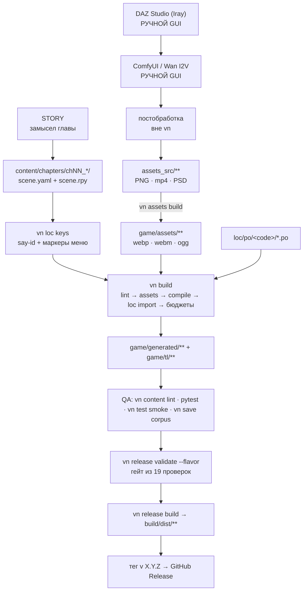

# Production Handbook

> ## Что изменилось в ADR-0012 (2026-08-09)
>
> Главы ниже писались до пересмотра ассет-конвейера. Актуальный контракт —
> [ADR-0012](../adr/0012-render-profile-and-oversampling.md) и
> [онбординг художника](../onboarding/artist.md); трассировка закрытых пунктов —
> [docs/audit/](../audit/).
>
> | Было | Стало |
> |---|---|
> | зона мастеров `assets_src/png/` | `assets_src/art/` (`png/` — рабочий алиас) |
> | только PNG | форматы по классу ассета; JPEG легален для `bg`/`cg` |
> | разрешение не проверялось | мастер валидируется по размеру, пропорциям, альфе и холсту |
> | спрайты `…@2.webp` в ссылках | референс без суффикса + вариант `@2`; вариант подбирает движок |
> | `config.image_cache_size_mb` — дефолт SDK | из `project.yaml: render`, worst-case сцены гейтится |
> | бюджеты под 20 плейсхолдеров | предохранители под 8–15 ГБ билда |
> | мастера в git обычными объектами | Git LFS; порог ADR-0004 считает только бинари мимо LFS |
> | три копии валидатора источников | один контракт `assets/sources.py` (DAZ / VaM / Sims 4) |
> | секвенцию склеивали ffmpeg'ом руками | `vn assets video seq` + провенанс |
> | у видео не было заглушки и превью | постер-кадр генерируется конвейером |


> **Что это:** практическая wiki репозитория — 39 файлов о том, **как здесь что-то сделать**.
> **Для кого:** для человека и для AI-агента. Оба читают одни и те же страницы.
> **Чем отличается от [`../ARCHITECTURE.md`](../ARCHITECTURE.md):** тот документ — **целевой норматив и контракт ревью** (4180 строк, большая часть — будущие фазы). Хендбук описывает **код, который есть сегодня**.

Репозиторий — коммерческая визуальная новелла на Ren'Py 8.5.3 с собственным CLI `vn`
(`../../tools/vn/`) и производственным конвейером DAZ → ComfyUI → ffmpeg → Ren'Py.
Источники истины (`content/`, `packs/`, `assets_src/`, `loc/`, `game/framework/`) лежат вне
собранной игры; `vn build` превращает их в `game/generated/`, `game/assets/`, `game/tl/`.

**Правило разрешения конфликтов:** при расхождении `ARCHITECTURE.md` и кода — **прав код**,
и хендбук описывает код. Если механизм заявлен в `ARCHITECTURE.md`, но кода нет, в хендбуке
он помечен `NOT IMPLEMENTED`. Источник истины по командам — `vn --help` и
[`../../tools/vn/src/vn/cli.py`](../../tools/vn/src/vn/cli.py).

---

## Мне нужно за 60 секунд

```bash
git lfs install                                   # один раз на машину
git clone https://github.com/Onemyname/renpy vn   # репозиторий приватный
cd vn && git lfs pull                             # шрифты UI лежат в LFS
pip install -e "tools/vn[dev]"                    # ставит команду vn; [dev] — для pytest
setx RENPY_SDK "C:\Users\<you>\renpy-sdk\renpy-8.5.3-sdk"   # и ОТКРОЙТЕ НОВЫЙ терминал

vn doctor                                # окружение: сейчас 8 PASS / 0 FAIL
vn build                                 # lint → ассеты → генерат → game/tl → бюджеты
vn play                                  # запуск игры (нужен RENPY_SDK)
python -m pytest tools/vn/tests -q       # 253 passed
```

`setx` виден только **новым** процессам. В bash-сессии агента `RENPY_SDK` не наследуется —
экспортируйте вручную: `export RENPY_SDK="C:/Users/Vadim/renpy-sdk/renpy-8.5.3-sdk"`.

Подробно, включая разбор каждого провала `vn doctor` → [03-getting-started.md](03-getting-started.md).

---

## Критические правила

1. Не правьте `game/generated/`, `game/assets/`, `game/tl/` — это генерат, его перезапишет ближайшая сборка (G4).
2. Id неизменяемы навсегда (G7). Переименование — не `git mv`, а новый id + запись в `content/renames.yaml`.
3. Метки сцен только `^chNN_sNNN__<suffix>$`; между сценами — `return "<exit_id>"` и `exits:` в YAML, а не `jump` (C2).
4. `content/` строго вне `game/` (G2). Руками пишут в `content/`, `packs/`, `assets_src/`, `loc/`, `game/framework/`, `tools/`, `docs/`.
5. После правки реплик — `vn loc keys`; иначе `vn loc keys --check` красит CI.
6. `game/tl/` руками не трогают: переводы правятся в `loc/po/<code>/*.po` и въезжают через `vn loc import`.
7. `vn assets push` без `vn assets lock` запрещён (G14).
8. Секреты (`CIVITAI_API_KEY`, patron-токен) — только в переменных окружения и секретах CI, никогда в git
   и никогда в дистрибутиве: наружу уезжает только метка `patron_tag` (ADR-0011). Сам токен получателя
   обязан быть случайным (`secrets.token_hex(16)`) — короткий подбирается перебором по 8-символьной метке.
9. Никогда не слать синтетический ввод (SendKeys) на рабочий стол — прогон игры только in-process: `vn test smoke`.
10. Изменение любой нормы раздела 0 `ARCHITECTURE.md` (G1–G24 / C1–C24) — только через ADR в `../adr/`.
11. Тег релиза `v<X.Y.Z>` обязан посимвольно совпадать с `project.yaml: version`.
12. Перед созданием нового механизма — `grep` по существующим. Вторая копия подсистемы дороже любой правки.

---

## Карта документации

### Старт

| Файл | О чём | Когда открывать |
|---|---|---|
| [01-project-overview.md](01-project-overview.md) | что за проект, версии, что работает и на что нельзя рассчитывать | первый день; когда нужен честный статус |
| [02-architecture.md](02-architecture.md) | зоны каталогов, поток данных, слои `game/framework/`, init-шкала, справочник G/C-норм | «куда класть файл и что его перезапишет» |
| [03-getting-started.md](03-getting-started.md) | путь `clone → pip install → vn doctor → vn build → vn play` и разбор провалов | настройка машины |
| [04-development-workflow.md](04-development-workflow.md) | что пересобирать после какой правки, git, коммиты, CI как зеркало локального прогона | ежедневно |

### Разработка

| Файл | О чём | Когда открывать |
|---|---|---|
| [05-renpy-development.md](05-renpy-development.md) | Ren'Py **в этом репозитории**: что рукописное, что генерат, что писать нельзя | пишете `.rpy` |
| [06-frontend.md](06-frontend.md) | UI: токены `gui.*`, компоненты `vn_*`, 20 рукописных экранов, панели из `content/ui/panels.yaml` | кнопка, панель, вёрстка экрана |
| [07-backend.md](07-backend.md) | состояние: named stores, `default`, снапшот, сейвы, миграции, флоу сцен | переменная, сейв, миграция |
| [08-content-pipeline.md](08-content-pipeline.md) | `vn build`: 36 входов → 21 выход, build-bridge, 34 правила линта, реестр схем | «почему `--check` красный» |
| [25-custom-engine.md](25-custom-engine.md) | CLI `vn`: полное дерево команд, коды возврата, заглушки по фазам, как добавить команду | нужна команда или её отсутствие |

### Контент

| Файл | О чём | Когда открывать |
|---|---|---|
| [09-chapters.md](09-chapters.md) | выпуск главы от замысла до релиза, сквозной workflow из 10+ шагов | новая глава |
| [10-characters.md](10-characters.md) | `character.yaml` → слои PNG → `layeredimage`; `vn char new` — заглушка, всё руками | новый персонаж |
| [11-locations.md](11-locations.md) | локация = 3 строки YAML + фоны; `image bg` эмитит компилятор | новое место действия |
| [12-scenes.md](12-scenes.md) | пара `sNNN.scene.{yaml,rpy}`, контракт меток, `exits` | новая сцена |
| [13-dialogue.md](13-dialogue.md) | реплики, say-id, `$ vn_menu`, выборы, ветвление внутри сцены | пишете текст |
| [14-localization.md](14-localization.md) | round-trip PO, добавление языка, псевдолокаль, покрытие | перевод, новый язык |
| [15-gallery.md](15-gallery.md) | галерея (ADR-0010) и достижения (backend есть, UI нет) | CG/видео в галерею |
| [16-assets.md](16-assets.md) | `assets_src/` → `game/assets/`: трансформации (включая послойные шоты shots@1 и транскод озвучки), именование, кэш, хранилище сырцов | куда положить картинку/видео/звук |

### Производство визуала

| Файл | О чём | Когда открывать |
|---|---|---|
| [17-daz-studio.md](17-daz-studio.md) | основной источник кадров; тулинг вокруг DAZ есть, сам рендер — ручной GUI | делаете кадр |
| [18-vam.md](18-vam.md) | Virt-a-Mate — опциональный источник; на этой машине не установлен | нужна физика тел |
| [19-sims4.md](19-sims4.md) | The Sims 4 — задел по ADR-0007, зона спит, правовой вопрос открыт | оцениваете источник |
| [20-image-generation.md](20-image-generation.md) | ComfyUI: окружение, модели, провенанс, консистентность персонажа | полировка/вариации кадра |
| [21-video-generation.md](21-video-generation.md) | Wan I2V вручную → `video_src` → VP9/WebM + `mov_meta@1` | движущийся кадр |
| [22-rendering.md](22-rendering.md) | разрешения, профили `draft`/`full`, качество, бюджеты | настройка рендера |
| [23-audio.md](23-audio.md) | музыка, SFX и озвучка: тракт `audio_stems/` работает (но треков ноль), голосовой контур `voice@1` + `vn voice` работает целиком | первый трек или дубль |
| [24-post-processing.md](24-post-processing.md) | что сделать в редакторе до `assets_src/` и чего конвейер не делает | между рендером и репозиторием |

### Процессы

| Файл | О чём | Когда открывать |
|---|---|---|
| [26-automation.md](26-automation.md) | что делает машина, что руками, и что автоматизировать следующим | планирование работ |
| [27-testing.md](27-testing.md) | 7 уровней проверок, 253 pytest, smoke-автопилот, сейв-корпус, чеклисты | перед push |
| [28-debugging.md](28-debugging.md) | логи, dev-меню, crash-репорты, чтение генерата, сужение поломки | «что-то не работает» |
| [29-build-and-release.md](29-build-and-release.md) | флейворы, гейт из 19 проверок, дистрибутивы, тег → GitHub Release | выпуск |
| [30-packs-and-dlc.md](30-packs-and-dlc.md) | формат пака, что собирается, что не собирается, гейт владения (провайдер подключён под Steam) | отдельная единица поставки |
| [31-storage-and-backup.md](31-storage-and-backup.md) | что в git, что нет, что вернётся командой, а что не вернётся никогда | «умер диск» |
| [32-performance-and-scalability.md](32-performance-and-scalability.md) | бюджеты G19, где ломается арифметика при росте до 50 глав | рост проекта |
| [33-security-and-legal.md](33-security-and-legal.md) | секреты, состав дистрибутива, реестр лицензий, ADR-0008 | деньги и право |
| [39-platforms.md](39-platforms.md) | Platform Services (ADR-0014): Steam, Steam Deck, Big Picture, controller-first UI, масштаб, `vn release steam`; Android — чего не хватает | выход на витрину, геймпад, Deck |

### AI-разработка

| Файл | О чём | Когда открывать |
|---|---|---|
| [34-ai-vibe-coding.md](34-ai-vibe-coding.md) | методика постановки задач агенту и приёмки результата | ставите задачу |
| [35-agent-rules.md](35-agent-rules.md) | жёсткие правила репозитория, черновик `CLAUDE.md`/`AGENTS.md`, форма отчёта | агент начинает работу |

### Справочники

| Файл | О чём | Когда открывать |
|---|---|---|
| [36-troubleshooting.md](36-troubleshooting.md) | ~70 записей «симптом → причина → диагностика → решение» по дословным сообщениям | есть текст ошибки |
| [37-roadmap.md](37-roadmap.md) | все известные разрывы, упорядоченные по влиянию на скорость производства | «что делать следующим» |
| [38-resources.md](38-resources.md) | инструменты, версии на машине, что реально подключено, проверенные ссылки | ищете документацию |

---

## «Хочу сделать X» — навигатор

| Задача | Куда | Первая команда / файл |
|---|---|---|
| Добавить главу | [09](09-chapters.md) | `vn chapter new <slug>` |
| Добавить сцену | [12](12-scenes.md) | `vn scene new chNN <slug>` |
| Заглушку для ещё не написанной цели перехода | [12](12-scenes.md) | `vn scene stub chNN sNNN` |
| Связать сцены / изменить порядок | [12](12-scenes.md), [09](09-chapters.md) | `exits:` в `*.scene.yaml`, `scene_order` в `chapter.yaml` |
| Написать реплики | [13](13-dialogue.md) | `*.scene.rpy` → `vn loc keys` |
| Добавить выбор | [13](13-dialogue.md) | `menu:` + `$ vn_menu`, проставит `vn loc keys` |
| Ветку внутри сцены | [13](13-dialogue.md) | `jump chNN_sNNN__<branch>` |
| Добавить переменную | [07](07-backend.md) | `content/variables/core.vars.yaml` или `chapters/*/vars.yaml` |
| Добавить персонажа | [10](10-characters.md) | руками: `content/characters/<id>/character.yaml` (`vn char new` — заглушка) |
| Добавить локацию | [11](11-locations.md) | руками: `content/locations/<id>/location.yaml` |
| Добавить фон | [11](11-locations.md), [16](16-assets.md) | `assets_src/png/backgrounds/<loc>/<variant>.png` |
| Добавить спрайт / позу / эмоцию | [10](10-characters.md) | `assets_src/png/characters/<id>/<pose>/` |
| Добавить CG | [16](16-assets.md), [17](17-daz-studio.md) | `assets_src/png/cg/chNN/<name>.png` → `vn assets build` |
| Добавить видео | [21](21-video-generation.md) | `assets_src/video_src/<group>/<name>.mp4` → `vn assets video build` |
| Добавить звук | [23](23-audio.md) | `.ogg` в `assets_src/audio_stems/{bgm,amb,sfx}/` → `vn assets build` → id в `content/audio/{bgm,amb,sfx}.yaml` |
| Добавить озвучку главы | [23](23-audio.md) §8 | `vn voice manifest chNN --lang <код> -o лист.csv` → запись → `vn voice import <dir> --lang <код>` → `vn assets build` |
| Добавить послойный шот | [16](16-assets.md) §13.7, [12](12-scenes.md) | слои в `assets_src/art/shots/chNN/sNNN/<shot>/` + `shots/sNNN.shots.yaml` → `scene shot_chNN_sNNN <shot>` |
| Добавить элемент галереи | [15](15-gallery.md) | `content/gallery/core.gallery.yaml` |
| Добавить достижение | [15](15-gallery.md) | `content/achievements/core.achievements.yaml` (UI достижений нет) |
| Поменять строку интерфейса | [06](06-frontend.md), [14](14-localization.md) | `content/ui/strings.yaml` → `vn loc extract && vn loc import` |
| Добавить UI-компонент | [06](06-frontend.md) | `game/framework/20_ui/components.rpy` |
| Поменять экран | [06](06-frontend.md) | `game/framework/20_ui/screens/<экран>.rpy` |
| Поменять форму панели / радиус / тень | [06](06-frontend.md) | `content/ui/panels.yaml` (ADR-0009) → `vn build` |
| Добавить язык | [14](14-localization.md) | `vn loc add ja --name 日本語` |
| Обновить переводы | [14](14-localization.md) | `vn loc extract` → правка PO → `vn loc import` |
| Сделать пак / DLC | [30](30-packs-and-dlc.md) | `vn pack validate`, `vn pack build <id>` |
| Включить Steam / выложить в Steam | [39](39-platforms.md) | `project.yaml: platform.steam.appid` → `vn build` → `vn release steam --flavor public` |
| Привязать пак к DLC в Steam | [39](39-platforms.md) §5, [30](30-packs-and-dlc.md) | `steam_dlc_appid` в `packs/<id>/manifest.yaml` |
| Проверить UI на геймпаде / Steam Deck / ТВ | [39](39-platforms.md) §7 | `RENPY_VARIANT="steam_deck medium touch" vn test smoke --picks 0,0` |
| Поменять масштаб интерфейса / safe-area ТВ | [39](39-platforms.md) §8, [06](06-frontend.md) | `game/framework/20_ui/scale.rpy` (`gui.ui_scale`, `gui.overscan_pad`) |
| Добавить кнопку геймпада | [39](39-platforms.md) §7 | `game/framework/20_ui/input.rpy` — единственное место |
| Написать миграцию сейва | [07](07-backend.md) | `content/migrations/` + `registry.yaml`, бамп `project.yaml: save_schema` |
| Добавить команду CLI | [25](25-custom-engine.md) | `tools/vn/src/vn/cli.py` |
| Добавить правило линтера | [08](08-content-pipeline.md) §7 | `tools/vn/src/vn/content/lint.py` |
| Добавить схему | [08](08-content-pipeline.md) §8 | `tools/schemas/<id>@N.schema.json` (сейчас 39 файлов) |
| Добавить тест | [27](27-testing.md) | `tools/vn/tests/test_*.py` |
| Выпустить релиз | [29](29-build-and-release.md) | `vn release validate --flavor public` → тег `v<X.Y.Z>` |
| Починить красный CI | [36](36-troubleshooting.md) §8, [04](04-development-workflow.md) | воспроизвести локально: `vn build --check` |
| Понять, почему не собирается | [36](36-troubleshooting.md) §2, [28](28-debugging.md) | `vn content lint`, затем `errors.txt` |
| Настроить окружение для рендера | [03](03-getting-started.md), [`../pipeline/phase-0.md`](../pipeline/phase-0.md) | `vn pipeline doctor` |
| Разобраться с лицензиями и EULA | [33](33-security-and-legal.md) | `vn assets licenses` |
| Понять, что делать дальше | [37](37-roadmap.md) | — |

---

## Production pipeline



| Этап | Вход | Выход | Инструмент | Где лежит | Валидация | Раздел |
|---|---|---|---|---|---|---|
| Замысел | — | номер `chNN`, слуг | тулинга нет | — | — | [09](09-chapters.md) |
| Скелет главы/сцен | слуг | `chapter.yaml`, пары `*.scene.{yaml,rpy}` | `vn chapter new`, `vn scene new` | `content/chapters/` | `vn content lint` | [09](09-chapters.md), [12](12-scenes.md) |
| Текст и ветвление | план | реплики, `menu:`, `return "<exit>"` | редактор + `vn loc keys` | `content/**/*.scene.rpy` | `vn content lint`, `vn content graph` | [13](13-dialogue.md) |
| Рендер | DAZ-сцена `.duf` | PNG 1920×1080 | **DAZ Studio, ручной GUI** — автоматизации нет | вне репозитория | `vn assets daz validate` (деклараций пока 0) | [17](17-daz-studio.md), [22](22-rendering.md) |
| AI-полировка / оживление кадра | PNG | PNG / mp4 | **ComfyUI GUI** — из `vn` не вызывается | `D:\ComfyUI` | `vn pipeline doctor`, `vn assets provenance record` | [20](20-image-generation.md), [21](21-video-generation.md) |
| Постобработка | PNG/mp4 | финальный PNG (sRGB) | редактор — **вне `vn`, проверок нет** | локально | — | [24](24-post-processing.md) |
| Сборка ассетов | `assets_src/**` | `game/assets/**` | `vn assets build` | не в git | `vn assets validate` | [16](16-assets.md) |
| Компиляция контента | `content/`, `packs/`, `game/assets/`, `loc/ledger/` | `game/generated/**` (21 выход) | `vn build` | не в git | `vn build --check` | [08](08-content-pipeline.md) |
| Локализация | ledger, `content/ui/strings.yaml` | `loc/po/**` → `game/tl/**` | `vn loc extract` / `import` | PO — в git, `tl/` — нет | `vn loc keys --check`, `vn loc report` | [14](14-localization.md) |
| QA | собранная игра | скриншоты, вердикты | `pytest`, `vn test smoke`, `vn save corpus` | `.vncache/smoke/` | exit 0 | [27](27-testing.md) |
| Гейт и сборка | всё вышеперечисленное | `build/dist/<version>-<flavor>/` | `vn release validate`, `vn release build`, `vn package` | не в git | 19 проверок PASS/WARN/FAIL | [29](29-build-and-release.md) |
| Публикация | тег `v<X.Y.Z>` | GitHub Release | `.github/workflows/release.yml` | GitHub | совпадение тега и `project.yaml` | [29](29-build-and-release.md) |
| Steam | `build/dist/<version>-<flavor>/*.zip` | `build/steam/app_build_<flavor>.vdf` + раскладка депотов | `vn release steam --flavor <f>` (аплоад — ручной `steamcmd`) | не в git | VDF рендерится, депоты распакованы, warning про steam_api | [39](39-platforms.md) |

Три этапа конвейера — рендер, AI-генерация и постобработка — **полностью ручные**: в репозитории
ноль `.dsa`, ноль ComfyUI-workflow, ноль HTTP-клиентов к ComfyUI. Граница автоматизации проходит
ровно по `assets_src/` — см. [26-automation.md](26-automation.md).

---

## MASTER CHECKLISTS

### Developer

```
[ ] git lfs install && git clone … && cd vn && git lfs pull
[ ] pip install -e "tools/vn[dev]"
[ ] setx RENPY_SDK "…\renpy-8.5.3-sdk"   →  открыть НОВЫЙ терминал
[ ] vn doctor                                      # 8 PASS / 0 FAIL
[ ] прочитать 02-architecture.md §2-3 (зоны) и 35-agent-rules.md
[ ] vn build && vn play                            # игра запустилась
[ ] python -m pytest tools/vn/tests -q             # 253 passed
[ ] правка — только в источниках истины (content/, packs/, assets_src/, loc/, game/framework/, tools/)
[ ] vn content lint && vn build && python -m pytest tools/vn/tests -q
[ ] git status --short — ни одного файла из game/generated | game/assets | game/tl
[ ] обновить соответствующий файл docs/handbook/ в ТОМ ЖЕ коммите
[ ] git commit -m "type(scope): описание по-русски"
```

### Content Creator

```
[ ] персонаж: content/characters/<id>/character.yaml вручную          → 10-characters.md
[ ] локация:  content/locations/<id>/location.yaml вручную            → 11-locations.md
[ ] сцена:    vn scene new chNN <slug>, затем exits: и текст          → 12, 13
[ ] рендер:   DAZ Studio (ручной GUI) → PNG                          → 17, 22
[ ] провенанс: vn assets provenance record <png> --source <src>       → 20
[ ] сырцы:    положить по конвенции в assets_src/**                   → 16 §4
[ ] сборка:   vn assets build --profile draft  (итерации) → vn assets build
[ ] проверка: vn assets validate && vn build
[ ] импорт:   vn loc keys && vn loc extract && vn loc import          → 14
[ ] тест:     vn test smoke --picks 0,0 ; смотреть .vncache/smoke/    → 27
```

### Chapter

```
[ ] история:      номер chNN, слуг, роль в арке (тулинга нет)         → 09 §1
[ ] скрипт:       vn chapter new <slug>; vn scene new chNN <slug> × N → 09, 12
[ ] граф:         entry_scene + scene_order + exits: в каждой сцене   → 12
[ ] текст:        *.scene.rpy → vn loc keys                            → 13
[ ] ассеты:       assets_src → vn assets build → vn assets validate    → 16
[ ] галерея:      CG в content/gallery/core.gallery.yaml               → 15
[ ] ветвление:    vn content graph; vn test smoke --picks 0,1 по веткам → 09, 27
[ ] локализация:  vn loc extract → перевод PO → vn loc import → vn loc report → 14
[ ] QA:           vn content lint; pytest; vn build --check; vn save corpus  → 27
[ ] сборка:       vn release validate --flavor public && --flavor patron     → 29
[ ] релиз:        vn release changelog; bump project.yaml:version; git tag vX.Y.Z → 29
```

---

## Состояние проекта

Проверено запуском на машине владельца **2026-08-08**.

| | |
|---|---|
| Версия игры / тулинга `vn` | `0.1.4` (`project.yaml:2`) / `0.1.0` (`vn --version`) — числа независимые |
| Ren'Py | SDK 8.5.3, пин в `project.yaml:5` |
| Контент | 1 глава ядра `ch01_awakening` (3 сцены, `status: draft`) + 1 пак-глава `ch90` в `packs/ep_beach`; 1 персонаж (`mira`), 2 локации |
| Языки | `en`, `de`, `pseudo` — 115/115 строк, fuzzy 0 |
| Тесты / схемы / релизный гейт | 253 pytest · 39 JSON Schema · 19 проверок гейта (16 PASS, exit 0) |
| Платформы | Windows/Linux/macOS standalone, Steam, Steam Deck, Big Picture — все IMPLEMENTED ([ADR-0014](../adr/0014-platform-services.md), [39](39-platforms.md)); Android — NOT IMPLEMENTED. `platform.steam.appid` сейчас `null`, поэтому локальные сборки — standalone |

**Работает:** компилятор контента, ассет-конвейер (включая ветку звука `audio_stems`), локализация
round-trip, галерея, сейвы и миграции внутри игры, сейв-корпус с проверкой миграций (2 фикстуры),
релизный гейт и сборка обоих флейворов, 4 GitHub-workflow с пиннованным тулчейном `tools/vn.lock`,
платформенный слой (Steam-ачивки, DLC-владение, controller-first UI Deck/Big Picture, генерация Steam-депотов).
**Частично:** флейворы (гейтят только `nsfw` и `watermark`), паки (компилируются только `chapters/`),
звук (тракт, канал `ambient` и озвучка `voice@1`/`vn voice` живые — но музыки/SFX ноль, `content/audio/*.yaml` пусты, `vn voice tts` — заглушка),
CODEOWNERS (все хэндлы — плейсхолдеры).
**Нет вообще:** автоматизации рендера и ComfyUI, автоматического Steam-аплоада (VDF и раскладка депотов
генерируются, `steamcmd` запускается руками) и каналов dev/beta/release, Android-сборки, `vn validate` /
`vn build --use-artifact` из `ARCHITECTURE.md`, `CLAUDE.md`/`AGENTS.md`.

Три главных пункта из [37-roadmap.md](37-roadmap.md): **P0-1** закрыть ADR-0008 (единственный
непринятый ADR — правовой статус NSFW-стека); **P0-2** пройти пилот контента насквозь
DAZ → ComfyUI → provenance → `video_src` → сцена; **P0-3** довести аудио: `loop_start`/`volume`
и голосовой контур уже эмитятся/работают, но нужны первые боевые `.ogg` и loudnorm для музыки/SFX.

---

## Troubleshooting — быстрый вход

| Симптом | Лечение | Подробно |
|---|---|---|
| `vn: command not found` | `pip install -e "tools/vn[dev]"` тем же интерпретатором | [36 §1](36-troubleshooting.md) |
| `ошибка: не найден корень репозитория` | запускать `vn` из репозитория (нужны `project.yaml` + `tools/schemas/`) | [36 §1](36-troubleshooting.md) |
| `✗ Ren'Py SDK не найден` | `export RENPY_SDK=…` — в bash-сессии переменная не наследуется | [36 §1](36-troubleshooting.md) |
| `ошибка: генерат не свеж — выполните vn build` | `vn build` (после смены HEAD — обязательно) | [36 §2](36-troubleshooting.md) |
| Правка в `game/generated/**` исчезла | так и задумано: правьте `content/` и пересоберите | [08](08-content-pipeline.md) |
| Игра не стартует: «errors were detected in your script» | `cat errors.txt` — и смотрите дату файла, он мог устареть | [36 §3](36-troubleshooting.md) |
| Картинка не показывается / `ImageNotFound` | цепочка `images.gen.rpy` → `game/assets/` → `assets_src/` | [36 §4](36-troubleshooting.md) |
| На экране сырой ключ вроде `ui.gallery.locked` | строки нет в `content/ui/strings.yaml` либо не прогнан `vn loc import` | [36 §6](36-troubleshooting.md) |
| `vn loc keys --check` красный | прогнать `vn loc keys` и закоммитить изменённые `.scene.rpy` | [36 §6](36-troubleshooting.md) |
| CI красный, локально зелено | воспроизвести `vn build --check` и `vn content compile --check` | [28 §10](28-debugging.md) |

Полный справочник — [36-troubleshooting.md](36-troubleshooting.md) (записи сгруппированы по слоям:
окружение → сборка → рантайм → ассеты → видео → локализация → сейвы → релиз/CI → внешний 3D/AI).

---

## Для AI-агента

**С чего начинать в этом репозитории:**

1. Прочитать этот README и профильный файл хендбука по задаче.
2. Прочитать [35-agent-rules.md](35-agent-rules.md) — там жёсткие запреты и форма отчёта.
3. Найти существующую реализацию: `vn --help`, затем `grep` по `tools/vn/src/vn/`,
   `game/framework/`, `tools/schemas/`, `content/`. Не изобретать вторую копию механизма.
4. Определить зону файла: источник истины / генерат / сырец — [02-architecture.md](02-architecture.md) §2–3.
5. Сделать минимальную правку. Данные — в YAML + схему, не в код.

**Обязательная цепочка валидации** (хвост любой задачи, 5–70 секунд):

```bash
vn content lint                              # 0 ошибок
vn build                                     # build: OK
python -m pytest tools/vn/tests -q           # 253 passed
git status --short                           # ни одного файла из game/generated|assets|tl
```

Дополнительно: рантайм/сейвы/локализация — `vn test smoke --picks 0,0 && vn save corpus`;
релизный путь — `vn release validate --flavor public`.

**Как читать статусные пометки** в шапке каждого файла:

| Пометка | Значение | Что делать |
|---|---|---|
| `IMPLEMENTED` | код есть и работает | можно опираться |
| `PARTIALLY IMPLEMENTED` / `PARTIAL` | код есть, но покрывает не то, что обещано — в тексте сказано, чего именно не хватает | читать оговорку целиком |
| `NOT IMPLEMENTED` | заявлено в `ARCHITECTURE.md`/ADR, кода нет | не вызывать, не ссылаться как на рабочее |
| `IMPLEMENTED / UNDOCUMENTED` | код есть, в `docs/` про это ничего | источник истины — код |
| `UNEXERCISED` | код есть, но в этом репозитории ни разу не исполнялся на реальных данных | ожидать сюрпризов на первом прогоне |

**Почему нельзя доверять `ARCHITECTURE.md` как описанию реальности.** Это целевой нормативный
документ на 4180 строк; большая часть — будущие фазы. Описанные там `vn validate`,
`vn build --use-artifact <sha>`, `vn content lint --strict` **не существуют** и дадут usage error
(exit 2). Правильная формулировка в отчёте: «`ARCHITECTURE.md` §X требует Y — сейчас
NOT IMPLEMENTED». Раздел 0 (G1–G24, C1–C24) при этом остаётся контрактом ревью: его изменение —
только через ADR.

Методика постановки задач и приёмки — [34-ai-vibe-coding.md](34-ai-vibe-coding.md).

---

## Как поддерживать сам хендбук

**Правило одно: изменил механизм — обнови соответствующий файл хендбука в том же коммите.**
Расхождение между кодом и хендбуком дороже, чем отсутствующий раздел: по хендбуку действуют
и человек, и агент.

- Формат файла фиксирован: шапка со статусом и вопросом → «Быстрый ответ» → содержательные
  разделы → «Как изменить / Как расширить» → «Чего НЕ делать» → «Проверка» → «Для AI-агента».
- Каждый описанный механизм помечается статусом из таблицы выше. «Не проверено» — допустимая
  формулировка; правдоподобная выдумка — нет.
- Ссылки на код — с путём и строкой: `tools/vn/src/vn/cli.py:84`. Ссылки внутри `docs/handbook/`
  — относительные, на корень репозитория — `../../`, на другие docs — `../ARCHITECTURE.md`.
- Не дублировать соседние файлы — ссылаться.

**Владельцы.** [`../../CODEOWNERS`](../../CODEOWNERS) покрывает `/tools/`, `/game/framework/`,
`/content/*`, `/loc/`, `/docs/conventions/`, `/docs/adr/`, `/ci/`, `/project.yaml`.
Две честные оговорки: **записи для `/docs/handbook/` там нет вообще**, и **все хэндлы —
плейсхолдеры** (`@tech-lead`, `@lead-writer`, `@engine-dev-1`…), о чём в самом файле стоит
`TODO(команда): заменить плейсхолдеры на реальные хэндлы при найме`. Пока проект ведёт один
человек, владельцем каждого раздела считается автор изменения в коде, который этот раздел
описывает.

---

**Смежные документы:** [`../ARCHITECTURE.md`](../ARCHITECTURE.md) (норматив) ·
[`../adr/`](../adr/) (14 ADR + шаблон; 13 приняты, ADR-0008 предложен) · [`../conventions/naming.md`](../conventions/naming.md) ·
[`../pipeline/phase-0.md`](../pipeline/phase-0.md) (установка рендер-окружения) ·
[`../CHANGELOG.md`](../CHANGELOG.md)
